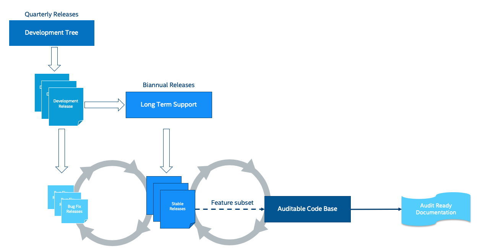
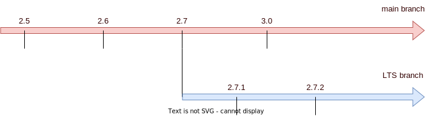

.. _release_process:

Release Process
###############

The Zephyr project releases on a time-based cycle, rather than a feature-driven
one. Zephyr releases represent an aggregation of the work of many contributors,
companies, and individuals from the community.

A time-based release process enables the Zephyr project to provide users with a
balance of the latest technologies and features and excellent overall quality. A
roughly 4-month release cycle allows the project to coordinate development of
the features that have actually been implemented, allowing the project to
maintain the quality of the overall release without delays because of one or two
features that are not ready yet.

The Zephyr release model was loosely based on the Linux kernel model:

- Release tagging procedure:

  - linear mode on main branch,
  - release branches for maintenance after release tagging.
- Each release period will consist of a development phase followed by a
  stabilization phase. Release candidates will be tagged during the
  stabilization phase. During the stabilization phase, only stabilization
  changes such as bug fixes and documentation will be merged unless granted a
  special exemption by the Technical Steering Committee.

  - Development phase: all changes are considered and merged, subject to
    approval from the respective maintainers.
  - Stabilisation phase: the release manager creates a vN-rc1 tag and the tree
    enters the stabilization phase
  - CI sees the tag, builds and runs tests; Test teams analyse the report from the
    build and test run and give an ACK/NAK to the build
  - The release owner, with test teams and any other needed input, determines if the
    release candidate is a go for release
  - If it is a go for a release, the release owner lays a tag release vN at the
    same point

    Release Cycle

.. note::

    The milestones for the current major version can be found on the
    `Official GitHub Wiki <https://github.com/zephyrproject-rtos/zephyr/wiki/Release-Management>`_.
    Information on previous releases can be found :ref:`here <zephyr_release_notes>`.

Development Phase
*****************

A relatively straightforward discipline is followed with regard to the merging
of patches for each release.  At the beginning of each development cycle, the
main branch is said to be open for development.  At that time, code which is deemed to be
sufficiently stable (and which is accepted by the maintainers and the wide community) is
merged into the mainline tree.  The bulk of changes for a new development cycle
(and all of the major changes) will be merged during this time.

The development phase lasts for approximately three months.  At the end of this time,
the release owner will declare that the development phase is over and releases the first
of the release candidates.  For the codebase release which is destined to be
3.1.0, for example, the release which happens at the end of the development phase
will be called 3.1.0-rc1.  The -rc1 release is the signal that the time to merge
new features has passed, and that the time to stabilize the next release of the
code base has begun.

Stabilization Phase
*******************

Over the next weeks, only patches which fix problems should be submitted to the
mainline.  On occasion, a more significant change will be allowed, but such
occasions are rare and require a TSC approval (Change Control Board). As a
general rule, if you miss submitting your code during the development phase for
a given feature, the best thing to do is to wait for the next development cycle.
(An occasional exception is made for drivers for previously unsupported
hardware; if they do not touch any other in-tree code, they cannot cause
regressions and should be safe to add at any time).

As fixes make their way into the mainline, the patch rate will slow over time.
The mainline release owner releases new -rc drops once or twice a week; a normal
series will get up to somewhere between -rc4 and -rc6 before the code base is
considered to be sufficiently stable and the release criteria have been achieved
at which point the final 3.1.0 release is made.

At that point, the whole process starts over again.

.. _release_quality_criteria:

Release Quality Criteria
************************

The current backlog of prioritized bugs shall be used as a quality metric to
gate the final release. The following counts shall be used:

.. csv-table:: Bug Count Release Thresholds
   :header: "High", "Medium", "Low"
   :widths: auto

   "0","<20","<50"

.. note::

   The "low" bug count target of <50 will be a phased approach starting with 150
   for release 2.4.0, 100 for release 2.5.0, and 50 for release 2.6.0

Release Milestones
*******************

.. list-table:: Release Milestones
   :widths: 15 25 100 25
   :header-rows: 1

   * - Timeline
     - Checkpoint
     - Description
     - Owner
   * - T-5M
     - Planning
     - Finalize dates for release, Assign release owner and agree on project wide goals for this release.
     - TSC
   * - T-7W
     - Review target milestones
     - Finalize target milestones for features in flight.
     - Release Engineering
   * - T-4W
     - Release Announcement
     - Release owner announces feature freeze and timeline for release.
     - Release Manager
   * - T-3W
     - Feature Freeze (RC1)
     - No new features, ONLY stabilization and cosmetic changes, bug and doc fixes are allowed.
     - Release Engineering
   * - T-2W
     - 2nd Release Candidate
     - No new features, ONLY stabilization and cosmetic changes, bug and doc fixes are allowed.
     - Release Manager
   * - T-1W
     - Hard Freeze (RC3)
     - Only blocker bug fixes, documentation and changes to release notes are allowed.
       Release notes need to be complete by this checkpoint. Release Criteria is
       met.
     - Release Manager
   * - T-0W
     - Release
     -
     - Release Manager

Releases
*********

The following syntax should be used for releases and tags in Git:

- Release [Major].[Minor].[Patch Level]
- Release Candidate [Major].[Minor].[Patch Level]-rc[RC Number]
- Tagging:

  - v[Major].[Minor].[Patch Level]-rc[RC Number]
  - v[Major].[Minor].[Patch Level]
  - v[Major].[Minor].99 - A tag applied to main branch to signify that work on
    v[Major].[Minor+1] has started. For example, v1.7.99 will be tagged at the
    start of v1.8 process. The tag corresponds to
    VERSION_MAJOR/VERSION_MINOR/PATCHLEVEL macros as defined for a
    work-in-progress main branch version. Presence of this tag allows generation of
    sensible output for "git describe" on main branch, as typically used for
    automated builds and CI tools.

    Zephyr Code and Releases

.. _release_process_lts:

Long Term Support (LTS)
=======================

Long-term support releases are designed to be supported and maintained
for an extended period and is the recommended release for
products and the auditable branch used for certification.

An LTS release is defined as:

- **Product focused**
- **Extended Stabilisation period**: Allow for more testing and bug fixing
- **Stable APIs**
- **Quality Driven Process**
- **Long Term**: Maintained for an extended period of time (at least 2.5 years)
  overlapping previous LTS release for at least half a year.

Product Focused
+++++++++++++++

Zephyr LTS is the recommended release for product makers with an extended
support and maintenance which includes general stability and bug fixes,
security fixes.

An LTS includes both mature and new features. API and feature maturity is
documented and tracked. The footprint and scope of mature and stable APIs expands
as we move from one LTS to the next giving users access to bleeding edge features
and new hardware while keeping a stable foundation that evolves over time.

Extended Stabilisation Period
+++++++++++++++++++++++++++++

Zephyr LTS development cycle differs from regular releases and has an extended
stabilization period. Feature freeze of regular releases happens 3-4 weeks
before the scheduled release date. The stabilization period for LTS is extended
by 3 weeks with the feature freeze occurring 6-7 weeks before the anticipated
release date. The time between code freeze and release date is extended in this case.

Stable APIs
+++++++++++

Zephyr LTS provides a stable and long-lived foundation for developing
products. To guarantee stability of the APIs and the implementation of such
APIs it is required that any release software that makes the core of the OS
went through the Zephyr API lifecycle and stabilized over at least 2 releases.
This guarantees that we release many of the highlighted and core features with
mature and well-established implementations with stable APIs that are
supported during the lifetime of the release LTS.

- API Freeze (LTS - 2)

  - All stable APIs need to be frozen 2 releases before an LTS. APIs can be extended
    with additional features, but the core implementation is not modified. This
    is valid for the following subsystems for example:

    - Device Drivers (i2c.h, spi.h)...
    - Kernel (k_*):
    - OS services (logging,debugging, ..)
    - DTS: API and bindings stability
    - Kconfig

  - New APIs for experimental features can be added at any time as long as they
    are standalone and documented as experimental or unstable features/APIs.
- Feature Freeze (LTS - 1)
  - No new features or overhaul/restructuring of code covering major LTS features.

    - Kernel + Base OS
    - Additional advertised LTS features

  - Auxiliary features on top of and/or extending the base OS and advertised LTS features
    can be added at any time and should be marked as experimental if applicable

Quality Driven Process
++++++++++++++++++++++

The Zephyr project follows industry standards and processes with the goal of
providing a quality oriented releases. This is achieved by providing the
following products to track progress, integrity and quality of the software
components provided by the project:

- Compliance with published coding guidelines, style guides and naming
  conventions and documentation of deviations.
- Regular static analysis on the complete tree using available commercial and
  open-source tools and documentation of deviations and false positives.
- Documented components and APIS
- Requirements Catalog
- Verification Plans
- Verification Reports
- Coverage Reports
- Requirements Traceability Matrix (RTM)
- SPDX License Reports

Each release is created with the above products to document the quality and the
state of the software when it was released.

Long Term Support and Maintenance
++++++++++++++++++++++++++++++++++

A Zephyr LTS release is published every 2 years and is branched and maintained
independently from the main tree for at least 2.5 years after it was
released. Support and maintenance for an LTS release stops at least half a year
after the following LTS release is published.

    Long Term Support Release

Changes and fixes flow in both directions. However, changes from main branch to an
LTS branch will be limited to fixes that apply to both branches and for existing
features only.

All fixes for an LTS branch that apply to the mainline tree shall be submitted to
mainline tree as well.

Auditable Code Base
===================

An auditable code base is to be established from a defined subset of Zephyr OS
features and will be limited in scope. The LTS,  development tree, and the
auditable code bases shall be kept in sync after the audit branch is created,
but with a more rigorous process in place for adding new features into the audit
branch used for certification.

This process will be applied before new features move into the
auditable code base.

The initial and subsequent certification targets will be decided by the Zephyr project
governing board.

Processes to achieve selected certification will be determined by the Security and
Safety Working Groups and coordinated with the TSC.

Release Procedure
******************

This section documents the Release manager responsibilities so that it serves as
a knowledge repository for Release managers.

Release Checklist
=================

Each release has a GitHub issue associated with it that contains the full
checklist. After a release is complete, a checklist for the next release is
created.

Tagging
=======

The final release and each release candidate shall be tagged using the following
steps:

.. note::

    Tagging needs to be done via explicit git commands and not via GitHub's release
    interface.  The GitHub release interface does not generate annotated tags (it
    generates 'lightweight' tags regardless of release or pre-release). You should
    also upload your gpg public key to your GitHub account, since the instructions
    below involve creating signed tags. However, if you do not have a gpg public
    key you can opt to remove the ``-s`` option from the commands below.

.. tabs::

    .. tab:: Release Candidate

        .. note::

            This section uses tagging 1.11.0-rc1 as an example, replace with
            the appropriate release candidate version.

        #. Update the version variables in the :zephyr_file:`VERSION` file
           located in the root of the Git repository to match the version for
           this release candidate. The ``EXTRAVERSION`` variable is used to
           identify the rc[RC Number] value for this candidate::

            EXTRAVERSION = rc1

        #. Post a PR with the updated :zephyr_file:`VERSION` file using
           ``release: Zephyr 1.11.0-rc1`` as the commit subject. Merge
           the PR after successful CI.
        #. Tag and push the version, using an annotated tag::

            $ git pull
            $ git tag -s -m "Zephyr 1.11.0-rc1" v1.11.0-rc1
            $ git push git@github.com:zephyrproject-rtos/zephyr.git v1.11.0-rc1

        #. Send an email to the mailing lists (``announce`` and ``devel``)
           with a link to the release

    .. tab:: Final Release

        .. note::

            This section uses tagging 1.11.0 as an example, replace with the
            appropriate final release version.

        When all final release criteria has been met and the final release notes
        have been approved and merged into the repository, the final release version
        will be set and repository tagged using the following procedure:

        #. Update the version variables in the :zephyr_file:`VERSION` file
           located in the root of the Git repository. Set ``EXTRAVERSION``
           variable to an empty string to indicate final release::

            EXTRAVERSION =

        #. Post a PR with the updated :zephyr_file:`VERSION` file using
           ``release: Zephyr 1.11.0`` as the commit subject. Merge
           the PR after successful CI.
        #. Tag and push the version, using two annotated tags::

            $ git pull
            $ git tag -s -m "Zephyr 1.11.0" v1.11.0
            $ git push git@github.com:zephyrproject-rtos/zephyr.git v1.11.0

        #. Find the new ``v1.11.0`` tag at the top of the releases page and
           edit the release with the ``Edit tag`` button with the following:

            * Copy the overview of ``docs/releases/release-notes-1.11.rst``
              into the release notes textbox and link to the full release notes
              file on docs.zephyrproject.org.

        #. Send an email to the mailing lists (``announce`` and ``devel``) with a link
           to the release
