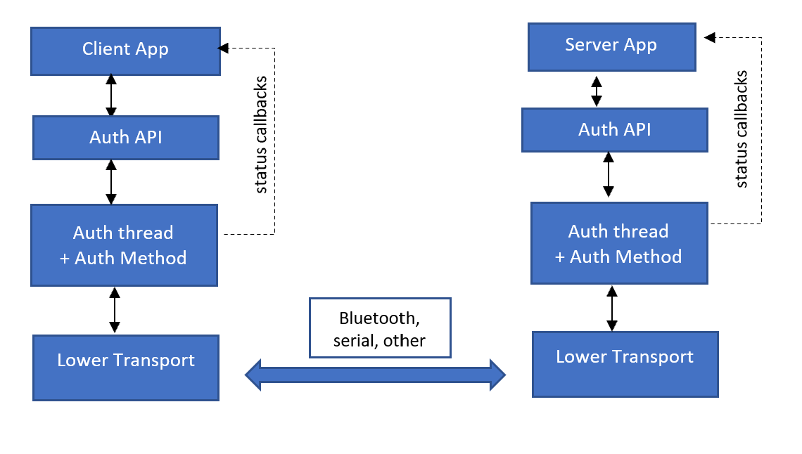
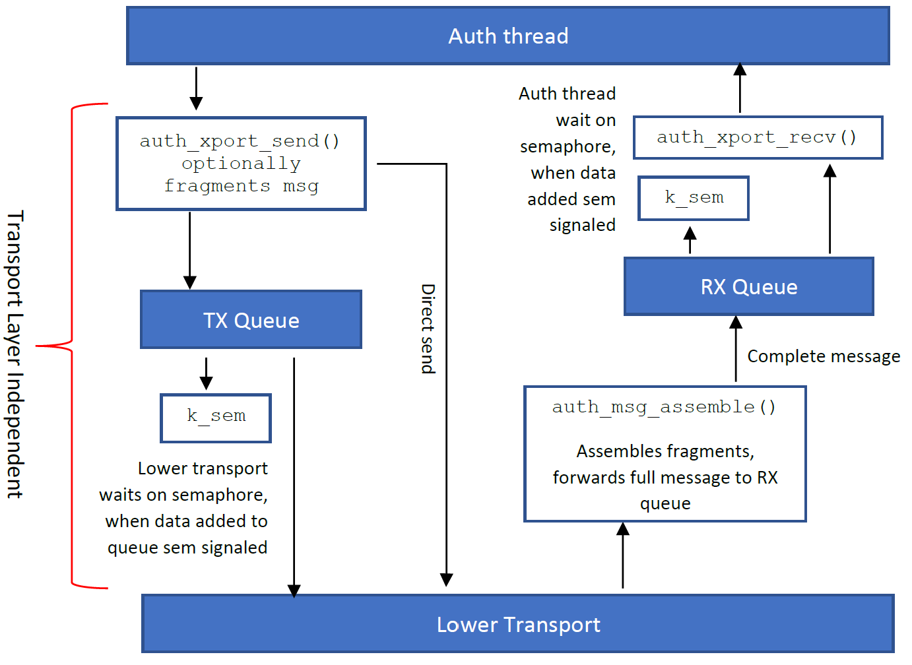
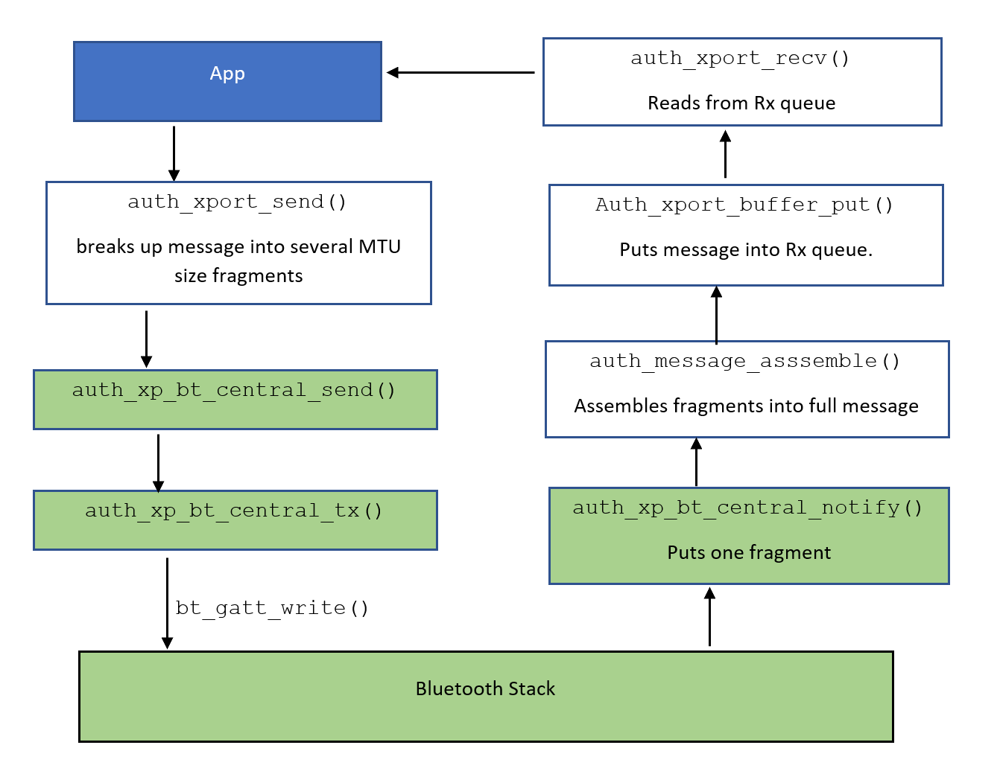
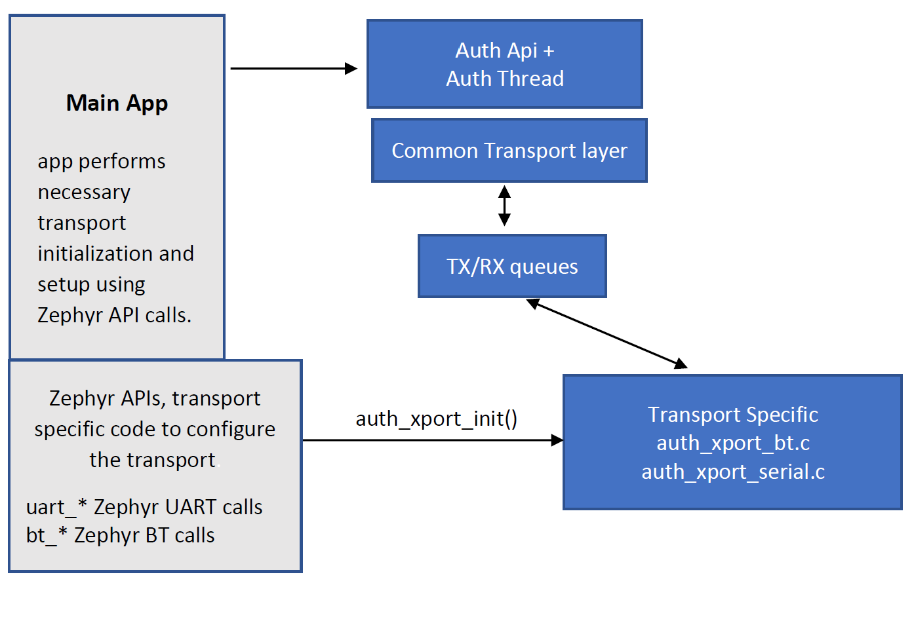

Authentication
##############################################

The Zephyr Authentication Library is a library that provides
authentication services between two devices independent of the lower
transport layer.   The library enables firmware applications to authenticate
with a Bluetooth or serial connected device using a simple
Challenge-Response or DTLS authentication method.  Authentication
means proving the peer device’s identity.

Use the authentication samples as a template for adding authentication into your
firmware application.

Kconfig Options
-----------------------------

:option:`CONFIG_AUTH_LIB`:  This option enables the Authentication library.

:option:`CONFIG_AUTH_CHALLENGE_RESPONSE`: Selects the Challenge Response authentication method

:option:`CONFIG_AUTH_DTLS`: Selects the DTLS authentication method.

:option:`CONFIG_AUTH_LOG_LEVEL`: Authentication log level, 0-4

:option:`CONFIG_BT_XPORT`:  Use Bluetooth as lower transport.

:option:`CONFIG_BT_XPORT`:  Use Bluetooth as lower transport.

:option:`CONFIG_ALT_AUTH_BT_UUIDS`: Use alternate Bluetooth Auth service UUIDs.

:option:`CONFIG_NUM_AUTH_INSTANCES`: Each authentication instance uses a thread to authenticate with
a peer over the lower transport.  It is possible to have multiple
authentication instances where one instance authenticates a peer
over Bluetooth and another authenticates over a serial link.

:option:`CONFIG_AUTH_THREAD_PRIORITY`:  Authentication thread priority.

Examples of API usage:
-----------------------------

The Authentication API is designed to abstract away the authentication method and
transport. The calling application configures the ZAUTH library, starts the authentication
process and monitors results via a status callback. The API is also designed to handle
multiple concurrent authentication processes, for example If device is acting as a
Bluetooth Central and Peripheral. An example of the API used is shown in the following
code snippet.

.. code-block:: none

   void auth_status(struct authenticate_conn *auth_conn, enum auth_instance_id instance, auth_status_t status, void *context)
   {
       if(status == AUTH_STATUS_SUCCESSFUL) {
           printk(“Authentication Successful.\n”);
       } else {
           printk(“Authentication status: %s\n”, auth_lib_getstatus_str(status));
       }
   }

   /* BLE connection callback */
   void connected(struct bt_conn *conn, uint8_t err)
   {
      /* start authentication */
      auth_lib_start(&central_auth_conn);
   }

   void main(void)
   {
       int err = auth_lib_init(&central_auth_conn, AUTH_INST_1, auth_status, NULL,
                                opt_parms, flags);

       err = bt_enabled(NULL);

       while(true) {
           k_yield();
      }
   }

Client Server Model
----------------------
ZAUTH is designed as a client server model for the authentication message flow.  The client initiates the
authentication messaging sequence where the server responds.  Depending on the authentication method chosen
(Challenge-Response, DTLS, other), mutual authentication can be used to authenticate both sides of the
connection.  For some transports, this model maps nicely to the native transport model.  Bluetooth
is an example of this, a peripheral is in the server role and the central is in the client role.  For Serial
transports, the choice of which endpoint acts as the client or server is up to the application firmware.

Authentication Instances
-------------------------
Multiple authentication instances are possible concurrently authenticating connections over different
communication links.  For example, a Bluetooth central device could use different instances to authenticate
different peripherals.  Another example could be a HVAC controller with Bluetooth to communicate with mobile
devices and a serial interface to control HVAC equipment.  One instance would authenticate the mobile device,
the second instance would authenticate the HVAC equipment.

Under the hood, an authentication Instance is a Zephyr thread and authentication method.

Authentication Methods
-------------------------
Two authentication methods are supported, DTLS and simple Challenge-Response. However, the authentication
architecture can support additional authentication methods in the future.

* DTLS. The TLS protocol is the gold standard of authentication and securing network communications. DTLS
  is part of the TLS protocol, but designed for IP datagrams which are lighter weight and ideal for resource
  constrained devices. Identities are verified using X.509 certificates and trusted root certificates. The
  DTLS handshake steps are used for authentication, a successful handshake means each side of the connection
  has been properly authenticated. A result of the DTLS handshake steps is a shared secret key which can be
  used to encrypted further communications, this is up to the firmware application to implement. For the ZAUTH
  this key is not used.

* Challenge-Response. A simple Challenge-Response authentication method is an alternative lighter weight
  approach to authentication. This method uses a shared key and a random nonce. Each side exchanges SHA256
  hash of Nonce and shared key, authentication is proven by each side knowing shared key. A Challenge-Response
  is not as secure and DTLS, however for some applications it is sufficient. For example, if a vendor wishes
  to restrict certain features of an IoT device to paid applications.

The authentication is done at the application layer after connecting over the lower transport. This
requires the firmware application to ignore or reject any messages until the authentication process has
completed. This complicates the application firmware but does enable authentication independent of a
vendor’s stack such as Bluetooth, TCP/IP, or serial. In addition, most embedded engineers have no
desire to modify a vendor’s stack.

Detailed Design
-------------------------
The high-level diagram below shows the main ZAUTH components.

Authentication is performed in a separate thread started by the application.   Each authentication method uses a
dedicated thread to exchange authentication message with their peer.  Adding additional authentication methods is
done by creating a authentication instance.   Messages are passed between the authentication thread and lower
transport using an abstracted transport handle which maps to a Tx or Rx queue.  The authentication threads are
unaware of how messages are transferred. Optionally the lower transport can be configured to bypass the Tx queue
and send the message directly to the lower transport, by passing the Tx queue.  This is ideal for lower transports
that handle their own message queueing.

An Authentication method is a defined message protocol between two peers.  The message protocol contains details
of the contents and the order of messages.  The DTLS protocol is an example of a detailed authentication
protocol. Messages are different sizes and depending on the lower transport, may not fit into a transports MTU
size.  For example, the default MTU for Bluetooth is 23 bytes versus the 512 byte minimum possible for DTLS record.

Authentication messages larger than the underlying transport MTU are fragmented; ZAUTH disassembles and
re-assembles messages over the transport layer.  For example, if a 267 byte message is send over a Bluetooth link
with an MTU of 150, ZAUTH will break up the message into one 150 byte message and a second 117 byte fragments when
sending.  The receiving side will reassemble the fragments into the original 267 byte message before
forwarding to the Rx queue.  An important caveat is ZAUTH does not handle reordering of fragments, if fragment 2
arrives before fragment 1, the message is corrupted.

The diagram below shows how the Tx and Rx queues are used along with message fragmentation.

The Bluetooth Central Authentication sample (see samples/authentication/bluetooth/central_auth) provides a
good example to drill deeper into the transport layer interface and how Bluetooth is “hooked up” to ZAUTH.
The GREEN boxes are Bluetooth transport specific.

In *auth_xp_bt_init()* the Bluetooth connection (*struct bt_conn*) is added, along with the transport,
to a connection using the *struct auth_xport_connection_map*

Transport Layer Interface
------------------------------
Transport layer details vary greatly, it does not make sense to create a one-size-fits-all transport
API.  ZAUTH separates the transport into transport independent and transport specific.  For example, the details
of the Bluetooth transport are in the *auth_xport_bt.c* file.  This includes direct calls into the Zephyr
Bluetooth stack.  The transport common function, *auth_xport_init()*, calls the transport specific i
nitialization function, passing the opaque transport handle (*auth_xport_hdl_t*) as an argument and transport
specific parameters.  The lower transport is responsible for mapping any transport specific variables to the
transport handle.  For example, the Bluetooth transport internally maps the transport handle to a Bluetooth
connection handle, *struct bt_conn*.

The organization of the transport layers are show in the following diagram, the blue boxs are the Authentication
library code.

API Reference
--------------------------

.. doxygengroup:: zauth_api
   :project: Zephyr
