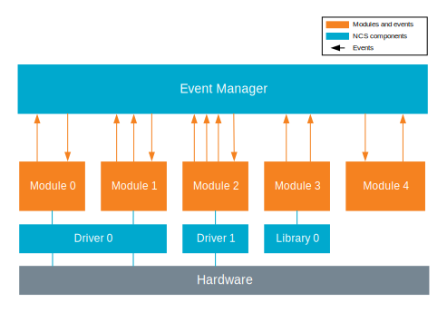

.. _event_manager:

Event Manager
#############

.. contents::
   :local:
   :depth: 2

The Event Manager is a piece of software that supports development of consistent, modular, event-based application.
In an event-based application, parts of the application functionality are separated into isolated modules that communicate with each other using events.
Events are submitted by modules and other modules can subscribe and react to them.
The Event Manager acts as coordinator of the event-based communication.

See the :ref:`event_manager_sample` sample for a simple example of how to use the Event Manager.

Events
******

Events are structured data types that are defined by the application and can contain additional data.

The Event Manager handles the events by processing and propagating all of them to the modules (listeners) that subscribe to a specific event.
Multiple modules can subscribe to the same event.
As part of this communication, listeners can process events differently based on their type.

The Event Manager provides API for defining, creating, and subscribing events.
See `Implementing an event type`_ for details about how to create custom event types.

Modules
*******

Modules are separate source files that can subscribe to every defined event.
You can use events for communication between modules.

There is no limitation as to how many modules each module can subscribe to.
An application can have as many modules as required.

The Event Manager provides API for subscribing modules to a specific events defined in the application.
When a module is subscribing to a specific event, it is called a listener module.
Every listener is identified by a unique name.

.. _event_manager_configuration:

Configuration
*************

To use Event Manager, you must enable the following Kconfig options:

* :kconfig:`CONFIG_EVENT_MANAGER` - This option enables the Event Manager.
* :kconfig:`CONFIG_LINKER_ORPHAN_SECTION_PLACE` - This option enables orphan memory sections used by the Event Manager.
  Set this option to suppress warnings and errors.

Initializing the Event Manager
==============================

You must initialize the Event Manager in your :file:`main.c` file.
Initializing the Event Manger allows it to handle submitted events and deliver them to modules that subscribe to the specified event type.

To initialize the Event Manager, complete the following steps:

1. Include :file:`event_manager.h` in your :file:`main.c` file.
#. Call :c:func:`event_manager_init()`.

.. _event_manager_implementing_events:

Implementing events and modules
*******************************

If an application module is supposed to react to an event, your application must implement an event type, submit the event, and register the module as listener.
Read the following sections for details.

Implementing an event type
==========================

If you want to easily create and implement custom event types, the Event Manager provides macros to add a new event type in your application.
Complete the following steps:

* `Create a header file`_ for the event type you want to define
* `Create a source file`_ for the event type

Create a header file
--------------------

To create a header file for the event type you want to define:

1. Make sure the header file includes the Event Manager header file:

   .. code-block:: c

	   #include event_manager.h

#. Define the new event type by creating a structure that contains :c:struct:`event_header` ``header`` as the first field.
#. Optionally, add additional custom data fields to the structure.
#. Declare the event type with the :c:macro:`EVENT_TYPE_DECLARE` macro, passing the name of the created structure as an argument.

The following code example shows a header file for the event type :c:struct:`sample_event`:

.. code-block:: c

   #include <event_manager.h>

   struct sample_event {
	   struct event_header header;

	   /* Custom data fields. */
	   int8_t value1;
	   int16_t value2;
	   int32_t value3;
   };

   EVENT_TYPE_DECLARE(sample_event);

In some use cases, the length of the data associated with an event may vary.
You can use the :c:macro:`EVENT_TYPE_DYNDATA_DECLARE` macro instead of :c:macro:`EVENT_TYPE_DECLARE` to declare an event type with variable data size.
In such case, add the data with the variable size as the last member of the event structure.
For example, you can add the variable size data to a previously defined event by applying the following change to the code:

.. code-block:: c

   #include <event_manager.h>

   struct sample_event {
	   struct event_header header;

	   /* Custom data fields. */
	   int8_t value1;
	   int16_t value2;
	   int32_t value3;
	   struct event_dyndata dyndata;
   };

   EVENT_TYPE_DYNDATA_DECLARE(sample_event);

In this example, the :c:struct:`event_dyndata` contains the following information:

* A zero-length array that is used as a buffer with variable size (:c:member:`event_dyndata.data`).
* A number representing the size of the buffer (:c:member:`event_dyndata.size`).

Create a source file
--------------------

To create a source file for the event type you defined in the header file:

1. Include the header file for the new event type in your source file.
#. Define the event type with the :c:macro:`EVENT_TYPE_DEFINE` macro.
   Passing the name of the event type as declared in the header and the additional parameters.
   For example, you can provide a function that fills a buffer with a string version of the event data (used for logging).

The following code example shows a source file for the event type ``sample_event``:

.. code-block:: c

   #include "sample_event.h"

   static int log_sample_event(const struct event_header *eh, char *buf,
			       size_t buf_len)
   {
	   struct sample_event *event = cast_sample_event(eh);

	   return snprintf(buf, buf_len, "val1=%d val2=%d val3=%d", event->value1,
			   event->value2, event->value3);
   }

   EVENT_TYPE_DEFINE(sample_event,	/* Unique event name. */
		     true,		/* Event logged by default. */
		     log_sample_event,	/* Function logging event data. */
		     NULL);		/* No event info provided. */

Submitting an event
===================

To submit an event of a given type, for example ``sample_event``:

1. Allocate the event by calling the function with the name *new_event_type_name*.
   For example, ``new_sample_event()``.
#. Write values to the data fields.
#. Use :c:macro:`EVENT_SUBMIT` to submit the event.

The following code example shows how to create and submit an event of type ``sample_event`` that has three data fields:

.. code-block:: c

	/* Allocate event. */
	struct sample_event *event = new_sample_event();

	/* Write data to datafields. */
	event->value1 = value1;
	event->value2 = value2;
	event->value3 = value3;

	/* Submit event. */
	EVENT_SUBMIT(event);

If an event type also defines data with variable size, you must pass also the size of the data as an argument to the function that allocates the event.
For example, if the ``sample_event`` also contains data with variable size, you must apply the following changes to the code:

.. code-block:: c

	/* Allocate event. */
	struct sample_event *event = new_sample_event(my_data_size);

	/* Write data to datafields. */
	event->value1 = value1;
	event->value2 = value2;
	event->value3 = value3;

	/* Write data with variable size. */
	memcpy(event->dyndata.data, my_buf, my_data_size);

	/* Submit event. */
	EVENT_SUBMIT(event);

After the event is submitted, the Event Manager adds it to the processing queue.
When the event is processed, the Event Manager notifies all modules that subscribe to this event type.

.. note::
	Events are dynamically allocated and must be submitted.
	If an event is not submitted, it will not be handled and the memory will not be freed.

.. _event_manager_register_module_as_listener:

Registering a module as listener
================================

If you want a module to receive events managed by the Event Manager, you must register it as a listener and you must subscribe it to a given event type.

To turn a module into a listener for specific event types, complete the following steps:

1. Include the header files for the respective event types, for example, ``#include "sample_event.h"``.
#. :ref:`Implement an Event handler function <event_manager_register_module_as_listener_handler>` and define the module as a listener with the :c:macro:`EVENT_LISTENER` macro, passing both the name of the module and the event handler function as arguments.
#. Subscribe the listener to specific event types.

For subscribing to an event type, the Event Manager provides three types of subscriptions, differing in priority.
They can be registered with the following macros:

* :c:macro:`EVENT_SUBSCRIBE_EARLY` - notification before other listeners
* :c:macro:`EVENT_SUBSCRIBE` - standard notification
* :c:macro:`EVENT_SUBSCRIBE_FINAL` - notification as the last, final subscriber

There is no defined order in which subscribers of the same priority are notified.

The module will receive events for the subscribed event types only.
The listener name passed to the subscribe macro must be the same one used in the macro :c:macro:`EVENT_LISTENER`.

.. _event_manager_register_module_as_listener_handler:

Implementing an event handler function
--------------------------------------

The event handler function is called when any of the subscribed event types are being processed.
Only one event handler function can be registered per listener.
Therefore, if a listener subscribes to multiple event types, the function must handle all of them.

The event handler gets a pointer to the :c:struct:`event_header` structure as the function argument.
The function should return ``true`` to consume the event, which means that the event is not propagated to further listeners, or ``false``, otherwise.

To check if an event has a given type, call the function with the name *is*\_\ *event_type_name* (for example, ``is_sample_event()``), passing the pointer to the event header as the argument.
This function returns ``true`` if the event matches the given type, or ``false`` otherwise.

To access the event data, cast the :c:struct:`event_header` structure to a proper event type, using the function with the name *cast*\_\ *event_type_name* (for example, ``cast_sample_event()``), passing the pointer to the event header as the argument.

Code example
------------

The following code example shows how to register an event listener with an event handler function and subscribe to the event type ``sample_event``:

.. code-block:: c

	#include "sample_event.h"

	static bool event_handler(const struct event_header *eh)
	{
		if (is_sample_event(eh)) {

			/* Accessing event data. */
			struct sample_event *event = cast_sample_event(eh);

			int8_t v1 = event->value1;
			int16_t v2 = event->value2;
			int32_t v3 = event->value3;

			/* Actions when received given event type. */
			foo(v1, v2, v3);

			return false;
		}

		return false;
	}

	EVENT_LISTENER(sample_module, event_handler);
	EVENT_SUBSCRIBE(sample_module, sample_event);

The variable size data is accessed in the same way as the other members of the structure defining an event.

Event Manager extensions
************************

The Event Manager provides additional features that could be helpful when debugging event-based applications.

.. _event_manager_profiling_tracing_hooks:

Tracing hooks
=============

.. em_tracing_hooks_start

Event Manager provides tracing hooks that you can use at run time to get information about Event Manager initialization, event submission, and event execution.
The hooks are provided as weak functions.
You can override them for interacting with custom profiler or for other purposes.

The following weak functions are provided by Event Manager as hooks:

* :c:func:`event_manager_trace_event_execution`
* :c:func:`event_manager_trace_event_submission`
* :c:func:`event_manager_trace_event_init`
* :c:func:`event_manager_alloc`
* :c:func:`event_manager_free`

For details, refer to `API documentation`_.

.. em_tracing_hooks_end

Shell integration
=================

Shell integration is available to display additional information and to dynamically enable or disable logging for given event types.

The Event Manager is integrated with :ref:`shell_api` module.
When the shell is turned on, an additional subcommand set (:command:`event_manager`) is added.

This subcommand set contains the following commands:

:command:`show_listeners`
  Show all registered listeners.

:command:`show_subscribers`
  Show all registered subscribers.

:command:`show_events`
  Show all registered event types.
  The letters "E" or "D" indicate if logging is currently enabled or disabled for a given event type.

:command:`enable` or :command:`disable`
  Enable or disable logging.
  If called without additional arguments, the command applies to all event types.
  To enable or disable logging for specific event types, pass the event type indexes, as displayed by :command:`show_events`, as arguments.

API documentation
*****************

| Header files: :file:`include/event_manager/`
| Source files: :file:`subsys/event_manager/`

.. doxygengroup:: event_manager
