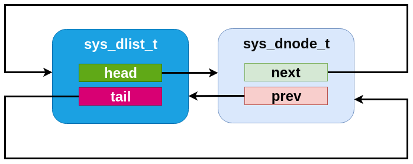
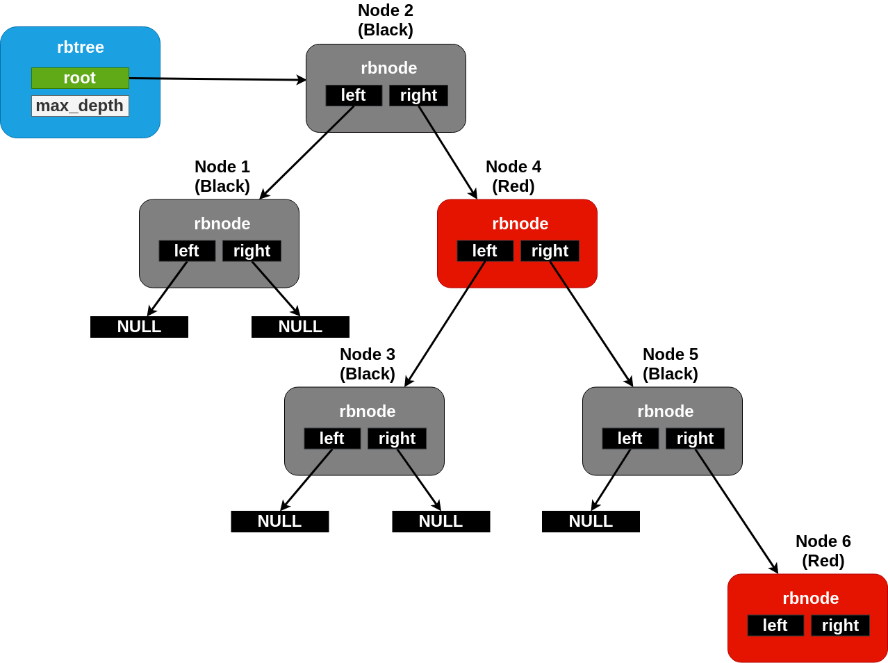

Data Structures
###############

Zephyr provides a library of common general purpose data structures
used within the kernel, but useful by application code in general.
These include list and balanced tree structures for storing ordered
data, and a ring buffer for managing "byte stream" data in a clean
way.

Note that in general, the collections are implemented as "intrusive"
data structures.  The "node" data is the only struct used by the
library code, and it does not store a pointer or other metadata to
indicate what user data is "owned" by that node.  Instead, the
expectation is that the node will be itself embedded within a
user-defined struct.  Macros are provided to retrieve a user struct
address from the embedded node pointer in a clean way.  The purpose
behind this design is to allow the collections to be used in contexts
where dynamic allocation is disallowed (i.e. there is no need to
allocate node objects because the memory is provided by the user).

Note also that these libraries are uniformly unsynchronized; access to
them is not threadsafe by default.  These are data structures, not
synchronization primitives.  The expectation is that any locking
needed will be provided by the user.

Single-linked List
==================

Zephyr provides a ``sys_slist_t`` type for storing simple
singly-linked list data (i.e. data where each list element stores a
pointer to the next element, but not the previous one).  This supports
constant-time access to the first (head) and last (tail) elements of
the list, insertion before the head and after the tail of the list and
constant time removal of the head.  Removal of subsequent nodes
requires access to the "previous" pointer and thus can only be
performed in linear time by searching the list.

The ``sys_slist_t`` struct may be instantiated by the user in any
accessible memory.  It should be initialized with either
``sys_slist_init()`` or by static assignment from SYS_SLIST_STATIC_INIT
before use.  Its interior fields are opaque and should not be accessed
by user code.

The end nodes of a list may be retrieved with
``sys_slist_peek_head()`` and ``sys_slist_peek_tail()``, which will
return NULL if the list is empty, otherwise a pointer to a
``sys_snode_t`` struct.

The ``sys_snode_t`` struct represents the data to be inserted.  In
general, it is expected to be allocated/controlled by the user,
usually embedded within a struct which is to be added to the list.
The container struct pointer may be retrieved from a list node using
``SYS_SLIST_CONTAINER()``, passing it the struct name of the
containing struct and the field name of the node.  Internally, the
``sys_snode_t`` struct contains only a next pointer, which may be
accessed with ``sys_slist_peek_next()``.

Lists may be modified by adding a single node at the head or tail with
``sys_slist_prepend()`` and ``sys_slist_append()``.  They may also
have a node added to an interior point with ``sys_slist_insert()``,
which inserts a new node after an existing one.  Similarly
``sys_slist_remove()`` will remove a node given a pointer to its
predecessor.  These operations are all constant time.

Convenience routines exist for more complicated modifications to a
list.  ``sys_slist_merge_slist()`` will append an entire list to an
existing one.  ``sys_slist_append_list()`` will append a bounded
subset of an existing list in constant time.  And
``sys_slist_find_and_remove()`` will search a list (in linear time)
for a given node and remove it if present.

Finally the slist implementation provides a set of "for each" macros
that allows for iterating over a list in a natural way without needing
to manually traverse the next pointers.  ``SYS_SLIST_FOR_EACH_NODE()``
will enumerate every node in a list given a local variable to store
the node pointer.  ``SYS_SLIST_FOR_EACH_NODE_SAFE()`` behaves
similarly, but has a more complicated implementation that requires an
extra scratch variable for storage and allows the user to delete the
iterated node during the iteration.  Each of those macros also exists
in a "container" variant (``SYS_SLIST_FOR_EACH_CONTAINER()`` and
``SYS_SLIST_FOR_EACH_CONTAINER_SAFE()``) which assigns a local
variable of a type that matches the user's container struct and not
the node struct, performing the required offsets internally.  And
``SYS_SLIST_ITERATE_FROM_NODE()`` exists to allow for enumerating a
node and all its successors only, without inspecting the earlier part
of the list.

Slist Internals
---------------

The slist code is designed to be minimal and conventional.
Internally, a ``sys_slist_t`` struct is nothing more than a pair of
"head" and "tail" pointer fields.  And a ``sys_snode_t`` stores only a
single "next" pointer.

.. figure:: slist.png
    :align: center
    :alt: slist example
    :figclass: align-center

    An slist containing three elements.

.. figure:: slist-empty.png
    :align: center
    :alt: empty slist example
    :figclass: align-center

    An empty slist

The specific implementation of the list code, however, is done with an
internal "Z_GENLIST" template API which allows for extracting those
fields from arbitrary structures and emits an arbitrarily named set of
functions.  This allows for implementing more complicated
single-linked list variants using the same basic primitives.  The
genlist implementor is responsible for a custom implementation of the
primitive operations only: an "init" step for each struct, and a "get"
and "set" primitives for each of head, tail and next pointers on their
relevant structs.  These inline functions are passed as parameters to
the genlist macro expansion.

Only one such variant, sflist, exists in Zephyr at the moment.

Flagged List
------------

The ``sys_sflist_t`` is implemented using the described genlist
template API.  With the exception of symbol naming ("sflist" instead
of "sflist"), it operates in all ways identically to the slist API.

It includes the ability to associate exactly two bits of user defined
"flags" with each list node.  These can be accessed and modified with
``sys_sflist_flags_get()`` and ``sys_sflist_flags_get()``.
Internally, the flags are stored unioned with the bottom bits of the
next pointer and incur no SRAM storage overhead when compared with the
simpler slist code.

Double-linked List
==================

Similar to the single-linked list in many respects, Zephyr includes a
double-linked implementation.  This provides the same algorithmic
behavior for all the existing slist operations, but also allows for
constant-time removal and insertion (at all points: before or after
the head, tail or any internal node).  To do this, the list stores two
pointers per node, and thus has somewhat higher runtime code and
memory space needs.

A ``sys_dlist_t`` struct may be instantiated by the user in any
accessible memory.  It must be initialized with ``sys_dlist_init()``
or ``SYS_DLIST_STATIC_INIT()`` before use.  The ``sys_dnode_t`` struct
is expected to be provided by the user for any nodes addded to the
list (typically embedded within the struct to be tracked, as described
above).  It must be initialized in zeroed/bss memory or with
``sys_dnode_init()`` before use.

Primitive operations may retrieve the head/tail of a list and the
next/prev pointers of a node with ``sys_dlist_peek_head()``,
``sys_dlist_peek_tail()``, ``sys_dlist_peek_next()`` and
``sys_dlist_peek_prev()``.  These can all return NULL where
appropriate (i.e. for empty lists, or nodes at the endpoints of the
list).

A dlist can be modified in constant time by removing a node with
``sys_dlist_remove()``, by adding a node to the head or tail of a list
with ``sys_dlist_prepend()`` and ``sys_dlist_append()``, or by
inserting a node before an existing node with ``sys_dlist_insert()``.

As for slist, each node in a dlist can be processed in a natural code
block style using ``SYS_DLIST_FOR_EACH_NODE()``.  This macro also
exists in a "FROM_NODE" form which allows for iterating from a known
starting point, a "SAFE" variant that allows for removing the node
being inspected within the code block, a "CONTAINER" style that
provides the pointer to a containing struct instead of the raw node,
and a "CONTAINER_SAFE" variant that provides both properties.

Convenience utilities provided by dlist include
``sys_dlist_insert_at()``, which inserts a node that linearly searches
through a list to find the right insertion point, which is provided by
the user as a C callback function pointer, and
``sys_dlist_is_linked()``, which will affirmatively return whether or
not a node is currently linked into a dlist or not (via an
implementation that has zero overhead vs. the normal list processing).

Dlist Internals
---------------

Internally, the dlist implementation is minimal: the ``sys_dlist_t``
struct contains "head" and "tail" pointer fields, the ``sys_dnode_t``
contains "prev" and "next" pointers, and no other data is stored.  But
in practice the two structs are internally identical, and the list
struct is inserted as a node into the list itself.  This allows for a
very clean symmetry of operations:

* An empty list has backpointers to itself in the list struct, which
  can be trivially detected.

* The head and tail of the list can be detected by comparing the
  prev/next pointers of a node vs. the list struct address.

* An insertion or deletion never needs to check for the special case
  of inserting at the head or tail.  There are never any NULL pointers
  within the list to be avoided.  Exactly the same operations are run,
  without tests or branches, for all list modification primitives.

Effectively, a dlist of N nodes can be thought of as a "ring" of "N+1"
nodes, where one node represents the list tracking struct.

.. figure:: dlist.png
    :align: center
    :alt: dlist example
    :figclass: align-center

    A dlist containing three elements.  Note that the list struct
    appears as a fourth "element" in the list.

    An dlist containing just one element.

.. figure:: dlist-empty.png
    :align: center
    :alt: dlist example
    :figclass: align-center

    An empty dlist.

Balanced Red/Black Tree
=======================

For circumstances where sorted containers may become large at runtime,
a list becomes problematic due to algorithmic costs of searching it.
For these situations, Zephyr provides a balanced tree implementation
which has runtimes on search and removal operations bounded at
O(log2(N)) for a tree of size N.  This is implemented using a
conventional red/black tree as described by multiple academic sources.

The ``struct rbtree`` tracking struct for a rbtree may be initialized
anywhere in user accessible memory.  It should contain only zero bits
before first use.  No specific initialization API is needed or
required.

Unlike a list, where position is explicit, the ordering of nodes
within an rbtree must be provided as a predicate function by the user.
A function of type ``rb_lessthan_t()`` should be assigned to the
``lessthan_fn`` field of the ``struct rbtree`` before any tree
operations are attempted.  This function should, as its name suggests,
return a boolean True value if the first node argument is "less than"
the second in the ordering desired by the tree.  Note that "equal" is
not allowed, nodes within a tree must have a single fixed order for
the algorithm to work correctly.

As with the slist and dlist containers, nodes within an rbtree are
represented as a ``struct rbnode`` structure which exists in
user-managed memory, typically embedded within the the data structure
being tracked in the tree.  Unlike the list code, the data within an
rbnode is entirely opaque.  It is not possible for the user to extract
the binary tree topology and "manually" traverse the tree as it is for
a list.

Nodes can be inserted into a tree with ``rb_insert()`` and removed
with ``rb_remove()``.  Access to the "first" and "last" nodes within a
tree (in the sense of the order defined by the comparison function) is
provided by ``rb_get_min()`` and ``rb_get_max()``.  There is also a
predicate, ``rb_contains()``, which returns a boolean True if the
provided node pointer exists as an element within the tree.  As
described above, all of these routines are guaranteed to have at most
log time complexity in the size of the tree.

There are two mechanisms provided for enumerating all elements in an
rbtree.  The first, ``rb_walk()``, is a simple callback implementation
where the caller specifies a C function pointer and an untyped
argument to be passed to it, and the tree code calls that function for
each node in order.  This has the advantage of a very simple
implementation, at the cost of a somewhat more cumbersome API for the
user (not unlike ISO C's ``bsearch()`` routine).  It is a recursive
implementation, however, and is thus not always available in
environments that forbid the use of unbounded stack techniques like
recursion.

There is also a ``RB_FOR_EACH()`` iterator provided, which, like the
similar APIs for the lists, works to iterate over a list in a more
natural way, using a nested code block instead of a callback.  It is
also nonrecursive, though it requires log-sized space on the stack by
default (however, this can be configured to use a fixed/maximally size
buffer instead where needed to avoid the dynamic allocation).  As with
the lists, this is also available in a ``RB_FOR_EACH_CONTAINER()``
variant which enumerates using a pointer to a container field and not
the raw node pointer.

Tree Internals
--------------

As described, the Zephyr rbtree implementation is a conventional
red/black tree as described pervasively in academic sources.  Low
level details about the algorithm are out of scope for this document,
as they match existing conventions.  This discussion will be limited
to details notable or specific to the Zephyr implementation.

The core invariant guaranteed by the tree is that the path from the root of
the tree to any leaf is no more than twice as long as the path to any
other leaf.  This is achieved by associating one bit of "color" with
each node, either red or black, and enforcing a rule that no red child
can be a child of another red child (i.e. that the number of black
nodes on any path to the root must be the same, and that no more than
that number of "extra" red nodes may be present).  This rule is
enforced by a set of rotation rules used to "fix" trees following
modification.

    A maximally unbalanced rbtree with a black height of two.  No more
    nodes can be added underneath the rightmost node without
    rebalancing.

These rotations are conceptually implemented on top of a primitive
that "swaps" the position of one node with another in the list.
Typical implementations effect this by simply swapping the nodes
internal "data" pointers, but because the Zephyr ``struct rbnode`` is
intrusive, that cannot work.  Zephyr must include somewhat more
elaborate code to handle the edge cases (for example, one swapped node
can be the root, or the two may already be parent/child).

The ``struct rbnode`` struct for a Zephyr rbtree contains only two
pointers, representing the "left", and "right" children of a node
within the binary tree.  Traversal of a tree for rebalancing following
modification, however, routinely requires the ability to iterate
"upwards" from a node as well.  It is very common for red/black trees
in the industry to store a third "parent" pointer for this purpose.
Zephyr avoids this requirement by building a "stack" of node pointers
locally as it traverses downward thorugh the tree and updating it
appropriately as modifications are made.  So a Zephyr rbtree can be
implemented with no more runtime storage overhead than a dlist.

These properties, of a balanced tree data structure that works with
only two pointers of data per node and that works without any need for
a memory allocation API, are quite rare in the industry and are
somewhat unique to Zephyr.

Ring Buffer
===========

For circumstances where an application needs to implement asynchronous
"streaming" copying of data, Zephyr provides a ``struct ring_buf``
abstraction to manage copies of such data in and out of a shared
buffer of memory.  Ring buffers may be used in either "bytes" mode,
where the data to be streamed is an uninterpreted array of bytes, or
"items" mode where the data much be an integral number of 32 bit
words.  While the underlying data structure is the same, it is not
legal to mix these two modes on a single ring buffer instance.  A ring
buffer initialized with a byte count must be used only with the
"bytes" API, one initialized with a word count must use the "items"
calls.

A ``struct ring_buf`` may be placed anywhere in user-accessible
memory, and must be initialized with ``ring_buf_init()`` before use.
This must be provided a region of user-controlled memory for use as
the buffer itself.  Note carefully that the units of the size of the
buffer passed change (either bytes or words) depending on how the ring
buffer will be used later.  Macros for combining these steps in a
single static declaration exist for convenience.
``RING_BUF_DECLARE()`` will declare and statically initialize a ring
buffer with a specified byte count, where
``RING_BUF_ITEM_DECLARE_SIZE()`` will declare and statically
initialize a buffer with a given count of 32 bit words.
``RING_BUF_ITEM_DECLARE_POW2()`` can be used to initialize an
items-mode buffer with a memory region guaranteed to be a power of
two, which enables various optimizations internal to the
implementation.  No power-of-two initialization is available for
bytes-mode ring buffers.

"Bytes" data may be copied into the ring buffer using
``ring_buf_put()``, passing a data pointer and byte count.  These
bytes will be copied into the buffer in order, as many as will fit in
the allocated buffer.  The total number of bytes copied (which may be
fewer than provided) will be returned.  Likewise ``ring_buf_get()``
will copy bytes out of the ring buffer in the order that they were
written, into a user-provided buffer, returning the number of bytes
that were transferred.

To avoid multiply-copied-data situations, a "claim" API exists for
byte mode.  ``ring_buf_put_claim()`` takes a byte size value from the
user and returns a pointer to memory internal to the ring buffer that
can be used to receive those bytes, along with a size of the
contiguous internal region (which may be smaller than requested).  The
user can then copy data into that region at a later time without
assembling all the bytes in a single region first.  When complete,
``ring_buf_put_finish()`` can be used to signal the buffer that the
transfer is complete, passing the number of bytes actually
transferred.  At this point a new transfer can be initiated.
Similarly, ``ring_buf_get_claim()`` returns a pointer to internal ring
buffer data from which the user can read without making a verbatim
copy, and ``ring_buf_get_finish()`` signals the buffer with how many
bytes have been consumed and allows for a new transfer to begin.

"Items" mode works similarly to bytes mode, except that all transfers
are in units of 32 bit words and all memory is assumed to be aligned
on 32 bit boundaries.  The write and read operations are
``ring_buf_item_put()`` and ``ring_buf_item_get()``, and work
otherwise identically to the bytes mode APIs.  There no "claim" API
provided for items mode.  One important difference is that unlike
``ring_buf_put()``, ``ring_buf_item_put()`` will not do a partial
transfer; it will return an error in the case where the provided data
does not fit in its entirety.

The user can manage the capacity of a ring buffer without modifying it
using the ``ring_buf_space_get()`` call (which returns a value of
either bytes or items depending on how the ring buffer has been used),
or by testing the ``ring_buf_is_empty()`` predicate.

Finally, a ``ring_buf_reset()`` call exists to immediately empty a
ring buffer, discarding the tracking of any bytes or items already
written to the buffer.  It does not modify the memory contents of the
buffer itself, however.

Ring Buffer Internals
---------------------

Data streamed through a ring buffer is always written to the next byte
within the buffer, wrapping around to the first element after reaching
the end, thus the "ring" structure.  Internally, the ``struct
ring_buf`` contains its own buffer pointer and its size, and also a
"head" and "tail" index representing where the next read and write

This boundary is invisible to the user using the normal put/get APIs,
but becomes a barrier to the "claim" API, because obviously no
contiguous region can be returned that crosses the end of the buffer.
This can be surprising to application code, and produce performance
artifacts when transfers need to alias closely to the size of the
buffer, as the number of calls to claim/finish need to double for such
transfers.

When running in items mode (only), the ring buffer contains two
implementations for the modular arithmetic required to compute "next
element" offsets.  One is used for arbitrary sized buffers, but the
other is optimized for power of two sizes and can replace the compare
and subtract steps with a simple bitmask in several places, at the
cost of testing the "mask" value for each call.
