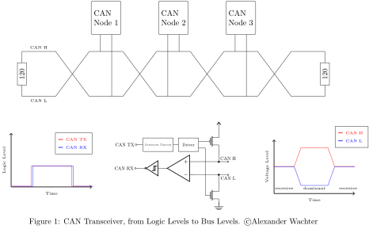

.. _can_interface:

Controller Area Network (CAN)
#############################

.. contents::
    :local:
    :depth: 2

Overview
********

Controller Area Network is a two-wire serial bus specified by the
Bosch CAN Specification, Bosch CAN with Flexible Data-Rate specification and the
ISO 11898-1:2003 standard.
CAN is mostly known for its application in the automotive domain. However, it
is also used in home and industrial automation and other products.

A CAN transceiver is an external device that converts the logic level signals
from the CAN controller to the bus-levels. The bus lines are called
CAN High (CAN H) and CAN Low (CAN L).
The transmit wire from the controller to the transceiver is called CAN TX,
and the receive wire is called CAN RX.
These wires use the logic levels whereas the bus-level is interpreted
differentially between CAN H and CAN L.
The bus can be either in the recessive (logical one) or dominant (logical zero)
state. The recessive state is when both lines, CAN H and CAN L, at roughly at
the same voltage level. This state is also the idle state.
To write a dominant bit to the bus, open-drain transistors tie CAN H to Vdd
and CAN L to ground.
The first and last node use a 120-ohm resistor between CAN H and CAN L to
terminate the bus. The dominant state always overrides the recessive state.
This structure is called a wired-AND.

.. warning::

   CAN controllers can only initialize when the bus is in the idle (recessive)
   state for at least 11 recessive bits. Therefore you have to make sure that
   CAN RX is high, at least for a short time. This is also necessary for
   loopback mode.

The bit-timing as defined in ISO 11898-1:2003 looks as following:

.. image:: can_timing.svg
   :width: 40%
   :align: center
   :alt: CAN Timing

A single bit is split into four segments.

* Sync_Seg: The nodes synchronize at the edge of the Sync_Seg. It is always one time quantum in length.

* Prop_Seg: The signal propagation delay of the bus and other delays of the transceiver and node.

* Phase_Seg1 and Phase_Seg2 :Define the sampling point. The bit is sampled at the end of Phase_Seg1.

The bit-rate is calculated from the time of a time quantum and the values
defined above.
A bit has the length of Sync_Seg plus Prop_Seg plus Phase_Seg1 plus Phase_Seg2
multiplied by the time of single time quantum.
The bit-rate is the inverse of the length of a single bit.

The resynchronization jump width (SJW) defines the amount of time quantum the
sample point can be moved. The sample point is moved when resynchronization
is needed.

CAN uses so-called identifiers to identify the frame instead of addresses to
identify a node.
This identifier can either have 11-bit width (Standard or Basic Frame) or
29-bit in case of an Extended Frame. The Zephyr CAN API supports both Standard
and Extended identifiers concurrently. A CAN frame starts with a dominant
Start Of Frame bit. After that, the identifiers follow. This phase is called the
arbitration phase. During the arbitration phase, write collisions are allowed.
They resolve by the fact that dominant bits override recessive bits.
Nodes monitor the bus and notice when their transmission is being overridden and
in case, abort their transmission.
This effectively gives lower number identifiers priority over higher number
identifiers.

Filters are used to whitelist identifiers that are of interest for the specific
node. An identifier that doesn't match any filter is ignored.
Filters can either match exactly or a specified part of the identifier.
This method is called masking.
As an example, a mask with 11 bits set for standard or 29 bits set for extended
identifiers must match perfectly.
Bits that are set to zero in the mask are ignored when matching an identifier.
Most CAN controllers implement a limited number of filters in hardware.
The number of filters is also limited in Kconfig to save memory.

Errors may occur during transmission. In case a node detects an erroneous frame,
it partially overrides the current frame with an error-frame.
Error-frames can either be error passive or error active, depending on the state
of the controller.
In case the controller is in error active state, it sends six consecutive
dominant bits, which is a violation of the stuffing rule that all nodes can
detect. The sender may resend the frame right after.

An initialized node can be in one of the following states:

* Error-active
* Error-passive
* Bus-off

After initialization, the node is in the error-active state. In this state, the
node is allowed to send active error frames, ACK, and overload frames.
Every node has a receive- and transmit-error counter.
If either the receive- or the transmit-error counter exceeds 127,
the node changes to error-passive state.
In this state, the node is not allowed to send error-active frames anymore.
If the transmit-error counter increases further to 255, the node changes to the
bus-off state. In this state, the node is not allowed to send any dominant bits
to the bus. Nodes in the bus-off state may recover after receiving 128
occurrences of 11 concurrent recessive bits.

You can read more about CAN bus in this
`CAN Wikipedia article <https://en.wikipedia.org/wiki/CAN_bus>`_.

Zephyr supports following CAN features:

* Standard and Extended Identifers
* Filters with Masking
* Loopback and Silent mode
* Remote Request

Sending
*******

The following code snippets show how to send data.

This basic sample sends a CAN frame with standard identifier 0x123 and eight
bytes of data. When passing NULL as the callback, as shown in this example,
the send function blocks until the frame is sent and acknowledged by at least
one other node or an error occurred. The timeout only takes effect on acquiring
a mailbox. When a transmitting mailbox is assigned, sending cannot be canceled.

.. code-block:: C

  struct zcan_frame frame = {
          .id_type = CAN_STANDARD_IDENTIFIER,
          .rtr = CAN_DATAFRAME,
          .ext_id = 0x123,
          .dlc = 8
  };
  struct device *can_dev;
  int ret;

  frame.data = {1,2,3,4,5,6,7,8};

  can_dev = device_get_binding("CAN_0");

  ret = can_send(can_dev, &frame, K_MSEC(100), NULL, NULL);
  if (ret != CAN_TX_OK) {
          LOG_ERR("Sending failed [%d]", ret);
  }

This example shows how to send a frame with extended identifier 0x1234567 and
two bytes of data. The provided callback is called when the message is sent, or
an error occurred. Passing `K_FOREVER` to the timeout causes the function to block
until a transfer mailbox is assigned to the frame or an error occurred. It does
not block until the message is sent like the example above.

.. code-block:: C

  void tx_irq_callback(u32_t error_flags, void *arg)
  {
          char *sender = (char *)arg;

          if (error_flags) {
                  LOG_ERR("Sendig failed [%d]\nSender: %s\n", error_flags, sender);
          }
  }

  int send_function(struct device *can_dev)
  {
          struct zcan_frame frame = {
                  .id_type = CAN_EXTENDED_IDENTIFIER,
                  .rtr = CAN_DATAFRAME,
                  .ext_id = 0x1234567,
                  .dlc = 2
          };

          frame.data = {1,2};
          return can_send(can_dev, &frame, K_FOREVER, tx_irq_callback, "Sender 1");
  }

Receiving
*********

Frames are only received when they match a filter.
The following code snippets show how to receive frames by attaching filters.

Here we have an example for a receiving callback.
It is used for `can_attach_isr` or `can_attach_workq`.
The argument arg is passed when the filter is attached.

.. code-block:: C

  void rx_callback_function(struct zcan_frame *frame, void *arg)
  {
          ... do something with the frame ...
  }

The following snippet shows how to attach a filter with an interrupt callback.
It is the most efficient but also the most critical way to receive messages.
The callback function is called from an interrupt context, which means that the
callback function should be as short as possible and must not block.
Attaching ISRs is not allowed from userspace context.

The filter for this example is configured to match the identifier 0x123 exactly.

.. code-block:: C

  const struct zcan_filter my_filter = {
          .id_type = CAN_STANDARD_IDENTIFIER,
          .rtr = CAN_DATAFRAME,
          .std_id = 0x123,
          .rtr_mask = 1,
          .std_id_mask = CAN_STD_ID_MASK
  };
  int filter_id;
  struct device *can_dev;

  can_dev = device_get_binding("CAN_0");

  filter_id = can_attach_isr(can_dev, rx_callback_function, callback_arg, &my_filter);
  if (filter_id < 0) {
    LOG_ERR("Unable to attach isr [%d]", filter_id);
  }

This example shows how to attach a callback from a work-queue.
In contrast to the `can_attach_isr` function, here the callback is called from the
work-queue provided. In this case, it is the system work queue. Blocking is
generally allowed in the callback but could result in a frame backlog when it is
not limited. For the reason of a backlog, a ring-buffer is applied for every
attached filter. The size of this buffer can be adjusted in Kconfig.
This function is not yet callable from userspace context but will be in the
future.

The filter for this example is configured to match a filter range from
0x120 to x12f.

.. code-block:: C

  const struct zcan_filter my_filter = {
          .id_type = CAN_STANDARD_IDENTIFIER,
          .rtr = CAN_DATAFRAME,
          .std_id = 0x120,
          .rtr_mask = 1,
          .std_id_mask = 0x7F0
  };
  struct zcan_work rx_work;
  int filter_id;
  struct device *can_dev;

  can_dev = device_get_binding("CAN_0");

  filter_id = can_attach_workq(can_dev, &k_sys_work_q, &rx_work, callback_arg, callback_arg, &my_filter);
  if (filter_id < 0) {
    LOG_ERR("Unable to attach isr [%d]", filter_id);
  }

Here an example for `can_attach_msgq` is shown. With this function, it is
possible to receive frames synchronously. This function can be called from
userspace context.
The size of the message queue should be as big as the expected backlog.

The filter for this example is configured to match the extended identifier
0x1234567 exactly.

.. code-block:: C

  const struct zcan_filter my_filter = {
          .id_type = CAN_EXTENDED_IDENTIFIER,
          .rtr = CAN_DATAFRAME,
          .std_id = 0x1234567,
          .rtr_mask = 1,
          .std_id_mask = CAN_EXT_ID_MASK
  };
  CAN_DEFINE_MSGQ(my_can_msgq, 2);
  struct zcan_frame rx_frame;
  int filter_id;
  struct device *can_dev;

  can_dev = device_get_binding("CAN_0");

  filter_id = can_attach_msgq(can_dev, &my_can_msgq, &my_filter);
  if (filter_id < 0) {
    LOG_ERR("Unable to attach isr [%d]", filter_id);
    return;
  }

  while (true) {
    k_msgq_get(&my_can_msgq, &rx_frame, K_FOREVER);
    ... do something with the frame ...
  }

`can_detach` removes the given filter.

.. code-block:: C

  can_detach(can_dev, filter_id);

SocketCAN
*********

Zephyr additionally supports SocketCAN, a BSD socket implementation of the
Zephyr CAN API.
SocketCAN brings the convenience of the well-known BSD Socket API to
Controller Area Networks. It is compatible with the Linux SocketCAN
implementation, where many other high-level CAN projects build on top.
Note that frames are routed to the network stack instead of passed directly,
which adds some computation and memory overhead.

Samples
*******

We have two ready-to-build samples demonstrating use of the Zephyr CAN API
:ref:`Zephyr CAN sample <can-sample>` and
:ref:`SocketCAN sample <socket-can-sample>`.

API Reference
*************

.. doxygengroup:: can_interface
   :project: Zephyr

