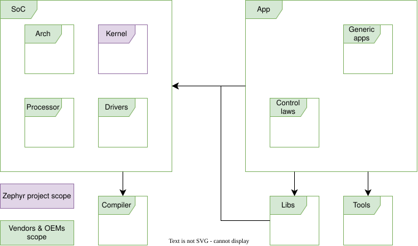

.. _safety_expanding_integrating:

Safety Expansion & Integration
##############################

This section describes a proposed approach for expanding or integrating the
Zephyr Project RTOS safety case for/with  architectures, processors, drivers, libraries, compilers or end user applications/solutions.

Ultimately, when expanding or integrating the Zephyr project safety case, it is up to the party performing such work and ultimately the vendor/OEMs to evaluate each elements' safety cases and whether the safety argument of each safety case, as integrated in the final system, is maintained.

Scope of Zephyr's safety case
*****************************

The scope of the Zephyr project safety case is currently limited to the Zephyr Kernel and the tools used during its software lifecycle development.
Additionally, the scope is limited to a specific configuration, documented in the safety manual.

Any other qualification reports or safety cases needed for end user applications are the responsibility of the vendors and/or OEMs integrating Zephyr in their solution.

   End user project - Safety case of cases and qualification reports view

Expanding Zephyr's safety case
******************************

Before being able to ship a end user application or solution that is compliant to your applicable safety standards, and as detailed in the above scope diagram, there are layers of safety evidence to be created.

.. note::
  The Zephyr safety committee hasn't converged on a final model to organize and document safety evidence other than that for the Kernel safety case.

While the Zephyr project distributed safety evidence model is being refined, community members willing to contribute requirements for components other than the Kernel are invited to create a directory within the `Zephyr project software requirements <https://github.com/zephyrproject-rtos/reqmgmt/tree/main/docs/software_requirements>`_  and `Zephyr project system requirements <https://github.com/zephyrproject-rtos/reqmgmt/tree/main/docs/system_requirements>`_ directories.

The directory structure should ideally mimic the Zephyr project code repository structure.

For example, a SoC vendor interested in contributing should do so the following way:

.. graphviz::
   :caption: Example of directory structure for SoC vendor contributions

   digraph folder_structure {
       rankdir="LR";
       node [fontname="Helvetica", fontsize=10];

       reqmgmt [label="reqmgmt", shape="cylinder", fillcolor="#e0f3ff", style="filled", URL="https://github.com/zephyrproject-rtos/reqmgmt"];
       docs [label="docs", shape="folder", fillcolor="#e0f3ff", style="filled"];
       soc [label="soc", shape="folder", fillcolor="#e0f3ff", style="filled"];
       vendor [label="<VENDOR>", shape="folder", fillcolor="#e0f3ff", style="filled"];
       vendorsoc [label="<VENDOR_SOC>", shape="folder", fillcolor="#e0f3ff", style="filled"];
       vendorsoc_sysreqdir [label="system_requirements", shape="folder", fillcolor="#e0f3ff", style="filled"];
       vendorsoc_swreqdir [label="software_requirements", shape="folder", fillcolor="#e0f3ff", style="filled"];
       vendorsoc_sysreq [label="<VENDOR_SOC>.sdoc", shape="note"];
       vendorsoc_swreq [label="<VENDOR_SOC>.sdoc", shape="note"];

       reqmgmt -> docs;
       docs -> soc;
       soc -> vendor;
       vendor -> vendorsoc;
       vendorsoc -> vendorsoc_sysreqdir;
       vendorsoc -> vendorsoc_swreqdir;
       vendorsoc_sysreqdir -> vendorsoc_sysreq;
       vendorsoc_swreqdir -> vendorsoc_swreq;
   }

When expanding Zephyr safety case, should it be for layers sitting below (e.g. processor, arch, drivers) or above (e.g. libraries, applications), users shall follow thei respective safety standards for integrating COTS software components, as briefly explained in the next section on integrating Zephyr's safety case.

Expansion deep dive: BSP
========================

.. admonition:: WIP
   :class: warning

   To be documented by the safety committee

Expansion deep dive: Libraries
==============================

.. admonition:: WIP
   :class: warning

   To be documented by the safety committee

Integrating Zephyr's safety case
********************************

It is up to the party integrating safety cases together, to evaluate whether the integrated elements' safety cases assumptions and requirements are valid after integration.

A high level and non-exhaustive list of activities for each integration level would be as follows:
#. Integrate Kernel, Architecture, Processor, Drivers, Libraries together
#. Review each COTS / components safety safety manuals, assumptions of use and integrators' requirements
#. Define configuration
#. Identify impacts of changes to the COTS / components
#. As required, update the COTS / components safety artefacts
#. Qualify the compiler
#. Rerun each COTS / components tests as identified in their safety safety manuals and during the change impact analysis
#. Provide the updated safety case for use by the application development teams and for integration in the system safety case

Integrators' considerations
***************************

When integrating Zephyr project RTOS as part of your product or project, you may want to consider the following areas for planning:
1. Qualification of / Safety strategy for:

   1. Drivers: Ethernet, USB, CAN, ARINC, SPI, I2C...
   2. Libraries: RUST, ROS, Security libraries (e.g. OP TEE), Diagnostics
   3. File System
   4. Compiler

2. Maintenance:

   1. Timely bug & security fixes (i.e. the community velocity may not suit you or your customer's expected SLAs)
   2. Long term maintenance (i.e. the community LTS duration may not suit you or your customer's expected support duration)

3. Partitioning, partitions types, boot sequence and OTA

Contributing back
*****************

When expanding Zephyr safety case for your use cases, there are 2 possible contributions scenarios:

1. Contributing safety artifacts back to the Zephyr project RTOS
2. Developing your own IP on top of the existing Zephyr project RTOS
