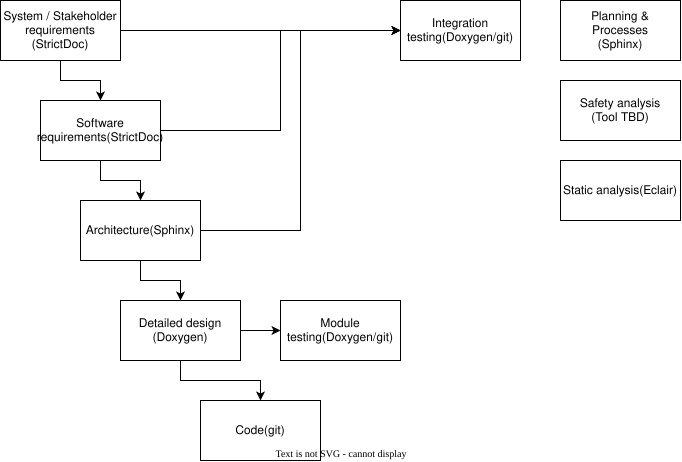

.. _safety_process_section:

Development Lifecycle Processes
###############################

These documents describe the lifecycle processes, safety and non-safety related
for ensuring that lifecycle processes required by the standards targeted by the
Zephyr project are addressed.

   Zephyr safety processes and tools overview

.. toctree::
   :maxdepth: 1
   :glob:
   
   planning.rst
   rrc_mgmt.rst
   cfg_chg_mgmt.rst
   supplier_mgmt.rst
   tool_eval_qual.rst
   quality_mgmt.rst
   requirements/index.rst
   design/index.rst
   safety_analysis/index.rst
   coding.rst
   safety_manual.rst
   verif_test.rst
   verif_review.rst
   release.rst
   other_considerations.rst
