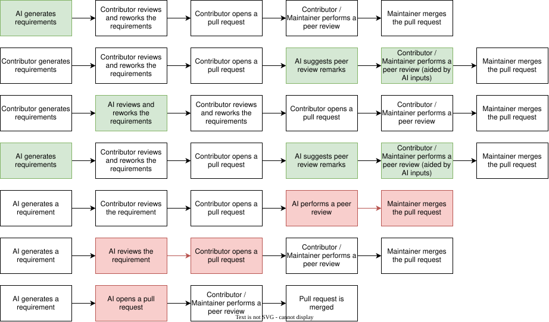

.. _safety_process-other_considerations:

Other considerations
####################

Document Identification
***********************

.. list-table::
   :header-rows: 1
   :width: 100%

   * - Version
     - Status
     - Release date (DD/MM/YYYY)
     - Review & Approval

   * - 1.0
     - Draft
     - 18/09/2026
     - See merge request history [#f1]_

.. [#f1] Refer to Configuration & Change Management process for how to identify commit and merge request related to a release.

Version history
***************

.. list-table::
   :header-rows: 1
   :widths: 10 90
   :width: 100%

   * - Version
     - Reason for change

   * - 1.0
     - Initial release

Introduction
************

Purpose & Scope
===============

This document provides guidelines for developers on specific topics not covered by the standard processes.

This document is applicable to Zephyr project safety releases and applies to all of the software life cycle data, software tools and hardware tools produced and used throughout the development life cycle.

Topics
======

Use of AI assistants
--------------------

The Zephyr project allows the use of AI in the software development lifecycle, and, when doing so, contributors must follow :ref:`ai_coding_assistants` guideline.

As required in that guideline, contributors must ensure that any artefact generated by AI assistants is reviewed by humans to ensure compliance with the Zephyr project SDLC processes.

Here are examples of how AI can assist, or not in the requirement development process:

   AI assisted scenarios for requirement development
