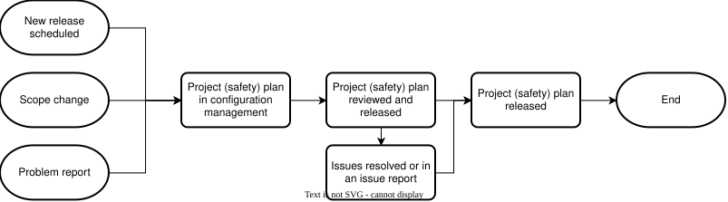

.. _safety_process-planning:

Planning
########

Document Identification
***********************

.. list-table::
   :header-rows: 1
   :width: 100%

   * - Version
     - Status
     - Release date (DD/MM/YYYY)
     - Review & Approval

   * - 1.0
     - Draft
     - 18/09/2026
     - See merge request history [#f1]_

.. [#f1] Refer to Configuration & Change Management process for how to identify commit and merge request related to a release.

Version history
***************

.. list-table::
   :header-rows: 1
   :widths: 10 90
   :width: 100%

   * - Version
     - Reason for change

   * - 1.0
     - Initial release

Process
*******

Purpose & Scope
===============

The planning process aims at planning software development lifecycle activities and monitoring these to completion.

This process is based on the established `Release Process <https://docs.zephyrproject.org/latest/project/release_process.html>`_ which defines the scope of the release and its timeline. 

This process is applicable to Zephyr project safety releases and applies to all of the software life cycle data, software tools and hardware tools produced and used throughout the development life cycle.

Overview
========

   Planning activity diagram

.. tabs::

   .. group-tab:: Entry

      #. New release development phase starts
      #. Change request on safety plan is approved

   .. group-tab:: Input

      #. Release scope including: 

         #. Applicable standards and regulations
         #. List of changes

      #. Released software development lifecycle processes

   .. group-tab:: Activities

      #. Create or Update safety plan

   .. group-tab:: Output   

      #. Safety plan
      #. Issues, if any

   .. group-tab:: Exit

      #. Safety plan is in configuration management
      #. Issues resulting from this process are resolved
      #. Non-resolved issues are logged and marked as non-gating
      #. Safety plan is released

   .. group-tab:: Tools

      .. list-table::
        :header-rows: 1
        :width: 100%

        * - Tool
          - Purpose
          - Location

        * - Safety Committee Git
          - Safety plan register
          - | Documented in safety plan
            | (Disclosed to Platinum members and assessors only)

        * - Git issues
          - SDLC Activities register
            Issues register
          - https://github.com/zephyrproject-rtos/<REPOSITORY>/issues

        * - Git pull requests
          - Changes register
          - https://github.com/zephyrproject-rtos/<REPOSITORY>/pulls

        * - Git commits
          - History of changes register
          - https://github.com/zephyrproject-rtos/<REPOSITORY>/commits/main

   .. group-tab:: R & R
      .. list-table::
        :header-rows: 1
        :width: 100%

        * - Role
          - Responsibilities

        * - Safety Manager
          - | Create the safety plan
            | Put the safety plan in configuration management

        * - Release manager
          - Reviews the safety plan

Activities
==========

Create or Update safety plan
----------------------------

The safety manager in conjunction with the project or release manager shall create the safety plan for the scope defined as part of the `Release Process <https://docs.zephyrproject.org/latest/project/release_process.html>`_.
The safety processes are an add on to the existing processes in the Zephyr Project and are defined by the Safety Manager and the Safety Chair.

The safety manager shall put the safety plan under configuration management.

The project or release manager shall review the safety plan.

Any issues found with the safety plan shall be fixed or logged in an issue record.

The safety plan shall then be released in configuration management.

.. list-table:: Acitivity Audit & Review checklist
        :header-rows: 1
        :widths: 10 50 40
        :width: 100%

        * - ID
          - Checklist item
          - Example (optional)

        * - 1
          - Are all the software development lifecycle processes released?
          - 

        * - 2
          - Is the scope of changes clearly defined in the safety plan?
          - 
