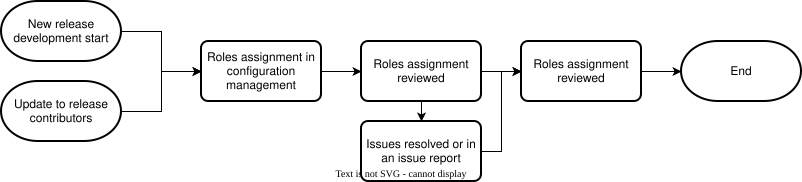

.. _safety_process-rrc_mgmt:

Roles, Responsibilities & Competence Management
###############################################

Document Identification
***********************

.. list-table::
   :header-rows: 1
   :width: 100%

   * - Version
     - Status
     - Release date (DD/MM/YYYY)
     - Review & Approval

   * - 1.0
     - Draft
     - 18/09/2026
     - See merge request history [#f1]_

.. [#f1] Refer to Configuration & Change Management process for how to identify commit and merge request related to a release.

Version history
***************

.. list-table::
   :header-rows: 1
   :widths: 10 90
   :width: 100%

   * - Version
     - Reason for change

   * - 1.0
     - Initial release

Process
*******

Purpose & Scope
===============

The roles, responsibilities and competence management process aims at defining roles, required competence for these roles and how to evaluate, train and report people's competence for these roles.

Roles, responsibilities and competence management shall ensure that the people involved in the development, safety and security lifecycle activities of the project possess the necessary skills and knowledge required for their assigned activities.

This process defines roles and provides guidance for assessing, monitoring, improving and reporting competencies of the people involved in the project.

This process is based on the established `Project Roles <https://docs.zephyrproject.org/latest/project/project_roles.html>`_ which defines roles and responsibilities for the project.

This process is applicable to Zephyr project safety releases and applies to all of the software life cycle data, software tools and hardware tools produced and used throughout the development life cycle.

Overview
========

   Roles Responsibilities and Competence Management process activity diagram

.. tabs::

   .. group-tab:: Entry

      #. New release development phase starts
      #. Update to the release contributors

   .. group-tab:: Input

      #. Released software development lifecycle processes
      #. Safety plan
      #. Release contributors

   .. group-tab:: Activities

      #. Define roles and competences
      #. Evaluate & Manage Competence

   .. group-tab:: Output   

      #. Roles assignment
      #. Issues, if any

   .. group-tab:: Exit

      #. Roles assignment is in configuration management
      #. Issues resulting from this process are resolved
      #. Non-resolved issues are logged and marked as non-gating
      #. Roles assignment is released

   .. group-tab:: Tools

      .. list-table::
        :header-rows: 1
        :width: 100%

        * - Tool
          - Purpose
          - Location

        * - Safety Committee Git
          - Safety roles assignment and competences register
          - | Documented in safety plan
            | (Disclosed to Platinum members and assessors only)

        * - Project Git
          - Code maintainers roles assignment register
          - https://github.com/zephyrproject-rtos/<REPOSITORY>/MAINTAINERS.yml

   .. group-tab:: R & R
      .. list-table::
        :header-rows: 1
        :width: 100%

        * - Role
          - Responsibilities

        * - Safety Manager
          - | Create or update the safety roles assignment
            | Ensure that contributors have the proper competence for their role
            | Put the safety roles assignment in configuration management

        * - Maintainers
          - | Create or update the code maintainers assignment
            | Ensure that contributors have the proper competence for their role
            | Put the code maintainers roles assignment in configuration management

Activities
==========

Define roles and competences
----------------------------

The need for, creation and management of roles for different disciplines or for maintaining software components shall be done according to `TSC Project Roles <https://docs.zephyrproject.org/latest/project/project_roles.html>`_ and the list of owners logged within `Maintainers list <https://github.com/zephyrproject-rtos/zephyr/blob/main/MAINTAINERS.yml>`_.

Additionally, the need for a subject matter experts group for a discipline (e.g. project management, requirements, architecture, code, test, documentation, release, safety, security) and the creation and management of such a discipline working group shall be done according to `TSC Working Groups <https://docs.zephyrproject.org/latest/project/project_roles.html>`_.

Evaluate & Manage Competence
----------------------------

**Evaluate competence**

People's competences shall be evaluated as documented in `Technical Steering Committee (TSC) <https://docs.zephyrproject.org/latest/project/tsc.html>`_, `TSC Project Roles <https://docs.zephyrproject.org/latest/project/project_roles.html>` and `TSC Working Groups <https://docs.zephyrproject.org/latest/project/project_roles.html>`_

Each discipline working group may define their competence evaluation methods within the Zephyr Documentation.

There does not need to be a competence evaluation and management log, but a summary of the maintainers and working group chairs shall be available on demand.

Good practices for competence evaluation include but are not limited to:

#. Reviewing cover letter or online profile
#. Peer recommendation
#. Interview by peers
#. Questionnaire / Quizz
#. Quality audits of work

.. list-table:: Acitivity Audit & Review checklist
        :header-rows: 1
        :widths: 10 50 40
        :width: 100%

        * - ID
          - Checklist item
          - Example (optional)

        * - 1
          - Are all disciplines defined in the TSC Project Roles — Zephyr Project Documentation?
          - 

        * - 2
          - Are owners defined for all disciplines or software components within Maintainers' list?
          - 

        * - 3
          - Is Maintainers' list disciplines or software components ownership up to date?
          - 

        * - 4
          - Are all working groups defined in Zephyr Committee and Working Groups · zephyrproject-rtos/zephyr Wiki · GitHub?
          - 

        * - 5
          - Are all working groups following the TSC Working Groups — Zephyr Project Documentation process? 
          - 

**Manage competence**

To ensure health of the project over time, the project shall maintain processes and / or work instructions to:

#. Train people
#. Transfer responsibilities
#. Transfer knowledge for the responsibilities
#. Remove access to project resources

Good practices for competence management include but are not limited to:

#. Knowledge sharing 

   #. Training material

      #. Onboarding plans
      #. Examples
      #. Videos
      #. Quizz

   #. Community of practice meetings and recordings / publications
   #. Centralized knowledge repository where disciplines log processes and information not widely known to the team such as 

      #. Common mistakes
      #. FAQs 

#. Mentorship program

   #. Pair experienced people with newer people to spread knowledge

#. Succession Plan 

   #. Identify and train candidates that are potential replacements for people whose experience and knowledge is unique within the project 
   #. Exit plan where exiting employee may document 
   #. Project actions items
   #. Project regular meetings and their roles within
   #. A list of ongoing or pending project deliverables, along with their status and any relevant deadlines
   #. Contact details for project team members, stakeholders, and any collaborators
   #. A record of access permissions to systems, software, databases, and any other tools critical to the project
   #. Information on any ongoing communications with clients, vendors, or external partners, along with the status of agreements, contracts, or negotiations.
   #. A list of tasks or activities that were in progress or planned, along with their status and any dependencies. 
   #. Highlight any pending approvals, sign-offs, or authorizations required for project-related decisions or tasks.

Competence management practices are documented in in `Technical Steering Committee (TSC) <https://docs.zephyrproject.org/latest/project/tsc.html>`_, `TSC Project Roles <https://docs.zephyrproject.org/latest/project/project_roles.html>`_ and `TSC Working Groups <https://docs.zephyrproject.org/latest/project/project_roles.html>`_.

Each discipline working group may define their competence management methods within the `Zephyr Documentation <https://docs.zephyrproject.org/latest/index.html>`_.

Training on ancillary processes (e.g. Issues, CM) common to each discipline is defined within `Contributing to Zephyr <https://docs.zephyrproject.org/latest/contribute/index.html>`_

Good practices for awareness & training include but are not limited to:

#. Documenting guidelines and procedures
#. Documenting generic and discipline specific onboarding
#. Sending reminders of process, guidelines and procedures to follow
#. Sending awareness messages for most common mistakes
#. Organizing recurring training, awareness or Q&A sessions (quarterly, bi-annual or yearly)

.. list-table:: Acitivity Audit & Review checklist
        :header-rows: 1
        :widths: 10 50 40
        :width: 100%

        * - ID
          - Checklist item
          - Example (optional)

        * - 1
          - Are all discipline responsibilities and qualifications defined in the project documentation?
          - 

        * - 2
          - Have all discipline owners qualifications been evaluated as defined in the TSC Project Roles — Zephyr Project Documentation?
          - 

        * - 3
          - Does the project have an onboarding onboarding plan?
          - 

        * - 4
          - Does the project have a contributor knowledge sharing or mentoring plan?
          - 

        * - 5
          - Does the project have a contributor succession plan?
          - 

        * - 6
          - Does the project have a contributor exit plan?
          - 

