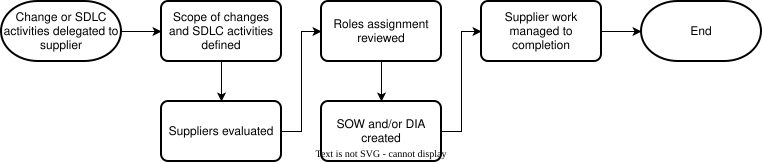

.. _safety_process-supplier_mgmt:

Supplier Management
###################

Document Identification
***********************

.. list-table::
   :header-rows: 1
   :width: 100%

   * - Version
     - Status
     - Release date (DD/MM/YYYY)
     - Review & Approval

   * - 1.0
     - Draft
     - 18/09/2026
     - See merge request history [#f1]_

.. [#f1] Refer to Configuration & Change Management process for how to identify commit and merge request related to a release.

Version history
***************

.. list-table::
   :header-rows: 1
   :widths: 10 90
   :width: 100%

   * - Version
     - Reason for change

   * - 1.0
     - Initial release

Process
*******

Purpose & Scope
===============

This process aims at defining the evaluation, selection, management and/or oversight of suppliers involved in the software development lifecycle activities.

This process is applicable to Zephyr project safety releases and applies to all of the software life cycle data, software tools and hardware tools produced and used throughout the development life cycle.
This process is applicable to suppliers responsible for providing work products delegated to them by the Zephyr project.
This process is not applicable to contractors hired to perform software development lifecycle activities as part of the Zephyr project releases, as these contractors are considered part of the Zephyr project and thus only subject to the roles, responsibilities and competence management process.

Overview
========

   Supplier management activity diagram

.. tabs::

   .. group-tab:: Entry

      #. SDLC activity is delegated to supplier

   .. group-tab:: Input

      #. Released software development lifecycle processes
      #. Safety plan
      #. Information on changes and SDLC activities to be delegated

   .. group-tab:: Activities

      #. Define the scope of changes and SDLC activities to be delegated to suppliers
      #. Evaluate and select supplier
      #. Manage supplier

   .. group-tab:: Output   

      #. Supplier selection report
      #. Statement of work (SOW) or Development interface agreement (DIA) with supplier

   .. group-tab:: Exit

      #. Supplier selection report is in configuration management
      #. SOW or DIA with supplier is in configuration management
      #. Issues resulting from this process are resolved
      #. Non-resolved issues are logged and marked as non-gating
      #. SOW with supplier is executed

   .. group-tab:: Tools

      .. list-table::
        :header-rows: 1
        :width: 100%

        * - Tool
          - Purpose
          - Location

        * - Safety Committee Git
          - | Supplier selection report register
            | SOW or DIA with supplier register
          - | Documented in safety plan
            | (Disclosed to Platinum members and assessors only)

   .. group-tab:: R & R
      .. list-table::
        :header-rows: 1
        :width: 100%

        * - Role
          - Responsibilities

        * - Safety Manager
          - | Define the scope of changes and SDLC activities to be delegated to suppliers
            | Evaluate and select suppliers
            | Create the Supplier Selection report
            | Put the Supplier Selection report, SOW or DIA in configuration management

Activities
==========

Define the scope of changes and SDLC activities to be delegated
---------------------------------------------------------------

The safety manager shall define the scope of changes and SDLC activities to be delegated to suppliers in a SOW.
The SOW shall document:
#. The requirements for compliance to a specific standard or Zephyr processes
#. The scope of changes and SDLC activities to be delegated 
#. The criteria required from a supplier for them to be evaluated and selected (e.g. previous experience, existing processes in place)
#. The supplier management and oversight framework to be used for the supplier (e.g. reporting, % audits, etc.)

Evaluate and select supplier
----------------------------

The suppliers' documents in response to the SOW shall be logged in configuration management and be evaluated by the safety manager.
The suppliers shall be evaluated against the criteria defined in the SOW and a supplier selection report shall be created.

Manage supplier
---------------

The safety manager shall manage the supplier according to the supplier management and oversight framework defined in the SOW.
