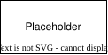

.. _safety_process-tool_eval_qual:

Tool Evaluation & Qualification
###############################

Document Identification
***********************

.. list-table::
   :header-rows: 1
   :width: 100%

   * - Version
     - Status
     - Release date (DD/MM/YYYY)
     - Review & Approval

   * - 1.0
     - Draft
     - 18/09/2026
     - See merge request history [#f1]_

.. [#f1] Refer to Configuration & Change Management process for how to identify commit and merge request related to a release.

Version history
***************

.. list-table::
   :header-rows: 1
   :widths: 10 90
   :width: 100%

   * - Version
     - Reason for change

   * - 1.0
     - Initial release

Process
*******

Purpose & Scope
===============

The tool evaluation and qualification process aims at reviewing the planned use of tools in the software development lifecycle and determining what additional measures, if any, are required to qualify that tool.

This process is applicable to Zephyr project safety releases and applies to all of the software life cycle data, software tools and hardware tools produced and used throughout the development life cycle.

Overview
========

   Tool evaluation and qualification activity diagram

.. tabs::

   .. group-tab:: Entry

      #. New software development lifecycle processes
      #. Updated software development lifecycle processes

   .. group-tab:: Input

      #. Released software development lifecycle processes

   .. group-tab:: Activities

      #. List all tools used in the software development lifecycle processes
      #. Document tool information, configuration and intended use
      #. Determine tool classification
      #. As required: Plan and execute tool qualification activities

   .. group-tab:: Output

      #. Tool classification
      #. Tool qualification plan (as required)

   .. group-tab:: Exit

      #. Tool evaluation is in configuration management
      #. Tool(s) qualification plan is in configuration management (as required)
      #. Tool(s) qualification report is in configuration management (as required)

   .. group-tab:: Tools

      .. list-table::
        :header-rows: 1
        :width: 100%

        * - Tool
          - Purpose
          - Location

        * - Project Git
          - Tool evaluation and classification register
          - TBD

        * - Safety Committee Git
          - Tool qualification report register
          - | Documented in safety plan
            | (Disclosed to Platinum members and assessors only)

   .. group-tab:: R & R
      .. list-table::
        :header-rows: 1
        :width: 100%

        * - Role
          - Responsibilities

        * - Safety Manager
          - Create the tool evaluation and classification document

        * - Release manager
          - Support safeyt manager in completing the tool evaluation

Activities
==========

List all tools
--------------

The safety manager, with the support of the release manager, shall list all the tools used as part of the development lifecycle processes.

.. list-table:: Acitivity Audit & Review checklist
        :header-rows: 1
        :widths: 10 50 40
        :width: 100%

        * - ID
          - Checklist item
          - Example (optional)

        * - 1
          - Have all tools and scripts been listed?
          - None

Document tool information, configuration and intended use
---------------------------------------------------------

For all tools, the following information shall be listed:

#. Tool ID
#. Tool Name
#. Maintainer
#. Tool short description
#. Tool Supplier
#. Tool Version
#. Activity using tool
#. Description of use case(s)
#. Tool input(s)
#. Tool output(s)
#. Tool Requirements
#. Tool Execution Environment
#. Tool Configuration
#. Tool User Manual link
#. Tool Procedure
#. Known issues
#. TI
#. Tool impact rationale
#. TD
#. Tool error detection rationale
#. TCL / Class
#. Forecasted TCL
#. Max ASIL
#. Qualification method (if required)

.. admonition:: WIP
   :class: warning

   To be documented by the safety committee: Public link to the "Tool Criteria Evaluation Report" from the Safety working Group shared drive

.. list-table:: Acitivity Audit & Review checklist
        :header-rows: 1
        :widths: 10 50 40
        :width: 100%

        * - ID
          - Checklist item
          - Example (optional)

        * - 1
          - Are all tools required information provided?
          - None

        * - 2
          - Are versions documented for all the tools documentation/links?
          - None

Determine tool classification
-----------------------------

The safety manager shall determine tool classification based on the respective standards requirements and the tool documented data:
#. T1, T2, T3 for IEC 61508
#. TCL1, TCL2, TCL3 for ISO 26262

.. list-table:: Acitivity Audit & Review checklist
        :header-rows: 1
        :widths: 10 50 40
        :width: 100%

        * - ID
          - Checklist item
          - Example (optional)

        * - 1
          - Are all tools classified for all the applicable standards?
          - None

Plan & execute tool qualification activities
----------------------------------------------

Based on each standard classification and requirements, the safety manager shall plan the tool qualification activities, if any, such that the tool qualification report will be compliant to all the applicable standards requirements.

Once completed, the tool qualification artefacts and report shall be logged in configuration management.

.. list-table:: Acitivity Audit & Review checklist
        :header-rows: 1
        :widths: 10 50 40
        :width: 100%

        * - ID
          - Checklist item
          - Example (optional)

        * - 1
          - Are all the tool qualifications planned?
          - None

        * - 2
          - Were all the tool qualifications activities executed as planned?
          - None

        * - 3
          - Are all the tool qualifications reports released?
          - None
