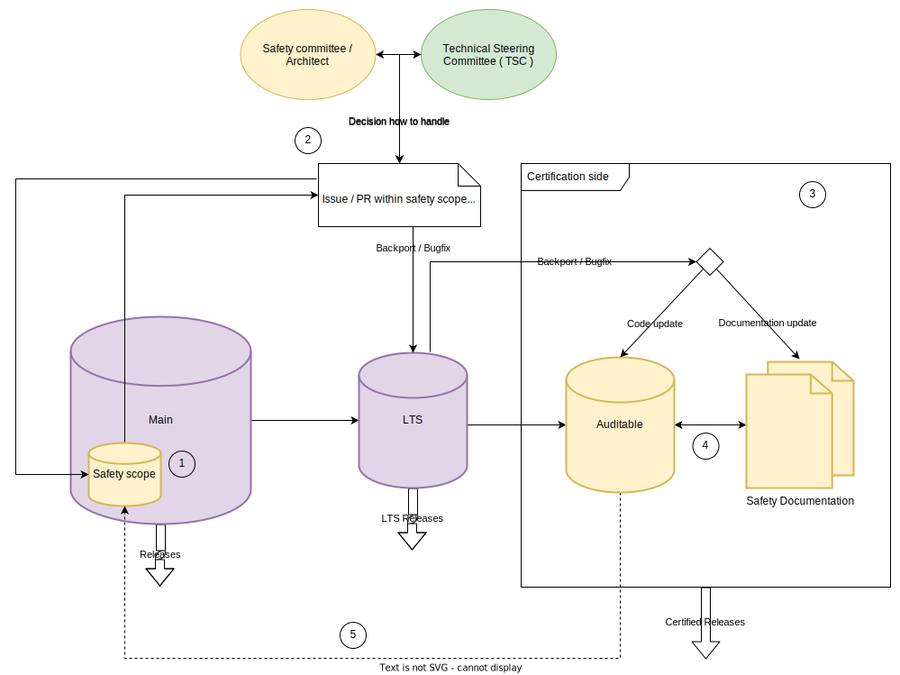

.. _safety_overview:

Zephyr Safety Overview
########################

Introduction
************

This document is the safety documentation providing an overview over the safety-relevant activities
and what the Zephyr Project and the Zephyr Safety Working Group / Committee try to achieve.

This overview is provided for people who are interested in the functional safety development part
of the Zephyr RTOS and project members who want to contribute to the safety aspects of the
project.

Overview
********

In this section we give the reader an overview of what the general goal of the safety certification
is, what standard we aim to achieve and what quality standards and processes need to be implemented
to reach such a safety certification.

Safety Document update
**********************

This document is a living document and may evolve over time as new requirements, guidelines, or
processes are introduced.

#. Changes will be submitted from the interested party(ies) via pull requests to the Zephyr
   documentation repository.

#. The Zephyr Safety Committee will review these changes and provide feedback or acceptance of
   the changes.

#. Once accepted, these changes will become part of the document.

General safety scope
********************

The general scope of the Safety Committee is to achieve a certification for the `IEC 61508
<https://en.wikipedia.org/wiki/IEC_61508>`__ standard and the Safety Integrity Level (SIL) 3 /
Systematic Capability (SC) 3 for a limited source scope (see certification scope TBD). Since the
code base is pre-existing, we use the route 3s/1s approach defined by the IEC 61508 standard.

Route 3s
   *Assessment of non-compliant development. Which is basically the route 1s with existing
   sources.*

Route 1s
   *Compliant development. Compliance with the requirements of this standard for the avoidance and
   control of systematic faults in software.*

Summarization IEC 61508 standard
================================

The IEC 61508 standard is a widely recognized international standard for functional safety of
electrical, electronic, and programmable electronic safety-related systems. Here's an overview of
some of the key safety aspects of the standard:

#. **Hazard and Risk Analysis**: The IEC 61508 standard requires a thorough analysis of potential
   hazards and risks associated with a system in order to determine the appropriate level of safety
   measures needed to reduce those risks to acceptable levels.

#. **Safety Integrity Level (SIL)**: The standard introduces the concept of Safety Integrity Level
   (SIL) to classify the level of risk reduction required for each safety function. The higher the
   SIL, the greater the level of risk reduction required.

#. **System Design**: The IEC 61508 standard requires a systematic approach to system design that
   includes the identification of safety requirements, the development of a safety plan, and the
   use of appropriate safety techniques and measures to ensure that the system meets the required
   SIL.

#. **Verification and Validation**: The standard requires rigorous testing and evaluation of the
   safety-related system to ensure that it meets the specified SIL and other safety requirements.
   This includes verification of the system design, validation of the system's functionality, and
   ongoing monitoring and maintenance of the system.

#. **Documentation and Traceability**: The IEC 61508 standard requires a comprehensive
   documentation process to ensure that all aspects of the safety-related system are fully
   documented and that there is full traceability from the safety requirements to the final system
   design and implementation.

Overall, the IEC 61508 standard provides a framework for the design, development, and
implementation of safety-related systems that aims to reduce the risk of accidents and improve
overall safety. By following the standard, organizations can ensure that their safety-related
systems are designed and implemented to the highest level of safety integrity.

Quality
*******

Quality is a mandatory expectation for software across the industry. The code base of the project
must achieve various software quality goals in order to be considered an auditable code base from a
safety perspective and to be usable for certification purposes. But software quality is not an
additional requirement caused by functional safety standards. Functional safety considers quality
as an existing pre-condition and therefore the "quality managed" status should be pursued for any
project regardless of the functional safety goals. The following list describes the quality goals
which need to be reached to achieve an auditable code base:

1. Basic software quality standards

   a. :ref:`coding_guidelines` (including: static code analysis, coding style, etc.)
   b. :ref:`safety_requirements` and requirements tracing
   c. Test coverage

2. Software architecture design principles

   a. Layered architecture model
   b. Encapsulated components
   c. Encapsulated single functionality (if not fitable and manageable in safety)

Basic software quality standards - Safety view
==============================================

In this chapter the Safety Committee describes why they need the above listed quality goals as
pre-condition and what needs to be done to achieve an auditable code base from the safety
perspective. Generally speaking, it can be said that all of these quality measures regarding safety
are used to minimize the error rate during code development.

Coding Guidelines
-----------------

The coding guidelines are the basis to a common understanding and a unified ruleset and development
style for industrial software products. For safety the coding guidelines are essential and have
another purpose beside the fact of a unified ruleset. It is also necessary to prove that the
developers follow a unified development style to prevent **systematic errors** in the process of
developing software and thus to minimize the overall **error rate** of the complete software
system.

Also the **IEC 61508 standard** sets a pre-condition and recommendation towards the use of coding
standards / guidelines to reduce likelihood of errors.

Requirements and requirements tracing
-------------------------------------

Requirements and requirement management are not only important for software development, but also
very important in terms of safety. On the one hand, this specifies and describes in detail and on a
technical level what the software should do, and on the other hand, it is an important and
necessary tool to verify whether the described functionality is implemented as expected. For this
purpose, tracing the requirements down to the code level is used. With the requirements management
and tracing in hand, it can now be verified whether the functionality has been tested and
implemented correctly, thus minimizing the systematic error rate.

Also the IEC 61508 standard highly recommends (which is like a must-have for the certification)
requirements and requirements tracing.

Test coverage
-------------

A high test coverage, in turn, is evidence of safety that the code conforms precisely to what it
was developed for and does not execute any unforeseen instructions. If the entire code is tested
and has a high (ideally 100%) test coverage, it has the additional advantage of quickly detecting
faulty changes and further minimizing the error rate. However, it must be noted that different
requirements apply to safety for test coverage, and various metrics must be considered, which are
prescribed by the IEC 61508 standard for the SIL 3 / SC3 target. The following must be fulfilled,
among other things:

* Structural test coverage (entry points) 100%
* Structural test coverage (statements) 100%
* Structural test coverage (branches) 100%

If the 100% cannot be reached (e.g. statement coverage of defensive code) that part needs to be
described and justified in the documentation.

Software architecture design principles
=======================================

To create and maintain a structured software product it is also necessary to consider individual
software architecture designs and implement them in accordance with safety standards because some
designs and implementations are not reasonable in safety, so that the overall software and code
base can be used as auditable code. However, most of these software architecture designs have
already been implemented in the Zephyr project and need to be verified by the Safety Committee /
Safety Working Group and the safety architect.

Layered architecture model
--------------------------

The **IEC 61508 standard** strongly recommends a modular approach to software architecture. This
approach has been pursued in the Zephyr project from the beginning with its layered architecture.
The idea behind this architecture is to organize modules or components with similar functionality
into layers. As a result, each layer can be assigned a specific role in the system. This model has
the advantage in safety that interfaces between different components and layers can be shown at a
very high level, and thus it can be determined which functionalities are safety-relevant and can be
limited. Furthermore, various analyses and documentations can be built on top of this architecture,
which are important for certification and the responsible certification body.

Encapsulated components
-----------------------

Encapsulated components are an essential part of the architecture design for safety at this point.
The most important aspect is the separation of safety-relevant components from non-safety-relevant
components, including their associated interfaces. This ensures that the components have no
**repercussions** on other components.

Encapsulated single functionality (if not reasonable and manageable in safety)
------------------------------------------------------------------------------

Another requirement for the overall system and software environment is that individual
functionalities can be disabled within components. This is because if a function is absolutely
unacceptable for safety (e.g. complete dynamic memory management), then these individual
functionalities should be able to be turned off. The Zephyr Project already offers such a
possibility through the use of Kconfig and its flexible configurability.

Processes and workflow
**********************

   Safety process and workflow overview

The diagram describes the rough process defined by the Safety Committee to ensure safety in the
development of the Zephyr project. To ensure understanding, a few points need to be highlighted and
some details explained regarding the role of the safety architect and the role of the safety
committee in the whole process. The diagram only describes the paths that are possible when a
change is related to safety.

#. On the main branch, the safety scope of the project should be identified, which typically
   represents a small subset of the entire code base. This subset should then be made auditable
   during normal development on “main”, which means that special attention is paid to quality goals
   (`Quality`_) and safety processes within this scope. The Safety Architect works alongside the
   Technical Steering Committee (TSC) in this area, monitoring the development process to ensure
   that the architecture meets the safety requirements.

#. At this point, the safety architect plays an increasingly important role. For PRs/issues that
   fall within the safety scope, the safety architect should ideally be involved in the discussions
   and decisions of minor changes in the safety scope to be able to react to safety-relevant
   changes that are not conformant. If a pull request or issue introduces a significant and
   influential change or improvement that requires extended discussion or decision-making, the
   safety architect should bring it to the attention of the Safety Committee or the Technical
   Steering Committee (TSC) as appropriate, so that they can make a decision on the best course of
   action.

#. This section describes the certification side. At this point, the code base has to be in an
   "auditable" state, and ideally no further changes should be necessary or made to the code base.
   There is still a path from the main branch to this area. This is needed in case a serious bug or
   important change is found or implemented on the main branch in the safety scope, after the LTS
   and the auditable branch were created. In this case, the Safety Committee, together with the
   safety architect, must decide whether this bug fix or change should be integrated into the LTS
   so that the bug fix or change could also be integrated into the auditable branch. This
   integration can take three forms: First either as only a code change or second as only an update
   to the safety documentation or third as both.

#. This describes the necessary safety process required for certification itself. Here, the final
   analyses, tests, and documents are created and conducted which must be created and conducted
   during the certification, and which are prescribed by the certifying authority and the standard
   being certified. If the certification body approves everything at this stage and the safety
   process is completed, a safety release can be created and published.

#. This transition from the auditable branch to the main branch should only occur in exceptional
   circumstances, specifically when something has been identified during the certification process
   that needs to be quickly adapted on the “auditable” branch in order to obtain certification. In
   order to prevent this issue from arising again during the next certification, there needs to be
   a path to merge these changes back into the main branch so that they are not lost, and to have
   them ready for the next certification if necessary.

.. important::
   Safety should not block the project and minimize the room to grow in any way.

.. important::
   **TODO:** Find and define ways, guidelines and processes which minimally impact the daily work
   of the maintainers, reviewers and contributors and also the safety architect itself.
   But which are also suitable for safety.
