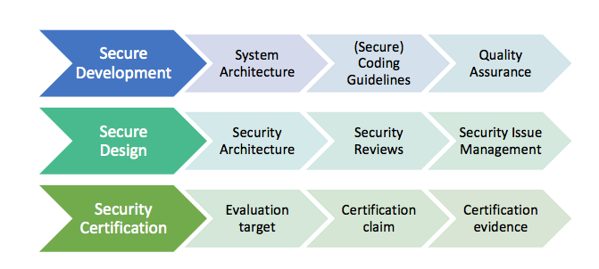
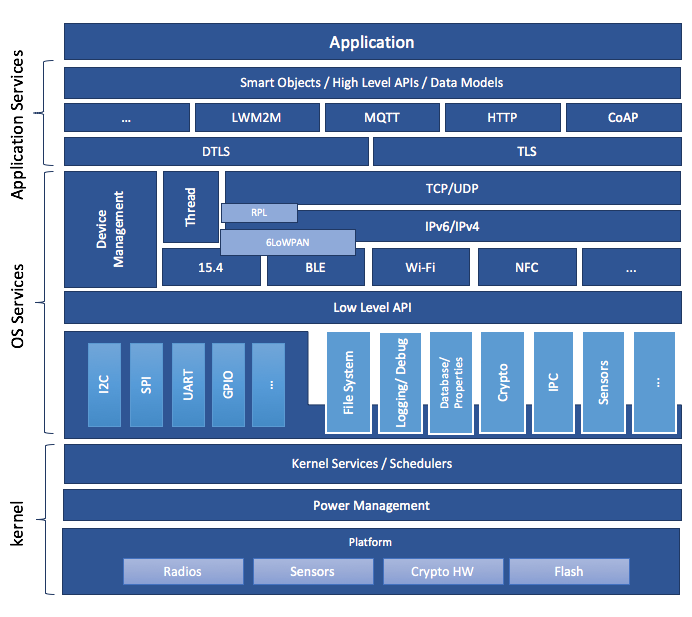

.. _security-overview:

Zephyr Security Overview
########################

Introduction
************

This document outlines the steps of the Zephyr Security Subcommittee towards a
defined security process that helps developers build more secure
software while addressing security compliance requirements. It presents
the key ideas of the security process and outlines which documents need
to be created. After the process is implemented and all supporting
documents are created, this document is a top-level overview and entry
point.

Overview and Scope
==================

We begin with an overview of the Zephyr development process, which
mainly focuses on security functionality.

In subsequent sections, the individual parts of the process are treated
in detail. As depicted in Figure 1, these main steps are:

1. **Secure Development:** Defines the system architecture and
   development process that ensures adherence to relevant coding
   principles and quality assurance procedures.

2. **Secure Design:** Defines security procedures and implement measures
   to enforce them. A security architecture of the system and
   relevant sub-modules is created, threats are identified, and
   countermeasures designed. Their correct implementation and the
   validity of the threat models are checked by code reviews.
   Finally, a process shall be defined for reporting, classifying,
   and mitigating security issues.

3. **Security Certification:** Defines the certifiable part of the
   Zephyr RTOS. This includes an evaluation target, its assets, and
   how these assets are protected. Certification claims shall be
   determined and backed with appropriate evidence.

   Figure 1. Security Process Steps

Intended Audience
=================

This document is a guideline for the development of a security process
by the Zephyr Security Subcommittee and the Zephyr Technical Steering
Committee. It provides an overview of the Zephyr security process for
(security) engineers and architects.

Nomenclature
============

In this document, the keywords "MUST", "MUST NOT", "REQUIRED", "SHALL",
"SHALL NOT", "SHOULD", "SHOULD NOT", "RECOMMENDED", "MAY", and
"OPTIONAL" are to be interpreted as described in [RFC2119]_.

These words are used to define absolute requirements (or prohibitions),
highly recommended requirements, and truly optional requirements. As
noted in RFC-2119, "These terms are frequently used to specify behavior
with security implications. The effects on security of not implementing
a MUST or SHOULD, or doing something the specification says MUST NOT or
SHOULD NOT be done may be very subtle. Document authors should take the
time to elaborate the security implications of not following
recommendations or requirements as most implementors will not have had
the benefit of the experience and discussion that produced the
specification."

Security Document Update
========================

This document is a living document. As new requirements, features, and
changes are identified, they will be added to this document through the
following process:

1. Changes will be submitted from the interested party(ies) via pull
   requests to the Zephyr documentation repository.

2. The Zephyr Security Subcommittee will review these changes and provide feedback
   or acceptance of the changes.

3. Once accepted, these changes will become part of the document.

Current Security Definition
***************************

This section recapitulates the current status of secure development
within the Zephyr RTOS. Currently, focus is put on functional security
and code quality assurance, although additional security features are
scoped.

The three major security measures currently implemented are:

-  **Security** **Functionality** with a focus on cryptographic
   algorithms and protocols. Support for cryptographic hardware is
   scoped for future releases. The Zephyr runtime architecture is a
   monolithic binary and removes the need for dynamic loaders,
   thereby reducing the exposed attack surface.

-  **Quality Assurance** is driven by using a development process that
   requires all code to be reviewed before being committed to the
   common repository. Furthermore, the reuse of proven building
   blocks such as network stacks increases the overall quality level
   and guarantees stable APIs. Static code analyses are provided by
   Coverity Scan.

-  **Execution Protection** including thread separation, stack and
   memory protection is currently available in the upstream
   Zephyr RTOS starting with version 1.9.0 (stack protection).  Memory
   protection and thread separation were added in version 1.10.0 for X86
   and in version 1.11.0 for ARM and ARC.

These topics are discussed in more detail in the following subsections.

Security Functionality
======================

The security functionality in Zephyr hinges mainly on the inclusion of
cryptographic algorithms, and on its monolithic system design.

The cryptographic features are provided through a set of cryptographic
libraries. Applications can choose TinyCrypt2 or Mbed TLS based on their
needs. TinyCrypt2 supports key cryptographic algorithms required by the
connectivity stacks. TinyCrypt2, however, only provides a limited set of
algorithms. Mbed TLS supports a wider range of algorithms, but at the
cost of additional requirements such as malloc support. Applications can
choose the solution that matches their individual requirements. Future
work may include APIs to abstract the underlying crypto library choice.

APIs for vendor specific cryptographic IPs in both hardware and software
are planned, including secure key storage in the form of secure access
modules (SAMs), Trusted Platform Modules (TPMs), and
Trusted Execution Environments (TEEs).

The security architecture is based on a monolithic design where the
Zephyr kernel and all applications are compiled into a single static
binary. System calls are implemented as function calls without requiring
context switches. Static linking eliminates the potential for
dynamically loading malicious code.

Additional protection features are available in later releases.  Stack
protection mechanisms are provided to protect against stack overruns.
In addition, applications can take advantage of thread separation
features to split the system into privileged and unprivileged execution
environments.  Memory protection features provide the capability to
partition system resources (memory, peripheral address space, etc.) and
assign resources to individual threads or groups of threads.  Stack,
thread execution level, and memory protection constraints are enforced
at the time of context switch.

Quality Assurance
=================

The Zephyr project uses an automated quality assurance process. The goal
is to have a process including mandatory code reviews, feature and issue
management/tracking, and static code analyses.

Code reviews are documented and enforced using a voting system before
getting checked into the repository by the responsible subsystem's
maintainer. The main goals of the code review are:

-  Verifying correct functionality of the implementation

-  Increasing the readability and maintainability of the contributed
   source code

-  Ensuring appropriate usage of string and memory functions

-  Validation of the user input

-  Reviewing the security relevant code for potential issues

The current coding principles focus mostly on coding styles and
conventions. Functional correctness is ensured by the build system and
the experience of the reviewer. Especially for security relevant code,
concrete and detailed guidelines need to be developed and aligned with
the developers (see: :ref:`secure code`).

Static code analyses are run on the Zephyr code tree on a regular basis
using the open source Coverity Scan tool. Coverity Scan now includes
complexity analysis.

Bug and issue tracking and management is performed using Jira. The term
"survivability" was coined to cover pro-active security tasks such as
security issue categorization and management. Initial effort has been
started on the definition of vulnerability categorization and mitigation
processes within Jira.

Issues determined by Coverity should have more stringent reviews before
they are closed as non-issues (at least another person educated in
security processes need to agree on non-issue before closing).

A security subcommittee has been formed to develop a security process in
more detail; this document is part of that process.

Execution Protection
====================

Execution protection is supported and can be categorized into the
following tasks:

-  **Memory separation:** Memory will be partitioned into regions and
   assigned attributes based on the owner of that region of memory.
   Threads will only have access to regions they control.

-  **Stack protection:** Stack guards would provide mechanisms for
   detecting and trapping stack overruns. Individual threads should
   only have access to their own stacks.

-  **Thread separation:** Individual threads should only have access to
   their own memory resources. As threads are scheduled, only memory
   resources owned by that thread will be accessible. Topics such as
   program flow protection and other measures for tamper resistance
   are currently not in scope.

System Level Security (Ecosystem, ...)
======================================

System level security encompasses a wide variety of categories. Some
examples of these would be:

-  Secure/trusted boot
-  Over the air (OTA) updates
-  External Communication
-  Device authentication
-  Access control of onboard resources

   -  Flash updating
   -  Secure storage
   -  Peripherals

-  Root of trust
-  Reduction of attack surface

Some of these categories are interconnected and rely on multiple pieces
to be in place to produce a full solution for the application.

Secure Development Process
**************************

The development of secure code shall adhere to certain criteria. These
include coding guidelines and development processes that can be roughly
separated into two categories related to software quality and related to
software security. Furthermore, a system architecture document shall be
created and kept up-to-date with future development.

System Architecture
===================

   Figure 2: Zephyr System Architecture

A high-level schematic of the Zephyr system architecture is given in
Figure 2. It separates the architecture into an OS part (*kernel + OS
Services*) and a user-specific part (*Application Services*). The OS
part itself contains low-level, platform specific drivers and the
generic implementation of I/O APIs, file systems, kernel-specific
functions, and the cryptographic library.

A document describing the system architecture and design choices shall
be created and kept up to date with future development. This document
shall include the base architecture of the Zephyr OS and an overview of
important submodules. For each of the modules, a dedicated architecture
document shall be created and evaluated against the implementation.
These documents shall serve as an entry point to new developers and as a
basis for the security architecture. Please refer to the
:ref:`Zephyr subsystem documentation <os_services>` for
detailed information.

Secure Coding
=============

Designing an open software system such as Zephyr to be secure requires
adhering to a defined set of design standards. These standards are
included in the Zephyr Project documentation, specifically in its
:ref:`secure code` section. In [SALT75]_, the following, widely
accepted principles for protection mechanisms are defined to prevent
security violations and limit their impact:

-  **Open design** as a design principle incorporates the maxim that
   protection mechanisms cannot be kept secret on any system in
   widespread use. Instead of relying on secret, custom-tailored
   security measures, publicly accepted cryptographic algorithms and
   well established cryptographic libraries shall be used.

-  **Economy of mechanism** specifies that the underlying design of a
   system shall be kept as simple and small as possible. In the
   context of the Zephyr project, this can be realized, e.g., by
   modular code [PAUL09]_ and abstracted APIs.

-  **Complete mediation** requires that each access to every object and
   process needs to be authenticated first. Mechanisms to store
   access conditions shall be avoided if possible.

-  **Fail-safe defaults** defines that access is restricted by default
   and permitted only in specific conditions defined by the system
   protection scheme, e.g., after successful authentication.
   Furthermore, default settings for services shall be chosen in a
   way to provide maximum security. This corresponds to the "Secure
   by Default" paradigm [MS12]_.

-  **Separation of privilege** is the principle that two conditions or
   more need to be satisfied before access is granted. In the
   context of the Zephyr project, this could encompass split keys
   [PAUL09]_.

-  **Least privilege** describes an access model in which each user,
   program and thread shall have the smallest possible
   subset of permissions in the system required to perform their
   task. This positive security model aims to minimize the attack
   surface of the system.

-  **Least common mechanism** specifies that mechanisms common to more
   than one user or process shall not be shared if not strictly
   required. The example given in [SALT75]_ is a function that should
   be implemented as a shared library executed by each user and not
   as a supervisor procedure shared by all users.

-  **Psychological acceptability** requires that security features are
   easy to use by the developers in order to ensure its usage and
   the correctness of its application.

In addition to these general principles, the following points are
specific to the development of a secure RTOS:

-  **Complementary Security/Defense in Depth:** do not rely on a single
   threat mitigation approach. In case of the complementary security
   approach, parts of the threat mitigation are performed by the
   underlying platform. In case such mechanisms are not provided by
   the platform, or are not trusted, a defense in depth [MS12]_
   paradigm shall be used.

-  **Less commonly used services off by default**: to reduce the
   exposure of the system to potential attacks, features or services
   shall not be enabled by default if they are only rarely used (a
   threshold of 80% is given in [MS12]_). For the Zephyr project,
   this can be realized using the configuration management. Each
   functionality and module shall be represented as a configuration
   option and needs to be explicitly enabled. Then, all features,
   protocols, and drivers not required for a particular use case can
   be disabled. The user shall be notified if low-level options and
   APIs are enabled but not used by the application.

-  **Change management:** to guarantee a traceability of changes to the
   system, each change shall follow a specified process including a
   change request, impact analysis, ratification, implementation,
   and validation phase. In each stage, appropriate documentation
   shall be provided. All commits shall be related to a bug report
   or change request in the issue tracker. Commits without a valid
   reference shall be denied.

Based on these design principles and commonly accepted best practices, a
secure development guide shall be developed, published, and implemented
into the Zephyr development process. Further details on this are given
in the `Secure Design`_ section.

Quality Assurance
=================

The quality assurance part encompasses the following criteria:

-  **Adherence to the Coding Conventions** with respect to coding style,
   naming schemes of modules, functions, variables, and so forth.
   This increases the readability of the Zephyr code base and eases
   the code review. These coding conventions are enforced by
   automated scripts prior to check-in.

-  **Adherence to Deployment Guidelines** is required to ensure
   consistent releases with a well-documented feature set and a
   trackable list of security issues.

-  **Code Reviews** ensure the functional correctness of the code base
   and shall be performed on each proposed code change prior to
   check-in. Code reviews shall be performed by at least one
   independent reviewer other than the author(s) of the code change.
   These reviews shall be performed by the subsystem maintainers and
   developers on a functional level and are to be distinguished from
   security reviews as laid out in the `Secure Design`_ section.
   Refer to the :ref:`development_model` documentation for more information.

-  **Static Code Analysis** tools efficiently detect common coding
   mistakes in large code bases. All code shall be analyzed using an
   appropriate tool prior to merges into the main repository. This
   is not per individual commit, but is to be run on some interval
   on specific branches. It is mandatory to remove all findings or
   waive potential false-positives before each release.
   Waivers shall be documented centrally and
   in the form of a comment inside the source code itself. The
   documentation shall include the employed tool and its version,
   the date of the analysis, the branch and parent revision number,
   the reason for the waiver, the author of the respective code, and
   the approver(s) of the waiver. This shall as a minimum run on the
   main release branch and on the security branch. It shall be
   ensured that each release has zero issues with regard to static
   code analysis (including waivers).
   Refer to the :ref:`development_model` documentation for more information.

-  **Complexity Analyses** shall be performed as part of the development
   process and metrics such as cyclomatic complexity shall be
   evaluated. The main goal is to keep the code as simple as
   possible.

-  **Automation:** the review process and checks for coding rule
   adherence are a mandatory part of the precommit checks. To
   ensure consistent application, they shall be automated as part of
   the precommit procedure. Prior to merging large pieces of code
   in from subsystems, in addition to review process and coding rule
   adherence, all static code analysis must have been run and issues
   resolved.

Release and Lifecycle Management
================================

Lifecycle management contains several aspects:

-  **Device management** encompasses the possibility to update the
   operating system and/or security related sub-systems of Zephyr
   enabled devices in the field.

-  **Lifecycle management:** system stages shall be defined and
   documented along with the transactions between the stages in a
   system state diagram. For security reasons, this shall include
   locking of the device in case an attack has been detected, and a
   termination if the end of life is reached.

-  **Release management** describes the process of defining the release
   cycle, documenting releases, and maintaining a record of known
   vulnerabilities and mitigations. Especially for certification
   purposes the integrity of the release needs to be ensured in a
   way that later manipulation (e.g., inserting of backdoors, etc.)
   can be easily detected.

-  **Rights management and NDAs:** if required by the chosen
   certification, the confidentiality and integrity of the system
   needs to be ensured by an appropriate rights management (e.g.,
   separate source code repository) and non-disclosure agreements
   between the relevant parties. In case of a repository shared
   between several parties, measures shall be taken that no
   malicious code is checked in.

These points shall be evaluated with respect to their impact on the
development process employed for the Zephyr project.

Secure Design
*************

In order to obtain a certifiable system or product, the security process
needs to be clearly defined and its application needs to be monitored
and driven. This process includes the development of security related
modules in all of its stages and the management of reported security
issues. Furthermore, threat models need to be created for currently
known and future attack vectors, and their impact on the system needs to
be investigated and mitigated. Please refer to the
:ref:`secure code` outlined in the Zephyr project documentation
for detailed information.

The software security process includes:

-  **Adherence to the Secure Development Coding** is mandatory to
   avoid that individual components breach the system security and
   to minimize the vulnerability of individual modules. While this
   can be partially achieved by automated tests, it is inevitable to
   investigate the correct implementation of security features such
   as countermeasures manually in security-critical modules.

-  **Security Reviews** shall be performed by a security architect in
   preparation of each security-targeted release and each time a
   security-related module of the Zephyr project is changed. This
   process includes the validation of the effectiveness of
   implemented security measures, the adherence to the global
   security strategy and architecture, and the preparation of audits
   towards a security certification if required.

-  **Security Issue Management** encompasses the evaluation of potential
   system vulnerabilities and their mitigation as described in
   :ref:`Security Issue Management <reporting>`.

These criteria and tasks need to be integrated into the development
process for secure software and shall be automated wherever possible. On
system level, and for each security related module of the secure branch
of Zephyr, a directly responsible security architect shall be defined to
guide the secure development process.

Security Architecture
=====================

The general guidelines above shall be accompanied by an architectural
security design on system- and module-level. The high level
considerations include

-  The identification of **security and compliance requirements**

-  **Functional security** such as the use of cryptographic functions
   whenever applicable

-  Design of **countermeasures** against known attack vectors

-  Recording of security relevant **auditable events**

-  Support for **Trusted Platform Modules (TPM)** and
   **Trusted Execution Environments (TEE)**

-  Mechanisms to allow for **in-the-field** **updates** of devices using
   Zephyr

-  Task scheduler and separation

The security architecture development is based on assets derived from
the structural overview of the overall system architecture. Based on
this, the individual steps include:

1. **Identification of assets** such as user data, authentication and
   encryption keys, key generation data (obtained from RNG),
   security relevant status information.

2. **Identification of threats** against the assets such as breaches of
   confidentiality, manipulation of user data, etc.

3. **Definition of requirements** regarding security and protection of
   the assets, e.g., countermeasures or memory protection schemes.

The security architecture shall be harmonized with the existing system
architecture and implementation to determine potential deviations and
mitigate existing weaknesses. Newly developed sub-modules that are
integrated into the secure branch of the Zephyr project shall provide
individual documents describing their security architecture.
Additionally, their impact on the system level security shall be
considered and documented.

Security Vulnerability Reporting
================================

Please see :ref:`reporting` for information on reporting security
vulnerabilities.

Threat Modeling and Mitigation
==============================

The modeling of security threats against the Zephyr RTOS is required for
the development of an accurate security architecture and for most
certification schemes. The first step of this process is the definition
of assets to be protected by the system. The next step then models how
these assets are protected by the system and which threats against them
are present. After a threat has been identified, a corresponding threat
model is created. This model contains the asset and system
vulnerabilities, as well as the description of the potential exploits of
these vulnerabilities. Additionally, the impact on the asset, the module
it resides in, and the overall system is to be estimated. This threat
model is then considered in the module and system security architecture
and appropriate countermeasures are defined to mitigate the threat or
limit the impact of exploits.

In short, the threat modeling process can be separated into these steps
(adapted from [OWASP]_):

1. Definition of assets

2. Application decomposition and creation of appropriate data flow
   diagrams (DFDs)

3. Threat identification and categorization using the [STRIDE09]_ and
   [CVSS]_ approaches

4. Determination of countermeasures and other mitigation approaches

This procedure shall be carried out during the design phase of modules
and before major changes of the module or system architecture.
Additionally, new models shall be created, or existing ones shall be
updated whenever new vulnerabilities or exploits are discovered. During
security reviews, the threat models and the mitigation techniques shall
be evaluated by the responsible security architect.

From these threat models and mitigation techniques tests shall be
derived that prove the effectiveness of the countermeasures. These tests
shall be integrated into the continuous integration workflow to ensure
that the security is not impaired by regressions.

Vulnerability Analyses
======================

In order to find weak spots in the software implementation,
vulnerability analyses (VA) shall be performed. Of special interest are
investigations on cryptographic algorithms, critical OS tasks, and
connectivity protocols.

On a pure software level, this encompasses

-  **Penetration testing** of the RTOS on a particular hardware
   platform, which involves testing the respective Zephyr OS
   configuration and hardware as one system.

-  **Side channel attacks** (timing invariance, power invariance, etc.)
   should be considered. For instance, ensuring **timing
   invariance** of the cryptographic algorithms and modules is
   required to reduce the attack surface. This applies to both the
   software implementations and when using cryptographic hardware.

-  **Fuzzing tests** shall be performed on both exposed APIs and
   protocols.

The list given above serves primarily illustration purposes. For each
module and for the complete Zephyr system (in general on a particular
hardware platform), a suitable VA plan shall be created and executed.
The findings of these analyses shall be considered in the security issue
management process, and learnings shall be formulated as guidelines and
incorporated into the secure coding guide.

If possible (as in case of fuzzing analyses), these tests shall be
integrated into the continuous integration process.

Security Certification
**********************

One goal of creating a secure branch of the Zephyr RTOS is to create a
certifiable system or certifiable submodules thereof. The certification
scope and scheme are yet to be decided. However, many certifications such
as Common Criteria [CCITSE12]_ require evidence that the evaluation
claims are indeed fulfilled, so a general certification process is
outlined in the following. Based on the final choices for the
certification scheme and evaluation level, this process needs to be
refined.

Generic Certification Process
=============================

In general, the steps towards a certification or precertification
(compare [MICR16]_) are:

1. The **definition of assets** to be protected within the Zephyr RTOS.
   Potential candidates are confidential information such as
   cryptographic keys, user data such as communication logs, and
   potentially IP of the vendor or manufacturer.

2. Developing a **threat model** and **security architecture** to
   protect the assets against exploits of vulnerabilities of the
   system. As a complete threat model includes the overall product
   including the hardware platform, this might be realized by a
   split model containing a precertified secure branch of Zephyr
   which the vendor could use to certify their Zephyr-enabled
   product.

3. Formulating an **evaluation target** that includes the
   **certification claims** on the security of the assets to be
   evaluated and certified, as well as assumptions on the operating
   conditions.

4. Providing **proof** that the claims are fulfilled. This includes
   consistent documentation of the security development process,
   etc.

These steps are partially covered in previous sections as well. In
contrast to these sections, the certification process only requires to
consider those components that shall be covered by the certification.
The security architecture, for example, considers assets on system level
and might include items not relevant for the certification.

Certification Options
=====================

For the security certification as such, the following options can be
pursued:

1. **Abstract precertification of Zephyr as a pure software system:**
   this option requires assumptions on the underlying hardware
   platform and the final application running on top of Zephyr. If
   these assumptions are met by the hardware and the application, a
   full certification can be more easily achieved. This option is
   the most flexible approach but puts the largest burden on the
   product vendor.

2. **Certification of Zephyr on specific hardware platform without a
   specific application in mind:** this scenario describes the
   enablement of a secure platform running the Zephyr RTOS. The
   hardware manufacturer certifies the platform under defined
   assumptions on the application. If these are met, the final
   product can be certified with little effort.

3. **Certification of an actual product:** in this case, a full product
   including a specific hardware, the Zephyr RTOS, and an
   application is certified.

In all three cases, the certification scheme (e.g., FIPS 140-2 [NIST02]_
or Common Criteria [CCITSE12]_), the scope of the certification
(main-stream Zephyr, security branch, or certain modules), and the
certification/assurance level need to be determined.

In case of partial certifications (options 1 and 2), assumptions on
hardware and/or software are required for certifications. These can
include [GHS10]_

-  **Appropriate physical security** of the hardware platform and its
   environment.

-  **Sufficient protection of storage and timing channels**  on
   the hardware platform itself and all connected devices. (No mentioning of
   remote connections.)

-  Only **trusted/assured applications** running on the device

-  The device and its software stack is configured and operated by
   **properly trained and trusted individuals** with no malicious
   intent.

These assumptions shall be part of the security claim and evaluation
target documents.
