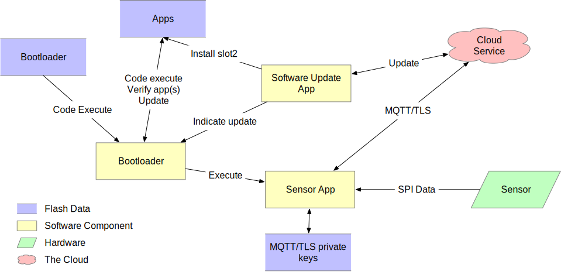

.. _sensor-threat:

Sensor Device Threat Model
##########################

This document describes a threat model for an IoT sensor device.
Spelling out a threat model helps direct development effort, and can
be used to help prioritize these efforts as well.

This device contains a sensor of some type (for example temperature, or a
pressure in a pipe), which sends this data to an SoC running a
microcontroller. This microcontroller connects to a cloud service, and
relays this sensor data to this service. The cloud service is also able
to send configuration data to the device, as well as software update
images. A general diagram can be seen in Figure 1:

   Figure 1. Sensor General Diagram

In this sensor device, the sensor connects with the SoC via an SPI bus,
and the SoC has a network interface that it uses to communicate with the
cloud service. The particulars of these interfaces can impact the threat
model in unexpected ways, and variants on this will need to be
considered (for example, using a separate network interface SoC
connected via some type of bus).

This model also focuses on communicating via the MQTT-over-TLS protocol,
as this seems to be in wide use [1]_.

Assets
======

One aspect of the threat model to consider are assets involved in the
operation of the device. The following list enumerates the assets
included in this model:

1. **The bootloader**. This is a small code/data image contained in
   on-device flash that is the first code to run. In order to establish
   a root of trust, this image must be immutable. This model assumes
   that the SoC provides a mechanism to protect a region of the flash
   from future writes, and that this will be done after this image is
   programmed into the device, early in production [th-imboot]_.

2. **The application firmware image**. This asset consists of the
   remainder of the firmware run by the microcontroller. The distinction
   is made because this part of the image will need to be updated
   periodically as security vulnerabilities are discovered. Requirements
   for updates to this image are:

   a. The image shall only be replaced with an authorized image
      [th-authrepl]_.

   b. When an authorized replacement image is available, the update
      shall be done in a timely manner [th-timely-update]_.

   c. The image update shall be seen as atomic, meaning that when the
      image is run, the flash shall contain either the update image in
      its entirety, or the old image in its entirety
      [th-atomic-update]_.

3. **Root certificate list**. In order to authenticate the cloud service
   (server), the IoT device must have a list of root certificates that
   are allowed to sign the certificate on the server. For cloud-provider
   based services, this list will generally be provided by the service
   provider. Because the root certificates can expire, and possibly be
   revoked, this list will need to be periodically updated
   [th-root-certs]_, [th-root-check]_.

4. **Client secrets**. To authenticate the client to the service, the
   client must possess some kind of secret. This is generally a private
   key, usually either an RSA key or an EC private key. When
   establishing communication with the server, the device will use
   this secret either as part of the TLS establishment, or to sign a
   message used in the communication.

   This secret is generally generated by the service provider, or by
   software running elsewhere, and must be securely installed on the
   device. Policy may dictate that this secret be replaced
   periodically, which will require a way to update the client secret.
   Typically, the service will allow two or three active keys to allow
   this update to proceed while the old key is used.

   These secrets must be protected from read, and the smallest amount
   of code necessary shall have access to them. [th-secret-storage]_

5. **Current date/time**. TLS certificate verification requires
   knowledge of the current date and time in order to determine if the
   current time falls within the certificate's current validity time.
   Also, token based client authentication will generally require the
   client to sign a message containing a time window that the token is
   valid. Certificate validation requires the device's notion of date and
   time to be accurate within a day or so. Token generation generally
   requires the time to be accurate within 5-10 minutes.

   It may be possible to approximate secure time by querying an
   external time server.  Secure NTP is possibly beyond the
   capabilities of an IoT device.  The main risks of having incorrect
   time are denial of service (the device rejects valid certificates),
   and the generation of tokens with invalid times.  It could be
   possible to trick the device into generating tokens that are valid in
   the future, but the attacker would also have to spoof the server's
   certificate to be able to intercept this. [th-time]_

6. **Sensor data**. The data received from the sensor itself, and
   delivered to the service shall be delivered without modification or
   tampering.

7. **Device configuration**. Various configuration data, such as the
   hostname of the service to connect to, the address of a time server,
   frequency and parameters of when sensor data is sent to the service,
   and other need to be kept by the device. This configuration data will
   need to be updated periodically as the configuration changes. Updates
   should be allowed only from authorized parties. [th-conf]_

8. **Logs**. In order to assist with analysis of security issues, the
   device shall log information about security-pertinent events. IoT
   devices generally have limited storage, and as such, these logs need
   to be carefully selected. It may also be possible to send these log
   events to the cloud service where they can be stored in a more
   resource-available environment. Types of events that should be logged
   include:

   a. **Firmware image updates**. The system should log the download of
      new images, and when an image is successfully updated.

   b. **Client secret changes**. Changes and new client secrets should be
      logged.

   c. **Changes to the device configuration**.

   [th-logs]_

Communication
=============

In addition to assets, the threat model also considers the locations
where data or assets are communicated between entities of the system.

1. **Flash contents**. The flash device contains several regions. The
   contents of flash can be modified programmatically by the SoC's CPU.

   a. **The bootloader**. As described in the Assets section, the
      bootloader is a small section of the flash device containing the
      code initially run. This section shall be written early in the
      lifecycle of the device, and the flash device then configured to
      permanently disallow modification of this section. This
      configuration should also prevent modification via external
      interfaces, such as JTAG or SWD debuggers.

      The bootloader is responsible for verifying the signature of the
      application image as well as updating the application image from
      the update image when an update is needed.

      The bootloader shall verify the signature of the update image
      before installing it.

      The bootloader shall only accept an update image with a newer
      version number than the current image.

   b. **The application image**. The application image contains the code
      executed during normal operation of the device. Before running
      this image, the bootloader shall verify a digital signature of the
      image, to avoid running an image that has been tampered with. The
      flash/system shall be configured such that after the bootloader
      has completed, the CPU will be unable to write to the application
      image.

   c. **The update image**. This is an area of flash that holds a new
      version of the application image. This image will be downloaded
      and stored by the application during normal operation. When this
      has completed, the application can trigger a reboot, and the
      bootloader can install the new image.

   d. **Secret storage**. An area of the flash will be used to store
      client secrets. This area is written and read by a subset of the
      application image. The application shall be configured to
      protect this area from both reads and writes by code that does
      not need to have access to it, giving consideration to possible
      exploits found within a majority of the application code.
      Revealing the contents of the secrets would allow the attacker
      to spoof this device.

      Initial secrets shall be placed in the device during a
      provisioning activity, distinct from normal operation of the
      device. Later updates can be made under the direction of
      communication received over a secured channel to the service.

   e. **Configuration storage**. There shall be an area to store other
      configuration information. On resource-constrained devices, it is
      allowed for this to be stored in the same region as the secret
      storage, however, this adds additional code that has access to the
      secret storage area, and as such, more code that must be
      scrutinized.

   f. **Log storage**. The device may have an area of flash where log
      events can be written.

2. **Sensor/Actuator interface**. In this design, the sensor or actuator
   communicates with the SoC via a bus, such as SPI. The hardware design
   shall be made to make intercepting this bus difficult for an attack.
   Required techniques depend on the sensitivity and use of the sensor
   data, and can range from having the sensor mounted on the same PCB as
   the MCU to epoxy potting the entire device.

3. **Communication with cloud service**. Communication between the
   device, and the cloud service will be done over the general
   internet. As such, it shall be assumed that an attacker can
   arbitrarily intercept this channel and, for example, return spoofed
   DNS results or attempt man-in-the-middle attacks
   against communication with cloud services.

   The device shall use TLS for all communication with the cloud
   service [th-all-tls]_. The TLS stack shall be configured to use only cipher suites
   that are generally considered secure [2]_, including forward
   secrecy. The communication shall be secured by the following:

   a. **Cipher suite selection**. The device shall only allow
      communication with generally agreed secure cipher suites
      [th-tls-ciphers]_.

   b. **Server certificate verification**. The server presented by the
      server shall be verified [th-root-check]_.

      i.   **Naming**. The certificate shall name the host and service
           the cloud service server is providing.
           `RFC6125 <https://tools.ietf.org/html/rfc6125>`__ describes
           best practices for this. It is permissible for the device to
           require the certificate to be more restrictive than as
           described in this RFC, provided the service can use a
           certificate that can comply.

      ii.  **Path validation**. The device shall verify that the
           certificate chain has a valid signature path from a root
           certificate contained within the device, to the certificate
           presented by the service.
           `RFC4158 <https://tools.ietf.org/html/rfc4158>`__ describes
           this is general. The device is permitted to require a more
           restricted path, provided the server certificate used
           complies with this restriction.

      iii. **Validity period**. The validity period of all presented
           certificates shall be checked against the device's best
           notion of the current time.

   c. **Client authentication**. The client shall authenticate itself to
      the service using a secret known only to that particular device.
      There are several options, and the technique used is generally
      mandated by the particular service provider being used
      [th-tls-client-auth]_.

      i.  **TLS client certificates**. The TLS protocol allows the
          client to present a certificate, and assert its knowledge of
          the secret described by that certificate. Generally, these
          certificates will be stored within the service provider. These
          certificates can be self-signed, or signed by a CA. Since the
          service provider maintains a list of valid certificates
          (mapping them to a device identity), having these certificates
          signed by a CA does not add any additional security, but may
          be useful in the management of these certificates.

      ii. **Token-based authentication**. It is also possible for the
          client to authenticate itself using the *password* field of
          the MQTT CONNECT packet. However, the secret itself must not
          be transmitted in this packet. Instead, a token-based
          protocol, such as
          `RFC7519 <https://tools.ietf.org/html/rfc7519>`__\ 's JSON Web
          Token (JWT) can be used. These tokens will generally have a
          small validity period (e.g. 1 hour), to prevent them from
          being reused if they are intercepted. The token shall not be
          sent until the device has verified the identity of the server.

   d. **Random/Entropy source**. Cryptographic communication requires the
      generation of secure pseudorandom numbers. The device shall use a
      modern, accepted cryptographic random-bit generator to generate
      these random numbers. It shall use either a Non-Deterministic
      Random Bit Generator (True RBG) implemented in hardware within the
      SoC, or a Deterministic Random Bit Generator (Pseudo RBG) seeded
      by an entropy source within the SoC.  Please see NIST SP 800-90A
      for information on approved RBGs and NIST SP 800-90B for
      information on testing a device's entropy source [th-entropy]_.

4. **Communication with the time service**. Ideally, the device shall
   contain hardware that maintains a secure time. However, most SoCs in
   use do not have support for this, and it will be necessary to consult
   an external time service.
   `RFC4330 <https://tools.ietf.org/html/rfc4330>`__ and referenced RFCs
   describe the Simple Network Time Protocol that can be used to query
   the current time from a network time server.

5. **Device lifecycle**. An IoT device will have a lifecycle from
   production to destruction and disposal of the device. Aspects of this
   lifecycle that impact security include initial provisioning, normal
   operation, re-provisioning, and destruction.

   a. **Initial provisioning**. During the initial provisioning stage,
      it is necessary to program the bootloader, an initial application
      image, a device secret, and initial configuration data
      [th-initial-provision]_. In
      addition, the bootloader flash protection shall be installed. Of
      this information, only the device secret needs to differ per
      device. This secret shall be securely maintained, and destroyed in
      all locations outside of the device once it has been programmed
      [th-initial-secret]_.

   b. **Normal operation**. Normal operation includes the behavior
      described by the rest of this document.

   c. **Re-provisioning**. Sometimes it is necessary to re-provision a
      device, such as for a different application. One way to do this is
      to keep the same device secret, and replace the configuration
      data, as well as the cloud service data associated with the
      device. It is also possible to program a new device secret, but if
      this is done it shall be done securely, and the new secret
      destroyed externally once programmed into the device
      [th-reprovision]_.

   d. **Destruction**. To prevent the device secret from being used to
      spoof the device, upon decommissioning, the secret for a
      particular device shall be rendered ineffective
      [th-destruction]_. Possibilities include:

      i.    Hardware destruction of the device.

      ii.   Securely wiping the flash area containing the
            secret [3]_.

      iii.  Removing the device identity and certificate from the
            service.

Other Considerations
====================

In addition to the above, network connected devices generally will need
a way to configure them to connect to the network environment they are
placed in. There are numerous ways of doing this, and it is important
for these configuration methods to not circumvent the security
requirements described above.

Threats
=======

.. [th-imboot] Must boot with an immutable bootloader.

.. [th-authrepl] Application image shall only be replaced with an
   authorized image.

.. [th-timely-update]
   Application updates shall be done in a timely manner.

.. [th-atomic-update]
   Application updates shall be atomic.

.. [th-root-certs]
   TLS must have a list of trusted root certificates.

.. [th-root-check]
   TLS must verify root certificate from server is valid.

.. [th-secret-storage]
   There must be a mechanism to securely store client secrets.  The
   least amount of code necessary shall have access to these secrets.

.. [th-time]
   System must have moderately accurate notion of the current
   date/time.

.. [th-conf]
   The system must receive, and keep configuration data.

.. [th-logs]
   The system must log security-related events, and either store them
   locally, or send to a service.

.. [th-all-tls]
   All communications with the cloud service shall use TLS.

.. [th-tls-ciphers]
   TLS shall be configured to allow only generally agreed cipher
   suites (including forward secrecy).

.. [th-tls-client-auth]
   The device shall authenticate itself with the cloud provider using
   one of the methods described.

.. [th-entropy]
   The TLS layer shall use a modern, accepted cryptographic random-bit
   generator seeded by an entropy source within the SoC.

.. [th-initial-provision]
   The device shall have a per-device secret loaded before deployment.

.. [th-initial-secret]
   The initial secret shall be securely maintained, and destroyed in
   any external location as soon as the device is provisioned.

.. [th-reprovision]
   Reprovisioning a device shall be done securely.

.. [th-destruction]
   Upon decommissioning, the device secret shall be rendered
   ineffective.

Notes
=====

.. [1]
   See https://www.slideshare.net/kartben/iot-developer-survey-2018. As
   of this writing, the three major cloud IoT service providers, AWS
   IoT, Google Cloud IoT, and Microsoft Azure IoT all provide MQTT over
   TLS. Some feedback has suggested that some find difficulty with UDP
   protocols and routing issues on various networks.

.. [2]
   As new exploits are discovered, what is considered secure can
   change.
   Organizations such as https://www.ssllabs.com/ provide information on
   current ideas of how TLS must be configured to be secure.

.. [3]
   Note that merely erasing this flash area is unlikely to be
   sufficient.
