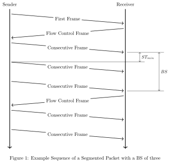

.. _can_isotp:

ISO-TP Transport Protocol
#########################

.. contents::
    :local:
    :depth: 2

Overview
********

ISO-TP is a transport protocol defined in the ISO-Standard ISO15765-2 Road
vehicles - Diagnostic communication over Controller Area Network (DoCAN).
Part2: Transport protocol and network layer services. As its name already
implies, it is originally designed, and still used in road vehicle diagnostic
over Controller Area Networks. Nevertheless, it's not limited to applications in
road vehicles or the automotive domain.

This transport protocol extends the limited payload data size for classical
CAN (8 bytes) and CAN FD (64 bytes) to theoretically four gigabytes.
Additionally, it adds a flow control mechanism to influence the sender's
behavior. ISO-TP segments packets into small fragments depending on the payload
size of the CAN frame. The header of those segments is called Protocol Control
Information (PCI).

Packets smaller or equal to seven bytes on Classical CAN are called
single-frames (SF). They don't need to fragment and do not have any flow-control.

Packets larger than that are segmented into a first-frame (FF) and as many
consecutive-frames (CF) as required. The FF contains information about the length of
the entire payload data and additionally, the first few bytes of payload data.
The receiving peer sends back a flow-control-frame (FC) to either deny,
postpone, or accept the following consecutive frames.
The FC also defines the conditions of sending, namely the block-size (BS) and
the minimum separation time between frames (STmin). The block size defines how
many CF the sender is allowed to send, before he has to wait for another FC.

On Classical CAN, the PCI occupies the first bytes of the CAN frame data, with
the frame type in the upper nibble of the first byte. The diagrams below show
one byte per row, most significant bit first. CAN FD frames longer than 8 bytes
and payloads larger than 4095 bytes use extended forms of the SF and FF headers.

.. mermaid::
   :caption: Single frame (SF)
   :alt: Single frame: the upper nibble of byte 0 is frame type 0 and the lower
         nibble is the payload length SF_DL, followed by up to 7 payload bytes.

   ---
   config:
     packet:
       bitOrder: descending
       bitsPerRow: 8
   ---
   packet
     0-3: "SF_DL"
     4-7: "Type = 0"
     8-15: "Data ..."

.. mermaid::
   :caption: First frame (FF)
   :alt: First frame: the upper nibble of byte 0 is frame type 1, the lower
         nibble of byte 0 and byte 1 hold the 12-bit payload length FF_DL,
         followed by 6 payload bytes.

   ---
   config:
     packet:
       bitOrder: descending
       bitsPerRow: 8
   ---
   packet
     0-3: "FF_DL [11:8]"
     4-7: "Type = 1"
     8-15: "FF_DL [7:0]"
     16-23: "Data ..."

.. mermaid::
   :caption: Consecutive frame (CF)
   :alt: Consecutive frame: the upper nibble of byte 0 is frame type 2 and the
         lower nibble is the sequence number SN, followed by up to 7 payload
         bytes.

   ---
   config:
     packet:
       bitOrder: descending
       bitsPerRow: 8
   ---
   packet
     0-3: "SN"
     4-7: "Type = 2"
     8-15: "Data ..."

.. mermaid::
   :caption: Flow control frame (FC)
   :alt: Flow control frame: the upper nibble of byte 0 is frame type 3 and the
         lower nibble is the flow status FS, byte 1 is the block size BS and
         byte 2 is the minimum separation time STmin.

   ---
   config:
     packet:
       bitOrder: descending
       bitsPerRow: 8
   ---
   packet
     0-3: "FS"
     4-7: "Type = 3"
     8-15: "BS"
     16-23: "STmin"

API Reference
*************

.. doxygengroup:: can_isotp
