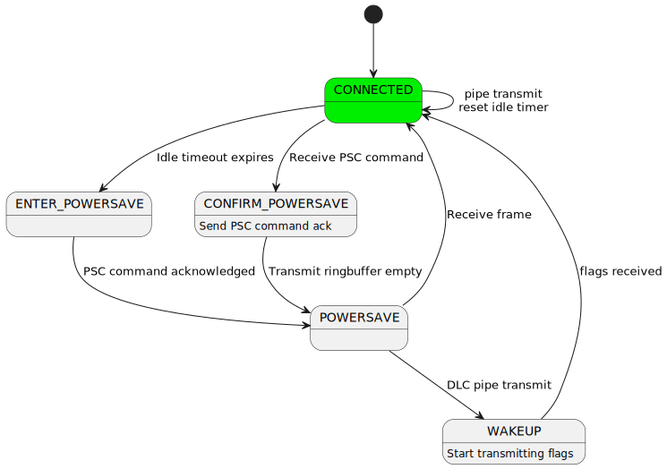

.. _modem:

Modem modules
#############

This service provides modules necessary to communicate with modems.

Modems are self-contained devices that implement the hardware and
software necessary to perform RF (Radio-Frequency) communication,
including GNSS, Cellular, WiFi etc.

The modem modules are inter-connected dynamically using
data-in/data-out pipes making them independently testable and
highly flexible, ensuring stability and scalability.

Modem pipe
**********

This module is used to abstract data-in/data-out communication over
a variety of mechanisms, like UART and CMUX DLCI channels, in a
thread-safe manner.

A modem backend will internally contain an instance of a modem_pipe
structure, alongside any buffers and additional structures required
to abstract away its underlying mechanism.

.. image:: images/modem_pipes.svg
        :alt: Modem pipes
        :align: center

The modem backend will return a pointer to its internal modem_pipe
structure when initialized, which will be used to interact with the
backend through the modem pipe API.

.. doxygengroup:: modem_pipe

Modem PPP
*********

This module defines and binds a L2 PPP network interface, described in
:ref:`net_l2_interface`, to a modem backend. The L2 PPP interface sends
and receives network packets. These network packets have to be wrapped
in PPP frames before being transported via a modem backend. This module
performs said wrapping.

.. doxygengroup:: modem_ppp

Modem CMUX
**********

This module is an implementation of CMUX following the 3GPP 27.010
specification. CMUX is a multiplexing protocol, allowing for multiple
bi-directional streams of data, called DLCI channels. The module
attaches to a single modem backend, exposing multiple modem backends,
each representing a DLCI channel.

Protocol defines simple framing for splitting each DLC into small chunks of data.

.. image:: images/cmux_frame.svg
        :alt: CMUX basic frame
        :align: center

Zephyr implements the basic frame type, with build-time configurable MTU size.

The module also implements power-saving using CMUX Power Saving Command (PSC) for
modems that support it. See the :ref:`cmux-power-saving` section below for more details.

.. doxygengroup:: modem_cmux

Modem pipelink
**************

This module is used to share modem pipes globally. This module aims to
decouple the creation and setup of modem pipes in device drivers from
the users of said pipes. See
:zephyr_file:`drivers/modem/modem_at_shell.c` and
:zephyr_file:`drivers/modem/modem_cellular.c` for examples of how to
use the modem pipelink between device driver and application.

.. doxygengroup:: modem_pipelink

.. _cmux-power-saving:

CMUX Power Saving
*****************

The 3GPP TS 27.010 specifies a power saving mechanism for CMUX which can be used in
Zephyr when the modem supports it.

The power saving mechanism is covered in the following sections on the specification:

* 5.2.5 Inter-frame Fill
* 5.4.6.3.2 Power Saving Control (PSC) message
* 5.4.7 Power Control and Wake-up Mechanisms

The power saving mechanism allows runtime power management for the UART device
used by the CMUX module. When there is no data to be sent or received on any
DLCI channel, the CMUX module will enter the idle state after a configurable
timeout. In the idle state, the CMUX module will send a Power Saving Control message to the
modem, requesting it to enter a low power state. The CMUX module may then
close the pipe device, allowing the UART device to be powered down if
runtime power management is enabled.

When data is to be sent or received on any DLCI channel, the CMUX module
will exit the idle state and wakes the modem up by sending flag characters
until it receives a flag character from the modem.

Some modems allow UART to be powered down only when the DTR (Data Terminal Ready)
signal is de-asserted. In this case, a UART device with DTR support can be used
with the CMUX module to control the DTR signal based on the power state of the UART.

Waking up on incoming data when UART is powered down requires a modem that supports
RING signal to wake up the host.
The RING signal is handled by the modem driver and it opens the pipe device when
the RING signal is detected, allowing the CMUX module to wake up the modem and
process incoming data.

The :zephyr_file:`subsys/modem/modem_cmux.c` module implements the power saving mechanism using the following state machine.

Within a connected state, ``modem_cmux_process_received_byte()`` is required to reply repeated flag characters as described in 5.2.5 Inter-frame Fill at the specification.
Idle timer is kept running and cleared on every sent or received frame. Timer expiry will initiate transitioning to power saving modes.

Within the POWERSAVE state all DLC pipes remain open but the pipe towards UART is blocked or closed, so all data is buffered within CMUX ringbuffers to wait for waking up.
Within this state, repeated flag characters are also replied to allow remote end proceed with wake-up procedure as described in 5.4.7.
If pipe is closed, it allows UART device to be powered down if runtime power management is enabled.

When idle timer expires on CONNECTED state, CMUX state machine blocks all DLC pipes and sends PSC command for remote end to initiate transitioning to POWERSAVE state.
When PSC command is replied, CMUX transitions to POWERSAVE mode.

When within the CONNECTED state, the remote end may send a PSC command to initiate the transitioning to power saving mode. CMUX blocks all DLC pipes and sends a PSC response.
When TX buffers are emptied, CMUX enters the POWERSAVE state.

When any of DLC pipes try to transmit data during POWERSAVE state, CMUX buffers it and moves to WAKEUP state that initiates wake-up procedure as specified in 5.4.7 by sending repeated stream of flag characters.
Remote end replies the flag characters to indicate it is ready to receive data. CMUX then stops sending flag characters and moves back to CONNECTED state, resuming normal operation.

The CMUX power saving mechanism can be configured using the following Device Tree properties:

.. code-block:: yaml

  cmux-enable-runtime-power-save:
    type: boolean
    description: Enable runtime power saving using CMUX PSC commands.
                 This requires modem to support CMUX and PSC commands while keeping the data
                 connection active.
  cmux-close-pipe-on-power-save:
    type: boolean
    description: Close the modem pipe when entering power save mode.
                When runtime power management is enabled, this closes the UART.
                This requires modem to support waking up the UART using RING signal.
  cmux-idle-timeout-ms:
    type: int
    description: Time in milliseconds after which CMUX will enter power save mode.
    default: 10000

Example Device Tree setup for CMUX with power saving:

.. code-block:: devicetree

  &uart1 {
    status = "okay";
    zephyr,pm-device-runtime-auto;

    uart_dtr: uart-dtr {
      compatible = "zephyr,uart-dtr";
      dtr-gpios = <&interface_to_nrf9160 4 GPIO_ACTIVE_LOW>;
      status = "okay";
      zephyr,pm-device-runtime-auto;

      modem: modem {
        compatible = "nordic,nrf91-slm";
        status = "okay";
        mdm-ring-gpios = <&interface_to_nrf9160 5 (GPIO_PULL_UP | GPIO_ACTIVE_LOW)>;
        zephyr,pm-device-runtime-auto;
        cmux-enable-runtime-power-save;
        cmux-close-pipe-on-power-save;
        cmux-idle-timeout-ms = <5000>;
      };
    };
  };

The above example shows a UART device with DTR support being used by a modem that supports CMUX and PSC commands. The DTR signal is used to control the power state of the UART.
The RING signal from the modem is used to wake up the modem subsystem when it is powered down.
