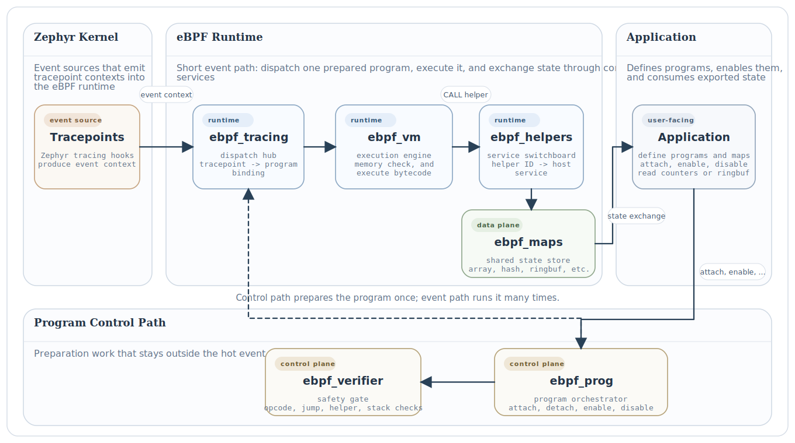

.. _ebpf:

eBPF (extended Berkeley Packet Filter)
######################################

The Zephyr eBPF subsystem is a lightweight runtime for event-driven,
in-kernel programmability. It borrows the core mental model of Linux eBPF,
including bytecode, a verifier, helper calls, maps, and tracepoint attachment,
but scopes those ideas to Zephyr's predictability and resource limits.

.. contents::
   :local:
   :depth: 2

Overview
********

At a high level, the subsystem lets you write a small program that runs when a
kernel event occurs. Instead of patching kernel C code each time you want to
count, inspect, or export something, you can:

1. define an eBPF program,
2. define any maps it needs,
3. attach it to a tracepoint,
4. enable it,
5. let the runtime execute it when the event fires,
6. read results from maps or a ring buffer.

This is especially useful for observability, lightweight tracing, and prototype
instrumentation on constrained systems.

The subsystem is easiest to understand as two paths that meet in the runtime:

* the control path prepares programs to run,
* the event path executes a prepared program when a tracepoint fires.

The short mental model is:

* :zephyr_file:`subsys/ebpf/ebpf_prog.c` is the eBPF program orchestrator,
* :zephyr_file:`subsys/ebpf/ebpf_verifier.c` is the safety gate,
* :zephyr_file:`subsys/ebpf/ebpf_tracing.c` is the dispatch hub,
* :zephyr_file:`subsys/ebpf/ebpf_vm.c` is the execution engine,
* :zephyr_file:`subsys/ebpf/ebpf_helpers.c` is the service switchboard,
* :zephyr_file:`subsys/ebpf/ebpf_maps.c` is the shared state store.

Why Zephyr Has eBPF
*******************

Zephyr applications often need to answer questions such as:

* How often is the scheduler switching threads?
* Which ISR path is firing too frequently?
* What state should be accumulated across repeated events?
* How can I add instrumentation without rewriting subsystem code?

Without eBPF, each new question tends to require a new patch to kernel or
subsystem source code. The Zephyr eBPF subsystem shifts part of that work into
data-driven programs that can be defined once, attached to a kernel event, and
reused with a stable runtime model.

The design goal is not to reproduce the entire Linux BPF ecosystem. The goal is
to provide a practical Zephyr-friendly subset with:

* static registration,
* predictable memory use,
* bounded execution,
* clear integration with Zephyr tracing hooks,
* enough helpers and map types to support useful tracing workflows.

Subsystem Architecture
**********************

The diagram below shows the complete runtime in one view.

  Zephyr eBPF subsystem architecture.

Read it from left to right:

* Zephyr tracepoints are the event sources. They emit an event context when a
  traced kernel action occurs.

* :zephyr_file:`subsys/ebpf/ebpf_tracing.c` is the dispatch hub. It remembers
  which program is bound to each tracepoint and forwards the event context to
  the runtime. The current implementation supports one attached program per
  tracepoint slot.

* :zephyr_file:`subsys/ebpf/ebpf_vm.c` is the execution engine. For each event,
  it creates a fresh register set and stack, passes the event context in
  register ``R1``, and interprets the program bytecode.

* :zephyr_file:`subsys/ebpf/ebpf_helpers.c` is the service switchboard. Helper
  IDs used by the program are translated into controlled runtime services such
  as map lookup, time queries, and thread or CPU metadata.

* :zephyr_file:`subsys/ebpf/ebpf_maps.c` is the shared state store. Maps hold
  persistent state across events and provide the main data exchange path
  between eBPF programs and normal application code.

* :zephyr_file:`subsys/ebpf/ebpf_prog.c` is the program orchestrator. It owns
  lifecycle operations such as attach, detach, enable, disable, and lookup.

* :zephyr_file:`subsys/ebpf/ebpf_verifier.c` is the safety gate. A program is
  checked before it is enabled so malformed bytecode does not reach the event
  path.

This split is deliberate: program management stays out of the hot event path,
while the event path stays short and predictable.

Typical Lifecycle
*****************

A typical eBPF workflow in Zephyr is:

1. Define a bytecode array and register it with :c:macro:`EBPF_PROG_DEFINE`.
2. Define any maps with :c:macro:`EBPF_MAP_DEFINE`.
3. Let subsystem initialization assign runtime map IDs and initialize map
   backends.
4. Attach the program to a tracepoint with :c:func:`ebpf_prog_attach`.
5. Enable the program with :c:func:`ebpf_prog_enable`; this runs the verifier
   if needed.
6. When the tracepoint fires, the tracing bridge dispatches the event to the
   VM.
7. The program uses helpers and maps to read context, keep state, and export
   results.
8. Normal application code, test code, or shell commands read those results.

The :zephyr:code-sample:`ebpf-hello-trace` sample follows exactly this model.
It attaches a small scheduler-oriented program to
:c:enumerator:`EBPF_TP_THREAD_SWITCHED_IN`, increments a counter in an array
map, and prints that counter from normal application code.

Core Concepts
*************

Programs
========

An eBPF program in Zephyr is defined as an instruction array together with a
descriptor in :zephyr_file:`include/zephyr/ebpf/ebpf_prog.h`. Programs are
statically registered and later attached to tracepoints.

The most useful way to think about :zephyr_file:`subsys/ebpf/ebpf_prog.c` is as
the subsystem's orchestrator: it does not execute programs itself, but it makes
sure each program is attached to the right event source and is in the right
state before execution is allowed.

Verifier
========

Before a program is enabled, the verifier checks that it is well-formed and
safe enough for the runtime model. The verifier validates things such as:

* program size,
* supported opcodes,
* register indices,
* valid jump targets,
* helper IDs,
* bounded stack usage.

This verifier is intentionally lightweight. Its job is to prevent obviously
unsafe or malformed program.

Its role is not to optimize programs or prove every runtime property. Its role
is to be the subsystem's safety gate.

VM (Virtual Machine)
====================

The VM is the execution engine. Each invocation creates a fresh execution
context containing registers, a program counter, and a private stack. The VM
supports the instruction families currently needed by the subsystem:

* 64-bit ALU operations,
* 32-bit ALU operations,
* memory load/store,
* jumps,
* helper calls,
* exit.

Optional runtime bounds checking can further constrain memory accesses to the
VM stack, the event context, and registered map storage.

This keeps the hot path simple: the VM only needs to execute one prepared
program against one event context.

Helpers
=======

Helpers are the subsystem's controlled extension surface. A program cannot call
arbitrary Zephyr internals directly. Instead, it issues a helper call, and the
runtime resolves that helper ID to a specific implementation.

The helper layer is therefore the service switchboard between bytecode and the
rest of the kernel runtime.

Current helpers include operations for:

* map lookup, update, and delete,
* timestamp retrieval,
* tracing-oriented debug output,
* current task or CPU information,
* ring buffer output.

Maps
====

Maps provide persistent state across repeated invocations. They let eBPF
programs accumulate counters, share state with application code, and export
records.

The current implementation supports:

* array maps,
* hash maps,
* per-CPU array maps,
* ring buffer maps.

The map layer is intentionally static-first: maps are defined at build time,
assigned runtime IDs during initialization, and then accessed through a common
operations table.

This makes maps the subsystem's shared state store: they are where transient
event handling turns into reusable counters, tables, and exported records.

Tracepoints
===========

Tracepoints are where programs connect to real system activity. The tracing
bridge binds Zephyr tracing hooks to eBPF tracepoint IDs and dispatches enabled
programs when an event occurs.

This keeps the event source separate from the program logic. The tracing
subsystem decides *when* to call into eBPF, while the eBPF runtime decides *how*
to execute the program.

Design Philosophy
*****************

Experienced developers will notice that this subsystem is not trying to be a
verbatim Linux BPF port. That is deliberate.

The design philosophy is:

* Linux-inspired semantics where they add familiarity and leverage,
* Zephyr-oriented implementation choices where they improve predictability,
* explicit limits instead of implicit dynamism,
* enough power for tracing and observability without importing unnecessary
  complexity.

Concretely, that means:

* static registration instead of runtime loaders,
* a small interpreter instead of JIT compilation,
* a lightweight verifier instead of a Linux-scale verifier,
* bounded helper and map support chosen for practical tracing workflows,
* straightforward integration with Zephyr tracing hooks and iterable sections.

What Zephyr eBPF Is, and Is Not
*******************************

Zephyr eBPF is:

* a lightweight event-driven programmability layer,
* a practical tool for tracing, counting, filtering, and exporting data,
* a subsystem designed to fit Zephyr's resource model.

Zephyr eBPF is not:

* a full replacement for the Linux BPF subsystem,
* a complete Linux userspace tooling environment,
* a promise of broad Linux helper or program-type compatibility.

Configuration
*************

The subsystem is enabled through :kconfig:option:`CONFIG_EBPF`. Related options
control tracing support, map types, the shell interface, VM stack size, program
size, and optional runtime bounds checking.

For tracing-oriented usage, the most relevant options are:

* :kconfig:option:`CONFIG_EBPF`
* :kconfig:option:`CONFIG_EBPF_TRACING`
* :kconfig:option:`CONFIG_EBPF_RUNTIME_BOUNDS_CHECK`
* :kconfig:option:`CONFIG_EBPF_STATS`

API Reference
*************

.. doxygengroup:: ebpf

See Also
********

* :zephyr:code-sample:`ebpf-hello-trace`
* :ref:`tracing`
* :zephyr_file:`include/zephyr/ebpf/ebpf.h`
* :zephyr_file:`include/zephyr/ebpf/ebpf_map.h`
* :zephyr_file:`include/zephyr/ebpf/ebpf_prog.h`
* :zephyr_file:`include/zephyr/ebpf/ebpf_tracepoint.h`
