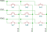
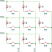
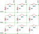
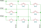

.. _gpio-kbd:

GPIO Keyboard Matrix
####################

The :dtcompatible:`gpio-kbd-matrix` driver supports a large variety of keyboard
matrix hardware configurations and has numerous options to change its behavior.
This is an overview of some common setups and how they can be supported by the
driver.

The conventional configuration for all of these is that the driver reads on the
row GPIOs (inputs) and selects on the columns GPIOs (output).

Base use case, no isolation diodes, interrupt capable GPIOs
***********************************************************

This is the common configuration found on consumer keyboards with membrane
switches and flexible circuit boards, no isolation diodes, requires ghosting
detection (which is enabled by default).

      A 3x3 matrix, no diodes

The system must support GPIO interrupts, and the interrupt can be enabled on all
row GPIOs at the same time.

.. code-block:: devicetree

   kbd-matrix {
        compatible = "gpio-kbd-matrix";
        row-gpios = <&gpio0 0 (GPIO_PULL_UP | GPIO_ACTIVE_LOW)>,
                    <&gpio0 1 (GPIO_PULL_UP | GPIO_ACTIVE_LOW)>,
                    <&gpio0 2 (GPIO_PULL_UP | GPIO_ACTIVE_LOW)>;
        col-gpios = <&gpio0 3 GPIO_ACTIVE_LOW>,
                    <&gpio0 4 GPIO_ACTIVE_LOW>,
                    <&gpio0 5 GPIO_ACTIVE_LOW>;
   };

In this configuration the matrix scanning library enters idle mode once all
keys are released, and the keyboard matrix thread only wakes up when a key has
been pressed.

GPIOs for columns that are not currently selected are configured in high
impedance mode. This means that the row state may need some time to settle to
avoid misreading the key state from a column to the following one. The settle
time can be tweaked by changing the ``settle-time-us`` property.

Isolation diodes
****************

If the matrix has isolation diodes for every key, then it's possible to:

 - disable ghosting detection, allowing any key combination to be detected
 - configuring the driver to drive unselected columns GPIO to inactive state
   rather than high impedance, this allows to reduce the settle time
   (potentially down to 0), and use the more efficient port wide GPIO read APIs
   (happens automatically if the GPIO pins are sequential)

Matrixes with diodes going from rows to columns must use pull-ups on rows and
active low columns.

      A 3x3 matrix with row to column isolation diodes.

.. code-block:: devicetree

   kbd-matrix {
        compatible = "gpio-kbd-matrix";
        row-gpios = <&gpio0 0 (GPIO_PULL_UP | GPIO_ACTIVE_LOW)>,
                    <&gpio0 1 (GPIO_PULL_UP | GPIO_ACTIVE_LOW)>,
                    <&gpio0 2 (GPIO_PULL_UP | GPIO_ACTIVE_LOW)>;
        col-gpios = <&gpio0 3 GPIO_ACTIVE_LOW>,
                    <&gpio0 4 GPIO_ACTIVE_LOW>,
                    <&gpio0 5 GPIO_ACTIVE_LOW>;
        col-drive-inactive;
        settle-time-us = <0>;
        no-ghostkey-check;
   };

Matrixes with diodes going from columns to rows must use pull-downs on rows and
active high columns.

      A 3x3 matrix with column to row isolation diodes.

.. code-block:: devicetree

   kbd-matrix {
        compatible = "gpio-kbd-matrix";
        row-gpios = <&gpio0 0 (GPIO_PULL_DOWN | GPIO_ACTIVE_HIGH)>,
                    <&gpio0 1 (GPIO_PULL_DOWN | GPIO_ACTIVE_HIGH)>,
                    <&gpio0 2 (GPIO_PULL_DOWN | GPIO_ACTIVE_HIGH)>;
        col-gpios = <&gpio0 3 GPIO_ACTIVE_HIGH>,
                    <&gpio0 4 GPIO_ACTIVE_HIGH>,
                    <&gpio0 5 GPIO_ACTIVE_HIGH>;
        col-drive-inactive;
        settle-time-us = <0>;
        no-ghostkey-check;
   };

GPIO with no interrupt support
******************************

Some GPIO controllers have limitations on GPIO interrupts, and may not support
enabling interrupts on all row GPIOs at the same time.

In this case, the driver can be configured to not use interrupt at all, and
instead idle by selecting all columns and keep polling on the row GPIOs, which
is a single GPIO API operation if the pins are sequential.

This configuration can be enabled by setting the ``idle-mode`` property to
``poll``:

.. code-block:: devicetree

   kbd-matrix {
        compatible = "gpio-kbd-matrix";
        ...
        idle-mode = "poll";
   };

GPIO multiplexer
****************

In more extreme cases, such as if the columns are using a multiplexer and it's
impossible to select all of them at the same time, the driver can be configured
to scan continuously.

This can be done by setting ``idle-mode`` to ``scan`` and ``poll-timeout-ms``
to ``0``.

.. code-block:: devicetree

   kbd-matrix {
        compatible = "gpio-kbd-matrix";
        ...
        poll-timeout-ms = <0>;
        idle-mode = "scan";
   };

Row and column GPIO selection
*****************************

If the row GPIOs are sequential and on the same gpio controller, the driver
automatically switches API to read from the whole GPIO port rather than the
individual pins. This is particularly useful if the GPIOs are not memory
mapped, for example on an I2C or SPI port expander, as this significantly
reduces the number of transactions on the corresponding bus.

The same is true for column GPIOs, but only if the matrix is configured for
``col-drive-inactive``, so that is only usable for matrixes with isolation
diodes.

16-bit row support
******************

The driver uses an 8-bit datatype to store the row state by default, which
limits the matrix row size to 8. This can be increased to 16 by enabling the
:kconfig:option:`CONFIG_INPUT_KBD_MATRIX_16_BIT_ROW` option.

Actual key mask configuration
*****************************

If the key matrix is not complete, a map of the keys that are actually
populated can be specified using the `actual-key-mask` property. This allows
the matrix state to be filtered to remove keys that are not present before
ghosting detection, potentially allowing key combinations that would otherwise
be blocked by it.

For example for a 3x3 matrix missing a key:

      A 3x3 matrix missing a key.

.. code-block:: devicetree

   kbd-matrix {
        compatible = "gpio-kbd-matrix";
        ...
        actual-key-mask = <0x07 0x05 0x07>;
   };

This would allow, for example, to detect pressing ``Sw1``, ``SW2`` and  ``SW4``
at the same time without triggering anti ghosting.

The actual key mask can be changed at runtime by enabling
:kconfig:option:`CONFIG_INPUT_KBD_ACTUAL_KEY_MASK_DYNAMIC` and the using the
:c:func:`input_kbd_matrix_actual_key_mask_set` API.

Keymap configuration
********************

Keyboard matrix devices report a series of x/y/touch events. These can be
mapped to normal key events using the :dtcompatible:`input-keymap` driver.

For example, the following would setup a ``keymap`` device that take the
x/y/touch events as an input and generate corresponding key events as an
output:

.. code-block:: devicetree

  kbd {
      ...
      keymap {
          compatible = "input-keymap";
          keymap = <
              MATRIX_KEY(0, 0, INPUT_KEY_1)
              MATRIX_KEY(0, 1, INPUT_KEY_2)
              MATRIX_KEY(0, 2, INPUT_KEY_3)
              MATRIX_KEY(1, 0, INPUT_KEY_4)
              MATRIX_KEY(1, 1, INPUT_KEY_5)
              MATRIX_KEY(1, 2, INPUT_KEY_6)
              MATRIX_KEY(2, 0, INPUT_KEY_7)
              MATRIX_KEY(2, 1, INPUT_KEY_8)
              MATRIX_KEY(2, 2, INPUT_KEY_9)
          >;
          row-size = <3>;
          col-size = <3>;
      };
  };

Keyboard matrix shell commands
******************************

The shell command ``kbd_matrix_state_dump`` can be used to test the
functionality of any keyboard matrix driver implemented using the keyboard
matrix library. Once enabled it logs the state of the matrix every time it
changes, and once disabled it prints an or-mask of any key that has been
detected, which can be used to set the ``actual-key-mask`` property.

The command can be enabled using the
:kconfig:option:`CONFIG_INPUT_SHELL_KBD_MATRIX_STATE`.

Example usage:

.. code-block:: console

   uart:~$ device list
   devices:
   - kbd-matrix (READY)
   uart:~$ input kbd_matrix_state_dump kbd-matrix
   Keyboard state logging enabled for kbd-matrix
   [00:01:41.678,466] <inf> input: kbd-matrix state [01 -- -- --] (1)
   [00:01:41.784,912] <inf> input: kbd-matrix state [-- -- -- --] (0)
   ...
   press more buttons
   ...
   uart:~$ input kbd_matrix_state_dump off
   Keyboard state logging disabled
   [00:01:47.967,651] <inf> input: kbd-matrix key-mask [07 05 07 --] (8)

Keyboard matrix library
***********************

The GPIO keyboard matrix driver is based on a generic keyboard matrix library,
which implements the core functionalities such as scanning delays, debouncing,
idle mode etc. This can be reused to implement other keyboard matrix drivers,
potentially application specific.

.. doxygengroup:: input_kbd_matrix
