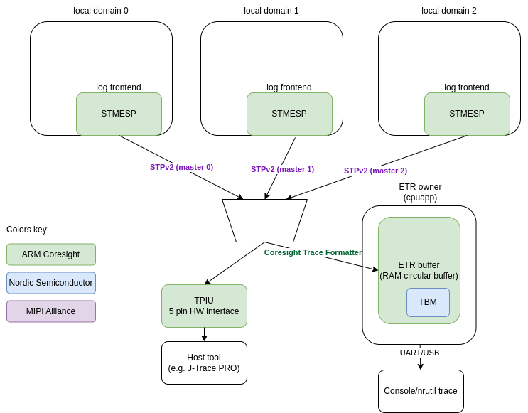

.. _logging_cs_stm:

Multi-domain logging using ARM Coresight STM
############################################

The Arm CoreSight SoC-400 is a comprehensive library of components for the creation of debug and
trace functionality within a system. The STM (System Trace Macrocell) is a trace source that
is integrated into a CoreSight system, designed primarily for high-bandwidth trace of
instrumentation embedded into software. This instrumentation is made up of memory-mapped writes to
the STMESP (STM Extended Stimulus Port) peripheral registers. Multiple cores can share and directly
access the STM without being aware of each other. Each core has 65536 stimulus ports (identical
register sets) which can be independently accessed thus there is no need for locking when various
contexts want to log the data.

STM Extended Stimulus Port (STMESP)
***********************************

Local domain (each core) has access to its own set of STMESP peripherals. Each set has registers for writing data (with or without timestamp and with or without marking) and writing a flag. Each write
to STMESP register results in the user data being encoded into MIPI System Trace Protocol v2 (STPv2).
Hardware manages multiplexing of data from different STMESP register sets and from different cores
by adding Major and Channel opcodes into the stream when necessary. Timestamp (from common source for all cores) and synchronization opcodes are autonomously added by the STM.

Data stream generated by STM can end up in various sinks. For example it can be directly send to
TPIU (Trace Port Interface Unit) or saved in the RAM Circular Buffer which is called ETR (Embedded
Trace Router). TPIU is a 5 pin interface (4 data pins and clock) and external tool is required to
capture the data (e.g. J-Trace PRO).
When ETR is used then one core in the system is responsible for processing that data, for example
dumping it over UART to the host.

ARM Coresight Embedded Trace Router (ETR)
*****************************************

ETR is a circular RAM buffer to which tracing data is saved. Since it may contain data from
various sources additional wrapping protocol is used to multiplex them. ``Coresight Trace
Formatter`` is used for that. Data is encoded into 16 bytes frames which holds up to 15 byte
of data. Circular RAM buffer size is limited to 4k thus there is a risk of data overflow. If
overflow occurs then data is lost but due to presence of synchronization opcodes in the STPv2
data stream synchronization can be restored.

Data from ETR is handled on the device. It can be forwarded as-is to the host (e.g. using UART),
where a host tool is decoding the data or data can be decoded on-chip to output the data in human readable format.

Nordic Semiconductor NRF54H20 implementation instead of using ETR peripheral for getting
buffer busyness is using own wrapper: Trace Buffer Monitor (TBM).

STMESP Logging frontend
***********************

:ref:`log_frontend` API is implemented. Custom frontend assumes that all required operations are executed in the context of the logging macro call. It is also assumed that frontend provides the timestamp. Frontend utilizes a fact that there are multiple STMESP register sets and use multiple sets to avoid locking context. The atomically incremented channel counter is used to pick unique STMESP set and
whole message is written to that STMESP. Limited pool of sets is used leaving most of channels for
other purposes.

Early logging
=============

STMESP cannot be used before STM or ETR/TPIU is setup. In order to support early logging,
before infrastructure is ready a dedicated RAM buffer is used to which data is written. When
STM infrastructure readiness is notified (:c:func:`log_frontend_stmesp_etr_ready`) then RAM buffer
content is written to STMESP. Early logging is applicable only to the core which owns and configures
Coresight infrastructure (e.g. in case of NRF54H20 it is the Secure core).

Trace points
============

There may be cases when logging is too slow (even though it is very fast). For cases like that a dedicated ``trace point`` API is added. It is extremely fast because it is just a single
write to one STMESP register. There are 2 functions in the API:

* :c:func:`log_frontend_stmesp_tp` - It accepts single argument - index. Index is between
  0 and 65280.
* :c:func:`log_frontend_stmesp_tp_d32` - It accepts two arguments - index and user data.
  Index is between 0 and 65280. User data is 32 bit word.

It takes less than 100 ns to log a single trace point on NRF54H20 and it is approx. 7 times faster than the fastest log message.

Logging using STM
*****************

STM logging has 2 modes of operations:

* Dictionary-based - assisted mode which is using dictionary-based logging. In this mode logging
  strings can be removed from the binary because they are only needed for decoding and decoding
  is performed by the host tool. This mode takes less memory and is faster (2-3 times faster).
  There is less data written so there is less chance of data overflow in ETR buffer.
* Standalone - data is decoded on chip and human-readable strings are printed. This mode requires
  more device resources and processing power.

Following figure presents multi-domain logging using ARM Coresight STM.

Each core (local domain) is using logging frontend which writes logging data to STMESP registers.

If TPIU is used as the output then there is no more software components needed. STPv2 stream
of data is composed by STM and send over TPIU.

If ETR RAM buffer is used then buffer owner core (``proxy``) is responsible for handling that data.
If dictionary-based logging is used then proxy just sends data as-is over UART.
If standalone logging is used then proxy is using :ref:`cs_trace_defmt` and
:ref:`mipi_stp_decoder` to decode data and demultiplex messages. Messages are formatted to human
readable strings using logging :ref:`log_output`.

Dictionary-based logging
========================

Assisted multicore logging uses dictionary-based logging to send messages without redundant strings
to STM, and is based on the :ref:`logging_guide_dictionary` feature of the logging API provided by
Zephyr.
Instead of including the format strings in the log messages, it logs the addresses (message IDs)
where the strings are stored, which reduces the size of the logging subsystem.
If the data goes to the ETR buffer, the proxy core's responsibility is to dump this data.
The host PC, equipped with a decoder tool, translates these addresses back into human-readable text
using a JSON database generated during the build process.

When using logs, this method has the following advantages:

* It reduces the size of the binary, as the strings used in the log messages are not stored in the binary itself. Logging infrastructure is also very limited. On local domains it is just the frontend. There is even no need to have string formatting function.
* It reduces the amount of data that needs to be sent to and processed by the application core, as the string formatting is offloaded to the host side.
* Logging is fast. It takes less than 1 us to log a simple message (up to 2 arguments) on NRF54H20.

Proxy core is using Nordic specific peripheral (TBM) to get ETR buffer busyness and send data over
UART. Nordic specific driver for ETR buffer is located in
:zephyr_file:`drivers/misc/coresight/nrf_etr.c`.

Configuration
-------------

For Nordic SoC a dedicated snippet (:ref:`nordic-log-stm-dict`) shall be used to enable logging.
Each core shall be build with that snippet. If any core wants to use it then application core is
required to have it enabled too since it acts as the proxy (ETR buffer processing). All cores must use the same configuration of the logging.

Reading the logs
----------------

To read the dictionary-based STM log output, do the following:

1. Set up the log capture.

   Use the ``nrfutil trace stm`` command to start capturing logs from the device, specifying the database configuration for each domain ID, as well as the serial port, the baud rate, and the output file name::

      nrfutil trace stm --database-config 34:build/zephyr/log_dictionary.json,35:build_rad/zephyr/log_dictionary.json --input-serialport /dev/ttyACM1 --baudrate 115200 --output-ascii out.txt

#. Capture and decode the logs.

   nrfutil will capture the log data from the specified UART port and use the provided dictionary databases to decode the logs into a human-readable format.
   The decoded logs will be saved in the specified output file (the :file:`out.txt` file in the previous example).

#. Open the output file to review the decoded log messages.

   The file will contain timestamps and the log messages in a format that is human-readable.

If the log capture fails to find a sync, rerun the capture process.

.. note::
   Decoding artifacts or incorrect timestamps might occur when rerunning the process.

Each log line contains a domain-related or core-related prefix between the log level and the module name, indicating the core that generated the log entry.
The following are the prefixes used to indicate the cores:

.. csv-table:: nRF54H20 log prefixes
   :header: "Core", "Prefix", "ID"

   Secure Domain, ``sec``, 0x21
   Application core, ``app``, 0x22
   Radio core, ``rad``, 0x23
   System Controller (SysCtrl), ``sys``, 0x2c
   Fast Lightweight Processor (FLPR), ``flpr``, 0x2d
   Peripheral Processor (PPR), ``ppr``, 0x2e
    , ``mod``, 0x24

Stand-alone logging
===================

Frontend is writing to STMESP registers. Message format is aligned with the on chip decoder
in :zephyr_file:`subsys/logging/frontends/log_frontend_stmesp_demux.c`.

``Proxy`` is using Nordic specific peripheral (TBM) to get ETR buffer busyness and read and
decode data and send human-readable data over UART. Nordic specific driver for ETR buffer is
located in :zephyr_file:`drivers/misc/coresight/nrf_etr.c`. It is using :ref:`cs_trace_defmt` and
:ref:`mipi_stp_decoder` and above-mentioned demultiplexer to decode messages.

Logging messages contains read-only format string used in the logging macros thus they cannot be
removed from the binary. This mode uses more read-only memory and has lower throughput because
messages are longer and processing is time consuming. Compared to the dictionary-based mode logging
is 2-3 slower.

Configuration
-------------

For Nordic SoC a dedicated snippet (:ref:`nordic-log-stm`) shall be used to enable logging.
Each core shall be build with that snippet. If any core wants to use it then application core is
required to have it enabled too since it acts as the proxy (ETR buffer processing). All cores must use the same configuration of the logging.

Reading the logs
----------------

Logs are printed using Console UART.

.. note::
   To use UART in your application, the UART's node must be described in devicetree.
   For more details, see :ref:`devicetree-intro`.

The following is an example log output::

   [00:00:00.154,790] <inf> app/spsc_pbuf: alloc in 0x2f0df800
   [00:00:00.163,319] <inf> app/spsc_pbuf: alloc 0x2f0df800 wr_idx:20
   [00:00:00.181,112] <inf> app/spsc_pbuf: commit in 0x2f0df800
   [00:00:00.189,090] <inf> app/spsc_pbuf: commit 0x2f0df800, len:20 wr_idx: 44
   [00:00:00.202,577] <inf> rad/icmsg: mbox_callback
   [00:00:00.214,750] <inf> rad/spsc_pbuf: claim 0x2f0df800 rd_idx:20
   [00:00:00.235,823] <inf> rad/spsc_pbuf: free 0x2f0df800 len:20 rd_idx: 44
   [00:00:00.244,507] <inf> rad/spsc_pbuf: read done 0x2f0df800 len:20
   [00:00:00.272,444] <inf> rad/host: ep recv 0x330021f0, len:20
   [00:00:00.283,939] <inf> rad/host: rx:00 exp:00
   [00:00:00.292,200] <inf> rad/icmsg: read 0
   [00:00:05.077,026] <inf> rad/spsc_pbuf: alloc in 0x2f0df000
   [00:00:05.077,068] <inf> rad/spsc_pbuf: alloc 0x2f0df000 wr_idx:44
   [00:00:05.077,098] <inf> rad/spsc_pbuf: commit in 0x2f0df000
   [00:00:05.077,134] <inf> rad/spsc_pbuf: commit 0x2f0df000, len:20 wr_idx

Each log line contains a domain-related or core-related prefix between the log level and the module name, indicating the core that generated the log entry.
The following are the prefixes used to indicate the cores:

.. csv-table:: nRF54H20 log prefixes
   :header: "Core", "Prefix"

   Secure Domain, ``sec``
   Application core, ``app``
   Radio core, ``rad``
   System Controller (SysCtrl), ``sys``
   Fast Lightweight Processor (FLPR), ``flpr``
   Peripheral Processor (PPR), ``ppr``

Additional considerations
=========================

When using STM logging, consider the following:

* Use optimized log macros (having up to 2 word size numeric arguments, like ``LOG_INF("%d %c", (int)x, (char)y)``) to improve the size and speed of logging.
* For memory constrained applications (for example, when running on the PPR core), disable the ``printk()`` function by setting both the :kconfig:option:`CONFIG_PRINTK` and :kconfig:option:`CONFIG_BOOT_BANNER` Kconfig options to ``n`` in your project configuration.
* When working with multiple domains, such as the Radio core and Application core, ensure that each database is prefixed with the correct domain ID.
* Some log messages might be dropped due to the limited size of the RAM buffer that stores STM logs.
