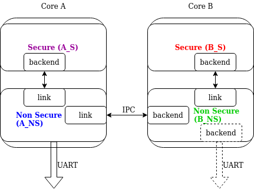

.. _logging_api:

Logging
#######

.. contents::
    :local:
    :depth: 2

The logging API provides a common interface to process messages issued by
developers. Messages are passed through a frontend and are then
processed by active backends.
Custom frontend and backends can be used if needed.

Summary of the logging features:

- Deferred logging reduces the time needed to log a message by shifting time
  consuming operations to a known context instead of processing and sending
  the log message when called.
- Multiple backends supported (up to 9 backends).
- Custom frontend support. It can work together with backends.
- Compile time filtering on module level.
- Run time filtering independent for each backend.
- Additional run time filtering on module instance level.
- Timestamping with user provided function. Timestamp can have 32 or 64 bits.
- Dedicated API for dumping data.
- Dedicated API for handling transient strings.
- Panic support - in panic mode logging switches to blocking, synchronous
  processing.
- Printk support - printk message can be redirected to the logging.
- Design ready for multi-domain/multi-processor system.
- Support for logging floating point variables and long long arguments.
- Built-in copying of transient strings used as arguments.
- Support for multi-domain logging.

Logging API is highly configurable at compile time as well as at run time. Using
Kconfig options (see :ref:`logging_kconfig`) logs can be gradually removed from
compilation to reduce image size and execution time when logs are not needed.
During compilation logs can be filtered out on module basis and severity level.

Logs can also be compiled in but filtered on run time using dedicate API. Run
time filtering is independent for each backend and each source of log messages.
Source of log messages can be a module or specific instance of the module.

There are four severity levels available in the system: error, warning, info
and debug. For each severity level the logging API (:zephyr_file:`include/zephyr/logging/log.h`)
has set of dedicated macros. Logger API also has macros for logging data.

For each level the following set of macros are available:

- ``LOG_X`` for standard printf-like messages, e.g. :c:macro:`LOG_ERR`.
- ``LOG_HEXDUMP_X`` for dumping data, e.g. :c:macro:`LOG_HEXDUMP_WRN`.
- ``LOG_INST_X`` for standard printf-like message associated with the
  particular instance, e.g. :c:macro:`LOG_INST_INF`.
- ``LOG_INST_HEXDUMP_X`` for dumping data associated with the particular
  instance, e.g. :c:macro:`LOG_INST_HEXDUMP_DBG`

The warning level also exposes the following additional macro:

- :c:macro:`LOG_WRN_ONCE` for warnings where only the first occurrence is of interest.

There are two configuration categories: configurations per module and global
configuration. When logging is enabled globally, it works for modules. However,
modules can disable logging locally. Every module can specify its own logging
level. The module must define the :c:macro:`LOG_LEVEL` macro before using the
API. Unless a global override is set, the module logging level will be honored.
The global override can only increase the logging level. It cannot be used to
lower module logging levels that were previously set higher. It is also possible
to globally limit logs by providing maximal severity level present in the
system, where maximal means lowest severity (e.g. if maximal level in the system
is set to info, it means that errors, warnings and info levels are present but
debug messages are excluded).

Each module which is using the logging must specify its unique name and
register itself to the logging. If module consists of more than one file,
registration is performed in one file but each file must define a module name.

Logger's default frontend is designed to be thread safe and minimizes time needed
to log the message. Time consuming operations like string formatting or access to the
transport are not performed by default when logging API is called. When logging
API is called a message is created and added to the list. Dedicated,
configurable buffer for pool of log messages is used. There are 2 types of messages:
standard and hexdump. Each message contain source ID (module or instance ID and
domain ID which might be used for multiprocessor systems), timestamp and
severity level. Standard message contains pointer to the string and arguments.
Hexdump message contains copied data and string.

.. _logging_kconfig:

Global Kconfig Options
**********************

These options can be found in the following path :zephyr_file:`subsys/logging/Kconfig`.

:kconfig:option:`CONFIG_LOG`: Global switch, turns on/off the logging.

Mode of operations:

:kconfig:option:`CONFIG_LOG_MODE_DEFERRED`: Deferred mode.

:kconfig:option:`CONFIG_LOG_MODE_IMMEDIATE`: Immediate (synchronous) mode.

:kconfig:option:`CONFIG_LOG_MODE_MINIMAL`: Minimal footprint mode.

Filtering options:

:kconfig:option:`CONFIG_LOG_RUNTIME_FILTERING`: Enables runtime reconfiguration of the
filtering.

:kconfig:option:`CONFIG_LOG_DEFAULT_LEVEL`: Default level, sets the logging level
used by modules that are not setting their own logging level.

:kconfig:option:`CONFIG_LOG_OVERRIDE_LEVEL`: It overrides module logging level when
it is not set or set lower than the override value.

:kconfig:option:`CONFIG_LOG_MAX_LEVEL`: Maximal (lowest severity) level which is
compiled in.

Processing options:

:kconfig:option:`CONFIG_LOG_MODE_OVERFLOW`: When new message cannot be allocated,
oldest one are discarded.

:kconfig:option:`CONFIG_LOG_BLOCK_IN_THREAD`: If enabled and new log message cannot
be allocated thread context will block for up to
:kconfig:option:`CONFIG_LOG_BLOCK_IN_THREAD_TIMEOUT_MS` or until log message is
allocated.

:kconfig:option:`CONFIG_LOG_PRINTK`: Redirect printk calls to the logging.

:kconfig:option:`CONFIG_LOG_PROCESS_TRIGGER_THRESHOLD`: When the number of buffered log
messages reaches the threshold, the dedicated thread (see :c:func:`log_thread_set`)
is woken up. If :kconfig:option:`CONFIG_LOG_PROCESS_THREAD` is enabled then this
threshold is used by the internal thread.

:kconfig:option:`CONFIG_LOG_PROCESS_THREAD`: When enabled, logging thread is created
which handles log processing.

:kconfig:option:`CONFIG_LOG_PROCESS_THREAD_STARTUP_DELAY_MS`: Delay in milliseconds
after which logging thread is started.

:kconfig:option:`CONFIG_LOG_BUFFER_SIZE`: Number of bytes dedicated for the circular
packet buffer.

:kconfig:option:`CONFIG_LOG_FRONTEND`: Direct logs to a custom frontend.

:kconfig:option:`CONFIG_LOG_FRONTEND_ONLY`: No backends are used when messages goes to frontend.

:kconfig:option:`CONFIG_LOG_FRONTEND_OPT_API`: Optional API optimized for the most common
simple messages.

:kconfig:option:`CONFIG_LOG_CUSTOM_HEADER`: Injects an application provided header into log.h

:kconfig:option:`CONFIG_LOG_TIMESTAMP_64BIT`: 64 bit timestamp.

:kconfig:option:`CONFIG_LOG_SIMPLE_MSG_OPTIMIZE`: Optimizes simple log messages for size
and performance. Option available only for 32 bit architectures.

Formatting options:

:kconfig:option:`CONFIG_LOG_FUNC_NAME_PREFIX_ERR`: Prepend standard ERROR log messages
with function name. Hexdump messages are not prepended.

:kconfig:option:`CONFIG_LOG_FUNC_NAME_PREFIX_WRN`: Prepend standard WARNING log messages
with function name. Hexdump messages are not prepended.

:kconfig:option:`CONFIG_LOG_FUNC_NAME_PREFIX_INF`: Prepend standard INFO log messages
with function name. Hexdump messages are not prepended.

:kconfig:option:`CONFIG_LOG_FUNC_NAME_PREFIX_DBG`: Prepend standard DEBUG log messages
with function name. Hexdump messages are not prepended.

:kconfig:option:`CONFIG_LOG_BACKEND_SHOW_COLOR`: Enables coloring of errors (red)
and warnings (yellow).

:kconfig:option:`CONFIG_LOG_BACKEND_FORMAT_TIMESTAMP`: If enabled timestamp is
formatted to *hh:mm:ss:mmm,uuu*. Otherwise is printed in raw format.

Backend options:

:kconfig:option:`CONFIG_LOG_BACKEND_UART`: Enabled built-in UART backend.

.. _log_usage:

Usage
*****

Logging in a module
===================

In order to use logging in the module, a unique name of a module must be
specified and module must be registered using :c:macro:`LOG_MODULE_REGISTER`.
Optionally, a compile time log level for the module can be specified as the
second parameter. Default log level (:kconfig:option:`CONFIG_LOG_DEFAULT_LEVEL`) is used
if custom log level is not provided.

.. code-block:: c

   #include <zephyr/logging/log.h>
   LOG_MODULE_REGISTER(foo, CONFIG_FOO_LOG_LEVEL);

If the module consists of multiple files, then ``LOG_MODULE_REGISTER()`` should
appear in exactly one of them. Each other file should use
:c:macro:`LOG_MODULE_DECLARE` to declare its membership in the module.
Optionally, a compile time log level for the module can be specified as
the second parameter. Default log level (:kconfig:option:`CONFIG_LOG_DEFAULT_LEVEL`)
is used if custom log level is not provided.

.. code-block:: c

   #include <zephyr/logging/log.h>
   /* In all files comprising the module but one */
   LOG_MODULE_DECLARE(foo, CONFIG_FOO_LOG_LEVEL);

In order to use logging API in a function implemented in a header file
:c:macro:`LOG_MODULE_DECLARE` macro must be used in the function body
before logging API is called. Optionally, a compile time log level for the module
can be specified as the second parameter. Default log level
(:kconfig:option:`CONFIG_LOG_DEFAULT_LEVEL`) is used if custom log level is not
provided.

.. code-block:: c

   #include <zephyr/logging/log.h>

   static inline void foo(void)
   {
   	LOG_MODULE_DECLARE(foo, CONFIG_FOO_LOG_LEVEL);

   	LOG_INF("foo");
   }

Dedicated Kconfig template (:zephyr_file:`subsys/logging/Kconfig.template.log_config`)
can be used to create local log level configuration.

Example below presents usage of the template. As a result CONFIG_FOO_LOG_LEVEL
will be generated:

.. code-block:: none

   module = FOO
   module-str = foo
   source "subsys/logging/Kconfig.template.log_config"

Logging in a module instance
============================

In case of modules which are multi-instance and instances are widely used
across the system enabling logs will lead to flooding. The logger provides the tools
which can be used to provide filtering on instance level rather than module
level. In that case logging can be enabled for particular instance.

In order to use instance level filtering following steps must be performed:

- a pointer to specific logging structure is declared in instance structure.
  :c:macro:`LOG_INSTANCE_PTR_DECLARE` is used for that.

.. code-block:: c

   #include <zephyr/logging/log_instance.h>

   struct foo_object {
   	LOG_INSTANCE_PTR_DECLARE(log);
   	uint32_t id;
   }

- module must provide macro for instantiation. In that macro, logging instance
  is registered and log instance pointer is initialized in the object structure.

.. code-block:: c

   #define FOO_OBJECT_DEFINE(_name)                             \
   	LOG_INSTANCE_REGISTER(foo, _name, CONFIG_FOO_LOG_LEVEL) \
   	struct foo_object _name = {                             \
   		LOG_INSTANCE_PTR_INIT(log, foo, _name)          \
   	}

Note that when logging is disabled logging instance and pointer to that instance
are not created.

In order to use the instance logging API in a source file, a compile-time log
level must be set using :c:macro:`LOG_LEVEL_SET`.

.. code-block:: c

   LOG_LEVEL_SET(CONFIG_FOO_LOG_LEVEL);

   void foo_init(foo_object *f)
   {
   	LOG_INST_INF(f->log, "Initialized.");
   }

In order to use the instance logging API in a header file, a compile-time log
level must be set using :c:macro:`LOG_LEVEL_SET`.

.. code-block:: c

   static inline void foo_init(foo_object *f)
   {
   	LOG_LEVEL_SET(CONFIG_FOO_LOG_LEVEL);

   	LOG_INST_INF(f->log, "Initialized.");
   }

Controlling the logging
=======================

By default, logging processing in deferred mode is handled internally by the
dedicated task which starts automatically. However, it might not be available
if multithreading is disabled. It can also be disabled by unsetting
:kconfig:option:`CONFIG_LOG_PROCESS_TRIGGER_THRESHOLD`. In that case, logging can
be controlled using the API defined in :zephyr_file:`include/zephyr/logging/log_ctrl.h`.
Logging must be initialized before it can be used. Optionally, the user can provide
a function which returns the timestamp value. If not provided, :c:macro:`k_cycle_get`
or :c:macro:`k_cycle_get_32` is used for timestamping.
The :c:func:`log_process` function is used to trigger processing of one log
message (if pending), and returns true if there are more messages pending.
However, it is recommended to use macro wrappers (:c:macro:`LOG_INIT` and
:c:macro:`LOG_PROCESS`) which handle the case where logging is disabled.

The following snippet shows how logging can be processed in simple forever loop.

.. code-block:: c

   #include <zephyr/logging/log_ctrl.h>

   int main(void)
   {
   	LOG_INIT();
   	/* If multithreading is enabled provide thread id to the logging. */
   	log_thread_set(k_current_get());

   	while (1) {
   		if (LOG_PROCESS() == false) {
   			/* sleep */
   		}
   	}
   }

If logs are processed from a thread (user or internal) then it is possible to enable
a feature which will wake up processing thread when certain amount of log messages are
buffered (see :kconfig:option:`CONFIG_LOG_PROCESS_TRIGGER_THRESHOLD`).

.. _logging_panic:

Logging panic
*************

In case of error condition system usually can no longer rely on scheduler or
interrupts. In that situation deferred log message processing is not an option.
Logger controlling API provides a function for entering into panic mode
(:c:func:`log_panic`) which should be called in such situation.

When :c:func:`log_panic` is called, _panic_ notification is sent to all active
backends. Once all backends are notified, all buffered messages are flushed. Since
that moment all logs are processed in a blocking way.

.. _logging_printk:

Printk
******

Typically, logging and :c:func:`printk` use the same output, which they compete
for. This can lead to issues if the output does not support preemption but it may
also result in corrupted output because logging data is interleaved with printk
data. However, it is possible to redirect printk messages to the
logging subsystem by enabling :kconfig:option:`CONFIG_LOG_PRINTK`. In that case,
printk entries are treated as log messages with level 0 (they cannot be disabled).
When enabled, logging manages the output so there is no interleaving. However,
in deferred mode the printk behaviour is changed since the output is delayed
until the logging thread processes the data. :kconfig:option:`CONFIG_LOG_PRINTK`
is enabled by default.

.. _log_architecture:

Architecture
************

Logging consists of 3 main parts:

- Frontend
- Core
- Backends

Log message is generated by a source of logging which can be a module or
instance of a module.

Default Frontend
================

Default frontend is engaged when the logging API is called in a source of logging (e.g.
:c:macro:`LOG_INF`) and is responsible for filtering a message (compile and run
time), allocating a buffer for the message, creating the message and committing that
message. Since the logging API can be called in an interrupt, the frontend is optimized
to log the message as fast as possible.

Log message
-----------

A log message contains a message descriptor (source, domain and level), timestamp,
formatted string details (see :ref:`cbprintf_packaging`) and optional data.
Log messages are stored in a continuous block of memory.
Memory is allocated from a circular packet buffer (:ref:`mpsc_pbuf`), which has
a few consequences:

 * Each message is a self-contained, continuous block of memory thus it is suited
   for copying the message (e.g. for offline processing).
 * Messages must be sequentially freed. Backend processing is synchronous. Backend
   can make a copy for deferred processing.

A log message has following format:

+------------------+----------------------------------------------------+
| Message Header   | 2 bits: MPSC packet buffer header                  |
|                  +----------------------------------------------------+
|                  | 1 bit: Trace/Log message flag                      |
|                  +----------------------------------------------------+
|                  | 3 bits: Domain ID                                  |
|                  +----------------------------------------------------+
|                  | 3 bits: Level                                      |
|                  +----------------------------------------------------+
|                  | 10 bits: Cbprintf Package Length                   |
|                  +----------------------------------------------------+
|                  | 12 bits: Data length                               |
|                  +----------------------------------------------------+
|                  | 1 bit: Reserved                                    |
|                  +----------------------------------------------------+
|                  | pointer: Pointer to the source descriptor [#l0]_   |
|                  +----------------------------------------------------+
|                  | 32 or 64 bits: Timestamp [#l0]_                    |
|                  +----------------------------------------------------+
|                  | Optional padding [#l1]_                            |
+------------------+----------------------------------------------------+
| Cbprintf         | Header                                             |
|                  +----------------------------------------------------+
| | package        | Arguments                                          |
| | (optional)     +----------------------------------------------------+
|                  | Appended strings                                   |
+------------------+----------------------------------------------------+
| Hexdump data (optional)                                               |
+------------------+----------------------------------------------------+
| Alignment padding (optional)                                          |
+------------------+----------------------------------------------------+

.. rubric:: Footnotes

.. [#l0] Depending on the platform and the timestamp size fields may be swapped.
.. [#l1] It may be required for cbprintf package alignment

Log message allocation
----------------------

It may happen that the frontend cannot allocate a message. This happens if the
system is generating more log messages than it can process in certain time
frame. There are two strategies to handle that case:

- No overflow - the new log is dropped if space for a message cannot be allocated.
- Overflow - the oldest pending messages are freed, until the new message can be
  allocated. Enabled by :kconfig:option:`CONFIG_LOG_MODE_OVERFLOW`. Note that it degrades
  performance thus it is recommended to adjust buffer size and amount of enabled
  logs to limit dropping.

.. _logging_runtime_filtering:

Run-time filtering
------------------

If run-time filtering is enabled, then for each source of logging a filter
structure in RAM is declared. Such filter is using 32 bits divided into ten 3
bit slots. Except *slot 0*, each slot stores current filter for one backend in
the system. *Slot 0* (bits 0-2) is used to aggregate maximal filter setting for
given source of logging. Aggregate slot determines if log message is created
for given entry since it indicates if there is at least one backend expecting
that log entry. Backend slots are examined when message is processed by the core
to determine if message is accepted by the given backend. Contrary to compile
time filtering, binary footprint is increased because logs are compiled in.

In the example below backend 1 is set to receive errors (*slot 1*) and backend
2 up to info level (*slot 2*). Slots 3-9 are not used. Aggregated filter
(*slot 0*) is set to info level and up to this level message from that
particular source will be buffered.

+------+------+------+------+-----+------+
|slot 0|slot 1|slot 2|slot 3| ... |slot 9|
+------+------+------+------+-----+------+
| INF  | ERR  | INF  | OFF  | ... | OFF  |
+------+------+------+------+-----+------+

.. _log_frontend:

Custom Frontend
===============

Custom frontend is enabled using :kconfig:option:`CONFIG_LOG_FRONTEND`. Logs are directed
to functions declared in :zephyr_file:`include/zephyr/logging/log_frontend.h`.
If option :kconfig:option:`CONFIG_LOG_FRONTEND_ONLY` is enabled then log message is not
created and no backend is handled. Otherwise, custom frontend can coexist with
backends.

In some cases, logs need to be redirected at the macro level. For these cases,
:kconfig:option:`CONFIG_LOG_CUSTOM_HEADER` can be used to inject an application provided
header named `zephyr_custom_log.h` at the end of :zephyr_file:`include/zephyr/logging/log.h`.

Frontend using ARM Coresight STM (System Trace Macrocell)
---------------------------------------------------------

For more details about logging using ARM Coresight STM see :ref:`logging_cs_stm`.

.. _logging_strings:

Logging strings
===============

String arguments are handled by :ref:`cbprintf_packaging`. See
:ref:`cbprintf_packaging_limitations` for limitations and recommendations.

Multi-domain support
====================

More complex systems can consist of multiple domains where each domain is an
independent binary. Examples of domains are a core in a multicore SoC or one
of the binaries (Secure or Nonsecure) on an ARM TrustZone core.

Tracing and debugging on a multi-domain system is more complex and requires an efficient logging
system. Two approaches can be used to structure this logging system:

* Log inside each domain independently.
  This option is not always possible as it requires that each domain has an available backend
  (for example, UART). This approach can also be troublesome to use and not scalable,
  as logs are presented on independent outputs.
* Use a multi-domain logging system where log messages from each domain end up in one root domain,
  where they are processed exactly as in a single domain case.
  In this approach, log messages are passed between domains using a connection between domains
  created from the backend on one side and linked to the other.

  The Log link is an interface introduced in this multi-domain approach. The Log link is
  responsible for receiving any log message from another domain, creating a copy, and
  putting that local log message copy (including remote data) into the message queue.
  This specific log link implementation matches the complementary backend implementation
  to allow log messages exchange and logger control like configuring filtering, getting log
  source names, and so on.

There are three types of domains in a multi-domain system:

* The *end domain* has the logging core implementation and a cross-domain
  backend. It can also have other backends in parallel.
* The *relay domain* has one or more links to other domains but does not
  have backends that output logs to the user. It has a cross-domain backend either to
  another relay or to the root domain.
* The *root domain* has one or multiple links and a backend that outputs logs
  to the user.

See the following image for an example of a multi-domain setup:

    Multi-domain example

In this architecture, a link can handle multiple domains.
For example, let's consider an SoC with two ARM Cortex-M33 cores with TrustZone: cores A and B (see
the example illustrated above). There are four domains in the system, as
each core has both a Secure and a Nonsecure domain. If *core A nonsecure* (A_NS) is the
root domain, it has two links: one to *core A secure* (A_NS-A_S) and one to
*core B nonsecure* (A_NS-B_NS). *B_NS* domain has one link, to *core B secure*
*B_NS-B_S*), and a backend to *A_NS*.

Since in all instances there is a standard logging subsystem, it is always possible
to have multiple backends and simultaneously output messages to them. An example of this is shown
in the illustration above as a dotted UART backend on the *B_NS* domain.

Domain ID
---------

The source of each log message can be identified by the following fields in the header:
``source_id`` and ``domain_id``.

The value assigned to the ``domain_id`` is relative. Whenever a domain creates a log message,
it sets its ``domain_id`` to ``0``.
When a message crosses the domain, ``domain_id`` changes as it is increased by the link offset.
The link offset is assigned during the initialization, where the logger core is iterating
over all the registered links and assigned offsets.

The first link has the offset set to 1.
The following offset equals the previous link offset plus the number of domains in the previous
link.

The following example is shown below, where
the assigned ``domain_ids`` are shown for each domain:

.. figure:: images/domain_ids.png

    Domain IDs assigning example

Let's consider a log message created on the *B_S* domain:

1. Initially, it has its ``domain_id`` set to ``0``.
#. When the *B_NS-B_S* link receives the message, it increases the ``domain_id``
   to ``1`` by adding the *B_NS-B_S* offset.
#. The message is passed to *A_NS*.
#. When the *A_NS-B_NS* link receives the message, it adds the offset (``2``) to the ``domain_id``.
   The message ends up with the ``domain_id`` set to ``3``, which uniquely identifies the message
   originator.

Cross-domain log message
------------------------

In most cases, the address space of each domain is unique, and one domain
cannot access directly the data in another domain. For this reason, the backend can
partially process the message before it is passed to another domain. Partial
processing can include converting a string package to a *fully self-contained*
version (copying read-only strings to the package body).

Each domain can have a different timestamp source in terms of frequency and
offset. Logging does not perform any timestamp conversion.

Runtime filtering
-----------------

In the single-domain case, each log source has a dedicated variable with runtime
filtering for each backend in the system. In the multi-domain case, the originator of
the log message is not aware of the number of backends in the root domain.

As such, to filter logs in multiple domains, each source requires a runtime
filtering setting in each domain on the way to the root domain. As the number of
sources in other domains is not known during the compilation, the runtime filtering
of remote sources must use dynamically allocated memory (one word per
source). When a backend in the root domain changes the filtering of the module from a
remote domain, the local filter is updated. After the update, the aggregated
filter (the maximum from all the local backends) is checked and, if changed, the remote domain is
informed about this change. With this approach, the runtime filtering works identically
in both multi-domain and single-domain scenarios.

Message ordering
----------------

Logging does not provide any mechanism for synchronizing timestamps across multiple
domains:

* If domains have different timestamp sources, messages will be
  processed in the order of arrival to the buffer in the root domain.
* If domains have the same timestamp source or if there is an out-of-bound mechanism that
  recalculates timestamps, there are 2 options:

  * Messages are processed as they arrive in the buffer in the root domain.
    Messages are unordered but they can be sorted by the host as the timestamp
    indicates the time of the message generation.
  * Links have dedicated buffers. During processing, the head of each buffer is checked
    and the oldest message is processed first.

    With this approach, it is possible to maintain the order of the messages at the cost
    of a suboptimal memory utilization (since the buffer is not shared) and increased processing
    latency (see :kconfig:option:`CONFIG_LOG_PROCESSING_LATENCY_US`).

Logging backends
================

Logging backends are registered using :c:macro:`LOG_BACKEND_DEFINE`. The macro
creates an instance in the dedicated memory section. Backends can be dynamically
enabled (:c:func:`log_backend_enable`) and disabled. When
:ref:`logging_runtime_filtering` is enabled, :c:func:`log_filter_set` can be used
to dynamically change filtering of a module logs for given backend. Module is
identified by source ID and domain ID. Source ID can be retrieved if source name
is known by iterating through all registered sources.

Logging supports up to 9 concurrent backends. Log message is passed to the
each backend in processing phase. Additionally, backend is notified when logging
enter panic mode with :c:func:`log_backend_panic`. On that call backend should
switch to synchronous, interrupt-less operation or shut down itself if that is
not supported.  Occasionally, logging may inform backend about number of dropped
messages with :c:func:`log_backend_dropped`. Message processing API is version
specific.

:c:func:`log_backend_msg_process` is used for processing message. It is common for
standard and hexdump messages because log message hold string with arguments
and data. It is also common for deferred and immediate logging.

.. _log_output:

Message formatting
------------------

Logging provides set of function that can be used by the backend to format a
message. Helper functions are available in :zephyr_file:`include/zephyr/logging/log_output.h`.

Example message formatted using :c:func:`log_output_msg_process`.

.. code-block:: console

   [00:00:00.000,274] <info> sample_instance.inst1: logging message

.. _logging_guide_dictionary:

Dictionary-based Logging
========================

Dictionary-based logging, instead of human readable texts, outputs the log
messages in binary format. This binary format encodes arguments to formatted
strings in their native storage formats which can be more compact than their
text equivalents. For statically defined strings (including the format
strings and any string arguments), references to the ELF file are encoded
instead of the whole strings. A dictionary created at build time contains
the mappings between these references and the actual strings. This allows
the offline parser to obtain the strings from the dictionary to parse
the log messages. This binary format allows a more compact representation
of log messages in certain scenarios. However, this requires the use of
an offline parser and is not as intuitive to use as text-based log messages.

Note that ``long double`` is not supported by Python's ``struct`` module.
Therefore, log messages with ``long double`` will not display the correct
values.

Configuration
-------------

Here are kconfig options related to dictionary-based logging:

- :kconfig:option:`CONFIG_LOG_DICTIONARY_SUPPORT` enables dictionary-based logging
  support. This should be selected by the backends which require it.

- The UART backend can be used for dictionary-based logging. These are
  additional config for the UART backend:

  - :kconfig:option:`CONFIG_LOG_BACKEND_UART_OUTPUT_DICTIONARY_HEX` tells
    the UART backend to output hexadecimal characters for dictionary based
    logging. This is useful when the log data needs to be captured manually
    via terminals and consoles.

  - :kconfig:option:`CONFIG_LOG_BACKEND_UART_OUTPUT_DICTIONARY_BIN` tells
    the UART backend to output binary data.

Usage
-----

When dictionary-based logging is enabled via enabling related logging backends,
a JSON database file, named :file:`log_dictionary.json`, will be created
in the build directory. This database file contains information for the parser
to correctly parse the log data. Note that this database file only works
with the same build, and cannot be used for any other builds.

To use the log parser:

.. code-block:: console

  ./scripts/logging/dictionary/log_parser.py <build dir>/log_dictionary.json <log data file>

The parser takes two required arguments, where the first one is the full path
to the JSON database file, and the second part is the file containing log data.
Add an optional argument ``--hex`` to the end if the log data file contains
hexadecimal characters
(e.g. when ``CONFIG_LOG_BACKEND_UART_OUTPUT_DICTIONARY_HEX=y``). This tells
the parser to convert the hexadecimal characters to binary before parsing.

Please refer to the :zephyr:code-sample:`logging-dictionary` sample to learn more on how to use
the log parser.

Recommendations
***************

The are following recommendations:

* Enable :kconfig:option:`CONFIG_LOG_SPEED` to slightly speed up deferred logging at the
  cost of slight increase in memory footprint.
* Compiler with C11 ``_Generic`` keyword support is recommended. Logging
  performance is significantly degraded without it. See :ref:`cbprintf_packaging`.
* It is recommended to cast pointer to ``const char *`` when it is used with ``%s``
  format specifier and it points to a constant string.
* It is recommended to cast pointer to ``char *`` when it is used with ``%s``
  format specifier and it points to a transient string.
* It is recommended to cast character pointer to non character pointer
  (e.g., ``void *``) when it is used with ``%p`` format specifier.

.. code-block:: c

   LOG_WRN("%s", str);
   LOG_WRN("%p", (void *)str);

Benchmark
*********

Benchmark numbers from :zephyr_file:`tests/subsys/logging/log_benchmark` performed
on ``qemu_x86``. It is a rough comparison to give a general overview.

+--------------------------------------------+------------------+
| Feature                                    |                  |
+============================================+==================+
| Kernel logging                             | 7us [#f0]_/11us  |
|                                            |                  |
+--------------------------------------------+------------------+
| User logging                               | 13us             |
|                                            |                  |
+--------------------------------------------+------------------+
| kernel logging with overwrite              | 10us [#f0]_/15us |
+--------------------------------------------+------------------+
| Logging transient string                   | 42us             |
+--------------------------------------------+------------------+
| Logging transient string from user         | 50us             |
+--------------------------------------------+------------------+
| Memory utilization [#f1]_                  | 518              |
|                                            |                  |
+--------------------------------------------+------------------+
| Memory footprint (test) [#f2]_             | 2k               |
+--------------------------------------------+------------------+
| Memory footprint (application) [#f3]_      | 3.5k             |
+--------------------------------------------+------------------+
| Message footprint [#f4]_                   | 47 [#f0]_/32     |
|                                            | bytes            |
+--------------------------------------------+------------------+

.. rubric:: Benchmark details

.. [#f0] :kconfig:option:`CONFIG_LOG_SPEED` enabled.

.. [#f1] Number of log messages with various number of arguments that fits in 2048
  bytes dedicated for logging.

.. [#f2] Logging subsystem memory footprint in :zephyr_file:`tests/subsys/logging/log_benchmark`
  where filtering and formatting features are not used.

.. [#f3] Logging subsystem memory footprint in :zephyr_file:`samples/subsys/logging/logger`.

.. [#f4] Average size of a log message (excluding string) with 2 arguments on ``Cortex M3``

Stack usage
***********

When logging is enabled it impacts stack usage of the context that uses logging API. If stack
is optimized it may lead to stack overflow. Stack usage depends on mode and optimization. It
also significantly varies between platforms. In general, when :kconfig:option:`CONFIG_LOG_MODE_DEFERRED`
is used stack usage is smaller since logging is limited to creating and storing log message.
When :kconfig:option:`CONFIG_LOG_MODE_IMMEDIATE` is used then log message is processed by the backend
which includes string formatting. In case of that mode, stack usage will depend on which backends
are used.

:zephyr_file:`tests/subsys/logging/log_stack` test is used to characterize stack usage depending
on mode, optimization and platform used. Test is using only the default backend.

Some of the platforms characterization for log message with two ``integer`` arguments listed below:

+---------------+----------+----------------------------+-----------+-----------------------------+
| Platform      | Deferred | Deferred (no optimization) | Immediate | Immediate (no optimization) |
+===============+==========+============================+===========+=============================+
| ARM Cortex-M3 | 40       | 152                        | 412       | 783                         |
+---------------+----------+----------------------------+-----------+-----------------------------+
| x86           | 12       | 224                        | 388       | 796                         |
+---------------+----------+----------------------------+-----------+-----------------------------+
| riscv32       | 24       | 208                        | 456       | 844                         |
+---------------+----------+----------------------------+-----------+-----------------------------+
| xtensa        | 72       | 336                        | 504       | 944                         |
+---------------+----------+----------------------------+-----------+-----------------------------+
| x86_64        | 32       | 528                        | 1088      | 1440                        |
+---------------+----------+----------------------------+-----------+-----------------------------+

Logging using ARM Coresight STM
*******************************

For logging on NRF54H20 using ARM Coresight STM see :ref:`logging_cs_stm`.

API Reference
*************

Logger API
==========

.. doxygengroup:: log_api

Logger control
==============

.. doxygengroup:: log_ctrl

Log message
===========

.. doxygengroup:: log_msg

Logger backend interface
========================

.. doxygengroup:: log_backend

Logger output formatting
========================

.. doxygengroup:: log_output

.. toctree::
   :maxdepth: 1

   cs_stm.rst
