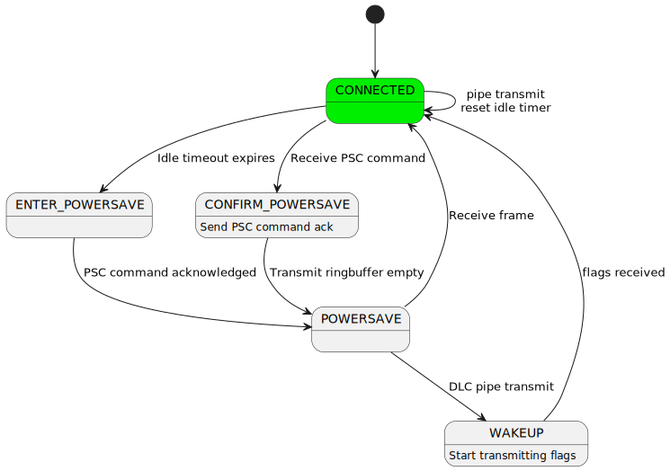

.. _modem:

Modem modules
#############

This service provides modules necessary to communicate with modems.

Modems are self-contained devices that implement the hardware and
software necessary to perform RF (Radio-Frequency) communication,
including GNSS, Cellular, WiFi etc.

The modem modules are inter-connected dynamically using
data-in/data-out pipes making them independently testable and
highly flexible, ensuring stability and scalability.

Modem pipe
**********

This module is used to abstract data-in/data-out communication over
a variety of mechanisms, like UART and CMUX DLCI channels, in a
thread-safe manner.

A modem backend will internally contain an instance of a modem_pipe
structure, alongside any buffers and additional structures required
to abstract away its underlying mechanism.

.. image:: images/modem_pipes.svg
        :alt: Modem pipes
        :align: center

The modem backend will return a pointer to its internal modem_pipe
structure when initialized, which will be used to interact with the
backend through the modem pipe API.

.. doxygengroup:: modem_pipe

Modem PPP
*********

This module defines and binds a L2 PPP network interface, described in
:ref:`net_l2_interface`, to a modem backend. The L2 PPP interface sends
and receives network packets. These network packets have to be wrapped
in PPP frames before being transported via a modem backend. This module
performs said wrapping.

.. doxygengroup:: modem_ppp

Modem CMUX
**********

This module is an implementation of CMUX following the 3GPP 27.010
specification. CMUX is a multiplexing protocol, allowing for multiple
bi-directional streams of data, called DLCI channels. The module
attaches to a single modem backend, exposing multiple modem backends,
each representing a DLCI channel.

Protocol defines simple framing for splitting each DLC into small chunks of data.

.. image:: images/cmux_frame.svg
        :alt: CMUX basic frame
        :align: center

Zephyr implements the basic frame type, with build-time configurable MTU size.

The module also implements power-saving using CMUX Power Saving Command (PSC) for
modems that support it. See the :ref:`cmux-power-saving` section below for more details.

.. doxygengroup:: modem_cmux

Modem pipelink
**************

This module is used to share modem pipes globally. This module aims to
decouple the creation and setup of modem pipes in device drivers from
the users of said pipes. See
:zephyr_file:`drivers/modem/modem_at_shell.c` and
:zephyr_file:`drivers/modem/modem_cellular.c` for examples of how to
use the modem pipelink between device driver and application.

.. doxygengroup:: modem_pipelink

Modem chat
**********

This module implements scripted AT command communication with a modem.
AT commands are organized into **scripts**, where each script is a
sequence of command–response exchanges. The module sends a command
string through a modem pipe and then waits for a response matching
one of the expected patterns. When a match is found, an optional
callback is invoked with parsed arguments.

Scripts are defined at build time using the :c:macro:`MODEM_CHAT_SCRIPT_DEFINE`
and :c:macro:`MODEM_CHAT_SCRIPT_CMDS_DEFINE` macros. Each script entry
pairs a request string with one or more :c:struct:`modem_chat_match`
patterns. Match patterns support argument parsing by specifying a
separator character (for example, ``","``), making it easy to extract
fields from responses such as ``+CSQ: 20,99``.

In addition to scripted exchanges, the module continuously monitors
the data stream for **unsolicited** responses — messages the modem
sends without a preceding command (for example, ``+CEREG:`` network
registration updates). These are handled by a separate set of match
patterns registered when the chat instance is initialized.

The chat module attaches to any modem pipe, so it can communicate
over a raw UART backend or over a CMUX DLCI channel interchangeably.

.. doxygengroup:: modem_chat

.. _cellular-modem:

Cellular Modem
**************

The generic cellular modem driver,
:zephyr_file:`drivers/modem/modem_cellular.c`, brings together all of
the modules described above to implement a complete, hardware-agnostic
cellular data connection. It exposes a standard Zephyr network
interface so that applications can use the :ref:`BSD sockets API <bsd_sockets_interface>`
without any modem-specific code.

Architecture overview
=====================

The driver assembles the modem modules into a layered pipe architecture:

#. **UART backend** — A :c:struct:`modem_backend_uart` instance provides
   the lowest-level modem pipe. It abstracts the physical UART
   peripheral into the modem pipe API, performing thread-safe,
   interrupt-driven transfers.

#. **CMUX** — The :c:struct:`modem_cmux` instance attaches to the UART
   pipe and multiplexes it into two DLCI channels, following the
   3GPP 27.010 specification.

#. **DLCI channel 1 (data)** — This pipe carries either AT command
   traffic during initialization, or PPP-framed IP data once the
   connection is established.

#. **DLCI channel 2 (commands)** — This pipe is dedicated to AT
   command traffic while the data connection is active, allowing the
   driver to query signal quality, registration status, and other
   parameters without interrupting the data flow.

#. **Modem chat** — A :c:struct:`modem_chat` instance executes AT
   command scripts. Before CMUX is started it attaches directly to the
   UART pipe; afterwards it moves to DLCI 1 for initialization scripts
   and then to DLCI 2 for periodic monitoring.

#. **Modem PPP** — A :c:struct:`modem_ppp` instance wraps Zephyr IP
   packets in PPP frames and sends them through DLCI 1. In the receive
   direction it strips the PPP framing and delivers packets to the
   network stack.

The simultaneous use of two DLCI channels is the key enabler: the
modem can transfer IP data at full speed on DLCI 1 while the driver
continues to exchange AT commands on DLCI 2 in the background.

Connection lifecycle
====================

The driver is built around an internal state machine that progresses
through the following phases:

Power-on and hardware reset
----------------------------

The driver pulses the modem reset and power GPIOs (if defined in the
Device Tree) and waits for the modem to become responsive.

Initial AT configuration
------------------------

The modem chat module attaches directly to the UART pipe and runs the
modem-specific ``init_chat_script``. This script typically disables
echo, queries the IMEI, model, firmware version, and configures
unsolicited response reporting. All communication at this stage is
plain AT over UART — CMUX is not yet active.

CMUX bring-up
--------------

After the init script succeeds the driver sends the ``AT+CMUX``
command to switch the modem into multiplexed mode. The CMUX module
attaches to the UART pipe and opens DLCI 1 and DLCI 2. From this
point all communication is framed inside CMUX.

APN configuration and dialing
------------------------------

The driver attaches the modem chat to DLCI 1 and runs a dynamically
built APN script (``AT+CGDCONT``) followed by the dial script
(``ATD*99#`` or equivalent). On success the modem enters data mode
on DLCI 1.

Data connection
----------------

The modem PPP module attaches to the DLCI 1 pipe, and the modem chat
moves to DLCI 2. The driver calls ``net_if_carrier_on()`` once a
``+CEREG`` (or ``+CREG`` / ``+CGREG``) unsolicited response indicates
that the modem has registered on the network.

At this point the Zephyr network stack negotiates a PPP session over
DLCI 1 and the application can use sockets normally. Meanwhile,
periodic chat scripts on DLCI 2 monitor signal quality and
registration status.

Shutdown
---------

The driver runs a shutdown script and pulses the power-off GPIO to
cleanly power down the modem. The state machine returns to the idle
state.

Adding support for a new modem
==============================

The generic cellular driver uses per-modem configuration supplied
through Device Tree compatible bindings and associated chat scripts.
Adding a new modem requires three artifacts:

#. A **Device Tree binding** that includes the common cellular modem
   base binding.

#. **Chat scripts** defining the AT command sequences for
   initialization, dialing, periodic monitoring, and (optionally)
   shutdown.

#. A **device instantiation macro** that ties the chat scripts and
   hardware configuration together.

The driver handles all pipe plumbing, CMUX management, PPP framing,
and state machine logic automatically.

Supported modems
----------------

The following modems are already supported in
:zephyr_file:`drivers/modem/modem_cellular.c`:

* Quectel BG95, BG96
* Quectel EG25-G, EG800Q
* SIMCom SIM7080, A76xx
* u-blox SARA-R4, SARA-R5, LARA-R6
* Sierra Wireless HL7800
* Telit ME910G1, ME310G1
* Nordic Semiconductor nRF91 SLM
* Sequans GM02S

Each supported modem is defined using the same set of macros
(``MODEM_CHAT_SCRIPT_CMDS_DEFINE``, ``MODEM_CHAT_SCRIPT_DEFINE``,
``MODEM_CELLULAR_DEFINE_INSTANCE``, etc.). Refer to
:zephyr_file:`drivers/modem/modem_cellular.c` for complete examples
of init, dial, periodic, and shutdown chat scripts. The common base
Device Tree properties shared by all modems are documented in
:zephyr_file:`dts/bindings/modem/zephyr,cellular-modem-device.yaml`.

Out-of-tree modem
-----------------

The driver macros and data structures are exported through
:zephyr_file:`include/zephyr/drivers/modem/modem_cellular.h`,
so a completely new modem can be defined **outside** the Zephyr tree —
for example in application source — without modifying any upstream
files. This is useful for fine-tuning AT command sequences for a
specific use case, or for developing support for a new modem before
submitting it upstream.

Start by creating a Device Tree binding that includes the common base
binding, then write a driver source file using the macros from
``modem_cellular.h``. The following three files are all that is needed.

**Device Tree binding** — ``app/dts/bindings/my,modem.yaml``:

.. code-block:: yaml

   compatible: "my,modem"

   include: zephyr,cellular-modem-device.yaml

**Device Tree overlay** — ``app.overlay`` (partial):

.. code-block:: devicetree

   &uart30 {
       modem: modem {
           compatible = "my,modem";
           status = "okay";
           mdm-power-gpios = <&gpio1 13 GPIO_ACTIVE_HIGH>;
       };
   };

**Driver source** — ``app/src/my_modem.c``:

.. code-block:: c

   #include <zephyr/drivers/modem/modem_cellular.h>
   #include <zephyr/device.h>

   MODEM_CHAT_MATCH_DEFINE(ok_match, "OK", "", NULL);
   MODEM_CHAT_MATCH_DEFINE(connect_match, "CONNECT", "", NULL);
   MODEM_CHAT_MATCHES_DEFINE(abort_matches,
       MODEM_CHAT_MATCH("ERROR", "", NULL),
       MODEM_CHAT_MATCH("NO CARRIER", "", NULL));

   /* Init script — configure the modem, enable unsolicited LTE
    * registration notifications, then switch to CMUX.
    */
   MODEM_CHAT_SCRIPT_CMDS_DEFINE(init_chat_script_cmds,
       MODEM_CHAT_SCRIPT_CMD_RESP("ATE0",              ok_match),
       MODEM_CHAT_SCRIPT_CMD_RESP("AT+CEREG=1",        ok_match),
       MODEM_CHAT_SCRIPT_CMD_RESP("AT+CMUX=0,0,5,127", ok_match));

   MODEM_CHAT_SCRIPT_DEFINE(init_chat_script, init_chat_script_cmds,
       abort_matches, modem_cellular_chat_callback_handler, 1);

   /* Dial script — enable the radio and open data mode */
   MODEM_CHAT_SCRIPT_CMDS_DEFINE(dial_chat_script_cmds,
       MODEM_CHAT_SCRIPT_CMD_RESP("AT+CFUN=1", ok_match),
       MODEM_CHAT_SCRIPT_CMD_RESP("ATD*99#",   connect_match));

   MODEM_CHAT_SCRIPT_DEFINE(dial_chat_script, dial_chat_script_cmds,
       abort_matches, modem_cellular_chat_callback_handler, 60);

   /* Macro for defining a DT instance */
   #define MY_MODEM_DEVICE(inst)                                                   \
       MODEM_DT_INST_PPP_DEFINE(inst,                                              \
           MODEM_CELLULAR_INST_NAME(ppp, inst), NULL, 98, 1500, 64);               \
                                                                                   \
       static struct modem_cellular_data                                           \
           MODEM_CELLULAR_INST_NAME(data, inst) = {                                \
           .chat_delimiter = "\r",                                                 \
           .chat_filter = "\n",                                                    \
           .ppp = &MODEM_CELLULAR_INST_NAME(ppp, inst),                            \
       };                                                                          \
                                                                                   \
       MODEM_CELLULAR_DEFINE_AND_INIT_USER_PIPES(inst,                             \
           (user_pipe_0, 3), (user_pipe_1, 4))                                     \
                                                                                   \
       MODEM_CELLULAR_DEFINE_INSTANCE(inst,                                        \
           1000, 100, 5000, 5000, false, NULL,                                     \
           &init_chat_script, &dial_chat_script, NULL, NULL)

   #define DT_DRV_COMPAT my_modem
   DT_INST_FOREACH_STATUS_OKAY(MY_MODEM_DEVICE)
   #undef DT_DRV_COMPAT

The example above is minimal but enough to start a PPP connection on a generic cellular modem.
Refer to :zephyr_file:`drivers/modem/modem_cellular.c` for more complete examples.

.. _cmux-power-saving:

CMUX Power Saving
*****************

The 3GPP TS 27.010 specifies a power saving mechanism for CMUX which can be used in
Zephyr when the modem supports it.

The power saving mechanism is covered in the following sections on the specification:

* 5.2.5 Inter-frame Fill
* 5.4.6.3.2 Power Saving Control (PSC) message
* 5.4.7 Power Control and Wake-up Mechanisms

The power saving mechanism allows runtime power management for the UART device
used by the CMUX module. When there is no data to be sent or received on any
DLCI channel, the CMUX module will enter the idle state after a configurable
timeout. In the idle state, the CMUX module will send a Power Saving Control message to the
modem, requesting it to enter a low power state. The CMUX module may then
close the pipe device, allowing the UART device to be powered down if
runtime power management is enabled.

When data is to be sent or received on any DLCI channel, the CMUX module
will exit the idle state and wakes the modem up by sending flag characters
until it receives a flag character from the modem.

Some modems allow UART to be powered down only when the DTR (Data Terminal Ready)
signal is de-asserted. In this case, a UART device with DTR support can be used
with the CMUX module to control the DTR signal based on the power state of the UART.

Waking up on incoming data when UART is powered down requires a modem that supports
RING signal to wake up the host.
The RING signal is handled by the modem driver and it opens the pipe device when
the RING signal is detected, allowing the CMUX module to wake up the modem and
process incoming data.

The :zephyr_file:`subsys/modem/modem_cmux.c` module implements the power saving mechanism using the following state machine.

Within a connected state, ``modem_cmux_process_received_byte()`` is required to reply repeated flag characters as described in 5.2.5 Inter-frame Fill at the specification.
Idle timer is kept running and cleared on every sent or received frame. Timer expiry will initiate transitioning to power saving modes.

Within the POWERSAVE state all DLC pipes remain open but the pipe towards UART is blocked or closed, so all data is buffered within CMUX ringbuffers to wait for waking up.
Within this state, repeated flag characters are also replied to allow remote end proceed with wake-up procedure as described in 5.4.7.
If pipe is closed, it allows UART device to be powered down if runtime power management is enabled.

When idle timer expires on CONNECTED state, CMUX state machine blocks all DLC pipes and sends PSC command for remote end to initiate transitioning to POWERSAVE state.
When PSC command is replied, CMUX transitions to POWERSAVE mode.

When within the CONNECTED state, the remote end may send a PSC command to initiate the transitioning to power saving mode. CMUX blocks all DLC pipes and sends a PSC response.
When TX buffers are emptied, CMUX enters the POWERSAVE state.

When any of DLC pipes try to transmit data during POWERSAVE state, CMUX buffers it and moves to WAKEUP state that initiates wake-up procedure as specified in 5.4.7 by sending repeated stream of flag characters.
Remote end replies the flag characters to indicate it is ready to receive data. CMUX then stops sending flag characters and moves back to CONNECTED state, resuming normal operation.

The CMUX power saving mechanism can be configured using the following Device Tree properties:

.. code-block:: yaml

  cmux-enable-runtime-power-save:
    type: boolean
    description: Enable runtime power saving using CMUX PSC commands.
                 This requires modem to support CMUX and PSC commands while keeping the data
                 connection active.
  cmux-close-pipe-on-power-save:
    type: boolean
    description: Close the modem pipe when entering power save mode.
                When runtime power management is enabled, this closes the UART.
                This requires modem to support waking up the UART using RING signal.
  cmux-idle-timeout-ms:
    type: int
    description: Time in milliseconds after which CMUX will enter power save mode.
    default: 10000

Example Device Tree setup for CMUX with power saving:

.. code-block:: devicetree

  &uart1 {
    status = "okay";
    zephyr,pm-device-runtime-auto;

    uart_dtr: uart-dtr {
      compatible = "zephyr,uart-dtr";
      dtr-gpios = <&interface_to_nrf9160 4 GPIO_ACTIVE_LOW>;
      status = "okay";
      zephyr,pm-device-runtime-auto;

      modem: modem {
        compatible = "nordic,nrf91-slm";
        status = "okay";
        mdm-ring-gpios = <&interface_to_nrf9160 5 (GPIO_PULL_UP | GPIO_ACTIVE_LOW)>;
        zephyr,pm-device-runtime-auto;
        cmux-enable-runtime-power-save;
        cmux-close-pipe-on-power-save;
        cmux-idle-timeout-ms = <5000>;
      };
    };
  };

The above example shows a UART device with DTR support being used by a modem that supports CMUX and PSC commands. The DTR signal is used to control the power state of the UART.
The RING signal from the modem is used to wake up the modem subsystem when it is powered down.
