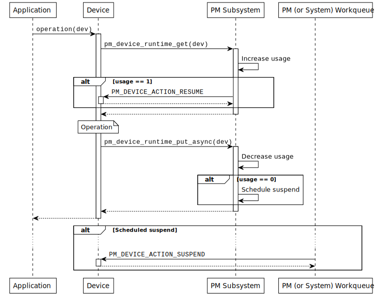

.. _pm-device-runtime:

Device Runtime Power Management
###############################

Introduction
************

The device runtime power management (PM) framework is an active power management
mechanism which reduces the overall system power consumption by suspending the
devices which are idle or not used independently of the system state. It can be
enabled by setting :kconfig:option:`CONFIG_PM_DEVICE_RUNTIME`. In this model the device
driver is responsible to indicate when it needs the device and when it does not.
This information is used to determine when to suspend or resume a device based
on usage count.

When device runtime power management is enabled on a device, its state will be
initially set to a :c:enumerator:`PM_DEVICE_STATE_SUSPENDED` indicating it is
not used. On the first device request, it will be resumed and so put into the
:c:enumerator:`PM_DEVICE_STATE_ACTIVE` state. The device will remain in this
state until it is no longer used. At this point, the device will be suspended
until the next device request. If the suspension is performed synchronously the
device will be immediately put into the
:c:enumerator:`PM_DEVICE_STATE_SUSPENDED` state, whereas if it is performed
asynchronously, it will be put into the
:c:enumerator:`PM_DEVICE_STATE_SUSPENDING` state first and then into the
:c:enumerator:`PM_DEVICE_STATE_SUSPENDED` state when the action is run.

.. graphviz::
   :caption: Device states and transitions

    digraph {
        node [shape=box];
        init [shape=point];

        SUSPENDED [label=PM_DEVICE_STATE_SUSPENDED];
        ACTIVE [label=PM_DEVICE_STATE_ACTIVE];
        SUSPENDING [label=PM_DEVICE_STATE_SUSPENDING];

        init -> SUSPENDED;
        SUSPENDED -> ACTIVE;
        ACTIVE -> SUSPENDED;
        ACTIVE -> SUSPENDING [constraint=false]
        SUSPENDING -> SUSPENDED [constraint=false];
        SUSPENDED -> SUSPENDING [style=invis];
        SUSPENDING -> ACTIVE [style=invis];
    }

The device runtime power management framework has been designed to minimize
devices power consumption with minimal application work. Device drivers are
responsible for indicating when they need the device to be operational and
when they do not. Therefore, applications can not manually suspend or resume a
device. An application can, however, decide when to disable or enable runtime
power management for a device. This can be useful, for example, if an
application wants a particular device to be always active.

Design principles
*****************

When runtime PM is enabled on a device it will no longer be resumed or suspended
during system power transitions. Instead, the device is fully responsible to
indicate when it needs a device and when it does not. The device runtime PM API
uses reference counting to keep track of device's usage. This allows the API to
determine when a device needs to be resumed or suspended. The API uses the *get*
and *put* terminology to indicate when a device is needed or not, respectively.
This mechanism plays a key role when we account for device dependencies. For
example, if a bus device is used by multiple sensors, we can keep the bus active
until the last sensor has finished using it.

.. note::

    As of today, the device runtime power management API does not manage device
    dependencies. This effectively means that, if a device depends on other
    devices to operate (e.g. a sensor may depend on a bus device), the bus will
    be resumed and suspended on every transaction. In general, it is more
    efficient to keep parent devices active when their children are used, since
    the children may perform multiple transactions in a short period of time.
    Until this feature is added, devices can manually *get* or *put* their
    dependencies.

The :c:func:`pm_device_runtime_get` function can be used by a device driver to
indicate it *needs* the device to be active or operational. This function will
increase device usage count and resume the device if necessary. Similarly, the
:c:func:`pm_device_runtime_put` function can be used to indicate that the device
is no longer needed. This function will decrease the device usage count and
suspend the device if necessary. It is worth to note that in both cases, the
operation is carried out synchronously. The sequence diagram shown below
illustrates how a device can use this API and the expected sequence of events.

.. figure:: images/devr-sync-ops.svg

    Synchronous operation on a single device

The synchronous model is as simple as it gets. However, it may introduce
unnecessary delays since the application will not get the operation result until
the device is suspended (in case device is no longer used). It will likely not
be a problem if the operation is fast, e.g. a register toggle. However, the
situation will not be the same if suspension involves sending packets through a
slow bus. For this reason the device drivers can also make use of the
:c:func:`pm_device_runtime_put_async` function. This function will schedule
the suspend operation, again, if device is no longer used. The suspension will
then be carried out when the system work queue gets the chance to run. The
sequence diagram shown below illustrates this scenario.

    Asynchronous operation on a single device

Implementation guidelines
*************************

In a first place, a device driver needs to implement the PM action callback used
by the PM subsystem to suspend or resume devices.

.. code-block:: c

    static int mydev_pm_action(const struct device *dev,
                               enum pm_device_action *action)
    {
        switch (action) {
        case PM_DEVICE_ACTION_SUSPEND:
            /* suspend the device */
            ...
            break;
        case PM_DEVICE_ACTION_RESUME:
            /* resume the device */
            ...
            break;
        default:
            return -ENOTSUP;
        }

        return 0;
    }

The PM action callback calls are serialized by the PM subsystem, therefore, no
special synchronization is required.

To enable device runtime power management on a device, the driver needs to call
:c:func:`pm_device_runtime_enable` at initialization time. Note that this
function will suspend the device if its state is
:c:enumerator:`PM_DEVICE_STATE_ACTIVE`. In case the device is physically
suspended, the init function should call
:c:func:`pm_device_init_suspended` before calling
:c:func:`pm_device_runtime_enable`.

.. code-block:: c

    /* device driver initialization function */
    static int mydev_init(const struct device *dev)
    {
        int ret;
        ...

        /* OPTIONAL: mark device as suspended if it is physically suspended */
        pm_device_init_suspended(dev);

        /* enable device runtime power management */
        ret = pm_device_runtime_enable(dev);
        if ((ret < 0) && (ret != -ENOSYS)) {
            return ret;
        }
    }

Device runtime power management can also be automatically enabled on a device
instance by adding the ``zephyr,pm-device-runtime-auto`` flag onto the corresponding
devicetree node. If enabled, :c:func:`pm_device_runtime_enable` is called immediately
after the ``init`` function of the device runs and returns successfully.

.. code-block:: dts

    foo {
        /* ... */
        zephyr,pm-device-runtime-auto;
    };

Assuming an example device driver that implements an ``operation`` API call, the
*get* and *put* operations could be carried out as follows:

.. code-block:: c

    static int mydev_operation(const struct device *dev)
    {
        int ret;

        /* "get" device (increases usage count, resumes device if suspended) */
        ret = pm_device_runtime_get(dev);
        if (ret < 0) {
            return ret;
        }

        /* do something with the device */
        ...

        /* "put" device (decreases usage count, suspends device if no more users) */
        return pm_device_runtime_put(dev);
    }

In case the suspend operation is *slow*, the device driver can use the
asynchronous API:

.. code-block:: c

    static int mydev_operation(const struct device *dev)
    {
        int ret;

        /* "get" device (increases usage count, resumes device if suspended) */
        ret = pm_device_runtime_get(dev);
        if (ret < 0) {
            return ret;
        }

        /* do something with the device */
        ...

        /* "put" device (decreases usage count, schedule suspend if no more users) */
        return pm_device_runtime_put_async(dev);
    }
