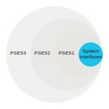
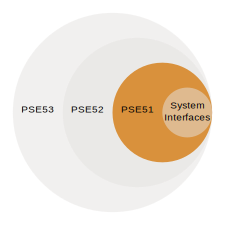
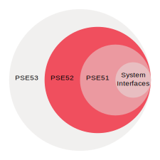
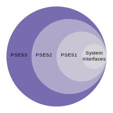

.. _posix_aep:

POSIX Application Environment Profiles (AEP)
############################################

Although inactive, `IEEE 1003.13-2003`_ defined a number of AEP that inspired the modern
subprofiling options of `IEEE 1003.1-2017`_. The single-purpose realtime system profiles
are listed below, for reference, in terms that agree with the current POSIX-1 standard. PSE54
is not considered at this time.

System Interfaces
=================

The required POSIX :ref:`System Interfaces<posix_system_interfaces_required>` are supported for
each Application Environment Profile.

    System Interfaces

.. _posix_aep_pse51:

Minimal Realtime System Profile (PSE51)
=======================================

The *Minimal Realtime System Profile* (PSE51) includes all of the
:ref:`System Interfaces<posix_system_interfaces_required>` along with several additional features.

    Minimal Realtime System Profile (PSE51)

.. Conforming implementations shall define _POSIX_AEP_REALTIME_MINIMAL to the value 200312L

.. csv-table:: PSE51 System Interfaces
   :header: Symbol, Support, Remarks
   :widths: 50, 10, 50

    _POSIX_AEP_REALTIME_MINIMAL, -1,

.. csv-table:: PSE51 Option Groups
   :header: Symbol, Support, Remarks
   :widths: 50, 10, 50

    :ref:`POSIX_C_LANG_JUMP <posix_option_group_c_lang_jump>`, yes,
    :ref:`POSIX_C_LANG_SUPPORT <posix_option_group_c_lang_support>`, yes,
    :ref:`POSIX_DEVICE_IO <posix_option_group_device_io>`,,
    :ref:`POSIX_SIGNALS <posix_option_group_signals>`,,
    :ref:`POSIX_SINGLE_PROCESS <posix_option_group_single_process>`, yes,
    :ref:`POSIX_THREADS_BASE <posix_option_group_threads_base>`, yes,
    :ref:`XSI_THREADS_EXT <posix_option_group_xsi_threads_ext>`, yes,

.. csv-table:: PSE51 Option Requirements
   :header: Symbol, Support, Remarks
   :widths: 50, 10, 50

    :ref:`_POSIX_FSYNC <posix_option_fsync>`, 200809L, :kconfig:option:`CONFIG_POSIX_FSYNC`
    :ref:`_POSIX_MEMLOCK <posix_option_memlock>`, -1,
    :ref:`_POSIX_MEMLOCK_RANGE <posix_option_memlock_range>`, -1,
    :ref:`_POSIX_MONOTONIC_CLOCK <posix_option_monotonic_clock>`, 200809L, :kconfig:option:`CONFIG_POSIX_CLOCK`
    :ref:`_POSIX_SHARED_MEMORY_OBJECTS <posix_shared_memory_objects>`, -1,
    :ref:`_POSIX_SYNCHRONIZED_IO <posix_option_synchronized_io>`, -1,
    :ref:`_POSIX_THREAD_ATTR_STACKADDR<posix_option_thread_attr_stackaddr>`, 200809L, :kconfig:option:`CONFIG_PTHREAD`
    :ref:`_POSIX_THREAD_ATTR_STACKSIZE<posix_option_thread_attr_stacksize>`, 200809L, :kconfig:option:`CONFIG_PTHREAD`
    :ref:`_POSIX_THREAD_CPUTIME <posix_option_thread_cputime>`, -1,
    _POSIX_THREAD_PRIO_INHERIT, 200809L, :kconfig:option:`CONFIG_PTHREAD_MUTEX`
    _POSIX_THREAD_PRIO_PROTECT, -1,
    :ref:`_POSIX_THREAD_PRIORITY_SCHEDULING<posix_option_thread_priority_scheduling>`, 200809L, :kconfig:option:`CONFIG_POSIX_PRIORITY_SCHEDULING` (will fail with ``ENOSYS``:ref:`†<posix_undefined_behaviour>`)
    _POSIX_THREAD_SPORADIC_SERVER, -1,

.. _posix_aep_pse52:

Realtime Controller System Profile (PSE52)
==========================================

The *Realtime Controller System Profile* (PSE52) includes all features from PSE51 and the
:ref:`System Interfaces<posix_system_interfaces_required>`.

    Realtime Controller System Profile (PSE52)

.. Conforming implementations shall define _POSIX_AEP_REALTIME_CONTROLLER to the value 200312L

.. csv-table:: PSE52 System Interfaces
   :header: Symbol, Support, Remarks
   :widths: 50, 10, 50

    _POSIX_AEP_REALTIME_CONTROLLER, -1,

.. csv-table:: PSE52 Option Groups
   :header: Symbol, Support, Remarks
   :widths: 50, 10, 50

    :ref:`POSIX_C_LANG_MATH <posix_option_group_c_lang_math>`, yes,
    :ref:`POSIX_FD_MGMT <posix_option_group_fd_mgmt>`,,
    :ref:`POSIX_FILE_SYSTEM <posix_option_group_file_system>`,,

.. csv-table:: PSE52 Option Requirements
   :header: Symbol, Support, Remarks
   :widths: 50, 10, 50

    :ref:`_POSIX_MESSAGE_PASSING <posix_option_message_passing>`, 200809L, :kconfig:option:`CONFIG_POSIX_MQUEUE`
    _POSIX_TRACE, -1,
    _POSIX_TRACE_EVENT_FILTER, -1,
    _POSIX_TRACE_LOG, -1,

.. _posix_aep_pse53:

Dedicated Realtime System Profile (PSE53)
=========================================

The *Dedicated Realtime System Profile* (PSE53) includes all features from PSE52, PSE51, and the
:ref:`System Interfaces<posix_system_interfaces_required>`.

    Dedicated Realtime System Profile (PSE53)

.. Conforming implementations shall define _POSIX_AEP_REALTIME_DEDICATED to the value 200312L

.. csv-table:: PSE53 System Interfaces
   :header: Symbol, Support, Remarks
   :widths: 50, 10, 50

    _POSIX_AEP_REALTIME_DEDICATED, -1,

.. csv-table:: PSE53 Option Groups
   :header: Symbol, Support, Remarks
   :widths: 50, 10, 50

    POSIX_MULTI_PROCESS,, :ref:`†<posix_undefined_behaviour>`
    :ref:`POSIX_NETWORKING <posix_option_group_networking>`, yes,
    :ref:`POSIX_PIPE <posix_option_group_pipe>`,,
    :ref:`POSIX_SIGNAL_JUMP <posix_option_group_signal_jump>`,,

.. csv-table:: PSE53 Option Requirements
   :header: Symbol, Support, Remarks
   :widths: 50, 10, 50

    _POSIX_CPUTIME, -1,
    _POSIX_PRIORITIZED_IO, -1,
    :ref:`_POSIX_PRIORITY_SCHEDULING <posix_option_priority_scheduling>`, -1,
    _POSIX_RAW_SOCKETS, 200809L, :kconfig:option:`CONFIG_NET_SOCKETS`
    _POSIX_SPAWN, -1,
    _POSIX_SPORADIC_SERVER, -1,

.. _IEEE 1003.1-2017: https://standards.ieee.org/ieee/1003.1/7101/
.. _IEEE 1003.13-2003: https://standards.ieee.org/ieee/1003.13/3322/
