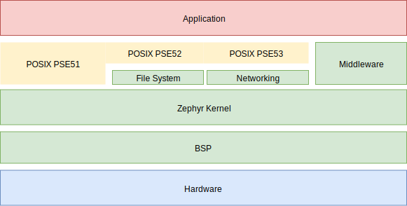

.. _posix_overview:

Overview
########

The Portable Operating System Interface (POSIX) is a family of standards specified by the
`IEEE Computer Society`_ for maintaining compatibility between operating systems. Zephyr
implements a subset of the standard POSIX API specified by `IEEE 1003.1-2017`_ (also known as
POSIX-1.2017).

    POSIX support in Zephyr

.. note::
    This page does not document Zephyr's :ref:`POSIX architecture<Posix arch>`, which is used to
    run Zephyr as a native application under the host operating system for prototyping,
    test, and diagnostic purposes.

With the POSIX support available in Zephyr, an existing POSIX conformant
application can be ported to run on the Zephyr kernel, and therefore leverage
Zephyr features and functionality. Additionally, a library designed to be
POSIX conformant can be ported to Zephyr kernel based applications with no changes.

The POSIX API is an increasingly popular OSAL (operating system abstraction layer) for IoT and
embedded applications, as can be seen in Zephyr, AWS:FreeRTOS, TI-RTOS, and NuttX.

Benefits of POSIX support in Zephyr include:

- Offering a familiar API to non-embedded programmers, especially from Linux
- Enabling reuse (portability) of existing libraries based on POSIX APIs
- Providing an efficient API subset appropriate for small (MCU) embedded systems

.. _posix_subprofiles:

POSIX Subprofiles
=================

While Zephyr supports running multiple :ref:`thread <threads_v2>` (possibly in an
:ref:`SMP <smp_arch>` configuration), as well as
:ref:`Virtual Memory and MMUs <memory_management_api>`, Zephyr code and data normally share a
common address space. The Zephyr kernel executable code and the application executable code are
typically compiled into the same binary artifact. From that perspective, Zephyr apps can be seen
as running in the context of a single process.

While multi-purpose operating systems (OS) offer full POSIX conformance, Real-Time Operating
Systems (RTOS) such as Zephyr typically serve a fixed-purpose, have limited hardware resources,
and experience limited user interaction. In such systems, full POSIX conformance can be
impractical and unnecessary.

For that reason, POSIX defined the following :ref:`Application Environment Profiles (AEP)<posix_aep>`
as part of `IEEE 1003.13-2003`_ (also known as POSIX.13-2003).

* Minimal Realtime System Profile (:ref:`PSE51 <posix_aep_pse51>`)
* Realtime Controller System Profile (:ref:`PSE52 <posix_aep_pse52>`)
* Dedicated Realtime System Profile (:ref:`PSE53 <posix_aep_pse53>`)
* Multi-Purpose Realtime System (PSE54)

POSIX.13-2003 AEP were formalized in 2003 via "Units of Functionality" but the specification is now
inactive (for reference only). Nevertheless, the intent is still captured as part of POSIX-1.2017
via :ref:`Options<posix_options>` and :ref:`Option Groups<posix_option_groups>`.

For more information, please see `IEEE 1003.1-2017, Section E, Subprofiling Considerations`_.

.. _posix_apps:

POSIX Applications in Zephyr
============================

A POSIX app in Zephyr is :ref:`built like any other app<application>` and therefore requires the
usual :file:`prj.conf`, :file:`CMakeLists.txt`, and source code. For example, the app below
leverages the ``nanosleep()`` and ``perror()`` POSIX functions.

.. code-block:: cfg
   :caption: `prj.conf` for a simple POSIX app in Zephyr

    CONFIG_POSIX_API=y

.. code-block:: c
   :caption: A simple app that uses Zephyr's POSIX API

    #include <stddef.h>
    #include <stdio.h>
    #include <time.h>

    void megasleep(size_t megaseconds)
    {
        struct timespec ts = {
            .tv_sec = megaseconds * 1000000,
            .tv_nsec = 0,
        };

        printf("See you in a while!\n");
        if (nanosleep(&ts, NULL) == -1) {
            perror("nanosleep");
        }
    }

    int main()
    {
        megasleep(42);
        return 0;
    }

For more examples of POSIX applications, please see the :ref:`POSIX sample applications<posix-samples>`.

.. _posix_config:

Configuration
=============

Like most features in Zephyr, POSIX features are
:ref:`highly configurable<zephyr_intro_configurability>` but disabled by default. Users must
explicitly choose to enable POSIX options via :ref:`Kconfig<kconfig>` selection. Indeed, there are
:ref:`many Kconfig options in Zephyr<posix_kconfig_options>` for the POSIX API to allow for
feature selection at various levels of granularity.

Alternatively, users may enable one of the Kconfig options below as a shortcut to enable multiple
:ref:`Option Groups<posix_option_groups>`.

* :kconfig:option:`CONFIG_POSIX_API`
* :kconfig:option:`CONFIG_PTHREAD_IPC`

.. note::
    Since the POSIX environment in Zephyr is fully configurable via :ref:`Kconfig<kconfig>`,
    configurations that require modifying features should not be made if strict compliance is
    required (POSIX-1.2017, section 2.1.3.1).

..
    TODO: create Kconfig shortcuts for PSE51, PSE52, and PSE53

.. _IEEE: https://www.ieee.org/
.. _IEEE Computer Society: https://www.computer.org/
.. _IEEE 1003.1-2017: https://standards.ieee.org/ieee/1003.1/7101/
.. _IEEE 1003.13-2003: https://standards.ieee.org/ieee/1003.13/3322/
.. _IEEE 1003.1-2017, Section E, Subprofiling Considerations:
    https://pubs.opengroup.org/onlinepubs/9699919799/xrat/V4_subprofiles.html
