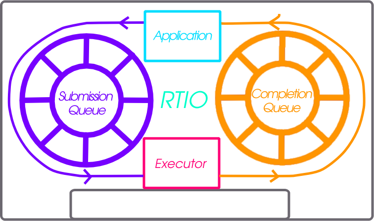

.. _rtio:

Real Time I/O (RTIO)
####################

.. contents::
  :local:
  :depth: 2

RTIO provides a framework for doing asynchronous operation chains with event
driven I/O. This section covers the RTIO API, queues, executor, iodev,
and common usage patterns with peripheral devices.

RTIO takes a lot of inspiration from Linux's io_uring in its operations and API
as that API matches up well with hardware transfer queues and descriptions such as
DMA transfer lists.

Problem
*******

An application wishing to do complex DMA or interrupt driven operations today
in Zephyr requires direct knowledge of the hardware and how it works. There is
no understanding in the DMA API of other Zephyr devices and how they relate.

This means doing complex audio, video, or sensor streaming requires direct
hardware knowledge or leaky abstractions over DMA controllers. Neither is ideal.

To enable asynchronous operations, especially with DMA, a description of what
to do rather than direct operations through C and callbacks is needed. Enabling
DMA features such as channels with priority, and sequences of transfers requires
more than a simple list of descriptions.

Using DMA and/or interrupt driven I/O shouldn't dictate whether or not the
call is blocking or not.

Inspiration, introducing io_uring
*********************************

It's better not to reinvent the wheel (or ring in this case) and io_uring as an
API from the Linux kernel provides a winning model. In io_uring there are two
lock-free ring buffers acting as queues shared between the kernel and a userland
application. One queue for submission entries which may be chained and flushed to
create concurrent sequential requests. A second queue for completion queue events.
Only a single syscall is actually required to execute many operations, the
io_uring_submit call. This call may block the caller when a number of
operations to wait on is given.

This model maps well to DMA and interrupt driven transfers. A request to do a
sequence of operations in an asynchronous way directly relates
to the way hardware typically works with interrupt driven state machines
potentially involving multiple peripheral IPs like bus and DMA controllers.

Submission Queue
****************

The submission queue (sq), is the description of the operations
to perform in concurrent chains.

For example imagine a typical SPI transfer where you wish to write a
register address to then read from. So the sequence of operations might be...

   1. Chip Select
   2. Clock Enable
   3. Write register address into SPI transmit register
   4. Read from the SPI receive register into a buffer
   5. Disable clock
   6. Disable Chip Select

If anything in this chain of operations fails give up. Some of those operations
can be embodied in a device abstraction that understands a read or write
implicitly means setup the clock and chip select. The transactional nature of
the request also needs to be embodied in some manner. Of the operations above
perhaps the read could be done using DMA as its large enough make sense. That
requires an understanding of how to setup the device's particular DMA to do so.

The above sequence of operations is embodied in RTIO as chain of
submission queue entries (sqe). Chaining is done by setting a bitflag in
an sqe to signify the next sqe must wait on the current one.

Because the chip select and clocking is common to a particular SPI controller
and device on the bus it is embodied in what RTIO calls an iodev.

Multiple operations against the same iodev are done in the order provided as
soon as possible. If two operation chains have varying points using the same
device its possible one chain will have to wait for another to complete.

Completion Queue
****************

In order to know when a sqe has completed there is a completion
queue (cq) with completion queue events (cqe). A sqe once completed results in
a cqe being pushed into the cq. The ordering of cqe may not be the same order of
sqe. A chain of sqe will however ensure ordering and failure cascading.

Other potential schemes are possible but a completion queue is a well trod
idea with io_uring and other similar operating system APIs.

Executor
********

The RTIO executor is a low overhead concurrent I/O task scheduler. It ensures
certain request flags provide the expected behavior. It takes a list of
submissions working through them in order. Various flags allow for changing the
behavior of how submissions are worked through. Flags to form in order chains of
submissions, transactional sets of submissions, or create multi-shot
(continuously producing) requests are all possible!

IO Device
*********

Turning submission queue entries (sqe) into completion queue events (cqe) is the
job of objects implementing the iodev (IO device) API. This API accepts requests
in the form of the iodev submit API call. It is the io devices job to work
through its internal queue of submissions and convert them into completions. In
effect every io device can be viewed as an independent, event driven actor like
object, that accepts a never ending queue of I/O like requests. How the iodev
does this work is up to the author of the iodev, perhaps the entire queue of
operations can be converted to a set of DMA transfer descriptors, meaning the
hardware does almost all of the real work.

Cancellation
************

Canceling an already queued operation is possible but not guaranteed. If the
SQE has not yet started, it's likely that a call to :c:func:`rtio_sqe_cancel`
will remove the SQE and never run it. If, however, the SQE already started
running, the cancel request will be ignored.

Memory pools
************

In some cases requests to read may not know how much data will be produced.
Alternatively, a reader might be handling data from multiple io devices where
the frequency of the data is unpredictable. In these cases it may be wasteful
to bind memory to in flight read requests. Instead with memory pools the memory
to read into is left to the iodev to allocate from a memory pool associated with
the RTIO context that the read was associated with. To create such an RTIO
context the :c:macro:`RTIO_DEFINE_WITH_MEMPOOL` can be used. It allows creating
an RTIO context with a dedicated pool of "memory blocks" which can be consumed by
the iodev. Below is a snippet setting up the RTIO context with a memory pool.
The memory pool has 128 blocks, each block has the size of 16 bytes, and the data
is 4 byte aligned.

.. code-block:: C

  #include <zephyr/rtio/rtio.h>

  #define SQ_SIZE       4
  #define CQ_SIZE       4
  #define MEM_BLK_COUNT 128
  #define MEM_BLK_SIZE  16
  #define MEM_BLK_ALIGN 4

  RTIO_DEFINE_WITH_MEMPOOL(rtio_context,
      SQ_SIZE, CQ_SIZE, MEM_BLK_COUNT, MEM_BLK_SIZE, MEM_BLK_ALIGN);

When a read is needed, the caller simply needs to replace the call
:c:func:`rtio_sqe_prep_read` (which takes a pointer to a buffer and a length)
with a call to :c:func:`rtio_sqe_prep_read_with_pool`. The iodev requires
only a small change which works with both pre-allocated data buffers as well as
the mempool. When the read is ready, instead of getting the buffers directly
from the :c:struct:`rtio_iodev_sqe`, the iodev should get the buffer and count
by calling :c:func:`rtio_sqe_rx_buf` like so:

.. code-block:: C

  uint8_t *buf;
  uint32_t buf_len;
  int rc = rtio_sqe_rx_buff(iodev_sqe, MIN_BUF_LEN, DESIRED_BUF_LEN, &buf, &buf_len);

  if (rc != 0) {
    LOG_ERR("Failed to get buffer of at least %u bytes", MIN_BUF_LEN);
    return;
  }

Finally, the consumer will be able to access the allocated buffer via
:c:func:`rtio_cqe_get_mempool_buffer`.

.. code-block:: C

  uint8_t *buf;
  uint32_t buf_len;
  int rc = rtio_cqe_get_mempool_buffer(&rtio_context, &cqe, &buf, &buf_len);

  if (rc != 0) {
    LOG_ERR("Failed to get mempool buffer");
    return rc;
  }

  /* Release the cqe events (note that the buffer is not released yet */
  rtio_cqe_release_all(&rtio_context);

  /* Do something with the memory */

  /* Release the mempool buffer */
  rtio_release_buffer(&rtio_context, buf);

When to Use
***********

RTIO is useful in cases where concurrent or batch like I/O flows are useful.

From the driver/hardware perspective the API enables batching of I/O requests, potentially in an optimal way.
Many requests to the same SPI peripheral for example might be translated to hardware command queues or DMA transfer
descriptors entirely. Meaning the hardware can potentially do more than ever.

There is a small cost to each RTIO context and iodev. This cost could be weighed
against using a thread for each concurrent I/O operation or custom queues and
threads per peripheral. RTIO is much lower cost than that.

Supported Buses
***************

To check if your bus supports RTIO natively, you can check the driver API implementation, if the
driver implements the ``iodev_submit`` function of the bus API, then RTIO is supported. If the
driver doesn't support the RTIO APIs, it will set the submit function to
``i2c_iodev_submit_fallback``.

I2C buses have a default implementation which allows apps to leverage the RTIO work queue while
vendors implement the submit function. With this queue, any I2C bus driver that does not implement
the ``iodev_submit`` function will defer to a work item which will perform a blocking I2C
transaction. To change the pool size, set a different value to
:kconfig:option:`CONFIG_RTIO_WORKQ_POOL_ITEMS`.

API Reference
*************

.. doxygengroup:: rtio
