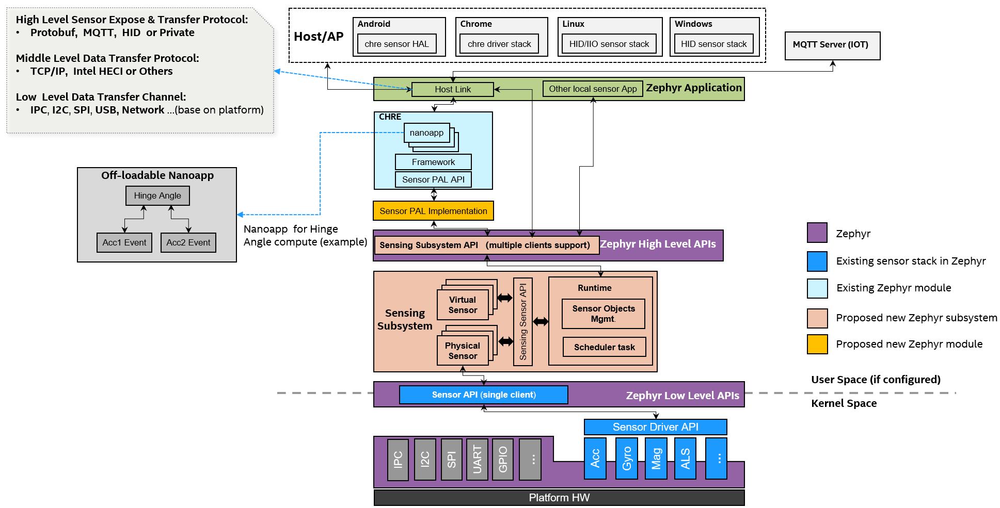
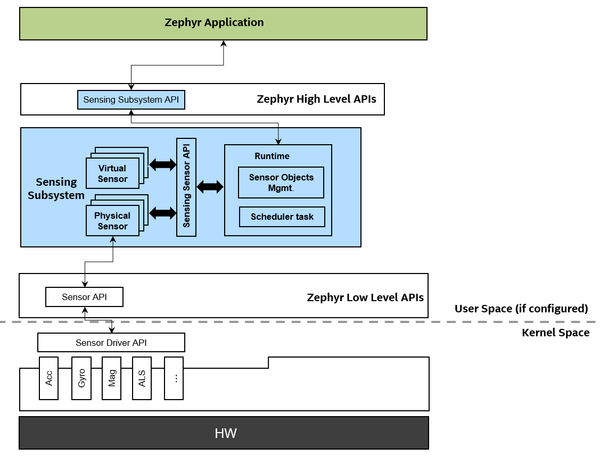
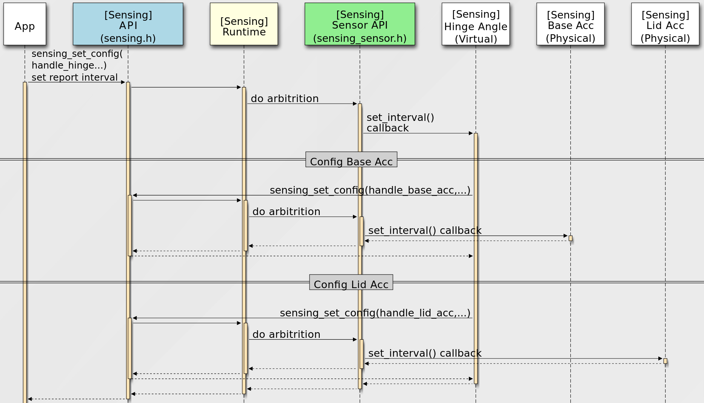
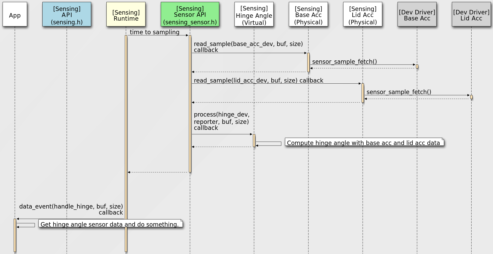
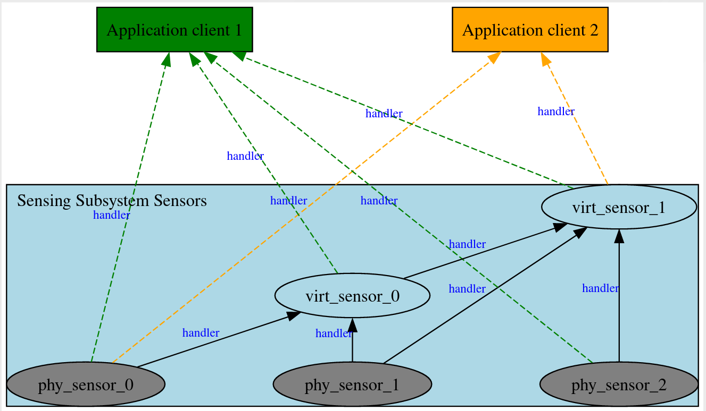

.. _sensing_api:

Sensing Subsystem
########################

.. contents::
    :local:
    :depth: 2

Overview
********

Sensing Subsystem is a high level sensor framework inside the OS user
space service layer. It is a framework focused on sensor fusion, client
arbitration, sampling, timing, scheduling and sensor based power management.

Key concepts in Sensing Subsystem include physical sensor and virtual sensor objects,
and a scheduling framework over sensor object relationships.
Physical sensors do not depend on any other sensor objects for input, and
will directly interact with existing zephyr sensor device drivers.
Virtual sensors rely on other sensor objects (physical or virtual) as
report inputs.

The sensing subsystem relies on Zephyr sensor device APIs (existing version or update in future)
to leverage Zephyr's large library of sensor device drivers (100+).

Use of the sensing subsystem is optional. Applications that only need to access simple sensors
devices can use the Zephyr :ref:`sensor_api` API directly.

Since the sensing subsystem is separated from device driver layer or
kernel space and could support various customizations and sensor
algorithms in user space with virtual sensor concepts. The existing
sensor device driver can focus on low layer device side works, can keep
simple as much as possible, just provide device HW abstraction and
operations etc. This is very good for system stability.

The sensing subsystem is decoupled with any sensor expose/transfer
protocols, the target is to support various up-layer frameworks and
Applications with different sensor expose/transfer protocols,
such as `CHRE <https://github.com/zephyrproject-rtos/chre>`_, HID sensors Applications,
MQTT sensor Applications according different products requirements. Or even support multiple
Applications with different up-layer sensor protocols at the same time
with it's multiple clients support design.

Sensing subsystem can help build a unified Zephyr sensing architecture for
cross host OSes support and as well as IoT sensor solutions.

The diagram below illustrates how the Sensing Subsystem integrates with up-layer frameworks.

Configurability
***************

* Reusable and configurable standalone subsystem.
* Based on Zephyr existing low-level Sensor API (reuse 100+ existing sensor device drivers)
* Provide Zephyr high-level Sensing Subsystem API for Applications.
* Separate option CHRE Sensor PAL Implementation module to support CHRE.
* Decoupled with any host link protocols, it's Zephyr Application's role to handle different
  protocols (MQTT, HID or Private, all configurable)

Main Features
*************

* Scope
    * Focus on framework for sensor fusion, multiple clients, arbitration, data sampling, timing
      management and scheduling.

* Sensor Abstraction
    * ``Physical sensor``: interacts with Zephyr sensor device drivers, focus on data collecting.
    * ``Virtual sensor``: relies on other sensor(s), ``physical`` or ``virtual``, focus on
      data fusion.

* Data Driven Model
    * ``Polling mode``: periodical sampling rate
    * ``Interrupt mode``: data ready, threshold interrupt etc.

* Scheduling
    * single thread main loop for all sensor objects sampling and process.

* Buffer Mode for Batching

* Configurable Via Device Tree

Below diagram shows the API position and scope:

``Sensing Subsystem API`` is for Applications.
``Sensing Sensor API`` is for development ``sensors``.

Major Flows
***********

* Sensor Configuration Flow

* Sensor Data Flow

Sensor Types And Instance
*************************

The ``Sensing Subsystem`` supports multiple instances of the same sensor type,
there're two methods for Applications to identify and open an unique sensor instance:

* Enumerate all sensor instances

  :c:func:`sensing_get_sensors` returns all current board configuration supported sensor instances'
  information in a :c:struct:`sensing_sensor_info` pointer array .

  Then Applications can use :c:func:`sensing_open_sensor` to
  open specific sensor instance for future accessing, configuration and receive sensor data etc.

  This method is suitable for supporting some up-layer frameworks like ``CHRE``, ``HID`` which need
  to dynamically enumerate the underlying platform's sensor instances.

* Open the sensor instance by devicetree node directly

  Applications can use :c:func:`sensing_open_sensor_by_dt` to open a sensor instance directly with
  sensor devicetree node identifier.

  For example:

.. code-block:: c

   sensing_open_sensor_by_dt(DEVICE_DT_GET(DT_NODELABLE(base_accel)), cb_list, handle);
   sensing_open_sensor_by_dt(DEVICE_DT_GET(DT_CHOSEN(zephyr_sensing_base_accel)), cb_list, handle);

This method is useful and easy use for some simple Application which just want to access specific
sensor(s).

``Sensor type`` follows the
`HID standard sensor types definition <https://usb.org/sites/default/files/hutrr39b_0.pdf>`_.

See :zephyr_file:`include/zephyr/sensing/sensing_sensor_types.h`

Sensor Instance Handler
***********************

Clients using a :c:type:`sensing_sensor_handle_t` type handler to handle a opened sensor
instance, and all subsequent operations on this sensor instance need use this handler,
such as set configurations, read sensor sample data, etc.

For a sensor instance, could have two kinds of clients:
``Application clients`` and ``Sensor clients``.

``Application clients`` can use :c:func:`sensing_open_sensor` to open a sensor instance
and get it's handler.

For ``Sensor clients``, there is no open API for opening a reporter, because the client-report
relationship is built at the sensor's registration stage with devicetree.

The ``Sensing Subsystem`` will auto open and create ``handlers`` for client sensor
to it's reporter sensors.
``Sensor clients`` can get it's reporters' handlers via :c:func:`sensing_sensor_get_reporters`.

.. note::
   Sensors inside the Sensing Subsystem, the reporting relationship between them are all auto
   generated by Sensing Subsystem according devicetree definitions, handlers between client sensor
   and reporter sensors are auto created.
   Application(s) need to call :c:func:`sensing_open_sensor` to explicitly open the sensor instance.

Sensor Sample Value
*******************

* Data Structure

  Each sensor sample value defines as a common ``header`` + ``readings[]`` data structure, like
  :c:struct:`sensing_sensor_value_3d_q31`, :c:struct:`sensing_sensor_value_q31`, and
  :c:struct:`sensing_sensor_value_uint32`.

  The ``header`` definition :c:func:`sensing_sensor_value_header`.

* Time Stamp

  Time stamp unit in sensing subsystem is ``micro seconds``.

  The ``header`` defines a **base_timestamp**, and
  each element in the **readings[]** array defines **timestamp_delta**.

  The **timestamp_delta** is is in relation to the previous **readings** (or the **base_timestamp**)

  For example:

  * timestamp of ``readings[0]`` is ``header.base_timestamp`` + ``readings[0].timestamp_delta``.

  * timestamp of ``readings[1]`` is ``timestamp of readings[0]`` + ``readings[1].timestamp_delta``.

  Since timestamp unit is micro seconds,
  the max **timestamp_delta** (``uint32_t``) is ``4295`` seconds.

  If a sensor has batched data where two consecutive readings differ by more than ``4295`` seconds,
  the sensing subsystem runtime will split them across multiple instances of the readings structure,
  and send multiple events.

  This concept is referred from `CHRE Sensor API <https://github.com/zephyrproject-rtos/
  chre/blob/zephyr/chre_api/include/chre_api/chre/sensor_types.h>`_.

* Data Format

  ``Sensing Subsystem`` uses per sensor type defined data format structure,
  and support ``Q Format`` defined in :zephyr_file:`include/zephyr/dsp/types.h`
  for ``zdsp`` lib support.

  For example :c:struct:`sensing_sensor_value_3d_q31` can be used by 3D IMU sensors like
  :c:macro:`SENSING_SENSOR_TYPE_MOTION_ACCELEROMETER_3D`,
  :c:macro:`SENSING_SENSOR_TYPE_MOTION_UNCALIB_ACCELEROMETER_3D`,
  and :c:macro:`SENSING_SENSOR_TYPE_MOTION_GYROMETER_3D`.

  :c:struct:`sensing_sensor_value_uint32` can be used by
  :c:macro:`SENSING_SENSOR_TYPE_LIGHT_AMBIENTLIGHT` sensor,

  and :c:struct:`sensing_sensor_value_q31` can be used by
  :c:macro:`SENSING_SENSOR_TYPE_MOTION_HINGE_ANGLE` sensor

  See :zephyr_file:`include/zephyr/sensing/sensing_datatypes.h`

Device Tree Configuration
*************************

Sensing subsystem using device tree to configuration all sensor instances and their properties,
reporting relationships.

See the example :zephyr_file:`samples/subsys/sensing/simple/boards/native_posix.overlay`

API Reference
*************

.. doxygengroup:: sensing_sensor_types
.. doxygengroup:: sensing_datatypes
.. doxygengroup:: sensing_api
.. doxygengroup:: sensing_sensor
