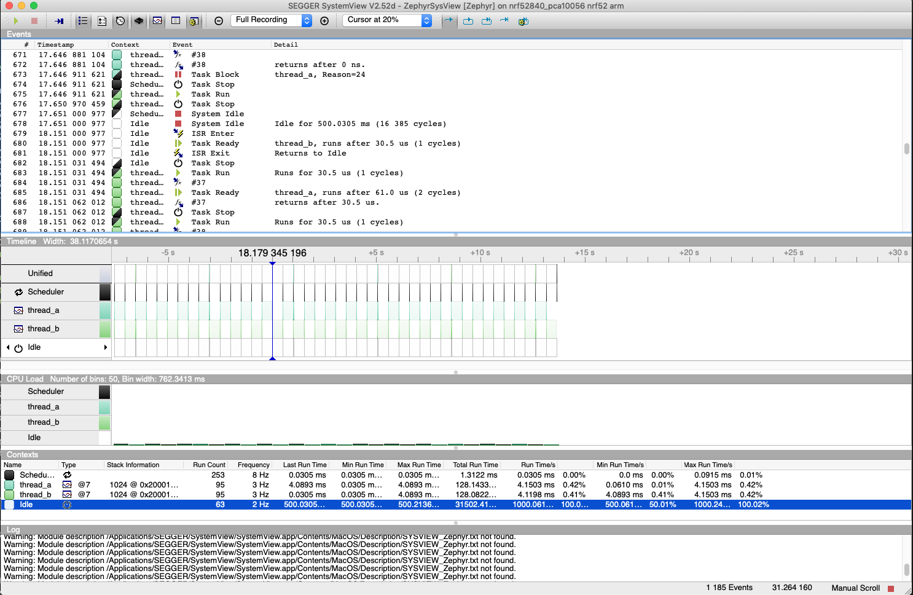

.. _tracing:

Tracing
#######

Overview
********

The tracing feature provides hooks that permits you to collect data from
your application and allows tools running on a host to visualize the inner-working of
the kernel and various subsystems.

Every system has application-specific events to trace out.  Historically,
that has implied:

1. Determining the application-specific payload,
2. Choosing suitable serialization-format,
3. Writing the on-target serialization code,
4. Deciding on and writing the I/O transport mechanics,
5. Writing the PC-side deserializer/parser,
6. Writing custom ad-hoc tools for filtering and presentation.

An application can use one of the existing formats or define a custom format by
overriding the macros declared in :zephyr_file:`include/zephyr/tracing/tracing.h`.

Different formats, transports and host tools are available and supported in
Zephyr.

In fact, I/O varies greatly from system to system.  Therefore, it is
instructive to create a taxonomy for I/O types when we must ensure the
interface between payload/format (Top Layer) and the transport mechanics
(bottom Layer) is generic and efficient enough to model these. See the
*I/O taxonomy* section below.

Serialization Formats
**********************

.. _ctf:

Common Trace Format (CTF) Support
=================================

Common Trace Format, CTF, is an open format and language to describe trace
formats. This enables tool reuse, of which line-textual (babeltrace) and
graphical (TraceCompass) variants already exist.

CTF should look familiar to C programmers but adds stronger typing.
See `CTF - A Flexible, High-performance Binary Trace Format
<http://diamon.org/ctf/>`_.

CTF allows us to formally describe application specific payload and the
serialization format, which enables common infrastructure for host tools
and parsers and tools for filtering and presentation.

A Generic Interface
--------------------

In CTF, an event is serialized to a packet containing one or more fields.
As seen from *I/O taxonomy* section below, a bottom layer may:

- perform actions at transaction-start (e.g. mutex-lock),
- process each field in some way (e.g. sync-push emit, concat, enqueue to
  thread-bound FIFO),
- perform actions at transaction-stop (e.g. mutex-release, emit of concat
  buffer).

CTF Top-Layer Example
----------------------

The CTF_EVENT macro will serialize each argument to a field::

  /* Example for illustration */
  static inline void ctf_top_foo(uint32_t thread_id, ctf_bounded_string_t name)
  {
    CTF_EVENT(
      CTF_LITERAL(uint8_t, 42),
      thread_id,
      name,
      "hello, I was emitted from function: ",
      __func__  /* __func__ is standard since C99 */
    );
  }

How to serialize and emit fields as well as handling alignment, can be done
internally and statically at compile-time in the bottom-layer.

The CTF top layer is enabled using the configuration option
:kconfig:option:`CONFIG_TRACING_CTF` and can be used with the different transport
backends both in synchronous and asynchronous modes.

SEGGER SystemView Support
=========================

Zephyr provides built-in support for `SEGGER SystemView`_ that can be enabled in
any application for platforms that have the required hardware support.

The payload and format used with SystemView is custom to the application and
relies on RTT as a transport. Newer versions of SystemView support other
transports, for example UART or using snapshot mode (both still not
supported in Zephyr).

To enable tracing support with `SEGGER SystemView`_ add the configuration option
:kconfig:option:`CONFIG_SEGGER_SYSTEMVIEW` to your project configuration file and set
it to *y*. For example, this can be added to the
:zephyr:code-sample:`synchronization` sample to visualize fast switching between threads.
SystemView can also be used for post-mortem tracing, which can be enabled with
`CONFIG_SEGGER_SYSVIEW_POST_MORTEM_MODE`. In this mode, a debugger can
be attached after the system has crashed using ``west attach`` after which the
latest data from the internal RAM buffer can be loaded into SystemView::

    CONFIG_STDOUT_CONSOLE=y
    # enable to use thread names
    CONFIG_THREAD_NAME=y
    CONFIG_SEGGER_SYSTEMVIEW=y
    CONFIG_USE_SEGGER_RTT=y
    CONFIG_TRACING=y
    # enable for post-mortem tracing
    CONFIG_SEGGER_SYSVIEW_POST_MORTEM_MODE=n

.. _SEGGER SystemView: https://www.segger.com/products/development-tools/systemview/

Recent versions of `SEGGER SystemView`_ come with an API translation table for
Zephyr which is incomplete and does not match the current level of support
available in Zephyr. To use the latest Zephyr API description table, copy the
file available in the tree to your local configuration directory to override the
builtin table::

        # On Linux and MacOS
        cp $ZEPHYR_BASE/subsys/tracing/sysview/SYSVIEW_Zephyr.txt ~/.config/SEGGER/

User-Defined Tracing
====================

This tracing format allows the user to define functions to perform any work desired
when a task is switched in or out, when an interrupt is entered or exited, and when the cpu
is idle.

Examples include:
- simple toggling of GPIO for external scope tracing while minimizing extra cpu load
- generating/outputting trace data in a non-standard or proprietary format that can
not be supported by the other tracing systems

The following functions can be defined by the user:

.. code-block:: c

   void sys_trace_thread_create_user(struct k_thread *thread);
   void sys_trace_thread_abort_user(struct k_thread *thread);
   void sys_trace_thread_suspend_user(struct k_thread *thread);
   void sys_trace_thread_resume_user(struct k_thread *thread);
   void sys_trace_thread_name_set_user(struct k_thread *thread);
   void sys_trace_thread_switched_in_user(struct k_thread *thread);
   void sys_trace_thread_switched_out_user(struct k_thread *thread);
   void sys_trace_thread_info_user(struct k_thread *thread);
   void sys_trace_thread_sched_ready_user(struct k_thread *thread);
   void sys_trace_thread_pend_user(struct k_thread *thread);
   void sys_trace_thread_priority_set_user(struct k_thread *thread, int prio);
   void sys_trace_isr_enter_user(int nested_interrupts);
   void sys_trace_isr_exit_user(int nested_interrupts);
   void sys_trace_idle_user();

Enable this format with the :kconfig:option:`CONFIG_TRACING_USER` option.

Transport Backends
******************

The following backends are currently supported:

* UART
* USB
* File (Using the native port with POSIX architecture based targets)
* RTT (With SystemView)
* RAM (buffer to be retrieved by a debugger)

Using Tracing
*************

The sample :zephyr_file:`samples/subsys/tracing` demonstrates tracing with
different formats and backends.

To get started, the simplest way is to use the CTF format with the :ref:`native_sim <native_sim>`
port, build the sample as follows:

.. zephyr-app-commands::
   :tool: all
   :app: samples/subsys/tracing
   :board: native_sim
   :gen-args: -DCONF_FILE=prj_native_ctf.conf
   :goals: build

You can then run the resulting binary with the option ``-trace-file`` to generate
the tracing data::

    mkdir data
    cp $ZEPHYR_BASE/subsys/tracing/ctf/tsdl/metadata data/
    ./build/zephyr/zephyr.exe -trace-file=data/channel0_0

The resulting CTF output can be visualized using babeltrace or TraceCompass
by pointing the tool to the ``data`` directory with the metadata and trace files.

Using RAM backend
=================

For devices that do not have available I/O for tracing such as USB or UART but have
enough RAM to collect trace data, the ram backend can be enabled with configuration
:kconfig:option:`CONFIG_TRACING_BACKEND_RAM`.
Adjust :kconfig:option:`CONFIG_RAM_TRACING_BUFFER_SIZE` to be able to record enough traces for your needs.
Then thanks to a runtime debugger such as gdb this buffer can be fetched from the target
to an host computer::

    (gdb) dump binary memory data/channel0_0 <ram_tracing_start> <ram_tracing_end>

The resulting channel0_0 file have to be placed in a directory with the ``metadata``
file like the other backend.

Visualisation Tools
*******************

TraceCompass
=============

TraceCompass is an open source tool that visualizes CTF events such as thread
scheduling and interrupts, and is helpful to find unintended interactions and
resource conflicts on complex systems.

See also the presentation by Ericsson,
`Advanced Trouble-shooting Of Real-time Systems
<https://wiki.eclipse.org/images/0/0e/TechTalkOnlineDemoFeb2017_v1.pdf>`_.

Future LTTng Inspiration
************************

Currently, the top-layer provided here is quite simple and bare-bones,
and needlessly copied from Zephyr's Segger SystemView debug module.

For an OS like Zephyr, it would make sense to draw inspiration from
Linux's LTTng and change the top-layer to serialize to the same format.
Doing this would enable direct reuse of TraceCompass' canned analyses
for Linux.  Alternatively, LTTng-analyses in TraceCompass could be
customized to Zephyr.  It is ongoing work to enable TraceCompass
visibility of Zephyr in a target-agnostic and open source way.

I/O Taxonomy
=============

- Atomic Push/Produce/Write/Enqueue:

  - synchronous:
                  means data-transmission has completed with the return of the
                  call.

  - asynchronous:
                  means data-transmission is pending or ongoing with the return
                  of the call. Usually, interrupts/callbacks/signals or polling
                  is used to determine completion.

  - buffered:
                  means data-transmissions are copied and grouped together to
                  form a larger ones. Usually for amortizing overhead (burst
                  dequeue) or jitter-mitigation (steady dequeue).

  Examples:
    - sync  unbuffered
        E.g. PIO via GPIOs having steady stream, no extra FIFO memory needed.
        Low jitter but may be less efficient (can't amortize the overhead of
        writing).

    - sync  buffered
        E.g. ``fwrite()`` or enqueuing into FIFO.
        Blockingly burst the FIFO when its buffer-waterlevel exceeds threshold.
        Jitter due to bursts may lead to missed deadlines.

    - async unbuffered
        E.g. DMA, or zero-copying in shared memory.
        Be careful of data hazards, race conditions, etc!

    - async buffered
        E.g. enqueuing into FIFO.

- Atomic Pull/Consume/Read/Dequeue:

  - synchronous:
                  means data-reception has completed with the return of the call.

  - asynchronous:
                  means data-reception is pending or ongoing with the return of
                  the call. Usually, interrupts/callbacks/signals or polling is
                  used to determine completion.

  - buffered:
                  means data is copied-in in larger chunks than request-size.
                  Usually for amortizing wait-time.

  Examples:
    - sync  unbuffered
        E.g. Blocking read-call, ``fread()`` or SPI-read, zero-copying in shared
        memory.

    - sync  buffered
        E.g. Blocking read-call with caching applied.
        Makes sense if read pattern exhibits spatial locality.

    - async unbuffered
        E.g. zero-copying in shared memory.
        Be careful of data hazards, race conditions, etc!

    - async buffered
        E.g. ``aio_read()`` or DMA.

Unfortunately, I/O may not be atomic and may, therefore, require locking.
Locking may not be needed if multiple independent channels are available.

  - The system has non-atomic write and one shared channel
        E.g. UART. Locking required.

        ``lock(); emit(a); emit(b); emit(c); release();``

  - The system has non-atomic write but many channels
        E.g. Multi-UART. Lock-free if the bottom-layer maps each Zephyr
        thread+ISR to its own channel, thus alleviating races as each
        thread is sequentially consistent with itself.

        ``emit(a,thread_id); emit(b,thread_id); emit(c,thread_id);``

  - The system has atomic write     but one shared channel
        E.g. ``native_sim`` or board with DMA. May or may not need locking.

        ``emit(a ## b ## c); /* Concat to buffer */``

        ``lock(); emit(a); emit(b); emit(c); release(); /* No extra mem */``

  - The system has atomic write     and many channels
        E.g. native_sim or board with multi-channel DMA. Lock-free.

        ``emit(a ## b ## c, thread_id);``

Object tracking
***************

The kernel can also maintain lists of objects that can be used to track
their usage. Currently, the following lists can be enabled::

  struct k_timer *_track_list_k_timer;
  struct k_mem_slab *_track_list_k_mem_slab;
  struct k_sem *_track_list_k_sem;
  struct k_mutex *_track_list_k_mutex;
  struct k_stack *_track_list_k_stack;
  struct k_msgq *_track_list_k_msgq;
  struct k_mbox *_track_list_k_mbox;
  struct k_pipe *_track_list_k_pipe;
  struct k_queue *_track_list_k_queue;
  struct k_event *_track_list_k_event;

Those global variables are the head of each list - they can be traversed
with the help of macro ``SYS_PORT_TRACK_NEXT``. For instance, to traverse
all initialized mutexes, one can write::

  struct k_mutex *cur = _track_list_k_mutex;
  while (cur != NULL) {
    /* Do something */

    cur = SYS_PORT_TRACK_NEXT(cur);
  }

To enable object tracking, enable :kconfig:option:`CONFIG_TRACING_OBJECT_TRACKING`.
Note that each list can be enabled or disabled via their tracing
configuration. For example, to disable tracking of semaphores, one can
disable :kconfig:option:`CONFIG_TRACING_SEMAPHORE`.

Object tracking is behind tracing configuration as it currently leverages
tracing infrastructure to perform the tracking.

API
***

Common
======

.. doxygengroup:: subsys_tracing_apis

Threads
=======

.. doxygengroup:: subsys_tracing_apis_thread

Work Queues
===========

.. doxygengroup:: subsys_tracing_apis_work

Poll
====

.. doxygengroup:: subsys_tracing_apis_poll

Semaphore
=========

.. doxygengroup:: subsys_tracing_apis_sem

Mutex
=====

.. doxygengroup:: subsys_tracing_apis_mutex

Condition Variables
===================

.. doxygengroup:: subsys_tracing_apis_condvar

Queues
======

.. doxygengroup:: subsys_tracing_apis_queue

FIFO
====

.. doxygengroup:: subsys_tracing_apis_fifo

LIFO
====
.. doxygengroup:: subsys_tracing_apis_lifo

Stacks
======

.. doxygengroup:: subsys_tracing_apis_stack

Message Queues
==============

.. doxygengroup:: subsys_tracing_apis_msgq

Mailbox
=======

.. doxygengroup:: subsys_tracing_apis_mbox

Pipes
======

.. doxygengroup:: subsys_tracing_apis_pipe

Heaps
=====

.. doxygengroup:: subsys_tracing_apis_heap

Memory Slabs
============

.. doxygengroup:: subsys_tracing_apis_mslab

Timers
======

.. doxygengroup:: subsys_tracing_apis_timer

Object tracking
===============

.. doxygengroup:: subsys_tracing_object_tracking

Syscalls
========

.. doxygengroup:: subsys_tracing_apis_syscall
