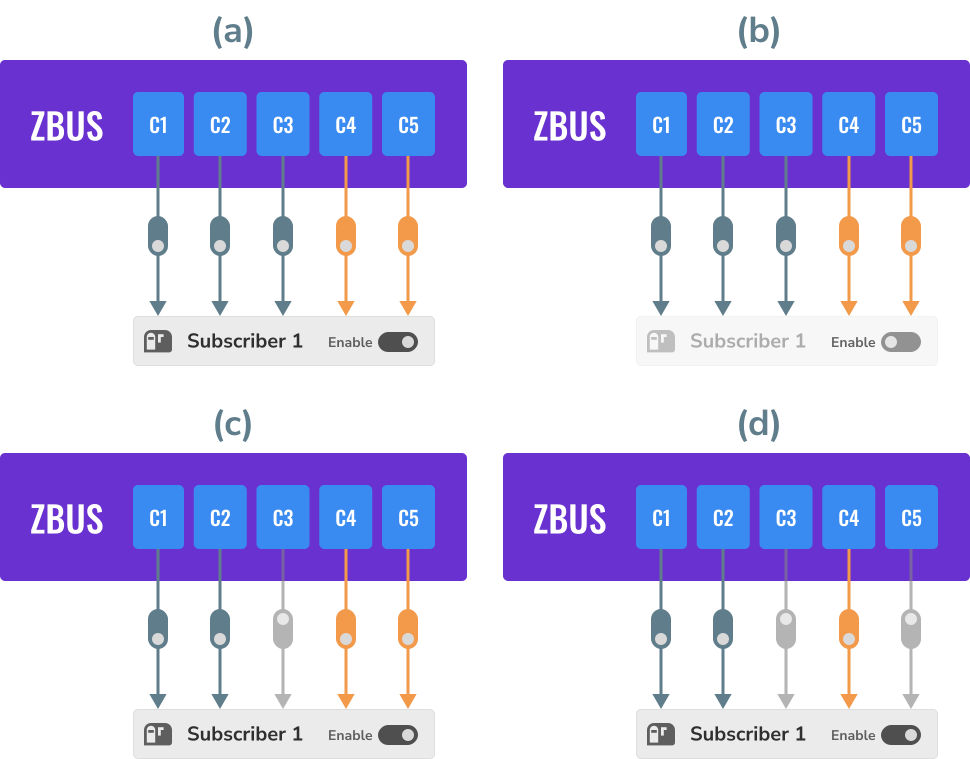
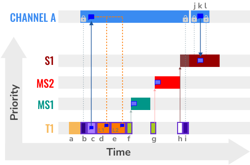

.. _zbus:

Zephyr bus (zbus)
#################

..
   Note to documentation authors: the diagrams included in this documentation page were designed
   using the following Figma library:
   https://www.figma.com/community/file/1292866458780627559/zbus-diagram-assets

The :dfn:`Zephyr bus - zbus` is a lightweight and flexible software bus enabling a simple way for
threads to talk to one another in a many-to-many way.

.. contents::
    :local:
    :depth: 2

Concepts
********
Threads can send messages to one or more observers using zbus. It makes the many-to-many
communication possible. The bus implements message-passing and publish/subscribe communication
paradigms that enable threads to communicate synchronously or asynchronously through shared memory.

The communication through zbus is channel-based. Threads (or callbacks) use channels to exchange
messages. Additionally, besides other actions, threads can publish and observe channels. When a
thread publishes a message on a channel, the bus will make the message available to all the
published channel's observers. Based on the observer's type, it can access the message directly,
receive a copy of it, or even receive only a reference of the published channel.

The figure below shows an example of a typical application using zbus in which the application logic
(hardware independent) talks to other threads via software bus. Note that the threads are decoupled
from each other because they only use zbus channels and do not need to know each other to talk.

.. figure:: images/zbus_overview.svg
    :alt: zbus usage overview
    :width: 75%

    A typical zbus application architecture.

The bus comprises:

* Set of channels that consists of the control metadata information, and the message itself;
* :dfn:`Virtual Distributed Event Dispatcher` (VDED), the bus logic responsible for sending
  notifications/messages to the observers. The VDED logic runs inside the publishing action in the same
  thread context, giving the bus an idea of a distributed execution. When a thread publishes to a
  channel, it also propagates the notifications to the observers;
* Threads (subscribers and message subscribers) and callbacks (listeners) publishing, reading, and
  receiving notifications from the bus.

.. figure:: images/zbus_anatomy.svg
    :alt: ZBus anatomy
    :width: 70%

    ZBus anatomy.

The bus makes the publish, read, claim, finish, notify, and subscribe actions available over
channels. Publishing, reading, claiming, and finishing are available in all RTOS thread contexts,
including ISRs. The publish and read operations are simple and fast; the procedure is channel
locking followed by a memory copy to and from a shared memory region and then a channel unlocking.
Another essential aspect of zbus is the observers. There are three types of observers:

    ZBus observers.

* Listeners, a callback that the event dispatcher executes every time an observed channel is
  published or notified;
* Subscriber, a thread-based observer that relies internally on a message queue where the event
  dispatcher puts a changed channel's reference every time an observed channel is published or
  notified. Note this kind of observer does not receive the message itself. It should read the
  message from the channel after receiving the notification;
* Message subscribers, a thread-based observer that relies internally on a FIFO where the event
  dispatcher puts a copy of the message every time an observed channel is published or notified.

Channel observation structures define the relationship between a channel and its observers. For
every observation, a pair channel/observer. Developers can statically allocate observation using the
:c:macro:`ZBUS_CHAN_DEFINE` or :c:macro:`ZBUS_CHAN_ADD_OBS`. There are also runtime observers,
enabling developers to create runtime observations. It is possible to disable an observer entirely
or observations individually.  The event dispatcher will ignore disabled observers and observations.

    ZBus observation mask.

The above figure illustrates some states, from (a) to (d), for channels from ``C1`` to ``C5``,
``Subscriber 1``, and the observations. The last two are in orange to indicate they are dynamically
allocated (runtime observation). (a) shows that the observer and all observations are enabled. (b)
shows the observer is disabled, so the event dispatcher will ignore it. (c) shows the observer
enabled. However, there is one static observation disabled. The event dispatcher will only stop
sending notifications from channel ``C3``.  In (d), the event dispatcher will stop sending
notifications from channels ``C3`` and ``C5`` to ``Subscriber 1``.

Suppose a usual sensor-based solution is in the figure below for illustration purposes. When
triggered, the timer publishes to the ``Trigger`` channel. As the sensor thread subscribed to the
``Trigger`` channel, it receives the sensor data. Notice the VDED executes the ``Blink`` because it
also listens to the ``Trigger`` channel. When the sensor data is ready, the sensor thread publishes
it to the ``Sensor data`` channel. The core thread receives the message as a ``Sensor data`` channel
message subscriber, processes the sensor data, and stores it in an internal sample buffer. It
repeats until the sample buffer is full; when it happens, the core thread aggregates the sample
buffer information, prepares a package, and publishes that to the ``Payload`` channel. The Lora
thread receives that because it is a ``Payload`` channel message subscriber and sends the payload to
the cloud. When it completes the transmission, the Lora thread publishes to the ``Transmission
done`` channel. The VDED executes the ``Blink`` again since it listens to the ``Transmission done``
channel.

.. figure:: images/zbus_operations.svg
    :alt: ZBus sensor-based application
    :width: 85%

    ZBus sensor-based application.

This way of implementing the solution makes the application more flexible, enabling us to change
things independently. For example, we want to change the trigger from a timer to a button press. We
can do that, and the change does not affect other parts of the system. Likewise, we would like to
change the communication interface from LoRa to Bluetooth; we only need to change the LoRa thread.
No other change is required in order to make that work. Thus, the developer would do that for every
block of the image. Based on that, there is a sign zbus promotes decoupling in the system
architecture.

Another important aspect of using zbus is the reuse of system modules. If a code portion with
well-defined behaviors (we call that module) only uses zbus channels and not hardware interfaces, it
can easily be reused in other solutions. The new solution must implement the interfaces (set of
channels) the module needs to work. That indicates zbus could improve the module reuse.

The last important note is the zbus solution reach. We can count on many ways of using zbus to
enable the developer to be as free as possible to create what they need. For example, messages can
be dynamic or static allocated; notifications can be synchronous or asynchronous; the developer can
control the channel in so many different ways claiming the channel, developers can add their
metadata information to a channel by using the user-data field, the discretionary use of a validator
enables the systems to be accurate over message format, and so on. Those characteristics increase
the solutions that can be done with zbus and make it a good fit as an open-source community tool.

.. _Virtual Distributed Event Dispatcher:

Virtual Distributed Event Dispatcher
====================================

The VDED execution always happens in the publisher's context. It can be a thread or an ISR. Be
careful with publications inside ISR because the scheduler won't preempt the VDED. Use that wisely.
The basic description of the execution is as follows:

* The channel lock is acquired;
* The channel receives the new message via direct copy (by a raw :c:func:`memcpy`);
* The event dispatcher logic executes the listeners, sends a copy of the message to the message
  subscribers, and pushes the channel's reference to the subscribers' notification message queue in
  the same sequence they appear on the channel observers' list. The listeners can perform non-copy
  quick access to the constant message reference directly (via the :c:func:`zbus_chan_const_msg`
  function) since the channel is still locked;
* At last, the publishing function unlocks the channel.

To illustrate the VDED execution, consider the example illustrated below. We have four threads in
ascending priority ``S1``, ``MS2``, ``MS1``, and ``T1`` (the highest priority); two listeners,
``L1`` and ``L2``; and channel A. Supposing ``L1``, ``L2``, ``MS1``, ``MS2``, and ``S1`` observer
channel A.

.. figure:: images/zbus_publishing_process_example_scenario.svg
    :alt: ZBus example scenario
    :width: 45%

    ZBus VDED execution example scenario.

The following code implements channel A. Note the ``struct a_msg`` is illustrative only.

.. code-block:: c

    ZBUS_CHAN_DEFINE(a_chan,                       /* Name */
             struct a_msg,                         /* Message type */

             NULL,                                 /* Validator */
             NULL,                                 /* User Data */
             ZBUS_OBSERVERS(L1, L2, MS1, MS2, S1), /* observers */
             ZBUS_MSG_INIT(0)                      /* Initial value {0} */
    );

In the figure below, the letters indicate some action related to the VDED execution. The X-axis
represents the time, and the Y-axis represents the priority of threads. Channel A's message,
represented by a voice balloon, is only one memory portion (shared memory). It appears several times
only as an illustration of the message at that point in time.

.. figure:: images/zbus_publishing_process_example.svg
    :alt: ZBus publish processing detail
    :width: 85%

    ZBus VDED execution detail for priority T1 > MS1 > MS2 > S1.

The figure above illustrates the actions performed during the VDED execution when T1 publishes to
channel A. Thus, the table below describes the activities (represented by a letter) of the VDED
execution. The scenario considers the following priorities: T1 > MS1 > MS2 > S1. T1 has the highest
priority.

.. list-table:: VDED execution steps in detail for priority T1 > MS1 > MS2 > S1.
   :widths: 5 65
   :header-rows: 1

   * - Actions
     - Description
   * - a
     - T1 starts and, at some point, publishes to channel A.
   * - b
     - The publishing (VDED) process starts. The VDED locks the channel A.
   * - c
     - The VDED copies the T1 message to the channel A message.

   * - d, e
     - The VDED executes L1 and L2 in the respective sequence. Inside the listeners, usually, there
       is a call to the :c:func:`zbus_chan_const_msg` function, which provides a direct constant
       reference to channel A's message. It is quick, and no copy is needed here.

   * - f, g
     - The VDED copies the message and sends that to MS1 and MS2 sequentially. Notice the threads
       get ready to execute right after receiving the notification. However, they go to a pending
       state because they have less priority than T1.
   * - h
     - The VDED pushes the notification message to the queue of S1. Notice the thread gets ready to
       execute right after receiving the notification. However, it goes to a pending state because
       it cannot access the channel since it is still locked.

   * - i
     - VDED finishes the publishing by unlocking channel A. The MS1 leaves the pending state and
       starts executing.

   * - j
     - MS1 finishes execution. The MS2 leaves the pending state and starts executing.

   * - k
     - MS2 finishes execution. The S1 leaves the pending state and starts executing.

   * - l, m, n
     - The S1 leaves the pending state since channel A is not locked. It gets in the CPU again and
       starts executing. As it did receive a notification from channel A, it performed a channel read
       (as simple as lock, memory copy, unlock), continues its execution and goes out of the CPU.

   * - o
     - S1 finishes its workload.

The figure below illustrates the actions performed during the VDED execution when T1 publishes to
channel A. The scenario considers the following priorities: T1 < MS1 < MS2 < S1.

    ZBus VDED execution detail for priority T1 < MS1 < MS2 < S1.

Thus, the table below describes the activities (represented by a letter) of the VDED execution.

.. list-table:: VDED execution steps in detail for priority T1 < MS1 < MS2 < S1.
   :widths: 5 65
   :header-rows: 1

   * - Actions
     - Description
   * - a
     - T1 starts and, at some point, publishes to channel A.
   * - b
     - The publishing (VDED) process starts. The VDED locks the channel A.
   * - c
     - The VDED copies the T1 message to the channel A message.

   * - d, e
     - The VDED executes L1 and L2 in the respective sequence. Inside the listeners, usually, there
       is a call to the :c:func:`zbus_chan_const_msg` function, which provides a direct constant
       reference to channel A's message. It is quick, and no copy is needed here.

   * - f
     - The VDED copies the message and sends that to MS1. MS1 preempts T1 and starts working.
       After that, the T1 regain MCU.

   * - g
     - The VDED copies the message and sends that to MS2. MS2 preempts T1 and starts working.
       After that, the T1 regain MCU.

   * - h
     - The VDED pushes the notification message to the queue of S1.

   * - i
     - VDED finishes the publishing by unlocking channel A.

   * - j, k, l
     - The S1 leaves the pending state since channel A is not locked. It gets in the CPU again and
       starts executing. As it did receive a notification from channel A, it performs a channel read
       (as simple as lock, memory copy, unlock), continues its execution, and goes out the CPU.

HLP priority boost
------------------
ZBus implements the Highest Locker Protocol that relies on the observers' thread priority to
determine a temporary publisher priority. The protocol considers the channel's Highest Observer
Priority (HOP); even if the observer is not waiting for a message on the channel, it is considered
in the calculation. The VDED will elevate the publisher's priority based on the HOP to ensure small
latency and as few preemptions as possible.

.. note::
    The priority boost is enabled by default. To deactivate it, you must set the
    :kconfig:option:`CONFIG_ZBUS_PRIORITY_BOOST` configuration.

.. warning::
    ZBus priority boost does not consider runtime observers on the HOP calculations.

The figure below illustrates the actions performed during the VDED execution when T1 publishes to
channel A. The scenario considers the priority boost feature and the following priorities: T1 < MS1
< MS2 < S1.

.. figure:: images/zbus_publishing_process_example_HLP.svg
    :alt: ZBus publishing process details using priority boost.
    :width: 85%

    ZBus VDED execution detail with priority boost enabled and for priority T1 < MS1 < MS2 < S1.

To properly use the priority boost, attaching the observer to a thread is necessary. When the
subscriber is attached to a thread, it assumes its priority, and the priority boost algorithm will
consider the observer's priority. The following code illustrates the thread-attaching function.

.. code-block:: c
   :emphasize-lines: 10

   ZBUS_SUBSCRIBER_DEFINE(s1, 4);
   void s1_thread(void *ptr1, void *ptr2, void *ptr3)
   {
           ARG_UNUSED(ptr1);
           ARG_UNUSED(ptr2);
           ARG_UNUSED(ptr3);

           const struct zbus_channel *chan;

           zbus_obs_attach_to_thread(&s1);

           while (1) {
                   zbus_sub_wait(&s1, &chan, K_FOREVER);

                   /* Subscriber implementation */

           }
   }
   K_THREAD_DEFINE(s1_id, CONFIG_MAIN_STACK_SIZE, s1_thread, NULL, NULL, NULL, 2, 0, 0);

On the above code, the :c:func:`zbus_obs_attach_to_thread` will set the ``s1`` observer with
priority two as the thread has that priority. It is possible to reverse that by detaching the
observer using the :c:func:`zbus_obs_detach_from_thread`. Only enabled observers and observations
will be considered on the channel HOP calculation. Masking a specific observation of a channel will
affect the channel HOP.

In summary, the benefits of the feature are:

* The HLP is more effective for zbus than the mutexes priority inheritance;
* No bounded priority inversion will happen among the publisher and the observers;
* No other threads (that are not involved in the communication) with priority between T1 and S1 can
  preempt T1, avoiding unbounded priority inversion;
* Message subscribers will wait for the VDED to finish the message delivery process. So the VDED
  execution will be faster and more consistent;
* The HLP priority is dynamic and can change in execution;
* ZBus operations can be used inside ISRs;
* The priority boosting feature can be turned off, and plain semaphores can be used as the channel
  lock mechanism;
* The Highest Locker Protocol's major disadvantage, the Inheritance-related Priority Inversion, is
  acceptable in the zbus scenario since it will ensure a small bus latency.

Limitations
===========

Based on the fact that developers can use zbus to solve many different problems, some challenges
arise. ZBus will not solve every problem, so it is necessary to analyze the situation to be sure
zbus is applicable. For instance, based on the zbus benchmark, it would not be well suited to a
high-speed stream of bytes between threads. The :ref:`Pipe <pipes_v2>` kernel object solves this
kind of need.

Delivery guarantees
-------------------

ZBus always delivers the messages to the listeners and message subscribers. However, there are no
message delivery guarantees for subscribers because zbus only sends the notification, but the
message reading depends on the subscriber's implementation. It is possible to increase the delivery
rate by following design tips:

* Keep the listeners quick-as-possible (deal with them as ISRs). If some processing is needed,
  consider submitting a work item to a work-queue;
* Try to give producers a high priority to avoid losses;
* Leave spare CPU for observers to consume data produced;
* Consider using message queues or pipes for intensive byte transfers.

.. warning::
   ZBus uses :zephyr_file:`include/zephyr/net_buf.h` (network buffers) to exchange data with message
   subscribers. Thus, choose carefully the configurations
   :kconfig:option:`CONFIG_ZBUS_MSG_SUBSCRIBER_NET_BUF_POOL_SIZE` and
   :kconfig:option:`CONFIG_HEAP_MEM_POOL_SIZE`. They are crucial to a proper VDED execution
   (delivery guarantee) considering message subscribers. If you want to keep an isolated pool for a
   specific set of channels, you can use
   :kconfig:option:`CONFIG_ZBUS_MSG_SUBSCRIBER_NET_BUF_POOL_ISOLATION` with a dedicated pool. Look
   at the :zephyr:code-sample:`zbus-msg-subscriber` to see the isolation in action.

.. warning::
   Subscribers will receive only the reference of the changing channel. A data loss may be perceived
   if the channel is published twice before the subscriber reads it. The second publication
   overwrites the value from the first. Thus, the subscriber will receive two notifications, but
   only the last data is there.

.. _zbus delivery sequence:

Message delivery sequence
-------------------------

The message delivery will follow the precedence:

#. Observers defined in a channel using the :c:macro:`ZBUS_CHAN_DEFINE` (following the definition
   sequence);
#. Observers defined using the :c:macro:`ZBUS_CHAN_ADD_OBS` based on the sequence priority
   (parameter of the macro);
#. The latest is the runtime observers in the addition sequence using the
   :c:func:`zbus_chan_add_obs`.

.. note::
    The VDED will ignore all disabled observers or observations.

Usage
*****

ZBus operation depends on channels and observers. Therefore, it is necessary to determine its
message and observers list during the channel definition. A message is a regular C struct; the
observer can be a subscriber (asynchronous), a message subscriber (asynchronous), or a listener
(synchronous).

The following code defines and initializes a regular channel and its dependencies. This channel
exchanges accelerometer data, for example.

.. code-block:: c

    struct acc_msg {
            int x;
            int y;
            int z;
    };

    ZBUS_CHAN_DEFINE(acc_chan,                           /* Name */
             struct acc_msg,                             /* Message type */

             NULL,                                       /* Validator */
             NULL,                                       /* User Data */
             ZBUS_OBSERVERS(my_listener, my_subscriber,
                            my_msg_subscriber),          /* observers */
             ZBUS_MSG_INIT(.x = 0, .y = 0, .z = 0)       /* Initial value */
    );

    void listener_callback_example(const struct zbus_channel *chan)
    {
            const struct acc_msg *acc;
            if (&acc_chan == chan) {
                    acc = zbus_chan_const_msg(chan); // Direct message access
                    LOG_DBG("From listener -> Acc x=%d, y=%d, z=%d", acc->x, acc->y, acc->z);
            }
    }

    ZBUS_LISTENER_DEFINE(my_listener, listener_callback_example);

    ZBUS_LISTENER_DEFINE(my_listener2, listener_callback_example);

    ZBUS_CHAN_ADD_OBS(acc_chan, my_listener2, 3);

    ZBUS_SUBSCRIBER_DEFINE(my_subscriber, 4);
    void subscriber_task(void)
    {
            const struct zbus_channel *chan;

            while (!zbus_sub_wait(&my_subscriber, &chan, K_FOREVER)) {
                    struct acc_msg acc = {0};

                    if (&acc_chan == chan) {
                            // Indirect message access
                            zbus_chan_read(&acc_chan, &acc, K_NO_WAIT);
                            LOG_DBG("From subscriber -> Acc x=%d, y=%d, z=%d", acc.x, acc.y, acc.z);
                    }
            }
    }
    K_THREAD_DEFINE(subscriber_task_id, 512, subscriber_task, NULL, NULL, NULL, 3, 0, 0);

    ZBUS_MSG_SUBSCRIBER_DEFINE(my_msg_subscriber);
    static void msg_subscriber_task(void *ptr1, void *ptr2, void *ptr3)
    {
            ARG_UNUSED(ptr1);
            ARG_UNUSED(ptr2);
            ARG_UNUSED(ptr3);
            const struct zbus_channel *chan;

            struct acc_msg acc = {0};

            while (!zbus_sub_wait_msg(&my_msg_subscriber, &chan, &acc, K_FOREVER)) {
                    if (&acc_chan == chan) {
                            LOG_INF("From msg subscriber -> Acc x=%d, y=%d, z=%d", acc.x, acc.y, acc.z);
                    }
            }
    }
    K_THREAD_DEFINE(msg_subscriber_task_id, 1024, msg_subscriber_task, NULL, NULL, NULL, 3, 0, 0);

It is possible to add static observers to a channel using the :c:macro:`ZBUS_CHAN_ADD_OBS`. We call
that a post-definition static observer. The command enables us to indicate an initialization
priority that affects the observers' initialization order. The sequence priority param only affects
the post-definition static observers. There is no possibility to overwrite the message delivery
sequence of the static observers.

.. note::
   It is unnecessary to claim/lock a channel before accessing the message inside the listener since
   the event dispatcher calls listeners with the notifying channel already locked. Subscribers,
   however, must claim/lock that or use regular read operations to access the message after being
   notified.

Channels can have a *validator function* that enables a channel to accept only valid messages.
Publish attempts invalidated by hard channels will return immediately with an error code. This
allows original creators of a channel to exert some authority over other developers/publishers who
may want to piggy-back on their channels. The following code defines and initializes a :dfn:`hard
channel` and its dependencies. Only valid messages can be published to a :dfn:`hard channel`. It is
possible because a *validator function* was passed to the channel's definition. In this example,
only messages with ``move`` equal to 0, -1, and 1 are valid. Publish function will discard all other
values to ``move``.

.. code-block:: c

    struct control_msg {
            int move;
    };

    bool control_validator(const void* msg, size_t msg_size) {
            const struct control_msg* cm = msg;
            bool is_valid = (cm->move == -1) || (cm->move == 0) || (cm->move == 1);
            return is_valid;
    }

    static int message_count = 0;

    ZBUS_CHAN_DEFINE(control_chan,    /* Name */
             struct control_msg,      /* Message type */

             control_validator,       /* Validator */
             &message_count,          /* User data */
             ZBUS_OBSERVERS_EMPTY,    /* observers */
             ZBUS_MSG_INIT(.move = 0) /* Initial value */
    );

The following sections describe in detail how to use zbus features.

.. _publishing to a channel:

Publishing to a channel
=======================

Messages are published to a channel in zbus by calling :c:func:`zbus_chan_pub`. For example, the
following code builds on the examples above and publishes to channel ``acc_chan``. The code is
trying to publish the message ``acc1`` to channel ``acc_chan``, and it will wait up to one second
for the message to be published. Otherwise, the operation fails. As can be inferred from the code
sample, it's OK to use stack allocated messages since VDED copies the data internally.

.. code-block:: c

	struct acc_msg acc1 = {.x = 1, .y = 1, .z = 1};
	zbus_chan_pub(&acc_chan, &acc1, K_SECONDS(1));

.. warning::
    Only use this function inside an ISR with a :c:macro:`K_NO_WAIT` timeout.

.. _reading from a channel:

Reading from a channel
======================

Messages are read from a channel in zbus by calling :c:func:`zbus_chan_read`. So, for example, the
following code tries to read the channel ``acc_chan``, which will wait up to 500 milliseconds to
read the message. Otherwise, the operation fails.

.. code-block:: c

    struct acc_msg acc = {0};
    zbus_chan_read(&acc_chan, &acc, K_MSEC(500));

.. warning::
    Only use this function inside an ISR with a :c:macro:`K_NO_WAIT` timeout.

.. warning::
   Choose the timeout of :c:func:`zbus_chan_read` after receiving a notification from
   :c:func:`zbus_sub_wait` carefully because the channel will always be unavailable during the VDED
   execution. Using ``K_NO_WAIT`` for reading is highly likely to return a timeout error if there
   are more than one subscriber. For example, consider the VDED illustration again and notice how
   ``S1`` read attempts would definitely fail with K_NO_WAIT. For more details, check
   the `Virtual Distributed Event Dispatcher`_ section.

Notifying a channel
===================

It is possible to force zbus to notify a channel's observers by calling :c:func:`zbus_chan_notify`.
For example, the following code builds on the examples above and forces a notification for the
channel ``acc_chan``. Note this can send events with no message, which does not require any data
exchange. See the code example under `Claim and finish a channel`_ where this may become useful.

.. code-block:: c

    zbus_chan_notify(&acc_chan, K_NO_WAIT);

.. warning::
    Only use this function inside an ISR with a :c:macro:`K_NO_WAIT` timeout.

Declaring channels and observers
================================

For accessing channels or observers from files other than its defining files, it is necessary to
declare them by calling :c:macro:`ZBUS_CHAN_DECLARE` and :c:macro:`ZBUS_OBS_DECLARE`. In other
words, zbus channel definitions and declarations with the same channel names in different files
would point to the same (global) channel. Thus, developers should be careful about existing
channels, and naming new channels or linking will fail. It is possible to declare more than one
channel or observer on the same call. The following code builds on the examples above and displays
the defined channels and observers.

.. code-block:: c

    ZBUS_OBS_DECLARE(my_listener, my_subscriber);
    ZBUS_CHAN_DECLARE(acc_chan, version_chan);

Iterating over channels and observers
=====================================

ZBus subsystem also implements :ref:`Iterable Sections <iterable_sections_api>` for channels and
observers, for which there are supporting APIs like :c:func:`zbus_iterate_over_channels`,
:c:func:`zbus_iterate_over_channels_with_user_data`, :c:func:`zbus_iterate_over_observers` and
:c:func:`zbus_iterate_over_observers_with_user_data`. This feature enables developers to call a
procedure over all declared channels, where the procedure parameter is a :c:struct:`zbus_channel`.
The execution sequence is in the alphabetical name order of the channels (see :ref:`Iterable
Sections <iterable_sections_api>` documentation for details). ZBus also implements this feature for
:c:struct:`zbus_observer`.

.. code-block:: c

   static bool print_channel_data_iterator(const struct zbus_channel *chan, void *user_data)
   {
         int *count = user_data;

         LOG_INF("%d - Channel %s:", *count, zbus_chan_name(chan));
         LOG_INF("      Message size: %d", zbus_chan_msg_size(chan));
         LOG_INF("      Observers:");

         ++(*count);

         struct zbus_channel_observation *observation;

         for (int16_t i = *chan->observers_start_idx, limit = *chan->observers_end_idx; i < limit;
               ++i) {
               STRUCT_SECTION_GET(zbus_channel_observation, i, &observation);

               LOG_INF("      - %s", observation->obs->name);
         }

         struct zbus_observer_node *obs_nd, *tmp;

         SYS_SLIST_FOR_EACH_CONTAINER_SAFE(chan->observers, obs_nd, tmp, node) {
               LOG_INF("      - %s", obs_nd->obs->name);
         }

         return true;
   }

   static bool print_observer_data_iterator(const struct zbus_observer *obs, void *user_data)
   {
         int *count = user_data;

         LOG_INF("%d - %s %s", *count, obs->queue ? "Subscriber" : "Listener", zbus_obs_name(obs));

         ++(*count);

         return true;
   }

   int main(void)
   {
         int count = 0;

         LOG_INF("Channel list:");

         zbus_iterate_over_channels_with_user_data(print_channel_data_iterator, &count);

         count = 0;

         LOG_INF("Observers list:");

         zbus_iterate_over_observers_with_user_data(print_observer_data_iterator, &count);

         return 0;
   }

The code will log the following output:

.. code-block:: console

    D: Channel list:
    D: 0 - Channel acc_chan:
    D:       Message size: 12
    D:       Observers:
    D:       - my_listener
    D:       - my_subscriber
    D: 1 - Channel version_chan:
    D:       Message size: 4
    D:       Observers:
    D: Observers list:
    D: 0 - Listener my_listener
    D: 1 - Subscriber my_subscriber

.. _Claim and finish a channel:

Advanced channel control
========================

ZBus was designed to be as flexible and extensible as possible. Thus, there are some features
designed to provide some control and extensibility to the bus.

Listeners message access
------------------------

For performance purposes, listeners can access the receiving channel message directly since they
already have the channel locked for it. To access the channel's message, the listener should use the
:c:func:`zbus_chan_const_msg` because the channel passed as an argument to the listener function is
a constant pointer to the channel. The const pointer return type tells developers not to modify the
message.

.. code-block:: c

    void listener_callback_example(const struct zbus_channel *chan)
    {
            const struct acc_msg *acc;
            if (&acc_chan == chan) {
                    acc = zbus_chan_const_msg(chan); // Use this
                    // instead of zbus_chan_read(chan, &acc, K_MSEC(200))
                    // or zbus_chan_msg(chan)

                    LOG_DBG("From listener -> Acc x=%d, y=%d, z=%d", acc->x, acc->y, acc->z);
            }
    }

User Data
---------
It is possible to pass custom data into the channel's ``user_data`` for various purposes, such as
writing channel metadata. That can be achieved by passing a pointer to the channel definition
macro's ``user_data`` field, which will then be accessible by others. Note that ``user_data`` is
individual for each channel. Also, note that ``user_data`` access is not thread-safe. For
thread-safe access to ``user_data``, see the next section.

Claim and finish a channel
--------------------------

To take more control over channels, two functions were added :c:func:`zbus_chan_claim` and
:c:func:`zbus_chan_finish`. With these functions, it is possible to access the channel's metadata
safely. When a channel is claimed, no actions are available to that channel. After finishing the
channel, all the actions are available again.

.. warning::
   Never change the fields of the channel struct directly. It may cause zbus behavior
   inconsistencies and scheduling issues.

.. warning::
    Only use this function inside an ISR with a :c:macro:`K_NO_WAIT` timeout.

The following code builds on the examples above and claims the ``acc_chan`` to set the ``user_data``
to the channel. Suppose we would like to count how many times the channels exchange messages. We
defined the ``user_data`` to have the 32 bits integer. This code could be added to the listener code
described above.

.. code-block:: c

    if (!zbus_chan_claim(&acc_chan, K_MSEC(200))) {
            int *message_counting = (int *) zbus_chan_user_data(&acc_chan);
            *message_counting += 1;
            zbus_chan_finish(&acc_chan);
    }

The following code has the exact behavior of the code in :ref:`publishing to a channel`.

.. code-block:: c

    if (!zbus_chan_claim(&acc_chan, K_MSEC(200))) {
            struct acc_msg *acc1 = (struct acc_msg *) zbus_chan_msg(&acc_chan);
            acc1.x = 1;
            acc1.y = 1;
            acc1.z = 1;
            zbus_chan_finish(&acc_chan);
            zbus_chan_notify(&acc_chan, K_SECONDS(1));
    }

The following code has the exact behavior of the code in :ref:`reading from a channel`.

.. code-block:: c

    if (!zbus_chan_claim(&acc_chan, K_MSEC(200))) {
            const struct acc_msg *acc1 = (const struct acc_msg *) zbus_chan_const_msg(&acc_chan);
            // access the acc_msg fields directly.
            zbus_chan_finish(&acc_chan);
    }

Runtime observer registration
-----------------------------

It is possible to add observers to channels in runtime. This feature uses the heap to allocate the
nodes dynamically. The heap size limits the number of dynamic observers zbus can create. Therefore,
set the :kconfig:option:`CONFIG_ZBUS_RUNTIME_OBSERVERS` to enable the feature. It is possible to
adjust the heap size by changing the configuration :kconfig:option:`CONFIG_HEAP_MEM_POOL_SIZE`. The
following example illustrates the runtime registration usage.

.. code-block:: c

    ZBUS_LISTENER_DEFINE(my_listener, callback);
    // ...
    void thread_entry(void) {
            // ...
            /* Adding the observer to channel chan1 */
            zbus_chan_add_obs(&chan1, &my_listener, K_NO_WAIT);
            /* Removing the observer from channel chan1 */
            zbus_chan_rm_obs(&chan1, &my_listener, K_NO_WAIT);

Samples
*******

For a complete overview of zbus usage, take a look at the samples. There are the following samples
available:

* :zephyr:code-sample:`zbus-hello-world` illustrates the code used above in action;
* :zephyr:code-sample:`zbus-work-queue` shows how to define and use different kinds of observers.
  Note there is an example of using a work queue instead of executing the listener as an execution
  option;
* :zephyr:code-sample:`zbus-msg-subscriber` illustrates how to use message subscribers;
* :zephyr:code-sample:`zbus-dyn-channel` demonstrates how to use dynamically allocated exchanging
  data in zbus;
* :zephyr:code-sample:`zbus-uart-bridge` shows an example of sending the operation of the channel to
  a host via serial;
* :zephyr:code-sample:`zbus-remote-mock` illustrates how to implement an external mock (on the host)
  to send and receive messages to and from the bus;
* :zephyr:code-sample:`zbus-priority-boost` illustrates zbus priority boost feature with a priority
  inversion scenario;
* :zephyr:code-sample:`zbus-runtime-obs-registration` illustrates a way of using the runtime
  observer registration feature;
* :zephyr:code-sample:`zbus-confirmed-channel` implements a way of implement confirmed channel only
  with subscribers;
* :zephyr:code-sample:`zbus-benchmark` implements a benchmark with different combinations of inputs.

Suggested Uses
**************

Use zbus to transfer data (messages) between threads in one-to-one, one-to-many, and many-to-many
synchronously or asynchronously. Choosing the proper observer type is crucial. Use subscribers for
scenarios that can tolerate message losses and duplications; when they cannot, use message
subscribers (if you need a thread) or listeners (if you need to be lean and fast). In addition to
the listener, another asynchronous message processing mechanism (like :ref:`message queues
<message_queues_v2>`) may be necessary to retain the pending message until it gets processed.

.. note::
   ZBus can be used to transfer streams from the producer to the consumer. However, this can
   increase zbus' communication latency. So maybe consider a Pipe a good alternative for this
   communication topology.

Configuration Options
*********************

For enabling zbus, it is necessary to enable the :kconfig:option:`CONFIG_ZBUS` option.

Related configuration options:

* :kconfig:option:`CONFIG_ZBUS_PRIORITY_BOOST` zbus Highest Locker Protocol implementation;
* :kconfig:option:`CONFIG_ZBUS_CHANNELS_SYS_INIT_PRIORITY` determine the :c:macro:`SYS_INIT`
  priority used by zbus to organize the channels observations by channel;
* :kconfig:option:`CONFIG_ZBUS_CHANNEL_NAME` enables the name of channels to be available inside the
  channels metadata. The log uses this information to show the channels' names;
* :kconfig:option:`CONFIG_ZBUS_OBSERVER_NAME` enables the name of observers to be available inside
  the channels metadata;
* :kconfig:option:`CONFIG_ZBUS_MSG_SUBSCRIBER` enables the message subscriber observer type;
* :kconfig:option:`CONFIG_ZBUS_MSG_SUBSCRIBER_BUF_ALLOC_DYNAMIC` uses the heap to allocate message
  buffers;
* :kconfig:option:`CONFIG_ZBUS_MSG_SUBSCRIBER_BUF_ALLOC_STATIC` uses the stack to allocate message
  buffers;
* :kconfig:option:`CONFIG_ZBUS_MSG_SUBSCRIBER_NET_BUF_POOL_SIZE` the available number of message
  buffers to be used simultaneously;
* :kconfig:option:`CONFIG_ZBUS_MSG_SUBSCRIBER_NET_BUF_POOL_ISOLATION` enables the developer to isolate
  a pool for the message subscriber for a set of channels;
* :kconfig:option:`CONFIG_ZBUS_MSG_SUBSCRIBER_NET_BUF_STATIC_DATA_SIZE` the biggest message of zbus
  channels to be transported into a message buffer;
* :kconfig:option:`CONFIG_ZBUS_RUNTIME_OBSERVERS` enables the runtime observer registration.

API Reference
*************

.. doxygengroup:: zbus_apis
