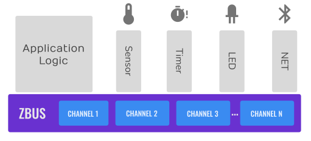
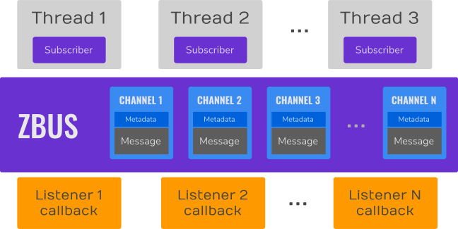
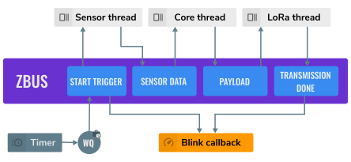
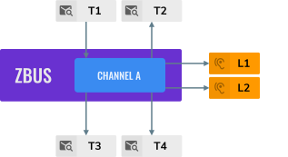
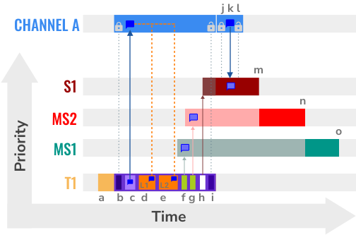

.. _zbus:

Zephyr message bus (zbus)
#########################

The :dfn:`Zephyr message bus - Zbus` is a lightweight and flexible message bus enabling a simple way for threads to talk to one another.

.. contents::
    :local:
    :depth: 2

Concepts
********

Threads can broadcast messages to all interested observers using zbus. Many-to-many communication is possible. The bus implements message-passing and publish/subscribe communication paradigms that enable threads to communicate synchronously or asynchronously through shared memory. The communication through zbus is channel-based, where threads publish and read to and from using messages. Additionally, threads can observe channels and receive notifications from the bus when the channels are modified. The figure below shows an example of a typical application using zbus in which the application logic (hardware independent) talks to other threads via message bus. Note that the threads are decoupled from each other because they only use zbus' channels and do not need to know each other to talk.

    A typical zbus application architecture.

The bus comprises:

* Set of channels that consists of a unique identifier, its control metadata information, and the message itself;
* :dfn:`Virtual distributed event dispatcher` (VDED), the bus logic responsible for sending notifications to the observers. The VDED logic runs inside the publishing action in the same thread context, giving the bus an idea of a distributed execution. When a thread publishes to a channel, it also propagates the notifications to the observers;
* Threads (subscribers) and callbacks (listeners) publishing, reading, and receiving notifications from the bus.

    Zbus anatomy.

The bus makes the publish, read, and subscribe actions available over channels. Publishing and reading are available in all RTOS thread contexts. However, it cannot run inside Interrupt Service Routines (ISR) because it uses mutexes to control channels access, and mutexes cannot work appropriately inside ISRs. The publish and read operations are simple and fast; the procedure is a mutex locking followed by a memory copy to and from a shared memory region and then a mutex unlocking. Another essential aspect of zbus is the observers, which can be:

* Static; defined in compile time. It is not possible to remove it at runtime, but it is possible to suppress it by calling the :c:func:`zbus_obs_set_enable`;
* Dynamic; it can be added and removed to and from a channel at runtime.

For illustration purposes, suppose a usual sensor-based solution in the figure below. When the timer is triggered, it pushes an action to a work queue that publishes to the ``Start trigger`` channel. As the sensor thread subscribed to the ``Start trigger`` channel, it fetches the sensor data. Notice the VDED executes the blink callback because it also listens to the ``Start trigger`` channel. When the sensor data is ready, the sensor thread publishes it to the ``Sensor data`` channel. The core thread, as a ``Sensor data`` channel subscriber, processes the sensor data and stores it in an internal sample buffer. It repeats until the sample buffer is full; when it happens, the core thread aggregates the sample buffer information, prepares a package, and publishes that to the ``Payload`` channel. The Lora thread receives that because it is a ``Payload`` channel subscriber and sends the payload to the cloud. When it completes the transmission, the Lora thread publishes to the ``Transmission done`` channel. The VDED executes the blink callback again since it listens to the ``Transmission done`` channel.

    Zbus sensor-based application.

This way of implementing the solution makes the application more flexible, enabling us to change things independently. For example, we want to change the trigger from a timer to a button press. We can do that, and the change does not affect other parts of the system. Likewise, we would like to change the communication interface from LoRa to Bluetooth; we only need to change the LoRa thread. No other change is required in order to make that work. Thus, the developer would do that for every block of the image. Based on that, there is a sign zbus promotes decoupling in the system architecture.

Another important aspect of using zbus is the reuse of system modules. If a code portion with well-defined behaviors (we call that module) only uses zbus channels and not hardware interfaces, it can easily be reused in other solutions. The new solution must implement the interfaces (set of channels) the module needs to work. That indicates zbus could improve the module reuse.

The last important note is the zbus solution reach. We can count on many ways of using zbus to enable the developer to be as free as possible to create what they need. For example, messages can be dynamic or static allocated; notifications can be synchronous or asynchronous; the developer can control the channel in so many different ways claiming the channel, developers can add their metadata information to a channel by using the user-data field, the discretionary use of a validator enables the systems to be accurate over message format, and so on. Those characteristics increase the solutions that can be done with zbus and make it a good fit as an open-source community tool.

.. _Virtual Distributed Event Dispatcher:

Virtual Distributed Event Dispatcher
====================================

The VDED execution always happens in the publishing's (thread) context. So it cannot occur inside an Interrupt Service Routine (ISR). Therefore, the IRSs must only access channels indirectly. The basic description of the execution is as follows:

* The channel mutex is acquired;
* The channel receives the new message via direct copy (by a raw :c:func:`memcpy`);
* The event dispatcher logic executes the listeners in the same sequence they appear on the channel observers' list. The listeners can perform non-copy quick access to the constant message reference directly (via the :c:func:`zbus_chan_const_msg` function) since the channel is still locked;
* The event dispatcher logic pushes the channel's reference to the subscribers' notification message queue. The pushing sequence is the same as the subscribers appear in the channel observers' list;
* At last, the publishing function unlocks the channel.

To illustrate the VDED execution, consider the example illustrated below. We have four threads in ascending priority T1, T2, T3, and T4 (the highest priority); two listeners, L1 and L2; and channel A. Suposing L1, L2, T2, T3, and T4 observer channel A.

    Zbus VDED execution example scenario.

The following code implements channel A. Note the ``struct a_msg`` is illustrative only.

.. code-block:: c

    ZBUS_CHAN_DEFINE(a_chan,                     /* Name */
             struct a_msg,                       /* Message type */

             NULL,                               /* Validator */
             NULL,                               /* User Data */
             ZBUS_OBSERVERS(L1, L2, T2, T3, T4), /* observers */
             ZBUS_MSG_INIT(0)                    /* Initial value {0} */
    );

In the figure below, the letters indicate some action related to the VDED execution. The X-axis represents the time, and the Y-axis represents the priority of threads. Channel A's message, represented by a voice balloon, is only one memory portion (shared memory). It appears several times only as an illustration of the message at that point in time.

    Zbus VDED execution detail.

The figure above illustrates the actions performed during the VDED execution when T1 publishes to channel A. Thus, the figure below describes the actions (represented by a letter) of the VDED execution.

.. list-table:: VDED execution steps in detail.
   :widths: 5 65
   :header-rows: 1

   * - Actions
     - Description
   * - a
     - T1 starts and at some point, publishes to channel A.
   * - b
     - The publishing (VDED) process starts. The VDED locks the channel A's mutex.
   * - c
     - The VDED copies the T1 message to the channel A message.

   * - d, e
     - The VDED executes L1 and L2 in the respective sequence. Inside the listeners, usually, there is a call to the :c:func:`zbus_chan_const_msg` function, which provides a direct constant reference to channel A's message. It is quick, and no copy is needed here.

   * - f, g, h
     - The VDED pushes the notification message to queues of T2, T3, and T4 sequentially. Notice the threads get ready to execute right after receiving the notification. However, they go to a pending state because they cannot access the channel since it is still locked. At that moment, the T1 thread gets its priority elevated (priority inheritance due to the mutex) to the highest pending thread (caused by channel A unavailability). In that case, T4's priority. It ensures the T1 will finish the VDED execution as quickly as possible without preemption from threads with priority below the engaged ones.

   * - i
     - VDED finishes the publishing by unlocking channel A.

   * - j, k
     - The T4 leaves the pending state since channel A is not locked. It gets in the CPU again and starts executing. As it did receive a notification from channel A, it performs a channel read (as simple as lock, memory copy, unlock), continues its execution, and goes out the CPU.

   * - l,m, n
     - Now, T3 can access the channel. It repeats the same steps from T4 (j and k). T2 does the same. That is the end of the VDED execution!

Limitations
===========

Based on the fact that developers can use zbus to solve many different problems, some challenges arise. Zbus will not solve every problem, so it is necessary to analyze the situation to be sure zbus is applicable. For instance, based on the zbus benchmark, it would not be well suited to a high-speed stream of bytes between threads. The `Pipe` kernel object solves this kind of need.

Delivery guarantees
-------------------

Zbus always delivers the messages to the listeners. However, there are no message delivery guarantees for subscribers because zbus only sends the notification, but the message reading depends on the subscriber's implementation. This is because channels have a mutex protected singleton objects for which message transfer is used. In other words, it can be seen as a single size queue where publishers always overwrite if queue is full. It is possible to increase the delivery rate by following design tips:

* Keep the listeners quick-as-possible (deal with them as ISRs). If some processing is needed, consider submitting a work to a work-queue;
* Try to give producers a high priority to avoid losses;
* Leave spare CPU for observers to consume data produced;
* Consider using message queues or pipes for intensive byte transfers.

Message delivery sequence
-------------------------

The listeners (synchronous observers) will follow the channel definition sequence as the notification and message consumption sequence. However, the subscribers, as they have an asynchronous nature, all will receive the notification as the channel definition sequence but only will consume the data when they execute again, so the delivery respects the order, but the priority assigned to the subscribers will define the reaction sequence. All the listeners (static o dynamic) will receive the message before subscribers receive the notification. The sequence of delivery is: (i) static listeners; (ii) runtime listeners; (iii) static subscribers; at last (iv) runtime subscribers.

Usage
*****

Zbus operation depends on channels and observers. Therefore, it is necessary to determine its message and observers list during the channel definition. A message is a regular C struct; the observer can be a subscriber (asynchronous) or a listener (synchronous).

The following code defines and initializes a regular channel and its dependencies. This channel exchanges accelerometer data, for example.

.. code-block:: c

    struct acc_msg {
            int x;
            int y;
            int z;
    };

    ZBUS_CHAN_DEFINE(acc_chan,                           /* Name */
             struct acc_msg,                             /* Message type */

             NULL,                                       /* Validator */
             NULL,                                       /* User Data */
             ZBUS_OBSERVERS(my_listener, my_subscriber), /* observers */
             ZBUS_MSG_INIT(.x = 0, .y = 0, .z = 0)       /* Initial value */
    );

    void listener_callback_example(const struct zbus_channel *chan)
    {
            const struct acc_msg *acc;
            if (&acc_chan == chan) {
                    acc = zbus_chan_const_msg(chan); // Direct message access
                    LOG_DBG("From listener -> Acc x=%d, y=%d, z=%d", acc->x, acc->y, acc->z);
            }
    }

    ZBUS_LISTENER_DEFINE(my_listener, listener_callback_example);

    ZBUS_SUBSCRIBER_DEFINE(my_subscriber, 4);
    void subscriber_task(void)
    {
            const struct zbus_channel *chan;

            while (!zbus_sub_wait(&my_subscriber, &chan, K_FOREVER)) {
                    struct acc_msg acc = {0};

                    if (&acc_chan == chan) {
                            // Indirect message access
                            zbus_chan_read(&acc_chan, &acc, K_NO_WAIT);
                            LOG_DBG("From subscriber -> Acc x=%d, y=%d, z=%d", acc.x, acc.y, acc.z);
                    }
            }
    }
    K_THREAD_DEFINE(subscriber_task_id, 512, subscriber_task, NULL, NULL, NULL, 3, 0, 0);

.. note::
    It is unnecessary to claim/lock a channel before accessing the message inside the listener since the event dispatcher calls listeners with the notifying channel already locked. Subscribers, however, must claim/lock that or use regular read operations to access the message after being notified.

Channels can have a ``validator function`` that enables a channel to accept only valid messages. Publish attempts invalidated by hard channels will return immediately with an error code. This allows original creators of a channel to exert some authority over other developers/publishers who may want to piggy-back on their channels. The following code defines and initializes a :dfn:`hard channel` and its dependencies. Only valid messages can be published to a :dfn:`hard channel`. It is possible because a ``Validator function`` passed to the channel's definition. In this example, only messages with ``move`` equal to 0, -1, and 1 are valid. Publish function will discard all other values to ``move``.

.. code-block:: c

    struct control_msg {
            int move;
    };

    bool control_validator(const void* msg, size_t msg_size) {
            const struct control_msg* cm = msg;
            bool is_valid = (cm->move == -1) || (cm->move == 0) || (cm->move == 1);
            return is_valid;
    }

    static int message_count = 0;

    ZBUS_CHAN_DEFINE(control_chan,    /* Name */
             struct control_msg,      /* Message type */

             control_validator,       /* Validator */
             &message_count,          /* User data */
             ZBUS_OBSERVERS_EMPTY,    /* observers */
             ZBUS_MSG_INIT(.move = 0) /* Initial value */
    );

The following sections describe in detail how to use zbus features.

.. _publishing to a channel:

Publishing to a channel
=======================

Messages are published to a channel in zbus by calling :c:func:`zbus_chan_pub`. For example, the following code builds on the examples above and publishes to channel ``acc_chan``. The code is trying to publish the message ``acc1`` to channel ``acc_chan``, and it will wait up to one second for the message to be published. Otherwise, the operation fails. As can be inferred from the code sample, it's OK to use stack allocated messages since VDED copies the data internally.

.. code-block:: c

	struct acc_msg acc1 = {.x = 1, .y = 1, .z = 1};
	zbus_chan_pub(&acc_chan, &acc1, K_SECONDS(1));

.. warning::
    Do not use this function inside an ISR.

.. _reading from a channel:

Reading from a channel
======================

Messages are read from a channel in zbus by calling :c:func:`zbus_chan_read`. So, for example, the following code tries to read the channel ``acc_chan``, which will wait up to 500 milliseconds to read the message. Otherwise, the operation fails.

.. code-block:: c

    struct acc_msg acc = {0};
    zbus_chan_read(&acc_chan, &acc, K_MSEC(500));

.. warning::
    Do not use this function inside an ISR.

.. warning::
    Choose the timeout of :c:func:`zbus_chan_read` after receiving a notification from :c:func:`zbus_sub_wait` carefully because the channel will always be unavailable during the VDED execution. Using ``K_NO_WAIT`` for reading is highly likely to return a timeout error if there are more than one subscriber. For example, consider the VDED illustration again and notice how ``T3`` and ``T4's`` read attempts would definitely fail with K_NO_WAIT. For more details, check the `Virtual Distributed Event Dispatcher`_ section.

Forcing channel notification
============================

It is possible to force zbus to notify a channel's observers by calling :c:func:`zbus_chan_notify`. For example, the following code builds on the examples above and forces a notification for the channel ``acc_chan``. Note this can send events with no message, which does not require any data exchange. See the code example under `Claim and finish a channel`_ where this may become useful.

.. code-block:: c

    zbus_chan_notify(&acc_chan, K_NO_WAIT);

.. warning::
    Do not use this function inside an ISR.

Declaring channels and observers
================================

For accessing channels or observers from files other than its defining files, it is necessary to declare them by calling :c:macro:`ZBUS_CHAN_DECLARE` and :c:macro:`ZBUS_OBS_DECLARE`. In other words, zbus channel definitions and declarations with the same channel names in different files would point to the same (global) channel. Thus, developers should be careful about existing channels, and naming new channels or linking will fail. It is possible to declare more than one channel or observer on the same call. The following code builds on the examples above and displays the defined channels and observers.

.. code-block:: c

    ZBUS_OBS_DECLARE(my_listener, my_subscriber);
    ZBUS_CHAN_DECLARE(acc_chan, version_chan);

Iterating over channels and observers
=====================================

Zbus subsystem also implements :ref:`Iterable Sections <iterable_sections_api>` for channels and observers, for which there are supporting APIs like :c:func:`zbus_iterate_over_channels` and :c:func:`zbus_iterate_over_observers`. This feature enables developers to call a procedure over all declared channels, where the procedure parameter is a :c:struct:`zbus_channel`. The execution sequence is in the alphabetical name order of the channels (see :ref:`Iterable Sections <iterable_sections_api>` documentation for details). Zbus also implements this feature for :c:struct:`zbus_observer`.

.. code-block:: c

    int count;

    bool print_channel_data_iterator(const struct zbus_channel *chan)
    {
            LOG_DBG("%d - Channel %s:", count, zbus_chan_name(chan));
            LOG_DBG("      Message size: %d", zbus_chan_msg_size(chan));
            ++count;
            LOG_DBG("      Observers:");
            for (struct zbus_observer **obs = chan->observers; *obs != NULL; ++obs) {
                LOG_DBG("      - %s", zbus_obs_name(*obs));
            }
            return true;
    }

    bool print_observer_data_iterator(const struct zbus_observer *obs)
    {
            LOG_DBG("%d - %s %s", count, ((obs->queue != NULL) ? "Subscriber" : "Listener"), zbus_obs_name(obs));
            ++count;
            return true;
    }
    int main(void)
    {
            LOG_DBG("Channel list:");
            count = 0;
            zbus_iterate_over_channels(print_channel_data_iterator);

            LOG_DBG("Observers list:");
            count = 0;
            zbus_iterate_over_observers(print_observer_data_iterator);
    }

The code will log the following output:

.. code-block:: console

    D: Channel list:
    D: 0 - Channel acc_chan:
    D:       Message size: 12
    D:       Observers:
    D:       - my_listener
    D:       - my_subscriber
    D: 1 - Channel version_chan:
    D:       Message size: 4
    D:       Observers:
    D: Observers list:
    D: 0 - Listener my_listener
    D: 1 - Subscriber my_subscriber

.. _Claim and finish a channel:

Advanced channel control
========================

Zbus was designed to be as flexible and extensible as possible. Thus, there are some features designed to provide some control and extensibility to the bus.

Listeners message access
------------------------

For performance purposes, listeners can access the receiving channel message directly since they already have the mutex lock for it. To access the channel's message, the listener should use the :c:func:`zbus_chan_const_msg` because the channel passed as an argument to the listener function is a constant pointer to the channel. The const pointer return type tells developers not to modify the message.

.. code-block:: c

    void listener_callback_example(const struct zbus_channel *chan)
    {
            const struct acc_msg *acc;
            if (&acc_chan == chan) {
                    acc = zbus_chan_const_msg(chan); // Use this
                    // instead of zbus_chan_read(chan, &acc, K_MSEC(200))
                    // or zbus_chan_msg(chan)

                    LOG_DBG("From listener -> Acc x=%d, y=%d, z=%d", acc->x, acc->y, acc->z);
            }
    }

User Data
---------
It is possible to pass custom data into the channel's ``user_data`` for various purposes, such as writing channel metadata. That can be achieved by passing a pointer to the channel definition macro's ``user_data`` field, which will then be accessible by others. Note that ``user_data`` is individual for each channel. Also, note that ``user_data`` access is not thread-safe. For thread-safe access to ``user_data``, see the next section.

Claim and finish a channel
--------------------------

To take more control over channels, two function were added :c:func:`zbus_chan_claim` and :c:func:`zbus_chan_finish`. With these functions, it is possible to access the channel's metadata safely. When a channel is claimed, no actions are available to that channel. After finishing the channel, all the actions are available again.

.. warning::
    Never change the fields of the channel struct directly. It may cause zbus behavior inconsistencies and scheduling issues.

.. warning::
    Do not use these functions inside an ISR.

The following code builds on the examples above and claims the ``acc_chan`` to set the ``user_data`` to the channel. Suppose we would like to count how many times the channels exchange messages. We defined the ``user_data`` to have the 32 bits integer. This code could be added to the listener code described above.

.. code-block:: c

    if (!zbus_chan_claim(&acc_chan, K_MSEC(200))) {
            int *message_counting = (int *) zbus_chan_user_data(&acc_chan);
            *message_counting += 1;
            zbus_chan_finish(&acc_chan);
    }

The following code has the exact behavior of the code in :ref:`publishing to a channel`.

.. code-block:: c

    if (!zbus_chan_claim(&acc_chan, K_MSEC(200))) {
            struct acc_msg *acc1 = (struct acc_msg *) zbus_chan_msg(&acc_chan);
            acc1.x = 1;
            acc1.y = 1;
            acc1.z = 1;
            zbus_chan_finish(&acc_chan);
            zbus_chan_notify(&acc_chan, K_SECONDS(1));
    }

The following code has the exact behavior of the code in :ref:`reading from a channel`.

.. code-block:: c

    if (!zbus_chan_claim(&acc_chan, K_MSEC(200))) {
            const struct acc_msg *acc1 = (const struct acc_msg *) zbus_chan_const_msg(&acc_chan);
            // access the acc_msg fields directly.
            zbus_chan_finish(&acc_chan);
    }

Runtime observer registration
-----------------------------

It is possible to add observers to channels in runtime. This feature uses the object pool pattern technique in which the dynamic nodes are pre-allocated and can be used and recycled. Therefore, it is necessary to set the pool size by changing the feature :kconfig:option:`CONFIG_ZBUS_RUNTIME_OBSERVERS_POOL_SIZE` to enable this feature. Furthermore, it uses memory slabs. When necessary, turn on the :kconfig:option:`CONFIG_MEM_SLAB_TRACE_MAX_UTILIZATION` configuration to track the maximum usage of the pool. The following example illustrates the runtime registration usage.

.. code-block:: c

    ZBUS_LISTENER_DEFINE(my_listener, callback);
    // ...
    void thread_entry(void) {
            // ...
            /* Adding the observer to channel chan1 */
            zbus_chan_add_obs(&chan1, &my_listener);
            /* Removing the observer from channel chan1 */
            zbus_chan_rm_obs(&chan1, &my_listener);

Zbus can only use a limited number of dynamic observers. The configuration option :kconfig:option:`CONFIG_ZBUS_RUNTIME_OBSERVERS_POOL_SIZE` represents the size of the runtime observers pool (memory slab). Change that to fit the solution needs. Use the :c:func:`k_mem_slab_num_used_get` to verify how many runtime observers slots are available. The function :c:func:`k_mem_slab_max_used_get` will provide information regarding the maximum number of used slots count reached during the execution. Use that to set the appropriate pool size avoiding waste. The following code illustrates how to use that.

.. code-block:: c

    extern struct k_mem_slab _zbus_runtime_obs_pool;
    uint32_t slots_available = k_mem_slab_num_free_get(&_zbus_runtime_obs_pool);
    uint32_t max_usage = k_mem_slab_max_used_get(&_zbus_runtime_obs_pool);

.. warning::
    Do not use ``_zbus_runtime_obs_pool`` memory slab directly. It may lead to inconsistencies.

Samples
*******

For a complete overview of zbus usage, take a look at the samples. There are the following samples available:

* :ref:`zbus-hello-world-sample` illustrates the code used above in action;
* :ref:`zbus-work-queue-sample` shows how to define and use different kinds of observers. Note there is an example of using a work queue instead of executing the listener as an execution option;
* :ref:`zbus-dyn-channel-sample` demonstrates how to use dynamically allocated exchanging data in zbus;
* :ref:`zbus-uart-bridge-sample` shows an example of sending the operation of the channel to a host via serial;
* :ref:`zbus-remote-mock-sample` illustrates how to implement an external mock (on the host) to send and receive messages to and from the bus.
* :ref:`zbus-runtime-obs-registration-sample` illustrates a way of using the runtime observer registration feature;
* :ref:`zbus-benchmark-sample` implements a benchmark with different combinations of inputs.

Suggested Uses
**************

Use zbus to transfer data (messages) between threads in one-to-one, one-to-many, and many-to-many synchronously or asynchronously.

.. note::
    Zbus can be used to transfer streams from the producer to the consumer. However, this can increase zbus' communication latency. So maybe consider a Pipe a good alternative for this communication topology.

Configuration Options
*********************

For enabling zbus, it is necessary to enable the :kconfig:option:`CONFIG_ZBUS` option.

Related configuration options:

* :kconfig:option:`CONFIG_ZBUS_CHANNEL_NAME` enables the name of channels to be available inside the channels metadata. The log uses this information to show the channels' names;
* :kconfig:option:`CONFIG_ZBUS_OBSERVER_NAME` enables the name of observers to be available inside the channels metadata;
* :kconfig:option:`CONFIG_ZBUS_STRUCTS_ITERABLE_ACCESS` enables :ref:`Iterable Sections <iterable_sections_api>` to on zbus channels and observers;
* :kconfig:option:`CONFIG_ZBUS_RUNTIME_OBSERVERS_POOL_SIZE` enables the runtime observer registration. It is necessary to set a value to be greater than zero.

API Reference
*************

.. doxygengroup:: zbus_apis
