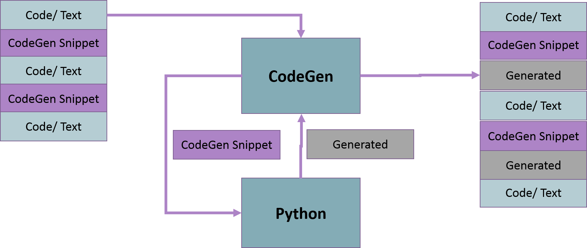
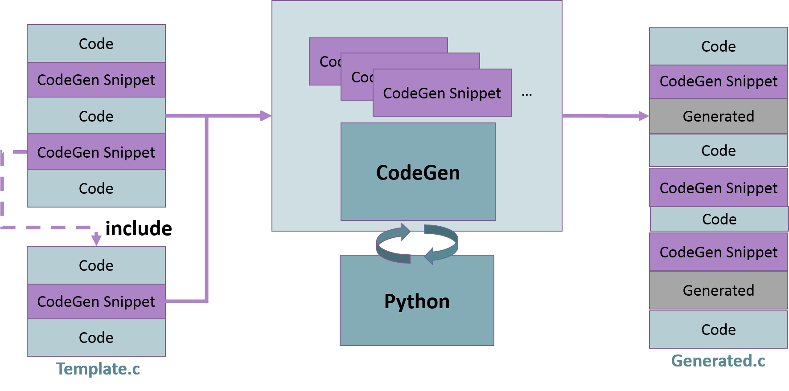
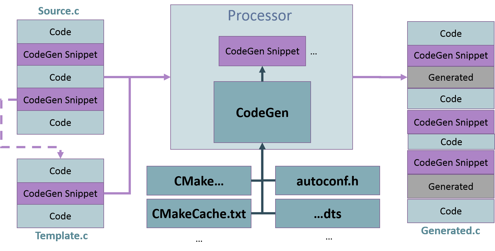
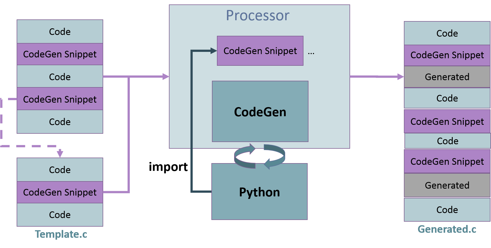

..
    Copyright (c) 2018 Bobby Noelte
    SPDX-License-Identifier: Apache-2.0

.. _codegen_principle:

Code Generation Principle
#########################

How code generation works in Zephyr.

.. contents::
   :depth: 2
   :local:
   :backlinks: top

Principle
---------

Inclusion of other inline code
------------------------------

Access to Zephyr data
---------------------

Import of Python modules
------------------------

