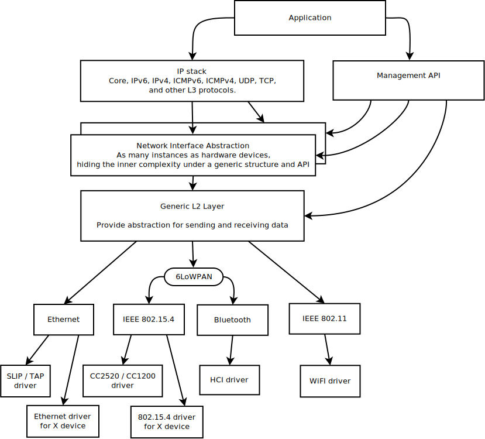

.. _ip_stack_architecture:

IP Stack Architecture
#####################

High level overview of the IP stack
***********************************

    Network stack overview

*The IP stack is layered and it consists of the following parts:*

* **Networking Application.** This application uses the connectivity API to
  manipulate a network connection, and management API to set network
  related parameters such as starting a scan (when applicable),
  setting IP address to a network interface, etc.

* **Core IP stack.** This provides implementations for
  various protocols such as IPv6, IPv4, UDP, TCP, ICMPv4 and ICMPv6.

* **Network interface abstraction layer.** This provides functionality
  that is common in all the network interfaces, such as acquiring
  an IP address, etc.

* **Generic L2 layer.** This provides common API for sending and receiving
  data to and from an actual network device.

* **L2 network technology component.** These components include Ethernet,
  IEEE 802.15.4, Bluetooth, etc. Some of these technologies support IPv6
  header compression (6LoWPAN), which is done in its own layer. For
  example ARP for IPv4 is done in the Ethernet component.

* **Network device driver.** The actual low-level device driver handles the
  physical sending or receiving of a network packet.

Network data flow
*****************

.. figure:: ip-stack-data-flow.svg
    :align: center
    :alt: Network data flow
    :figclass: align-center

    Network data flow

The application typically consists of one or more tasks or threads
that execute the application logic. When using the network
connectivity APIs, following things will happen.

*Data receiving (RX):*

1) A network data packet is received by a device driver.

2) The device driver allocates enough network buffers to store the received
   data. The network buffers are then passed to the RX FIFO
   for further processing. The RX FIFO is used as a way to separate
   the data processing pipeline (bottom-half) as the device driver is
   running in interrupt context and it must do its processing very fast.

3) The RX thread reads the RX FIFO and passes the data to the correct
   L2 driver. After the L2 driver has checked the packet, the packet is
   passed to L3 processing. The L3 layer checks if the packet is a proper
   IPv6 or IPv4 packet. If the packet contains UDP or TCP data, it
   is then sent to correct application via a function callback.
   This also means that the application data processing in that callback
   is run in thread context even if the actual application is running
   in task context. The data processing in the application callback should
   be done fast in order not to block the system too long.
   There is only one RX thread in the system. The stack size of the RX
   thread can be tweaked via Kconfig option but it should be kept as
   small as possible. This also means that stack utilization in the
   data processing callback should be minimized in order to avoid stack
   overflow.

4) The application will then receive the data, which is stored inside a chain
   of net_bufs. The application now owns the data. After it has finished working
   with it, the application should release the net_bufs data by calling
   `net_nbuf_unref()`.

*Data sending (TX):*

1) The application should use the connectivity API when the application is
   ready to send data. The sent data is checked by the correct L2 layer module
   and if everything is ok, the data is placed into the network interface TX
   queue. The network interface is typically selected to be the same interface
   for reply data packets or the interface is selected according to the routing
   algorithm. The application should not free the data packet if it was
   correctly placed into TX queue; the network driver will release the packet
   after it is sent. If the connectivity API sending function returns an error
   to the application, that means the packet was not sent correctly and the
   application needs to free the packet.

2) Each network interface has a TX thread associated with it and the TX thread
   will send the packet to the correct device driver.

3) If the device driver is able to inject the network packet into the
   network, then it will release the packet. Typically there are no
   retransmits at this lower level so usually the packet is released
   even if not sent correctly. This depends on the technology being used.
