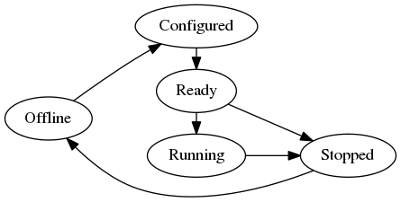

# Remoteproc Design Document
Remoteproc provides abstraction to manage the life cycle of a remote
application. For now, it only provides APIs on bringing up and
tearing down the remote application, and parsing resource table.
It will extend to crash detection, suspend and resume.

## Remoteproc LCM States
| State | State Description |
|:------|:------------------|
| Offline | Initial state of a remoteproc instance. The remote presented by the remoteproc instance and its resource has been powered off. |
| Configured | The remote presented by the remoteproc instance has been configured. And ready to load applicaiton. |
| Ready | The remote presented by the remoteproc instance has applicaiton loaded, and ready to run. |
| Stopped | The remote presented by the remoteproc instance has stopped from running. But the remote is still powered on. And the remote's resource hasn't been released. |



### State Transition
| State Transition | Transition Trigger |
|:-----------------|:-------------------|
| Offline -> Configured | Configure the remote to make it able to load application;<br>`remoteproc_configure(&rproc, &config_data)`|
| Configured -> Ready | load firmware ;<br>`remoteproc_load(&rproc, &path, &image_store, &image_store_ops, &image_info)` |
| Ready -> Running | start the processor; <br>`remoteproc_start(&rproc)` |
| Ready -> Stopped | stop the processor; <br>`remoteproc_stop(&rproc)`; <br>`remoteproc_shutdown(&rproc)`(Stopped is the intermediate state of shutdown operation)  |
| Running -> Stopped | stop the processor; <br>`remoteproc_stop(&rproc)`; <br>`remoteproc_shutdown(&rproc)` |
| Stopped -> Offline | shutdown the processor; <br>`remoteproc_shutdown(&rproc)` |

## Remote User APIs
* Initialize remoteproc instance:
  ```
  struct remoteproc *remoteproc_init(struct remoteproc *rproc,
				     struct remoteproc_ops *ops, void *priv)
  ```
* Release remoteproc instance:
  ```
  int remoteproc_remove(struct remoteproc *rproc)
  ```
* Add memory to remoteproc:
  ```
  void remoteproc_add_mem(struct remoteproc *rproc, struct remoteproc_mem *mem)
  ```
* Get memory libmetal I/O region from remoteproc specifying memory name:
  ```
  struct metal_io_region *remoteproc_get_io_with_name(struct remoteproc *rproc, const char *name)
  ```
* Get memory libmetal I/O region from remoteproc specifying physical address:
  ```
  struct metal_io_region *remoteproc_get_io_with_pa(struct remoteproc *rproc, metal_phys_addr_t pa);
  ```
* Get memory libmetal I/O region from remoteproc specifying virtual address:
  ```
  struct metal_io_region *remoteproc_get_io_with_va(struct remoteproc *rproc, void *va);
  ```
* Map memory and add the memory to the remoteproc instance:
  ```
  void *remoteproc_mmap(struct remoteproc *rproc,
		        metal_phys_addr_t *pa, metal_phys_addr_t *da,
		        size_t size, unsigned int attribute,
		        struct metal_io_region **io);
  ```
* Set resource table to remoteproc:
  ```
  int remoteproc_set_rsc_table(struct remoteproc *rproc,
			       struct resource_table *rsc_table,
			       size_t rsc_size)
  ```
* Configure the remote presented by the remoteproc instance to make it able
  to load applicaiton:
  ```
  int remoteproc_config(struct remoteproc *rproc, void *data)
  ```
* Load application to the remote presented by the remoteproc instance to make
  it ready to run:
  ```
  int remoteproc_load(struct remoteproc *rproc, const char *path,
		      void *store, struct image_store_ops *store_ops,
		      void **img_info)
  ```
* Run application on the remote presented by the remoteproc instance:
  ```
  int remoteproc_start(struct remoteproc *rproc)
  ```
* Stop application on remote presented by the remoteproc instance:
  ```
  int remoteproc_stop(struct remoteproc *rproc)
  ```
* Shutdown the remote presented by the remoteproc instance:
  ```
  int remoteproc_shutdown(struct remoteproc *rproc)
  ```
* Create virtio device from the resource table vdev resource, and add it to the
  remoteproc instance:
  ```
  struct virtio_device *remoteproc_create_virtio(struct remoteproc *rproc,
						 int vdev_id, unsigned int role,
						 void (*rst_cb)(struct virtio_device *vdev))
  ```
* Remove virtio device from the remoteproc instance:
  ```
  void remoteproc_remove_virtio(struct remoteproc *rproc,
			        struct virtio_device *vdev)
  ```


