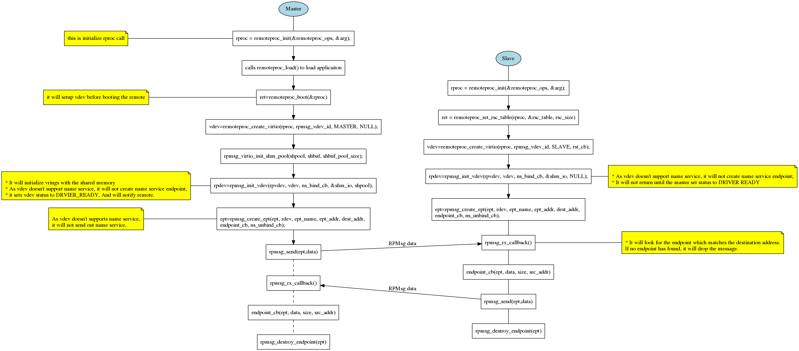
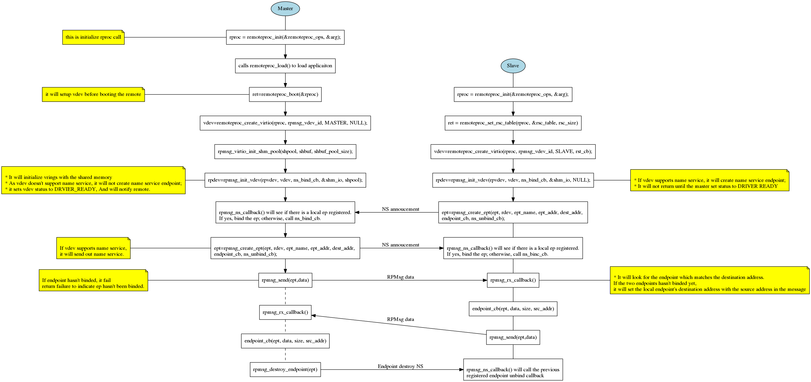
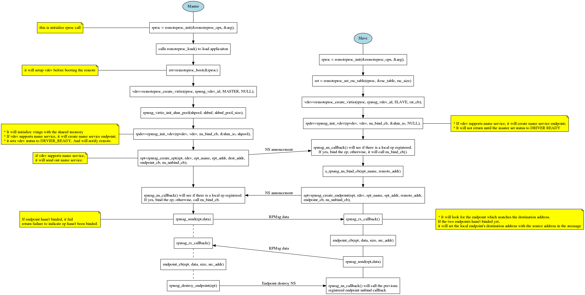

# RPMsg Design Document
RPMsg is a framework to allow communication between two processors.
RPMsg implementation in OpenAMP library is based on virtio. It complies
the RPMsg Linux kernel implementation. It defines the handshaking on
setting up and tearing down the communication between applicaitons
running on two processors.

## RPMsg User API Flow Chats
### RPMsg Static Endpoint

### Binding Endpoint Dynamically with Name Service

### Creating Endpoint Dynamically with Name Service


## RPMsg User APIs
* RPMsg virtio master to initialize the shared buffers pool(RPMsg virtio slave
  doesn't need to use this API):
  ```
  void rpmsg_virtio_init_shm_pool(struct rpmsg_virtio_shm_pool *shpool,
				  void *shbuf, size_t size)
  ```
* Initialize RPMsg virtio device:
  ```
  int rpmsg_init_vdev(struct rpmsg_virtio_device *rvdev,
		      struct virtio_device *vdev,
		      rpmsg_ns_bind_cb ns_bind_cb,
		      struct metal_io_region *shm_io,
		      struct rpmsg_virtio_shm_pool *shpool)
  ```
* Deinitialize RPMsg virtio device:
  ```
  void rpmsg_deinit_vdev(struct rpmsg_virtio_device *rvdev)`
  ```
* Get RPMsg device from RPMsg virtio device:
  ```
  struct rpmsg_device *rpmsg_virtio_get_rpmsg_device(struct rpmsg_virtio_device *rvdev)
  ```
* Create RPMsg endpoint:
  ```
  int rpmsg_create_ept(struct rpmsg_endpoint *ept,
		       struct rpmsg_device *rdev,
		       const char *name, uint32_t src, uint32_t dest,
		       rpmsg_ept_cb cb, rpmsg_ns_unbind_cb ns_unbind_cb)
  ```
* Destroy RPMsg endpoint:
  ```
  void rpmsg_destroy_ept(struct rpsmg_endpoint *ept)
  ```
* Check if the local RPMsg endpoint is binded to the remote, and ready to send
  message:
  ```
  int is_rpmsg_ept_ready(struct rpmsg_endpoint *ept)
  ```
* Send message with RPMsg endpoint default binding:
  ```
  int rpmsg_send(struct rpmsg_endpoint *ept, const void *data, int len)
  ```
* Send message with RPMsg endpoint, specify destination address:
  ```
  int rpmsg_sendto(struct rpmsg_endpoint *ept, void *data, int len,
		   uint32_t dst)
  ```
* Send message with RPMsg endpoint using explicit source and destination
  addresses:
  ```
  int rpmsg_send_offchannel(struct rpmsg_endpoint *ept,
			    uint32_t src, uint32_t dst,
			    const void *data, int len)
  ```
* Try to send message with RPMsg endpoint default binding, if no buffer
  available, returns:
  ```
  int rpmsg_trysend(struct rpmsg_endpoint *ept, const void *data,
		    int len)
  ```
* Try to send message with RPMsg endpoint, specify destination address,
  if no buffer available, returns:
  ```
  int rpmsg_trysendto(struct rpmsg_endpoint *ept, void *data, int len,
		      uint32_t dst)
  ```
* Try to send message with RPMsg endpoint using explicit source and destination
  addresses, if no buffer available, returns:
  ```
  int rpmsg_trysend_offchannel(struct rpmsg_endpoint *ept,
			       uint32_t src, uint32_t dst,
			       const void *data, int len)`
  ```
## RPMsg User Defined Callbacks
* RPMsg endpoint message received callback:
  ```
  int (*rpmsg_ept_cb)(struct rpmsg_endpoint *ept, void *data,
		      size_t len, uint32_t src, void *priv)
  ```
* RPMsg name service binding callback. If user defines such callback, when
  there is a name service announcement arrives, if there is no registered
  endpoint found to bind to this name service, it will call this callback.
  If this callback is not defined, it will drop this name service.:
  ```
  void (*rpmsg_ns_bind_cb)(struct rpmsg_device *rdev,
			   const char *name, uint32_t dest)
  ```
* RPMsg endpoint name service unbind callback. If user defines such callback,
  when there is name service destroy arrives, it will call this callback to
  notify the user application about the remote has destroyed the service.:
  ```
  void (*rpmsg_ns_unbind_cb)(struct rpmsg_endpoint *ept)
  ```
