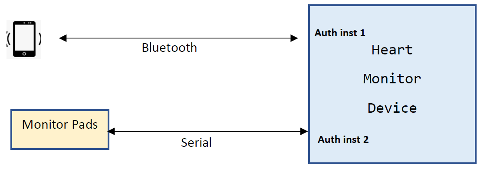

.. _auth_multi-sample:

Multiple Authentication Instances
#################################

Overview
********

This sample shows how to use two authentication instances using the serial and Bluetooth transports.  In this sample,
DTLS authentication is instance 1 and uses the Bluetooth transport, the Challenge-Response authentication is instance
2 and uses the Serial transport.  The choice of instance and authentication methods are just for sample purposes, it is
possible to use any combination of authentication method and transport.  For example, two instances of Challenge-Response
using the Serial transport.

Here is a real world example of multiple authentication instances.  A medical device with disposable heart monitor pads and a
Bluetooth connection.  The monitor pads are connected via serial link and are authenticated when plugged into the device.
When the pads are replaced, the new pads are authenticated. The mobile app is authenticated over the Bluetooth link.

One authentication instance handles the monitor pads, the second instance handles the mobile app connection.

Building and Running
--------------------
This sample was developed and tested with two Nordic nRF52840 dev
kits (see: https://www.nordicsemi.com/Software-and-Tools/Development-Kits/nRF52840-DK).  Two Ubuntu
VMs were used, one running the Central the other VM running the Peripheral.

To build:|br|
cmake -Bbuild_auth_client -DBOARD=nrf52840dk_nrf52840  samples/authentication/multi_instance/auth_client

To build using West:|br|
west build -d build_auth_client -b nrf52840dk_nrf52840 samples/authentication/multi_instance/auth_client

Replace auth_client with auth_server to build the server.
