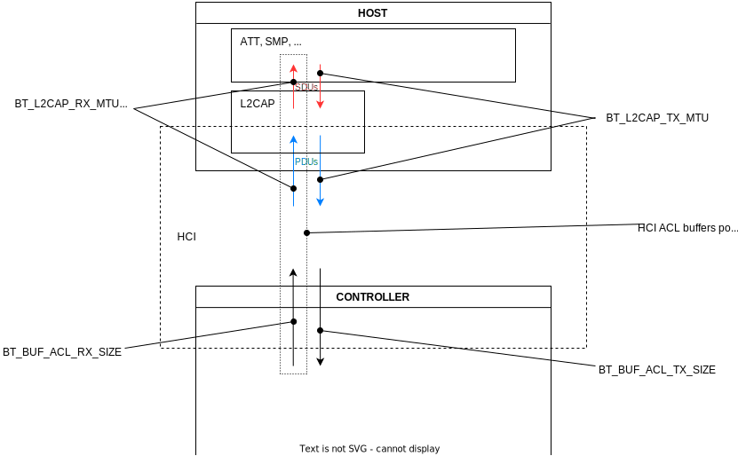

.. zephyr:code-sample:: bluetooth_mtu_update
   :name: MTU Update
   :relevant-api: bt_gatt bluetooth

   Configure and exchange MTU between two devices.

Q&A:
****

  Question: What do I have to do to update my ATT MTU?

| Answer: To get an ATT MTU of x octets, do the following:
| Set :kconfig:option:`CONFIG_BT_L2CAP_TX_MTU` to at least x
| Set :kconfig:option:`CONFIG_BT_BUF_ACL_RX_SIZE` to at least x + L2CAP header
  size (4 octets).
| Set :kconfig:option:`CONFIG_BT_BUF_ACL_RX_SIZE` to at least x + L2CAP header +
  SDU length field length (6 octets) if using
  :kconfig:option:`CONFIG_BT_EATT`.
| Ensure the remote side supports the same MTUs.

  Question: I only want to *send* large packets. I don't need to receive large
  ones.
  Do I still need to set :kconfig:option:`CONFIG_BT_BUF_ACL_RX_SIZE`?

Answer: Yes. [#mtu_exchange]_ The Bluetooth specification mandates a symmetric MTU for ATT.

Overview:
*********

This sample demonstrates the exchange of MTU between two devices to allow a
large notification to be sent.
Updating the MTU can be useful to send bigger packets and so have a better
throughput.

To be able to send a large notification both the server and the client need to
update their MTU. The MTU is not a negotiated value, the client and the server
will exchange their MTUs and choose the minimum of the two. Thus the two MTU can
be set to a different value, but the MTU of the server must be greater or equal
to the MTU of the client.

According to the Bluetooth specification, [#mtu]_ MTU is the maximum size of
SDUs.
However, in Zephyr, we can assume that it also represents the maximum size of
the PDUs. Because, in Bluetooth LE, [#sud_encapsulation]_ unless we are using L2CAP dynamic
channels, SDUs are not segmented.
The Kconfig symbol used to configure the size of the TX MTU is
:kconfig:option:`CONFIG_BT_L2CAP_TX_MTU`. There is no Kconfig symbol to update
the size of the RX MTU, because Zephyr uses a buffer pool for ACL RX buffers
coming from the controller.
The L2CAP RX MTU is defined as the maximum size of ACL RX buffers minus the
L2CAP header size.
That maximum ACL RX buffer size is configured with
:kconfig:option:`CONFIG_BT_BUF_ACL_RX_SIZE`.
The resulting L2CAP RX MTU will be the value of this Kconfig symbol minus the
L2CAP header size.

     Diagram of the MTUs and their corresponding Kconfig symbols

Hardware Setup
**************

This sample use two applications, two devices need to be setup.
The first one should be flashed with the central and the second one with the
peripheral.

The two devices will connect only if they are close to each other, because of
RSSI filtering.

Building and Running
********************

This sample can be found under :zephyr_file:`samples/bluetooth/mtu_update` in
the Zephyr tree.

See :zephyr:code-sample-category:`bluetooth` samples for details.

If the devices are close enough, the central should connect to the peripheral
and send his MTU to the other device. If the MTU exchange succeeds, the central
should subscribe and then the peripheral will send a large notification. Right
after receiving the notification the central should unsubscribe.

Here are the outputs you should have on the devices:

Central:

.. code-block:: console

  *** Booting Zephyr OS build zephyr-v3.2.0-2251-g95d8943c69ce ***
  Bluetooth initialized
  Scanning successfully started
  Device found: EB:BF:36:26:42:09 (random) (RSSI -34)
  Connected: EB:BF:36:26:42:09 (random)
  mtu_exchange: Current MTU = 23
  mtu_exchange: Exchange MTU...
  mtu_exchange_cb: MTU exchange successful (247)
  [ATTRIBUTE] handle 16
  [ATTRIBUTE] handle 17
  [ATTRIBUTE] handle 19
  [SUBSCRIBED]
  [NOTIFICATION] data 0x20004b73 length 100
  [UNSUBSCRIBED]

Peripheral:

.. code-block:: console

  *** Booting Zephyr OS build zephyr-v3.2.0-2251-g95d8943c69ce ***
  Updated MTU: TX: 23 RX: 23 bytes
  Updated MTU: TX: 247 RX: 247 bytes
  MTU Test Update: notifications enabled
  MTU Test Update: notifications disabled

References
**********

.. [#mtu_exchange] Bluetooth Core Specification v. 5.3: Vol. 3, Part F, 3.4.2
.. [#mtu] Bluetooth Core Specification v. 5.3: Vol. 3, Part A, 5.1
.. [#sud_encapsulation] Bluetooth Core Specification v. 5.3: Vol. 3, Part A, 7.3
