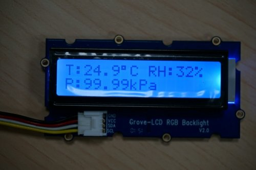
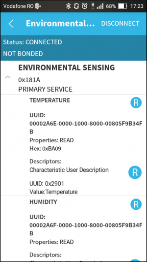

.. _env_sensing_sample:

Environmental Sensing Sample
############################

Overview
********

This sample implements a simple environmental sensing service using the Arduino
101 board.

The sensor subsystem application collects temperature, humidity and pressure
data from a set of sensors connected to the Arduino 101 and sends it to the SoC
through IPM. The collected sensor data is also displayed by the sensor subsystem
on a Grove LCD.

The application processor exposes the received sensor data as a simple Bluetooth
Environmental Sensing Service.

Requirements
************

To use this sample, the following hardware is required:

* Arduino 101
* `Grove LCD module`_
* `Grove Base Shield`_ [Optional]
* `HDC1008 Sensor`_
* `BME280 Sensor`_

Wiring
******

External Wiring
===============

The sample uses the HDC1008 sensor for temperature and humidity measurement, and
the BMP280 sensor for pressure measurement. This section describes how to wire
these sensors to the Arduino 101 board.

Both sensors operate at 3.3V and use I2C to communicate with the Arduino. On the
Arduino 101, the I2C data pin (SDA) is exposed as pin A4 (on the ANALOG IN
header) and the I2C clock pin (SCL) as pin A5 (also on the ANALOG IN header).
Since the Arduino 101 doesn't have internal pull-up resistors, these need to be
added externally when connecting SCL and SDA to the sensors.

In addition to connecting the ground (GND), 3.3V power (VDD and VDDIO) and I2C
pins, both HDC1008 and BMP280 require some extra wiring.

For HDC1008, connect the address pins (A0 and A1) to GND (this sets the device
address to the default used by the app). Also connect the RDY pin of the sensor
to the A1 pin (on ANALOG IN header) of the Arduino board. This is needed as the
application configures data-ready interrupt on that pin (GPIO pin 3).

For BMP280, connect the SDO pin to GND and the CSB pin to VDDIO, since the
sensor needs to be setup to use I2C, and not SPI.

.. image:: figures/wiring.png
    :width: 600px
    :align: center
    :alt: Wiring with Arduino 101

Using board sensors
===================

If you do not want to use any external sensors, you can use the Arduino 101's
internal BMI160 sensor to do just temperature readings. To do this, you need to
modify the channel_info array from the sensor subsystem application to contain
only BMI160's temperature channel, and also remove the humidity and pressure
characteristic from the control application (running on the application
processor).

If you choose this approach and you also want to use the Grove LCD, then you
also need to modify the sensor subsystem application to only display temperature
on the LCD, as humidity and pressure values will not be available.

Grove LCD
=========

Using the Grove LCD is optional and it can be disabled by removing the Grove
configuration options from the arc/proj.conf file.

The Grove LCD communicates with the sensor subsystem through the I2C bus. When
connecting the Grove LCD to the Arduino 101, either directly (similar to sensor
wiring) or through a Grove Base Shield, you need to make sure that the I2C SDA
and SCL lines have pull-up resistors connected between GND and the 3.3V power
source.

Take note that even though SDA and SCL are connected to a 3.3V power source, the
Grove LCD VDD line needs to be connected to the 5V power line, otherwise
characters will not be displayed on the LCD (3.3V is enough to power just the
backlight).

Building and Running
********************

Building
========

This sample builds two applications for both the sensor subsystem (arc) and the
application processor (x86). The resulting images need to be flashed to the
device either using JTAG (openocd) or DFU util (USB).

Before using the environmental sensing sample, the Arduino 101 board needs to be
flashed with the firmware for its nRF51 Bluetooth LE controller. To do this,
follow the steps in :ref:`bluetooth_firmware_arduino_101`.

Build and flash each of the images either using JTAG or DFU (DFU is preferred):

.. zephyr-app-commands::
   :zephyr-app: samples/boards/arduino_101/environmental_sensing/ap
   :board: arduino_101
   :goals: build flash
   :compact:

.. zephyr-app-commands::
   :zephyr-app: samples/boards/arduino_101/environmental_sensing/sensor
   :board: arduino_101_sss
   :goals: build flash
   :compact:

Running
========
The ARC (Sensor Subsystem) program collects temperature, humidity and pressure
data using the sensors API and sends it to the x86 core through an outbound
IPM. The collected data is also displayed on a Grove LCD.

The x86 program reads the sensor data from an inbound IPM and exposes it as
GATT characteristics (temperature, humidity and pressure) through a simple
Bluetooth Environmental Sensing Service. The values of these characteristics
are updated every time a new message containing sensor data is received.

An example of sensor data values that can be seen on the Grove LCD is
illustrated in the image below.

The data exposed over Bluetooth using an Environmental Sensing Service can be
tested with a BLE Scanner app. The image below is a screenshot of such an application.

The temperature value is 0xBA09 (little-endian) which is equal to 2490 in
decimal. Since the Bluetooth specification states that temperature values are
expressed with a resolution of 0.01 degrees Celsius, the value exposed over
Bluetooth is the same as the one displayed on the Grove LCD (24.9 degrees
Celsius).

.. _HDC1008 Sensor: https://www.adafruit.com/product/2635
.. _BME280 Sensor: https://www.adafruit.com/products/2652
.. _Grove Base Shield: http://wiki.seeedstudio.com/wiki/Grove_-_Base_Shield
.. _Grove LCD module: http://wiki.seeed.cc/Grove-LCD_RGB_Backlight/
