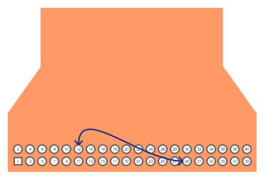

.. _i2s_app-sample:

Intel® S1000 I2S Audio Sample Application
#########################################

Overview
********

This sample application demonstrates audio playback on an Intel® S1000 CRB.
The application uses the following drivers

- I2S driver
- Codec driver

Two instances of the I2S driver are used.

- I2S_1 is used as the output interface to play audio to the onboard codec.
- I2S_2 is used as the input interface to receive audio from a connected host.

Intel® S1000 is the master on both I2S interfaces.
The host is a slave on the I2S and is expected to send a stereo audio at a
sampling frequency of 48KHz, 32 bits per sample.

The app can be built in one of two modes and the mode selection is done by
providing a command line flag to ``west build`` or ``cmake``.

1. **Audio Playback from Host**

   In this mode, the audio is played from the host. For example, on Linux hosts,
   the ALSA ``aplay`` utility may be used to send Audio over the I2S bus to
   S1000.
   The app receives the audio from the host and forwards it to over another I2S
   interface to the codec to play it out on the audio jack.
   A copy of the same audio is also looped back to the host.

   This mode is chosen when ``-DAUDIO_PLAY_FROM_HOST=Y`` is specified in the
   ``west build`` or ``cmake`` command.

   In this mode, the app forwards the audio forever, and does not exit.
   After the app starts, one may use the ALSA aplay command on a Linux host
   connected to S1000 over the I2S bus.

   ``aplay -f S32_LE -r 48000 -c 2 -D <Device> <WAV file>``

#. **Tone playback from S1000**

   In this mode, a sequence of tones is generated by the app and played out over
   the I2S bus connected to the codec.

   This mode is chosen when ``-DAUDIO_PLAY_FROM_HOST=N`` is specified in the
   ``west build`` or ``cmake`` command.

   In this mode, the app exits after the tone sequence is played.
   For the duration of tone playback, the app uses the I2S interface connected
   to the host for generating audio frame timing. The audio frames thus received
   are looped back on the same I2S interface.

   If a host is connected on this I2S, it may still play audio and record the
   looped back audio. However, only the audio tones generated within the app
   will be sent to the codec.

Requirements
************

This application uses an Intel® S1000 Customer Reference Board (CRB)
with a circular 8 microphone array board.
The Microphone array board contains a TI TLV320DAC3101 DAC for line-level
Audio output.

Cable Rework
============

A rework of the host to CRB cable is required for playing audio from host.
Pin 12 needs to be wired to Pin 29 on the 40-pin connector of the cable.
This rework is not needed for playing tones generated by the app on S1000.

Building and Running
********************

Audio Playback from a Host
==========================

.. zephyr-app-commands::
   :zephyr-app: samples/boards/intel_s1000_crb/i2s
   :board:
   :goals: build
   :gen-args: -DAUDIO_PLAY_FROM_HOST=Y
   :compact:

Tone Sequence Playback
======================

.. zephyr-app-commands::
   :zephyr-app: samples/boards/intel_s1000_crb/i2s
   :board:
   :goals: build
   :gen-args: -DAUDIO_PLAY_FROM_HOST=N
   :compact:

Sample Output
=============

Console output (Audio Playback from Host)
-----------------------------------------

.. code-block:: console

   [00:00:00.344,026] <inf> i2s_sample: Starting I2S audio sample app in host playback mode...
   [00:00:00.346,481] <wrn> i2s_sample: Play audio from the host over I2S using
   [00:00:00.346,481] <wrn> i2s_sample: aplay -f S32_LE -r 48000 -c 2 -D <Device> <WAV file>

Console output (Tone Playback from S1000)
-----------------------------------------

.. code-block:: console

   [00:00:00.344,028] <inf> i2s_sample: Starting I2S audio sample app in tone playback mode...
   [00:00:00.347,860] <inf> i2s_sample: Tone 1046 Hz
   [00:00:01.355,860] <inf> i2s_sample: Tone 1174 Hz
   [00:00:02.363,860] <inf> i2s_sample: Tone 1318 Hz
   [00:00:03.371,860] <inf> i2s_sample: Tone 1396 Hz
   [00:00:04.379,860] <inf> i2s_sample: Tone 1567 Hz
   [00:00:05.387,860] <inf> i2s_sample: Tone 1759 Hz
   [00:00:06.395,860] <inf> i2s_sample: Tone 1864 Hz
   [00:00:07.403,857] <inf> i2s_sample: Tone 2093 Hz
   [00:00:08.411,859] <inf> i2s_sample: Tone 2093 Hz
   [00:00:09.419,860] <inf> i2s_sample: Tone 1864 Hz
   [00:00:10.427,860] <inf> i2s_sample: Tone 1759 Hz
   [00:00:00.698,442] <inf> i2s_sample: Tone 1567 Hz
   [00:00:01.706,442] <inf> i2s_sample: Tone 1396 Hz
   [00:00:02.714,442] <inf> i2s_sample: Tone 1318 Hz
   [00:00:03.722,442] <inf> i2s_sample: Tone 1174 Hz
   [00:00:04.730,439] <inf> i2s_sample: Tone 1046 Hz
   [00:00:05.737,095] <inf> i2s_sample: Exiting I2S audio sample app ...
