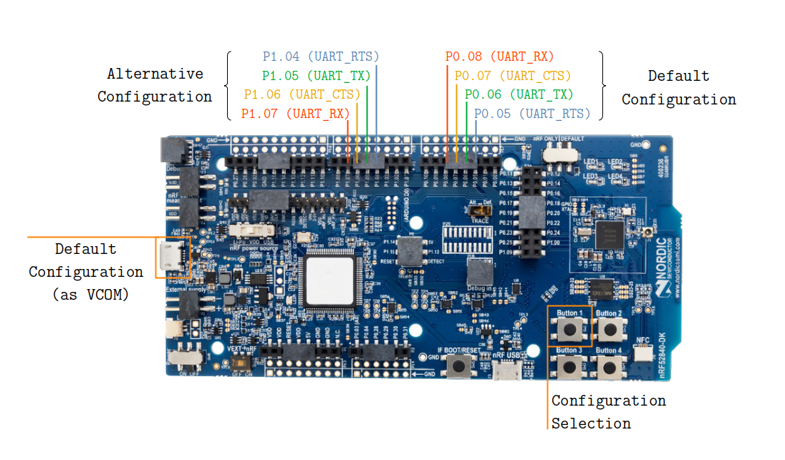

.. _samples_boards_nrf_dynamic_pinctrl:

Dynamic Pin Control (nRF)
#########################

The Dynamic Pin Control (nRF) sample demonstrates how to change ``uart0`` at
early boot stages, depending on the input level on a pin connected to a
push-button.

Overview
********

Slightly different board revisions that implement just small changes (like
improving the PCB layout or changing components to new equivalents) do not
necessarily require changes to the firmware. As such, one firmware image can be
able to boot onto multiple board revisions.

However, if a certain peripheral is routed to different sets of pins between
revisions, the firmware needs to select the appropriate routing when the
system is initialized.

The Dynamic Pin Control (nRF) sample allows you to select the appropriate routing.

If the push button is not pressed, the system does nothing and continues with
the default configuration. If the button is pressed, the alternative
configuration is applied.

Alternative configurations can only be applied if the device driver using the
associated pins has not been initialized yet. Therefore, pay attention to the
initialization priorities set in the :file:`prj.conf` file.

nRF52840 DK
===========

The diagram below shows the pins assigned to the default and alternative
configurations.

    Configuration for nRF52840 DK

If you power on the board, the ``uart0`` peripheral is routed to the default
set of pins. The default set of pins is also exposed through the left USB
connector as a virtual COM port.

If you power on the board while holding Button 1, the ``uart0`` peripheral is
routed to the alternative set of pins.

Building and Running
********************

You can build this application for the nRF52840 DK as follows:

.. zephyr-app-commands::
   :zephyr-app: samples/boards/nrf/dynamic_pinctrl
   :board: nrf52840dk/nrf52840
   :goals: build
   :compact:

The sample can also support other nRF based boards if you provide a Devicetree
overlay file with an alternative configuration for ``uart0``. Select ``uart0``
for ``zephyr,console`` to make the sample work as expected.

Sample Output
=============

Follow these steps to test the two configurations :

1. Connect a USB-to-UART adapter to both sets of pins. If the board routes the
   default configuration to a virtual COM port (as in the nRF52840 DK), you can
   directly use that port.

#. Open two serial terminals, one connected to the default set of pins and the
   other connected to the alternative set of pins.

   .. figure:: images/terminals-empty.png

       Two serial terminals (left: default, right: alternative).

#. Turn on the board. You should see a ``Hello World!`` message printed on
   the first terminal.

   .. figure:: images/terminals-default.png

       ``Hello World!`` printed on the default set of pins.

#. Press and hold the configuration-selection push-button (button 1 on the
   nRF52840 DK) and press the board reset button. You now should see a
   ``Hello World!`` message on the second terminal.

   .. figure:: images/terminals-alt.png

       ``Hello World!`` printed on the alternative set of pins.
