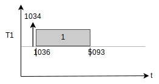
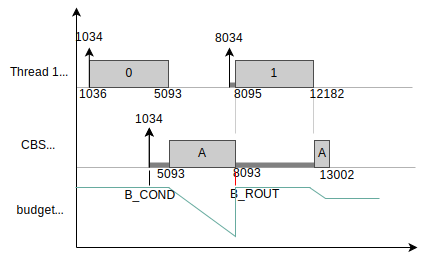

.. zephyr:code-sample:: cbs_edf
   :name: CBS + EDF

   A sample to understand how the CBS works alongside regular EDF threads.

Overview
********

A sample that creates a Constant Bandwidth Server (CBS) to run
aperiodic jobs within a periodic EDF taskset. The user can select
between two examples:

* 1: one CBS with (budget, period) = (3, 8) time units and one
  periodic EDF task with (execution_time, period) = (4, 7)
  time units. The EDF task period is equal to the deadline.

* 2: one CBS with (budget, period) = (2, 6) time units and two
  periodic EDF tasks with (execution_time, relative_deadline) =
  (2, 6) and (3, 9) time units, respectively. The EDF tasks have
  periods equal to deadlines.

the time units have millisecond resolution, and are defined by U:

.. code-block:: c

  /* all time values are multiplied by U (ms) */
  #define U   1000

This is the recommended setup when the application has both tasks
that have hard deadlines (directly scheduled by EDF) and soft
deadlines (wrapped by a CBS). The CBS in this case guarantees that
any overruns caused by the soft tasks will not jeopardize the
execution environment of the hard tasks. It can be seen as the
EDF equivalent of a :ref:`workqueue thread<workqueues_v2>`, and will
deliver better overall performance than a workqueue.

.. note::
  If the system prioritizes schedulability and no task has hard
  deadlines, then all tasks can be wrapped by their own personal
  CBS. This is specially useful if the execution times of the tasks
  are unknown, as the CBS budget can be used instead. If the budget
  matches the task worst-case execution time (WCET), it is guaranteed
  that the system will behave just like a regular EDF.

  If this is the case, all the application needs to do is guarantee
  that the sum of all CBS's (budget / period) ratio is lower than 1.

Building and Running
********************

This application can be built and executed on QEMU as follows:

.. zephyr-app-commands::
   :zephyr-app: samples/cbs/edf
   :host-os: unix
   :board: qemu_riscv32
   :goals: run
   :compact:

To build and run on a physical target (i.e. XIAO ESP32-C3) instead,
run the following:

.. zephyr-app-commands::
   :zephyr-app: samples/cbs/edf
   :board: xiao_esp32c3
   :goals: build flash
   :compact:

Sample Output
=============

Each task, in its cycle, will print its own ID at every tenth of its
execution time, with square brackets at the edges to signal the start
and end of the cycle. For a task of ID = '1', This is the output:

.. code-block:: console

  [1-1-1-1-1-1-1-1-1-1]

EDF tasks have a numeric ID (1, 2, ...), while the CBS jobs have an
alphabetic ID (A, B, ...). After a few seconds, the system will dump
a tracing of the events in the following format:

.. code-block:: console

  ========================
  EDF events:
  1034    [ 1 ] TRIG  0
  1036    [ 1 ] START 0
  5093    [ 1 ] END   0
  ========================

What it means is that EDF thread 1 was triggered at system tick 1034,
started executing in tick 1036 and finished running in tick 5093. Thus,
for the example above, thread 1 takes roughly 4057 ticks to execute.
In a diagram, that would mean:

In the given example, thread 1 is periodic and has period = deadline = 7000.
So if activating at instant 1034, thread 1 will be set an absolute deadline
of 8034, which is also its next triggering event. In other words, the next
sequence of events would be likely the following:

.. code-block:: console

  [1-1-1-1-1-1-1-1-1-1]-[1-1-1-1-1-1-1-1-1-1]

  ========================
  EDF events:
  1034    [ 1 ] TRIG  0
  1036    [ 1 ] START 0
  5093    [ 1 ] END   0
  ...
  8034    [ 1 ] TRIG  1
  8035    [ 1 ] START 1
  12032   [ 1 ] END   1
  ...
  ========================

Now, if we add up a CBS with (budget, period) of (3000, 8000), we might see a
somewhat different execution outcome. If the CBS receives a job A at instant
4035 with an expected execution time of 4000 ticks, this is what happens:

.. code-block:: console

  [1-1-1-1-1-1-1-1-1-1-1]-[A-A-A-A-A-A-A-A-[1-1-1-1-1-1-1-1-1-1-1]-A-A-A]

  ========================
  EDF events:
  1034    [ 1 ] TRIG  0
  1036    [ 1 ] START 0
  4035    [ A ] TRIG  0
  5093    [ 1 ] END   0
  5093    [ A ] START 0
  8034    [ 1 ] TRIG  1
  8095    [ 1 ] START 1
  12182   [ 1 ] END   1
  13002   [ A ] END   0
  ========================

* As job A is triggered at instant 4035 and the CBS was idle, its absolute
  deadline is calculated as (4035 + CBS period) = 12035. However, at this very
  event thread 1 was mid-execution and its deadline, as said before, was
  set at 8034. Therefore, job A is triggered but not yet executed. It only
  starts to run at instant 5093, right after thread 1 finished its cycle.

* At instant 8034, thread A is triggered for its next cycle. Its deadline
  is set at (8034 + 7000) = 15034. However, the CBS is still running job A
  and its deadline is 12035, so thread 1 cannot start just yet.

* At instant 8093, 3000 ticks after job A started, the CBS budget runs out.
  In other words, it executed for its allowed time slice. The kernel then
  intervenes, replenishing the CBS budget at the cost of postponing its
  deadline. The new CBS absolute deadline is then 8093 + 8000 = 16093.

* Thread 1 now has the earliest absolute deadline (15034), so it *preempts*
  the CBS (and by extension, job A) and starts at tick 8095. That's why we
  see a [1-1-1] nested within the [A-A-A] logs above.

* Thread 1 finishes at tick 12182. The CBS is now allowed to resume. It
  finishes job A soon after, at tick 13002.

In a diagram, the events listed above translate to the following:

Note that the CBS schedulability and deadlines only depend of the configured
values of budget and period. It doesn't depend on how many jobs are received,
nor it takes into account the expected duration of these jobs. The CBS thus
wraps the jobs within a know scheduling context which ensures that the remaining
application threads will never miss a deadline.
