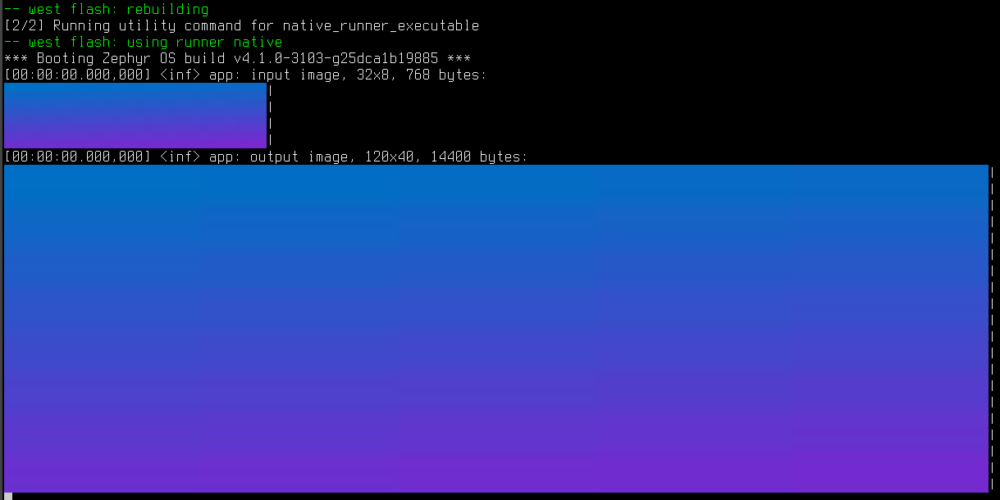

.. zephyr:code-sample:: lib_pixel_image
   :name: Pixel Imaging Library

   Image an image using subsampling.

Overview
********

A sample showcasing how to perform arbitrary image manipulation using few memory with a
developer-friendly API.

The input and output are printed as preview images on the console.

Building and Running
********************

This application can be built and executed on the native simulator as follows:

.. zephyr-app-commands::
   :zephyr-app: samples/lib/pixel/image
   :host-os: unix
   :board: native_sim
   :goals: run
   :compact:

To build for another board, change "native_sim" above to that board's name.

Sample Output
=============

.. code-block:: console

   *** Booting Zephyr OS build v4.1.0-3103-g25dca1b19885 ***
   [00:00:00.000,000] <inf> app: input image, 32x8, 768 bytes:
   ▄▄▄▄▄▄▄▄▄▄▄ shows-up ▄▄▄▄▄▄▄▄▄▄▄|
   ▄▄▄▄▄▄▄▄▄▄▄ as color ▄▄▄▄▄▄▄▄▄▄▄|
   ▄▄▄▄▄▄▄▄▄▄▄ on the   ▄▄▄▄▄▄▄▄▄▄▄|
   ▄▄▄▄▄▄▄▄▄▄▄ terminal ▄▄▄▄▄▄▄▄▄▄▄|
   [00:00:00.000,000] <inf> app: output image, 120x40, 14400 bytes:
   ▄▄▄▄▄▄▄▄▄▄▄▄▄▄▄▄▄▄▄▄▄▄▄▄▄▄▄▄▄▄▄▄▄▄▄▄▄▄▄▄▄▄▄▄▄▄▄▄▄▄▄▄▄▄▄▄▄▄▄▄▄[...]▄▄|
   ▄▄▄▄▄▄▄▄▄▄▄▄▄▄▄▄▄▄▄▄▄▄▄▄▄▄▄▄▄▄▄▄▄▄▄▄▄▄▄▄▄▄▄▄▄▄▄▄▄▄▄▄▄▄▄▄▄▄▄▄▄[...]▄▄|
   ▄▄▄▄▄▄▄▄▄▄▄▄▄▄▄▄▄▄▄▄▄▄▄▄▄▄▄▄▄▄▄▄▄▄▄▄▄▄▄▄▄▄▄▄▄▄▄▄▄▄▄▄▄▄▄▄▄▄▄▄▄[...]▄▄|
   ▄▄▄▄▄▄▄▄▄▄▄ shows-up ▄▄▄▄▄▄▄▄▄▄▄▄▄▄▄▄▄▄▄▄▄▄▄▄▄▄▄▄▄▄▄▄▄▄▄▄▄▄▄▄[...]▄▄|
   ▄▄▄▄▄▄▄▄▄▄▄ as color ▄▄▄▄▄▄▄▄▄▄▄▄▄▄▄▄▄▄▄▄▄▄▄▄▄▄▄▄▄▄▄▄▄▄▄▄▄▄▄▄[...]▄▄|
   ▄▄▄▄▄▄▄▄▄▄▄ on the   ▄▄▄▄▄▄▄▄▄▄▄▄▄▄▄▄▄▄▄▄▄▄▄▄▄▄▄▄▄▄▄▄▄▄▄▄▄▄▄▄[...]▄▄|
   ▄▄▄▄▄▄▄▄▄▄▄ terminal ▄▄▄▄▄▄▄▄▄▄▄▄▄▄▄▄▄▄▄▄▄▄▄▄▄▄▄▄▄▄▄▄▄▄▄▄▄▄▄▄[...]▄▄|
   ▄▄▄▄▄▄▄▄▄▄▄▄▄▄▄▄▄▄▄▄▄▄▄▄▄▄▄▄▄▄▄▄▄▄▄▄▄▄▄▄▄▄▄▄▄▄▄▄▄▄▄▄▄▄▄▄▄▄▄▄▄[...]▄▄|
   ▄▄▄▄▄▄▄▄▄▄▄▄▄▄▄▄▄▄▄▄▄▄▄▄▄▄▄▄▄▄▄▄▄▄▄▄▄▄▄▄▄▄▄▄▄▄▄▄▄▄▄▄▄▄▄▄▄▄▄▄▄[...]▄▄|
   ▄▄▄▄▄▄▄▄▄▄▄▄▄▄▄▄▄▄▄▄▄▄▄▄▄▄▄▄▄▄▄▄▄▄▄▄▄▄▄▄▄▄▄▄▄▄▄▄▄▄▄▄▄▄▄▄▄▄▄▄▄[...]▄▄|

