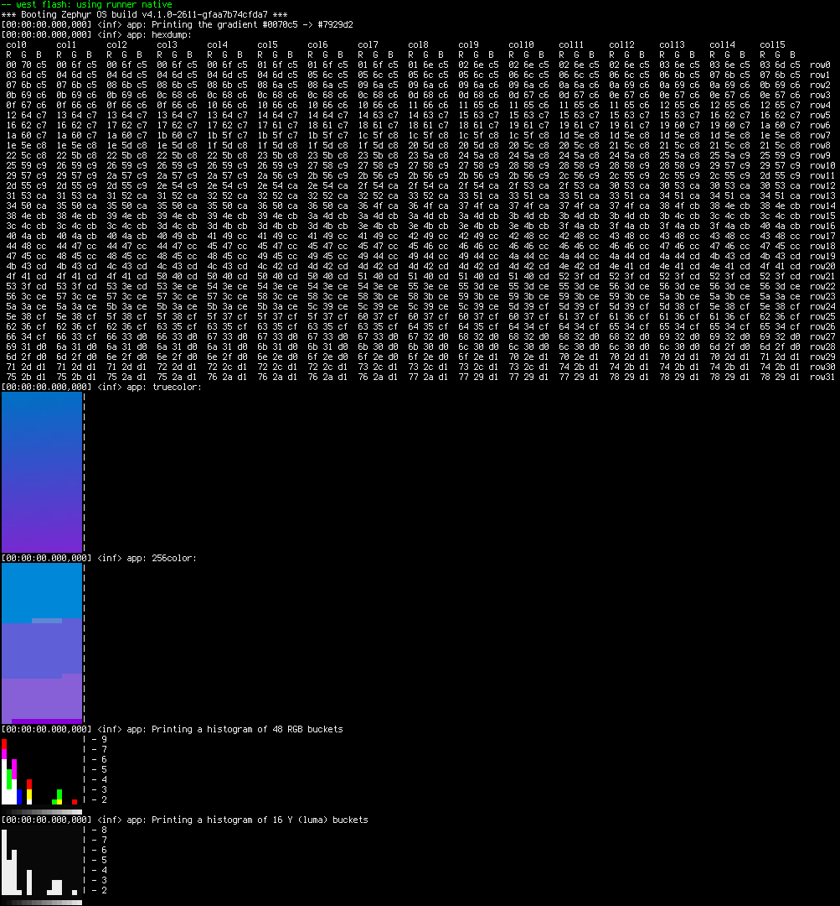

.. zephyr:code-sample:: lib_pixel_print
   :name: Pixel Printiing Library

   Print images on the console.

Overview
********

A sample showcasing how to make use of the pixel library to visualize an image or histogram data
by printing it out on the console using `ANSI escape codes`_.

This way debug logs can be interleaved with small preview images for debug purposes.

.. _ANSI escape codes: https://en.wikipedia.org/wiki/ANSI_escape_code

Building and Running
********************

This application can be built and executed on QEMU as follows:

.. zephyr-app-commands::
   :zephyr-app: samples/lib/pixel/print
   :host-os: unix
   :board: native_sim
   :goals: run
   :compact:

To build for another board, change "native_sim" above to that board's name.

Sample Output
=============

.. code-block:: console

   *** Booting Zephyr OS build v4.1.0-2611-gfaa7b74cfda7 ***
   [00:00:00.000,000] <inf> app: Printing the gradient #0070c5 -> #7929d2
   [00:00:00.000,000] <inf> app: hexdump:
    col0      col1      col2      col3      col4      [...]  col14     col15
    R  G  B   R  G  B   R  G  B   R  G  B   R  G  B   [...]  R  G  B   R  G  B
    00 70 c5  00 6f c5  00 6f c5  00 6f c5  00 6f c5  [...]  00 6f c5  03 6d c5  row0
    03 6d c5  04 6d c5  04 6d c5  04 6d c5  04 6d c5  [...]  04 6d c5  07 6b c5  row1
    07 6b c5  07 6b c5  08 6b c5  08 6b c5  08 6b c5  [...]  07 6b c5  0b 69 c6  row2
    0b 69 c6  0b 69 c6  0b 69 c6  0c 68 c6  0c 68 c6  [...]  0b 69 c6  0e 67 c6  row3
    0f 67 c6  0f 66 c6  0f 66 c6  0f 66 c6  10 66 c6  [...]  0f 66 c6  12 65 c7  row4
    12 64 c7  13 64 c7  13 64 c7  13 64 c7  13 64 c7  [...]  13 64 c7  16 62 c7  row5
    16 62 c7  16 62 c7  17 62 c7  17 62 c7  17 62 c7  [...]  16 62 c7  1a 60 c7  row6
   [...]
   [00:00:00.000,000] <inf> app: truecolor:
   ▄▄▄▄▄▄▄▄▄▄▄▄▄▄▄▄|
   ▄▄▄ shows-up ▄▄▄|
   ▄▄▄ as color ▄▄▄|
   ▄▄▄ on the   ▄▄▄|
   ▄▄▄ terminal ▄▄▄|
   ▄▄▄▄▄▄▄▄▄▄▄▄▄▄▄▄|
   [...]

