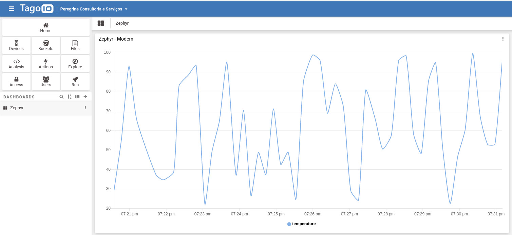
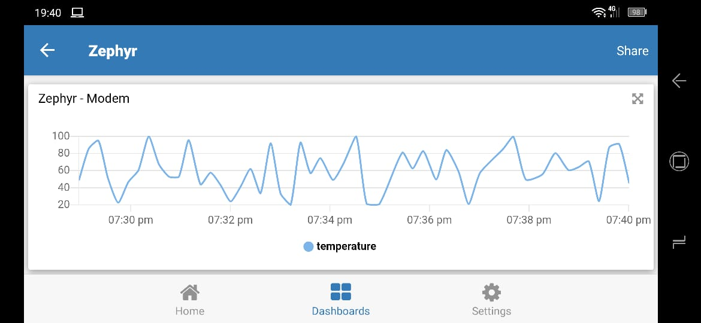

.. _cloud-tagoio-http-post-sample:

TagoIO IoT Cloud HTTP Sample
############################

Overview
********

This sample application implements an HTTP client that will do an HTTP post
request to `TagoIO`_ IoT Service Platform. The sample sends random temperature
values to simulate a real device. This can be used to speed-up development
and shows how to send simple JSON data to `TagoIO`_ servers.

The source code for this sample application can be found at:
:zephyr_file:`samples/net/cloud/tagoio_http_post`.

Requirements
************

- A free `TagoIO`_ account
- A board with internet connectivity, see :ref:`networking`
- The example provides three ways to get internet:

  * Ethernet: Using default configuration
  * WiFi: Using default configuration plus wifi overlay
  * Modem: Using default configuration plus modem overlay

TagoIO Device Configuration
***************************

If you don't have a `TagoIO`_ account, simple create a free account at
`TagoIO`_.  After that, add a device selecting Custom HTTP(S) protocol.  That
is it! Now reveal your device token.  The token will be used to identify your
device when sending data.  You need fill ``CONFIG_TAGOIO_DEVICE_TOKEN`` at
:zephyr_file:`samples/net/cloud/tagoio_http_post/prj.conf` file with that
information.

Building and Running
********************

Ethernet
========

You can use this application on a supported board with ethernet port.  There
are many like :ref:`sam4e_xpro`, :ref:`sam_v71_xplained_ultra`,
:ref:`frdm_k64f`, :ref:`nucleo_f767zi_board` etc.  Pick one and just build
tagoio-http-client sample application with minimal configuration:

.. zephyr-app-commands::
   :zephyr-app: samples/net/cloud/tagoio_http_post
   :board: [sam4e_xpro | sam_v71_xult | frdm_k64f | nucleo_f767zi]
   :goals: build flash
   :compact:

WIFI
====

To enable WIFI support, you need a board with an embedded WIFI support like
:ref:`disco_l475_iot1_board` or you can add a shield like
:ref:`module_esp_8266` or :ref:`inventek_eswifi_shield`.  Additionally you
need fill ``CONFIG_TAGOIO_HTTP_WIFI_SSID`` with your wifi network SSID and
``CONFIG_TAGOIO_HTTP_WIFI_PSK`` with the correspondent password at
:zephyr_file:`samples/net/cloud/tagoio_http_post/overlay-wifi.conf` file.

.. zephyr-app-commands::
   :zephyr-app: samples/net/cloud/tagoio_http_post
   :board: disco_l475_iot1
   :gen-args: -DOVERLAY_CONFIG=overlay-wifi.conf
   :goals: build flash
   :compact:

.. zephyr-app-commands::
   :zephyr-app: samples/net/cloud/tagoio_http_post
   :board: [sam_v71_xult | frdm_k64f | nucleo_f767zi]
   :shield: [esp_8266_arduino | inventek_eswifi_arduino_uart]
   :gen-args: -DOVERLAY_CONFIG=overlay-wifi.conf
   :goals: build flash
   :compact:

Modem
=====

The Modem support is quite similar to WIFI, you need a board with an embedded
Modem support or you can add a shield.  Currently, the overlay was created to
allow modems with PPP support.  This was tested using ``SIMcom SIM808 EVB``.
Additionally you need fill ``CONFIG_MODEM_GSM_APN`` with the correspondent Access
Point Name (APN) at
:zephyr_file:`samples/net/cloud/tagoio_http_post/overlay-modem.conf` file. A
DTC overlay file should be used to configure the glue between the modem and the
uart port. It can reside at boards directory, with the board name, or it can be
a special designator like defined at ``arduino.overlay``.

.. zephyr-app-commands::
   :zephyr-app: samples/net/cloud/tagoio_http_post
   :board: sam4e_xpro
   :gen-args: -DOVERLAY_CONFIG=overlay-modem.conf
   :goals: build flash
   :compact:

.. zephyr-app-commands::
   :zephyr-app: samples/net/cloud/tagoio_http_post
   :board: frdm_k64f
   :gen-args: -DOVERLAY_CONFIG=overlay-modem.conf -DDTC_OVERLAY_FILE=arduino.overlay
   :goals: build flash
   :compact:

In a terminal window you can check if communication is happen:

.. code-block:: console

    $ minicom -D /dev/ttyACM0

    *** Booting Zephyr OS build zephyr-v2.4.0-1135-g137732e23c1e  ***

    [00:00:02.172,000] <inf> modem_gsm: Manufacturer: SIMCOM_Lt
    [00:00:02.227,000] <inf> modem_gsm: Model: SIMCOM_SIM808
    [00:00:02.283,000] <inf> modem_gsm: Revision: 1418B04SIM808M32
    [00:00:02.338,000] <inf> modem_gsm: IMSI: XXXXXX
    [00:00:02.393,000] <inf> modem_gsm: ICCID: XXXXXX
    [00:00:02.453,000] <inf> modem_gsm: IMEI: XXXXXX
    [00:00:02.574,000] <inf> modem_gsm: Attached to packet service!
    [00:00:02.575,000] <inf> net_ppp: Initializing PPP to use UART_3
    [00:00:13.370,000] <inf> tagoio: TagoIO IoT - HTTP Client - Temperature demo
    [00:00:13.370,000] <inf> tagoio: Temp: 20
    [00:00:25.237,000] <inf> tagoio: Temp: 76
    [00:00:37.581,000] <inf> tagoio: Temp: 36
    [00:00:50.437,000] <inf> tagoio: Temp: 98

Visualizing TagoIO dashboard
****************************

After you got some logs on console it is time to create a dashboard on the
TagoIO to visualize the data.

* Go to the TagoIO web console
* Create a dashboard as Normal, give it a denomination and move next
* Add a line plot graph. You will see your device, temperature variable will
  be automatically selected for you.
* Just Save and enjoy!

You can experiment the TagoIO mobile application on your cellphone or tablet.
Simple go to your app store and search by TagoIO, install, sign in, enjoy!

More information at `TagoIO`_ and `TagoIO Documentation`_.

References
**********

.. target-notes::

.. _TagoIO:
   https://tago.io/

.. _TagoIO Documentation:
   https://docs.tago.io
