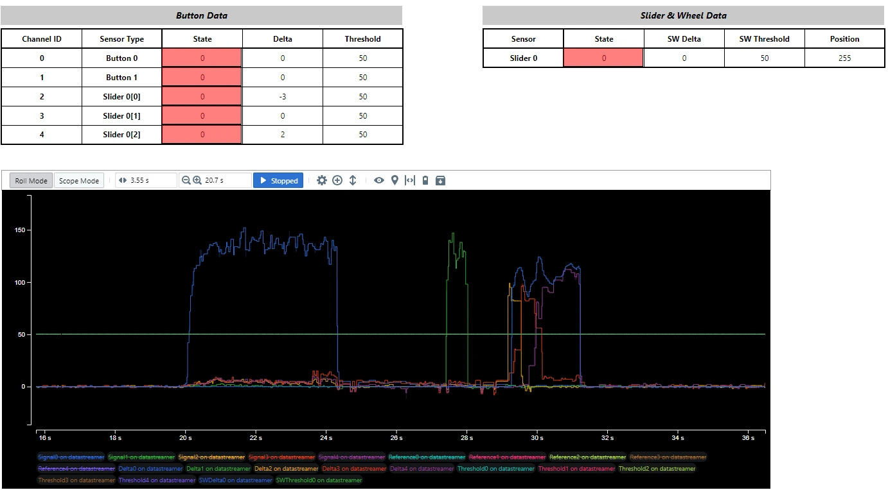

.. zephyr:code-sample:: mchp_qt7
   :name: Microchip QT7 Touch Sensor
   :relevant-api: input_events mchp_ptc_interface

   Interact with the QT7 add on board Touch Sensor

Overview
********

The **Microchip® QT7 Xplained Pro** is an extension board designed to evaluate
**self-capacitance touch** applications with a strong focus on **water-tolerant
operation**.

The kit demonstrates water-tolerant touch functionality using either
**Driven Shield** or **Driven Shield+**, depending on the capabilities of the
target MCU. The board features:

* One self-capacitance slider
* Two self-capacitance buttons
* Eight LEDs providing visual feedback for button state and slider position

This sample provides a generic reference implementation and is intended to work
with **any Microchip development board and touch controller supported by Zephyr**,
provided the appropriate device tree configuration is present.

Operation
*********

The touch driver uses Zephyrs input subsystem and generates input events when the
touch button is pressed or released.

The event uses a ``zephyr,code`` value defined in the device tree.
The touch-detection event uses the node-specific code.

**Example:**

.. code-block:: dts

   node_0_params: touch_node0 {
      x-mask = <19>, <13>, <28>, <29>, <25>;
      x-names = "DRIVEN_SHIELD", "BUTTON_1", "SLIDER_0", "SLIDER_1", "SLIDER_2";
      y-mask = <14>;
      y-names = "BUTTON_0";
      zephyr,code = <INPUT_KEY_0>;
      csd = <0>;
      prescaler = "PRSC_DIV_SEL_16";
      digital-gain = "GAIN_1";
      analog-gain = "GAIN_1";
      filter-level = "FILTER_LEVEL_16";
   };

This ``zephyr,code`` value must be one of the input event codes defined by Zephyr
in <zephyr/dt-bindings/input/input-event-codes.h>.

Requirements
************

* A Microchip MCU board supported by Zephyr with a capacitive touch controller
* **QT7 Xplained Pro** extension board
*  A device tree configuration that defines the required PTC node, example: ``ptc``.

Touch Configuration (Kconfig)
*****************************

The following Kconfig options must be enabled for touch operation:

Mandatory options:

* ``CONFIG_INPUT``

Enables the Zephyr input subsystem.

* ``CONFIG_INPUT_MCHP_TOUCH``

Enables the Microchip touch driver.

* ``CONFIG_INPUT_MCHP_TOUCH_EN_BTTN_MODULE``

Enables the touch button module.

* ``CONFIG_INPUT_MCHP_TOUCH_EN_FREQ_HOP``

Enables Frequency Hopping for noise avoidance.

* ``CONFIG_INPUT_MCHP_TOUCH_EN_SCROLLER``

Enables the Scroller module.

* ``CONFIG_INPUT_MCHP_SCROLLER_TOUCH_EVENT``

By default, this option is enabled. When enabled, the scroller reports
two events:

* A touch-detection event indicating that the scroller is being touched.
* A scroller-position event reporting the current scroller position.

Each event uses a different ``zephyr,code`` value defined in the device
tree. The touch-detection event uses the node-specific code.

**Example:**

.. code-block:: dts

   node_0_params: touch_node0 {
      x-mask = <19>, <13>, <28>, <29>, <25>;
      x-names = "DRIVEN_SHIELD", "BUTTON_1", "SLIDER_0", "SLIDER_1", "SLIDER_2";
      y-mask = <14>;
      y-names = "BUTTON_0";
      zephyr,code = <INPUT_KEY_0>;
      csd = <0>;
      prescaler = "PRSC_DIV_SEL_16";
      digital-gain = "GAIN_1";
      analog-gain = "GAIN_1";
      filter-level = "FILTER_LEVEL_16";
   };

The scroller-position event uses the scroller-node-specific code ``zephyr,code``.

**Example:**

.. code-block:: dts

   scroller-0-params {
      compatible = "microchip,ptc-scroller";
      scroller-type = "SCROLLER_TYPE_SLIDER";
      zephyr,code = <INPUT_ABS_WHEEL>;
      start-key = <2>;
      number-of-keys = <3>;
      position-hysteresis = <8>;
      contact-min-threshold = <50>;
      /* resol_deadband */
      scroller-resolution = "SCR_RESOL_8_BIT";
      scr-db-percent = "SCR_DB_10_PERCENT";
   };

When this option is not selected, only the scroller-position event is
reported, using the scroller-node-specific code.

Optional:

* ``CONFIG_INPUT_MCHP_TOUCH_EN_FREQ_AUTO_TUNE``

Enables Frequency Hopping with Autotune.

Frequency Hopping with Autotune is the **recommended configuration** for
robust touch operation. This feature operates autonomously and provides the
flexibility required to counteract electrical noise in real-world
environments.

The Autotune module is a superset of Frequency Hopping. In addition to
frequency variation, it continuously monitors noise and automatically tunes
the touch acquisition frequency.

The touch controller performs measurements on multiple frequencies (by
default three, or as configured by the host). Noise levels are monitored for
each frequency. If the noise on a given frequency exceeds the configured
Noise Threshold for a defined number of integrations, that frequency is
replaced by another frequency from the available frequency pool.

* ``CONFIG_INPUT_MCHP_TOUCH_DATASTREAMER``

Provides touch data for visualization in MPLAB Data Visualizer.
Supports unidirectional data streaming only. Tuning is not supported.

Prerequisites
*************

Before building the application, make sure you have updated your workspace and fetched any required binary blobs

.. code-block:: console

   west update hal_microchip
   west blobs fetch hal_microchip

Building and Running
********************

This is a generic sample and should work with any supported Microchip board and
touch controller, as long as the required device tree bindings are configured.

Before building the sample, make sure all required modules and binary blobs are
available.

Once the workspace is prepared, you can build and flash the application using the following command:

.. zephyr-app-commands::
   :zephyr-app: samples/shields/mchp_QT7
   :board: pic32cm_jh01_cpro
   :shield: qt7_pic32cm_jh01_cpro
   :goals: build flash
   :compact:

Connection Details
*******************

The connection detail is available in **qt7_<boards>.overlay** file

Example:
boards/shields/mchp_touch_qt7/qt7_pic32cm_jh01_cpro.overlay

Expected Output
***************
* **Buttons:**

The corresponding LED turns on when the button is touched
and remains on until the finger is lifted.

* **Scroller**

  ``CONFIG_INPUT_MCHP_SCROLLER_TOUCH_EVENT`` is enabled

Sliding a finger across the slider updates the LED position feedback.
The LED turns off when the finger is lifted.

  ``CONFIG_INPUT_MCHP_SCROLLER_TOUCH_EVENT`` is disabled

Sliding a finger across the **slider** updates the LED position feedback.
The LED remains on at the last detected position when the finger is lifted.

Data Streaming and Visualization
********************************

Touch diagnostic data can be streamed to a host PC and visualized using the
**Microchip Data Visualizer** tool, which displays touch parameters in a
graphical user interface (GUI).

To enable touch data streaming, the following configuration options must be
enabled:

* ``CONFIG_INPUT_MCHP_TOUCH_DATASTREAMER``
* ``CONFIG_SERIAL``

When enabled, touch data is transmitted over the serial interface and can be
monitored in real time using the Data Visualizer GUI. This is useful for
debugging, tuning, and validating touch performance.

Detailed instructions for installing and using the Data Visualizer tool are
available at the following link:

Note:
  * Refer to the section **Data Visualization**

  * Select 115200 baudrate in Data Visualizer Software

  * Required datastremer files are available in the sample application directory

Visualize Touch Data Using - `MPLAB Data Visualizer`_

.. _MPLAB Data Visualizer:
   https://onlinedocs.microchip.com/oxy/GUID-1B9D4635-2151-4E5D-9BFB-EE9E513397AC-en-US-5/GUID-8F2641B0-4039-483B-9BE6-5141EE667743.html

References
**********

`QT7 Xplained Pro User Guide`_

.. _QT7 Xplained Pro User Guide:
   https://ww1.microchip.com/downloads/aemDocuments/documents/OTH/ProductDocuments/UserGuides/QT7XplainedProUserGuide50002725A.pdf
