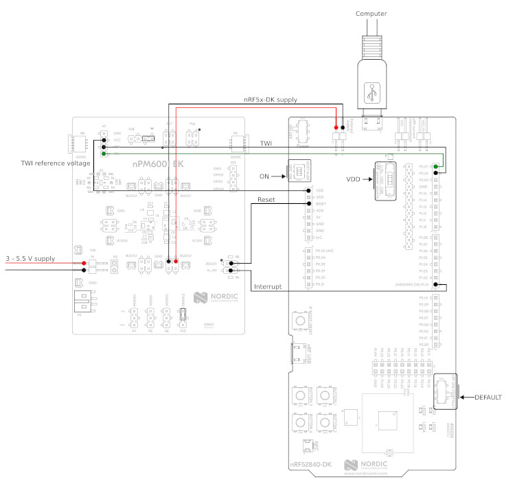

.. _npm6001_ek_sample:

nPM6001 EK sample
#################

Overview
********

This sample is provided as an example to test the :ref:`npm6001_ek`. The sample
provides a shell interface that allows to test multiple functionalities offered
by the nPM6001 PMIC, including:

- GPIO
- Watchdog

Requirements
************

The shield needs to be wired to a host board supporting the Arduino connector.
Below you can find a wiring example for the nRF52840 DK:

   nRF52840DK + nPM6001-EK wiring example

Building and Running
********************

The sample is designed so that it can run on any platform. For example, when
building for the nRF52840 DK, the following command can be used:

.. zephyr-app-commands::
   :zephyr-app: samples/shields/npm6001_ek
   :board: nrf52840dk_nrf52840
   :goals: build
   :compact:

Note that this sample automatically sets ``SHIELD`` to ``npm6001_ek``. Once
flashed, you should boot into the shell interface. The ``npm6001`` command is
provided to test the PMIC. Below you can find details for each subcommand.

GPIO
====

The ``npm6001`` shell interface provides the ``gpio`` subcommand to test the
GPIO functionality offered by the PMIC. Below you can find some command
examples.

.. code-block:: bash

   # configure GPIO 0 as output
   npm6001 gpio configure -p 0 -d out
   # configure GPIO 0 as output (init high)
   npm6001 gpio configure -p 0 -d outh
   # configure GPIO 0 as output (init low)
   npm6001 gpio configure -p 0 -d outl
   # configure GPIO 0 as output with high-drive mode enabled
   npm6001 gpio configure -p 0 -d out --high-drive
   # configure GPIO 1 as input
   npm6001 gpio configure -p 1 -d input
   # configure GPIO 1 as input with pull-down enabled
   npm6001 gpio configure -p 1 -d input --pull-down
   # configure GPIO 1 as input with CMOS mode enabled
   npm6001 gpio configure -p 1 -d input --cmos

.. code-block:: bash

   # get GPIO 1 level
   npm6001 gpio get 1

.. code-block:: bash

   # set GPIO 0 high
   npm6001 gpio set 0 1
   # set GPIO 0 low
   npm6001 gpio set 0 0

.. code-block:: bash

   # toggle GPIO 0
   npm6001 gpio toggle 0

Watchdog
========

The ``npm6001`` shell interface provides the ``wdt`` subcommand to test the
Watchdog functionality offered by the PMIC. Below you can find some command
examples.

.. code-block:: bash

   # enable watchdog, timeout set to 8 seconds. Timeout will be rounded up to
   # the resolution of the watchdog, e.g. 10s -> 12s.
   npm6001 wdt enable 8000
   # disable watchdog
   npm6001 wdt disable
   # kick/feed watchdog
   npm6001 wdt kick

.. note::
   When the watchdog reset pin is connected to your board reset, you will see
   how Zephyr reboots after the watchdog timeout expires.
