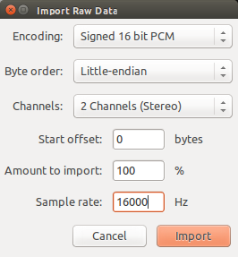

.. _x-nucleo-cca02m1-sample:

X-NUCLEO-CCA02M1: Digital MEMS microphones SHIELD for STM32 Nucleo
##################################################################

Overview
********
This sample enables the two digital MEMS microphones on X-NUCLEO-CCA02M1
shields

This sample provides an example of how to acquire audio through
the two digital MEMS microphones on X-NUCLEO-CCA02M1 shield.
The microphone generates a PDM stream which is acquired through I2S.
The PDM stream is then converted to PCM using the OpenPDMFilter external
library.

Requirements
************

This sample communicates over I2C with the X-NUCLEO-CCA02M1 shield
stacked on a board with an Arduino connector. The board's I2C must be
configured for the I2C Arduino connector (both for pin muxing
and device tree). See for example the :ref:`nucleo_f411re_board` board
source code:

- :zephyr_file:`boards/arm/nucleo_f411re/nucleo_f411re.dts`
- :zephyr_file:`boards/arm/nucleo_f411re/pinmux.c`

References
**********

- X-NUCLEO-CCA02M1: https://www.st.com/en/ecosystems/x-nucleo-cca02m1.html

Building and Running
********************

This sample runs with X-NUCLEO-CCA02M1 stacked on any board with a matching
Arduino connector. For this example, we use a :ref:`nucleo_f411re_board` board.

.. zephyr-app-commands::
   :zephyr-app: samples/shields/x_nucleo_cca02m1
   :board: nucleo_f411re
   :goals: build
   :compact:

Sample Output
=============

The example acquires one second of audio and prints out the PCM stream on COM port.
The acquisition starts immediately after the reset button is pressed.

The characteristics of the PCM audio are hardcoded in the example:

- 16KHz sample rate
- 16 bits per sample
- 2 channel (stereo)

One second of acquisition at a 2 channels 16KHz sampling rate yields 32,000 16-bit samples.
The microphone PDM requested clock should lead the MP34DT05 driver to select an
oversampling/decimation factor to result in approximately a 2MHz bit clock.

See PCM and PDM configuration in file :zephyr_file:`samples/shields/x_nucleo_cca02m1/src/main.c`.

.. note:: It is possible to change the AUDIO_FREQ to 32000 acquiring only 500 ms.

At the end of the acquisition the PCM data will be printed on the terminal
emulator in either binary or ASCII format. The output is controlled by the
:c:macro:`PCM_OUTPUT_IN_ASCII` macro, off by default, in
:zephyr_file:`samples/shields/x_nucleo_cca02m1/src/main.c`.

Binary PCM Output
-----------------

The Nucleo F411RE board presents itself to the host
as a USB CDC class, and will use ``/dev/ttyACM0``
device for communication. The ``/dev/ttyACM0`` port
must be configured in raw mode to avoid having
special characters (such as :kbd:`CNTL-Z` or :kbd:`CNTL-D`)
processed or 'cooked' out.

.. code-block:: console

   stty -F /dev/ttyACM0 115200 raw
   cat /dev/ttyACM0 > /tmp/sound.raw

.. note:: In case the character 0x0a is interpreted as NL and an 0x0d (CR) is added,
   you may need to remove it::

      dos2unix -f /tmp/sound.raw

ASCII PCM Output
----------------

It is also possible to recompile and to have PCM output in ASCII, which needs
to be converted to binary later on. The output format is the following:

.. code-block:: console

    -- start
    0xfbe0,
    0xfbf0,
    0xfc0c,
    0xfc24,
    0xfc3c,
    0xfc4c,
    0xfc68,
    0xfc48,

    [...]

    0xfb98,
    0xfb98,
    0xfbb8,
    0xfbac,
    0xfbc4,
    0xfbe8,
    0xfbf4,
    -- end

Play PCM Audio
--------------

Now that we have a binary PCM file (say sound.raw), you can use,
for example, the audacity open source editor/player to load and play it.

Use the 'Import->Raw Data' menu to load the sound.raw file as
signed 16 bit PCM, Little Endian, stereo format @16KHz:

After the file is imported you can analyze and play the one second audio file:

.. image:: img/audio_file.png
     :width: 1627px
     :height: 505px
     :align: center
     :alt: audio_file
