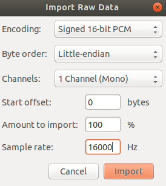
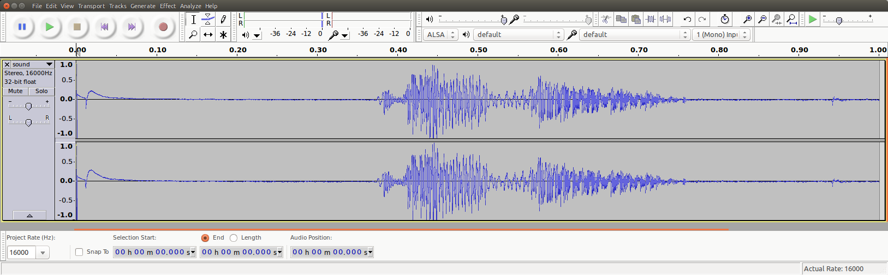

.. zephyr:code-sample:: x-nucleo-iks02a1-mic
   :name: X-NUCLEO-IKS02A1 shield - MEMS microphone
   :relevant-api: audio_dmic_interface

   Acquire audio using the digital MEMS microphone on X-NUCLEO-IKS02A1 shield.

Overview
********
This sample enables the digital MEMS microphone on X-NUCLEO-IKS02A1
shields

This sample provides an example of how to acquire audio through
the digital MEMS microphone on X-NUCLEO-IKS02A1 shield.
The microphone generates a PDM stream which is acquired through I2S.
The PDM stream is then converted to PCM using the OpenPDM2PCM library
available in zephyrproject/modules/hal/st/audio/microphone.

Requirements
************

This sample communicates over I2C with the X-NUCLEO-IKS02A1 shield
stacked on a board with an Arduino connector.

.. note::

   Please note that, in order to make the shield working on top of this board,
   it is needed to have SB24 and SB29 solder bridges properly closed. In this way
   the PDM microphone clock and data lines get connected to SPI clock and MOSI.
   Similar consideration may apply to other boards as well.

References
**********

- X-NUCLEO-IKS02A1: https://www.st.com/en/ecosystems/x-nucleo-iks02a1.html

Building and Running
********************

This sample runs with X-NUCLEO-IKS02A1 stacked on any board with a matching
Arduino connector. For this example, we use a :ref:`nucleo_f411re_board` board.
To build the sample you can use following command:

.. zephyr-app-commands::
   :zephyr-app: samples/shields/x_nucleo_iks02a1/microphone/
   :board: nucleo_f411re
   :goals: build
   :compact:

.. note::

   In case a different board is used, one of the things that must be verified before
   building the sample is the I2S output clock frequency configuration. For example,
   for nucleo_f411re board, we have the following file that configures the I2SPLL and
   have a dependency on HSE/HSI:
   :zephyr_file:`boards/shields/x_nucleo_iks02a1/boards/nucleo_f411re.defconfig`

   The user is invited to to verify which osci is configured on the used host board
   defconfig file and calculate the final I2SClk frequency, e.g.
   :zephyr_file:`boards/arm/nucleo_f411re/nucleo_f411re.dts`

Sample Output
=============

The example acquires one second of audio and prints out the PCM stream on COM port.
The acquisition starts immediately after the reset button is pressed.

The characteristics of the PCM audio are hardcoded in the example:

- 16KHz sample rate
- 16 bits per sample
- 1 channel (mono)

One second of acquisition at a 1 channel 16KHz sampling rate yields 16,000 16-bit samples.
The microphone PDM requested clock should lead the MP34DT05 driver to select an
oversampling/decimation factor to result in approximately a 2MHz bit clock.

See PCM and PDM configuration in file :zephyr_file:`samples/shields/x_nucleo_iks02a1/microphone/src/main.c`.

.. note:: It is possible to change the AUDIO_FREQ to 32000 acquiring only 500 ms.

At the end of the acquisition the PCM data will be printed on the terminal
emulator in either binary or ASCII format. The output is controlled by the
:c:macro:`PCM_OUTPUT_IN_ASCII` macro, off by default, in
:zephyr_file:`samples/shields/x_nucleo_iks02a1/microphone/src/main.c`.

Binary PCM Output
-----------------

The Nucleo F411RE board presents itself to the host
as a USB CDC class, and will use ``/dev/ttyACM0``
device for communication. The ``/dev/ttyACM0`` port
must be configured in raw mode to avoid having
special characters (such as :kbd:`CTRL-Z` or :kbd:`CTRL-D`)
processed and 'cooked out'.

.. code-block:: console

   stty -F /dev/ttyACM0 115200 raw
   cat /dev/ttyACM0 > /tmp/sound.raw
   dos2unix -f /tmp/sound.raw

.. note::

   The dos2unix command is used to recover the situation in which the character 0x0a is
   interpreted as NL and an 0x0d (CR) is added. If you don't remove it the audio stream would
   get corrupted.

.. warning::

   The /tmp/sound.raw file final size should result exactly of 32000 byte, but sometimes may
   happen that 1 or 2 spurious 0x00 bytes are put at the beginning. In this case the user
   may get rid of them using the following linux command (change ``skip`` value according
   to number of spurious bytes to be removed):

   dd if=sound.raw of=sound_clean.raw bs=1 skip=1

ASCII PCM Output
----------------

It is also possible to recompile and to have PCM output in ASCII, which needs
to be converted to binary later on. The output format is the following:

.. code-block:: console

    -- start
    0xfbe0,
    0xfbf0,
    0xfc0c,
    0xfc24,
    0xfc3c,
    0xfc4c,
    0xfc68,
    0xfc48,

    [...]

    0xfb98,
    0xfb98,
    0xfbb8,
    0xfbac,
    0xfbc4,
    0xfbe8,
    0xfbf4,
    -- end

Play PCM Audio
--------------

Now that we have a binary PCM file (say sound.raw), you can use,
for example, the audacity open source editor/player to load and play it.

Use the 'Import->Raw Data' menu to load the sound.raw file as
signed 16 bit PCM, Little Endian, mono format @16KHz:

After the file is imported you can analyze and play the 1sec audio file:

