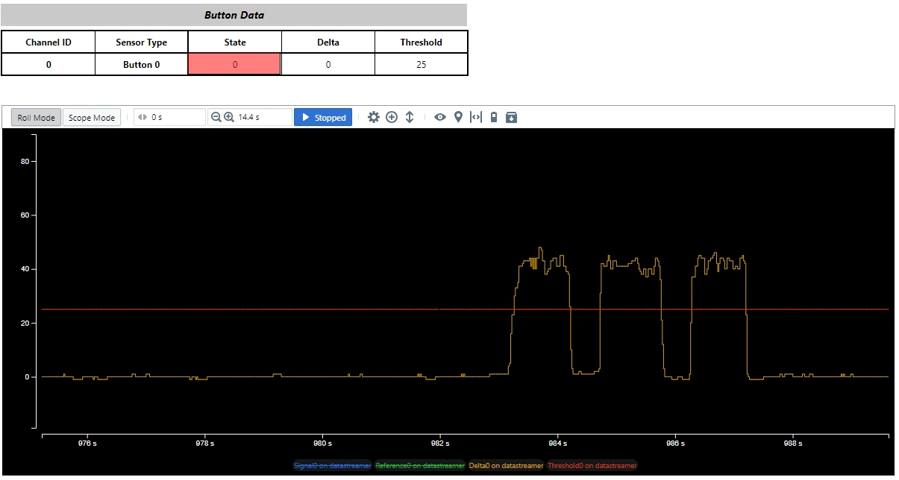

.. zephyr:code-sample:: input_capacitive_touch_buttons
   :name: Microchip On-board Touch Sensor
   :relevant-api: input_events mchp_ptc_interface

   Interact with On-board Touch Sensor

Overview
********

This sample demonstrates the use of a **self-capacitance touch button** available
on Microchip evaluation kits. The touch button is intended to be driven by the
devices built-in **Peripheral Touch Controller (PTC)**.

The sample uses Zephyrs input subsystem and generates input events when the
touch button is pressed or released.

For hardware details, refer to the Microchip evaluation kit user guide.

Requirements
************

* A Microchip evaluation kit with an on-board self-capacitance touch button
* A Microchip MCU with a supported Peripheral Touch Controller (PTC)
* A device tree configuration that defines the required PTC node, example: ``ptc``.

Touch Configuration (Kconfig)
*****************************

The following Kconfig options must be enabled for touch operation:

Mandatory options:

* ``CONFIG_INPUT``
  Enables the Zephyr input subsystem.

* ``CONFIG_INPUT_MCHP_TOUCH``
  Enables the Microchip touch driver.

* ``CONFIG_INPUT_MCHP_TOUCH_EN_BTTN_MODULE``
  Enables the touch button module.

* ``CONFIG_INPUT_MCHP_TOUCH_EN_FREQ_HOP``
  Enables Frequency Hopping for noise avoidance.

Optional options:

* ``CONFIG_INPUT_MCHP_TOUCH_EN_FREQ_AUTO_TUNE``
  Enables Frequency Hopping with Autotune.

  Frequency Hopping with Autotune is the **recommended configuration** for
  robust touch operation. This feature operates autonomously and provides the
  flexibility required to counteract electrical noise in real-world
  environments.

  The Autotune module is a superset of Frequency Hopping. In addition to
  frequency variation, it continuously monitors noise and automatically tunes
  the touch acquisition frequency.

  The touch controller performs measurements on multiple frequencies (by
  default three, or as configured by the host). Noise levels are monitored for
  each frequency. If the noise on a given frequency exceeds the configured
  Noise Threshold for a defined number of integrations, that frequency is
  replaced by another frequency from the available frequency pool.

Prerequisites
*************

Before building the application, make sure you have updated your workspace and fetched any required binary blobs

.. code-block:: console

   west update hal_microchip
   west blobs fetch hal_microchip

Building and Running
********************

This is a generic sample and should work with any Microchip evaluation kit that
provides on-board touch sensors and a touch controller supported by Zephyr,
provided the required device tree bindings are configured.

Before building the sample, make sure all required modules and binary blobs are
available.

Once the workspace is prepared, you can build and flash the application using the following command:

.. zephyr-app-commands::
   :zephyr-app: samples/subsys/input/input_capacitive_touch_buttons
   :board: pic32cm_jh01_cpro
   :goals: build flash
   :compact:

Expected Behavior
*****************

* Touching the capacitive button generates input press and release events
* On-board LED status will change when the touch button is pressed or released

Data Streaming and Visualization
********************************

Touch debug data can be streamed to a host PC and visualized using the
**Microchip Data Visualizer** tool, which presents touch parameters in a
graphical user interface (GUI).

To enable data streaming, the following configuration options must be enabled:

* ``CONFIG_INPUT_MCHP_TOUCH_DATASTREAMER_UNI_DIR``
* ``CONFIG_SERIAL``

When enabled, touch data is transmitted over the serial interface and can be
viewed in the Data Visualizer GUI.

Detailed instructions for installing and using the Data Visualizer tool are
available at the link follows.

Note:
1. Refer to the section **Data Visualization**
2. Required datastremer files are available in the sample application directory

Visualize Touch Data Using - `MPLAB Data Visualizer`_

.. _MPLAB Data Visualizer:
   https://onlinedocs.microchip.com/oxy/GUID-1B9D4635-2151-4E5D-9BFB-EE9E513397AC-en-US-5/GUID-8F2641B0-4039-483B-9BE6-5141EE667743.html
