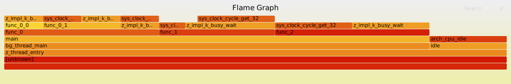

.. zephyr:code-sample:: profiling-perf
   :name: Perf tool

    Send perf samples to the host with console support

This application can be used to understand how to use the :ref:`profiling-perf`
tool.

Requirements
************

The Perf tool is currently implemented only for RISC-V and x86_64 architectures.

Usage example
*************

* Build and run the sample with:

  .. zephyr-app-commands::
     :zephyr-app: samples/subsys/profiling/perf
     :board: qemu_riscv64
     :goals: run
     :compact:

* After the sample has started, enter the shell command:

  .. code-block:: console

     uart:~$ perf record <duration> <frequency>

  This command will start a timer for *duration* milliseconds at *frequency* Hz.

* Wait for the completion message ``perf done!``, or ``perf buf override!`` if
  the perf buffer size is smaller than required.

* Print the samples captured by perf in the terminal with the shell command:

  .. code-block:: console

     uart:~$ perf printbuf

  The output should be similar to:

  .. code-block:: console

     Perf buf length 2046
     0000000000000004
     00000000001056b2
     0000000000108192
     000000000010052f
     0000000000000000
       ....
     000000000010052f
     0000000000000000

* Copy the output into a file, for example :file:`perf_buf`.

* Generate :file:`graph.svg` with
  :zephyr_file:`scripts/profiling/stackcollapse.py` and `FlameGraph`_:

  .. _FlameGraph: https://github.com/brendangregg/FlameGraph/

  .. code-block:: shell

     python scripts/perf/stackcollapse.py perf_buf build/zephyr/zephyr.elf | <flamegraph_dir_path>/flamegraph.pl > graph.svg

Graph example
=============

