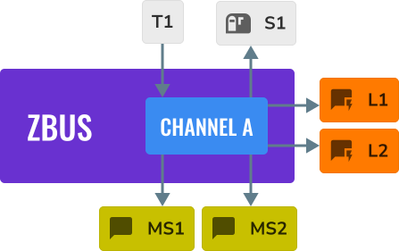
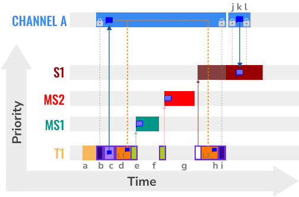
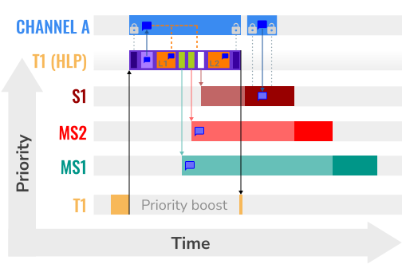

.. zephyr:code-sample:: zbus-priority-boost
   :name: zbus Priority Boost
   :relevant-api: zbus_apis

   Illustrates zbus priority boost feature with a priority inversion scenario.

Overview
********
This sample implements a simple application that illustrates the priority boost feature. The
application implements the below figure scenario. When the priority boost feature is disabled, the
execution sequence presents a priority inversion problem, which may not affect much of the
developer's application. Those who want to avoid priority inversions between message subscribers and
plain subscribers should use the priority boost strategy.

.. code-block:: c

   ZBUS_CHAN_DEFINE(chan_a,
                    int,
                    NULL,
                    NULL,
                    ZBUS_OBSERVERS(l1, ms1, ms2, s1, l2),
                    0
   );

.. note::

   The developer must use the :c:func:`zbus_obs_attach_to_thread` function to ensure a proper
   priority boost execution.

Building and Running
********************

The figure below illustrates the execution of the cited scenario but with the priority boost
disabled.

It can be built and executed on QEMU as follows:

.. zephyr-app-commands::
   :zephyr-app: samples/subsys/zbus/priority_boost
   :gen-args: -DCONFIG_ZBUS_PRIORITY_BOOST=n
   :host-os: unix
   :board: qemu_x86
   :goals: run

Sample Output
=============

.. code-block:: console

   I: --------------
   I: 0 -> T1: prio before 5
   I: 0 ---> L1: T1 prio 5
   I: 0 -> MS1:  T1 prio 5
   I: 0 -> MS2:  T1 prio 5
   I: 0 ---> L2: T1 prio 5
   I: 0 -> T1: prio after 5
   I: N -> S1:  T1 prio 5
   I: 0 -> S1:  T1 prio 5
   I: --------------
   I: 1 -> T1: prio before 5
   I: 1 ---> L1: T1 prio 5
   I: 1 -> MS1:  T1 prio 5
   I: 1 -> MS2:  T1 prio 5
   I: 1 ---> L2: T1 prio 5
   I: 1 -> T1: prio after 5
   I: N -> S1:  T1 prio 5
   I: 1 -> S1:  T1 prio 5
   I: --------------
   I: 2 -> T1: prio before 5
   I: 2 ---> L1: T1 prio 5
   I: 2 -> MS1:  T1 prio 5
   I: 2 ---> L2: T1 prio 5
   I: 2 -> T1: prio after 5
   I: 2 -> MS2:  T1 prio 5
   I: --------------
   I: 3 -> T1: prio before 5
   I: 3 ---> L1: T1 prio 5
   I: 3 -> MS1:  T1 prio 5
   I: 3 ---> L2: T1 prio 5
   I: 3 -> T1: prio after 5
   I: 3 -> MS2:  T1 prio 5
   I: --------------
   I: 4 -> T1: prio before 5
   I: 4 ---> L1: T1 prio 5
   I: 4 ---> L2: T1 prio 5
   I: 4 -> T1: prio after 5
   I: 4 -> MS2:  T1 prio 5
   I: --------------
   I: 5 -> T1: prio before 5
   I: 5 ---> L1: T1 prio 5
   I: 5 ---> L2: T1 prio 5
   I: 5 -> T1: prio after 5
   I: 5 -> MS2:  T1 prio 5
   I: --------------
   I: 6 -> T1: prio before 5
   I: 6 ---> L1: T1 prio 5
   I: 6 -> MS1:  T1 prio 5
   I: 6 -> MS2:  T1 prio 5
   I: 6 ---> L2: T1 prio 5
   I: 6 -> T1: prio after 5
   I: N -> S1:  T1 prio 5
   I: 6 -> S1:  T1 prio 5
   I: --------------
   <continues>

Exit QEMU by pressing :kbd:`CTRL+A` :kbd:`x`.

The figure below illustrates the execution of the same scenario but with the priority boost enabled.
The developer must enable the priority boost and properly attach all the observers to their threads.

To execute the sample with priority boost feature enabled, run the following command:

.. zephyr-app-commands::
   :zephyr-app: samples/subsys/zbus/priority_boost
   :gen-args: -DCONFIG_ZBUS_PRIORITY_BOOST=y
   :host-os: unix
   :board: qemu_x86
   :goals: run

Sample Output
=============

.. code-block:: console

   I: --------------
   I: 0 -> T1: prio before 5
   I: 0 ---> L1: T1 prio 1
   I: 0 ---> L2: T1 prio 1
   I: N -> S1:  T1 prio 5
   I: 0 -> S1:  T1 prio 5
   I: 0 -> MS1:  T1 prio 5
   I: 0 -> MS2:  T1 prio 5
   I: 0 -> T1: prio after 5
   I: --------------
   I: 1 -> T1: prio before 5
   I: 1 ---> L1: T1 prio 1
   I: 1 ---> L2: T1 prio 1
   I: N -> S1:  T1 prio 5
   I: 1 -> S1:  T1 prio 5
   I: 1 -> MS1:  T1 prio 5
   I: 1 -> MS2:  T1 prio 5
   I: 1 -> T1: prio after 5
   I: --------------
   I: 2 -> T1: prio before 5
   I: 2 ---> L1: T1 prio 2
   I: 2 ---> L2: T1 prio 2
   I: 2 -> MS1:  T1 prio 5
   I: 2 -> MS2:  T1 prio 5
   I: 2 -> T1: prio after 5
   I: --------------
   I: 3 -> T1: prio before 5
   I: 3 ---> L1: T1 prio 2
   I: 3 ---> L2: T1 prio 2
   I: 3 -> MS1:  T1 prio 5
   I: 3 -> MS2:  T1 prio 5
   I: 3 -> T1: prio after 5
   I: --------------
   I: 4 -> T1: prio before 5
   I: 4 ---> L1: T1 prio 3
   I: 4 ---> L2: T1 prio 3
   I: 4 -> MS2:  T1 prio 5
   I: 4 -> T1: prio after 5
   I: --------------
   I: 5 -> T1: prio before 5
   I: 5 ---> L1: T1 prio 3
   I: 5 ---> L2: T1 prio 3
   I: 5 -> MS2:  T1 prio 5
   I: 5 -> T1: prio after 5
   I: --------------
   I: 6 -> T1: prio before 5
   I: 6 ---> L1: T1 prio 1
   I: 6 ---> L2: T1 prio 1
   I: N -> S1:  T1 prio 5
   I: 6 -> S1:  T1 prio 5
   I: 6 -> MS1:  T1 prio 5
   I: 6 -> MS2:  T1 prio 5
   I: 6 -> T1: prio after 5
   I: --------------
   <continues>

Exit QEMU by pressing :kbd:`CTRL+A` :kbd:`x`.
